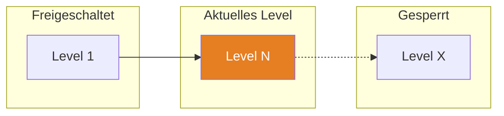

{/* ============================================================
    BRIEFING TEMPLATE — Level Up AI
    Jedes Level startet mit einem Briefing.
    ============================================================ */}

## TL;DR

{/* 30-Sekunden-Zusammenfassung fuer Fortgeschrittene.
    Was dieses Level abdeckt und warum es wichtig ist. */}

> [Zusammenfassung in 2-3 Saetzen]

## Skill Tree

{/* Mermaid-Diagramm das zeigt welche Levels freigeschaltet sind.
    Aktuelles Level hervorgehoben. */}

## Was Du lernst

- [Bullet 1]
- [Bullet 2]
- [Bullet 3]

## Warum das wichtig ist

[2-3 Saetze: Konkretes Problem das dieses Level loest]

## Voraussetzungen

- [Voraussetzung 1]
- [Voraussetzung 2]

> **Skip-Hinweis:** [Fuer Fortgeschrittene — wann kann man das Level ueberspringen?]

## Challenges

| # | Challenge | Konzept |
|---|-----------|---------|
| 1 | [Name] | [Was Du lernst] |
| 2 | [Name] | [Was Du lernst] |

## Boss Fight

[Kurze Beschreibung der Abschluss-Challenge]

## Quellen fuer dieses Level

- [Quelle 1](url)
- [Quelle 2](url)
