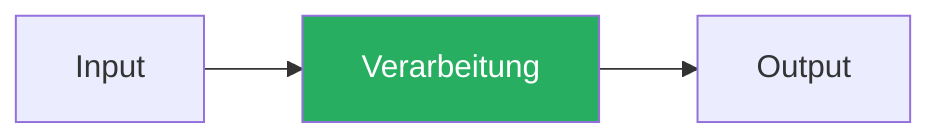
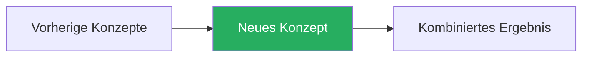

{/* ============================================================
    CHALLENGE TEMPLATE — Level Up AI
    Jede Challenge folgt dieser 6-Schritt-Struktur.
    Siehe: docs/plans/2026-03-08-didaktik-konzept-design.md
    ============================================================ */}

## THINK

{/* Eine Frage an den Leser, BEVOR das Konzept erklaert wird.
    Zweck: Vorwissen aktivieren, Neugier erzeugen.
    Inspiration: Brilliant.org "Pretest before teaching"
    Beispiel: "Was passiert, wenn Du ein LLM nach aktuellen Nachrichten fragst?" */}

[Frage an den Leser]

## OVERVIEW

{/* Mermaid-Diagramm das zeigt, wo dieses Konzept im Gesamtsystem sitzt.
    Markiere das aktuelle Konzept visuell ("Du bist HIER" oder Highlight-Farbe).
    Farbkodierung:
    - Blau (#4A90D9): Daten/Input
    - Gruen (#27AE60): Verarbeitung
    - Orange (#E67E22): Output
    - Rot (#E74C3C): Fehler/Risiko
    - Gestrichelt: Optional/Conditional */}



## WHY

{/* Das Problem beschreiben, das dieses Konzept loest.
    Format: Vorher/Nachher Vergleich.
    Nie: "X ist eine Technik die..." — stattdessen: "Ohne X passiert Y (schlecht)" */}

**Ohne [Konzept]:** [Was schiefgeht — 1-2 Saetze]

**Mit [Konzept]:** [Was besser wird — 1-2 Saetze]

## WALKTHROUGH

{/* OVERVIEW-Diagramm wird Schicht fuer Schicht aufgeloest.
    Jede Schicht: Erklaerung + annotiertes Code-Snippet.
    Kommentare markieren die 2-3 kritischen Zeilen.
    Max 3 Absaetze Fliesstext, dann visueller Wechsel.
    "Aendere diesen Wert und beobachte was passiert" wo moeglich. */}

### Schicht 1: [Name]

[Erklaerung]

```typescript
// Annotiertes Code-Beispiel
const result = await someFunction({
  key: 'value',  // ← kritische Zeile: erklaert warum
});
```

### Schicht 2: [Name]

[Erklaerung]

```typescript
// Weiteres annotiertes Code-Beispiel
```

## TRY

{/* Isolierte Uebung: Genau EIN Konzept, keine Ablenkung.
    Stark gefuehrt — klare Schritte, wenig Raum fuer Fehler.
    Loesung hinter <details> aufklappbar. */}

**Aufgabe:** [Klare Aufgabenstellung]

```typescript
// Starter-Code mit TODOs
// TODO: [Schritt 1]
// TODO: [Schritt 2]
```

**Checkliste:**
- [ ] [Kriterium 1]
- [ ] [Kriterium 2]
- [ ] [Kriterium 3]

<details>
<summary>Loesung anzeigen</summary>

```typescript
// Vollstaendige, getestete Loesung
```

**Erklaerung:** [Warum die Loesung so aussieht — 2-3 Saetze]

</details>

## COMBINE

{/* Gesamtbild-Diagramm erscheint erneut, neuer Baustein eingesetzt.
    Uebung verbindet aktuelles Konzept mit vorherigen Challenges.
    Weniger Hilfe als TRY — Progressive Unabhaengigkeit.
    Optional: Stretch Goals fuer Ambitionierte. */}



**Uebung:** [Aufgabe die aktuelles + vorheriges Konzept verbindet]

**Optional Stretch Goal:** [Bonus-Aufgabe fuer Ambitionierte]

## Quellen

{/* Mindestens 1 Quelle aus Rang 1-3:
    Rang 1: Offizielle Docs (ai-sdk.dev, docs.anthropic.com)
    Rang 2: Lauffaehiger, getesteter Code
    Rang 3: Open-Source Referenz (ai-hero-dev Exercises) */}

- [Quelle 1](url)
- [Quelle 2](url)
