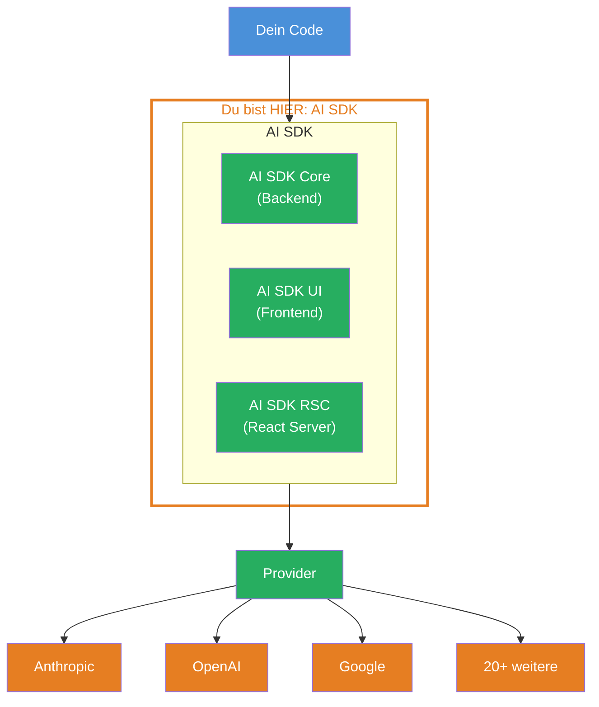
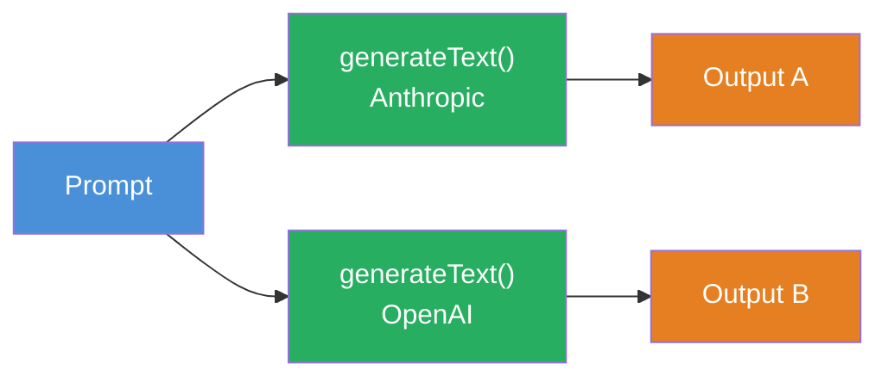

## THINK

Wenn Du mit Claude, GPT und Gemini arbeiten willst — brauchst Du fuer jeden eine andere Library? Andere Typen? Andere Fehlerbehandlung?

## OVERVIEW



Das AI SDK sitzt zwischen Deinem Code und den LLM-Providern. Es bietet eine einheitliche API — egal welchen Provider Du nutzt. Drei Bibliotheken, ein Interface.

## WHY

**Ohne AI SDK:** Fuer jeden Provider eine andere API, andere Typen, andere Fehlerbehandlung. Provider wechseln bedeutet den halben Code umschreiben. Jeder Provider hat eigene SDKs mit unterschiedlichen Interfaces.

**Mit AI SDK:** Eine API fuer alle Provider. Du wechselst den Provider, indem Du eine Import-Zeile und den Modell-Namen aenderst. Der Rest Deines Codes bleibt identisch.

## WALKTHROUGH

### Schicht 1: Die drei Bibliotheken

Das AI SDK besteht aus drei Teilen. In diesem Level arbeiten wir ausschliesslich mit **AI SDK Core**:

| Bibliothek | Package | Einsatz |
|------------|---------|---------|
| **AI SDK Core** | `ai` | Backend: Text generieren, Tools, Agents, Structured Output |
| **AI SDK UI** | `ai` (gleicher Import) | Frontend: Framework-agnostische Hooks fuer Chat-UIs |
| **AI SDK RSC** | `ai` (gleicher Import) | React Server Components: Streaming React Components |

AI SDK Core ist das Fundament. Alles andere baut darauf auf. Wenn Du `generateText` oder `streamText` nutzt, nutzt Du AI SDK Core.

### Schicht 2: Installation und Setup

Zwei Packages — das AI SDK selbst und ein Provider-Package:

```bash
npm install ai @ai-sdk/anthropic
```

`ai` ist das Kern-Package mit allen Funktionen (`generateText`, `streamText`, `Output`, etc.). `@ai-sdk/anthropic` ist der Provider — er weiss, wie man mit der Anthropic API kommuniziert.

Dein API-Key wird als Environment Variable gesetzt:

```bash
export ANTHROPIC_API_KEY="sk-ant-..."
```

### Schicht 3: Dein erster generateText Call

Das "Hello World" des AI SDK — ein einzelner API-Call der Text generiert:

```typescript
import { generateText } from 'ai';
import { anthropic } from '@ai-sdk/anthropic';

const result = await generateText({
  model: anthropic('claude-sonnet-4-5-20250514'),  // ← Provider + Modell
  prompt: 'Was ist TypeScript in einem Satz?',
});

console.log(result.text);         // ← Der generierte Text
console.log(result.usage);        // ← Token-Verbrauch: { promptTokens, completionTokens, totalTokens }
console.log(result.finishReason); // ← Warum gestoppt: 'stop' | 'length' | 'tool-calls'
```

Drei Zeilen Code, drei Informationen zurueck:
1. **`result.text`** — der generierte Text als String
2. **`result.usage`** — wie viele Tokens verbraucht wurden (wichtig fuer Kosten)
3. **`result.finishReason`** — warum das LLM aufgehoert hat zu generieren

Das `model`-Argument ist der einzige Ort, an dem der Provider vorkommt. Alles andere (`prompt`, `result.text`, `result.usage`) ist Provider-unabhaengig.

## TRY

**Aufgabe:** Installiere das AI SDK und den Anthropic Provider. Fuehre einen `generateText` Call aus und logge Text, Usage und Finish Reason.

```typescript
// TODO 1: Installiere die Packages
// npm install ai @ai-sdk/anthropic

// TODO 2: Importiere generateText und den Anthropic Provider
// import { ... } from 'ai';
// import { ... } from '@ai-sdk/anthropic';

// TODO 3: Setze den API-Key als Environment Variable
// export ANTHROPIC_API_KEY="sk-ant-..."

// TODO 4: Rufe generateText auf
// const result = await generateText({
//   model: ???,
//   prompt: ???,
// });

// TODO 5: Logge die drei Ergebnisse
// console.log(result.???);  // Text
// console.log(result.???);  // Token-Verbrauch
// console.log(result.???);  // Warum gestoppt
```

**Checkliste:**
- [ ] `ai` und `@ai-sdk/anthropic` installiert
- [ ] `generateText` importiert und aufgerufen
- [ ] `result.text`, `result.usage` und `result.finishReason` geloggt
- [ ] `ANTHROPIC_API_KEY` als Environment Variable gesetzt

<details>
<summary>Loesung anzeigen</summary>

```typescript
import { generateText } from 'ai';
import { anthropic } from '@ai-sdk/anthropic';

const result = await generateText({
  model: anthropic('claude-sonnet-4-5-20250514'),
  prompt: 'Was ist TypeScript in einem Satz?',
});

console.log('Text:', result.text);
console.log('Usage:', result.usage);
console.log('Finish Reason:', result.finishReason);
```

**Erklaerung:** `generateText` ist eine async Funktion, die ein Result-Objekt zurueckgibt. Das `model`-Argument erstellt eine Anthropic-Modell-Instanz mit dem Modell-Namen `claude-sonnet-4-5-20250514`. Der `prompt` ist der User-Input. Die drei geloggten Properties geben Dir den generierten Text, den Token-Verbrauch und den Grund fuer das Stoppen.

</details>

## COMBINE



**Uebung:** Aendere den Provider — ersetze `anthropic` durch `openai`. Was musst Du aendern?

1. Installiere den OpenAI Provider: `npm install @ai-sdk/openai`
2. Aendere den Import: `import { openai } from '@ai-sdk/openai'`
3. Aendere die Model-Zeile: `model: openai('gpt-4o')`
4. Setze `OPENAI_API_KEY` als Environment Variable

Der Rest des Codes bleibt identisch — `result.text`, `result.usage`, `result.finishReason` funktionieren genauso. Das ist die Provider-Austauschbarkeit des AI SDK.

**Optional Stretch Goal:** Fuehre beide Provider nacheinander aus (Anthropic und OpenAI) mit demselben Prompt und vergleiche die Outputs.

## Quellen

- [Vercel AI SDK: Introduction](https://ai-sdk.dev/docs/introduction)
- [Vercel AI SDK: Providers and Models](https://ai-sdk.dev/docs/foundations/providers-and-models)
- [Vercel Blog: AI SDK 6](https://vercel.com/blog/ai-sdk-6)
- [ai-hero-dev Exercise 01.01](https://github.com/ai-hero-dev/ai-sdk-v6-crash-course/tree/main/exercises/01-ai-sdk-basics/01.01-intro-to-the-sdk)
