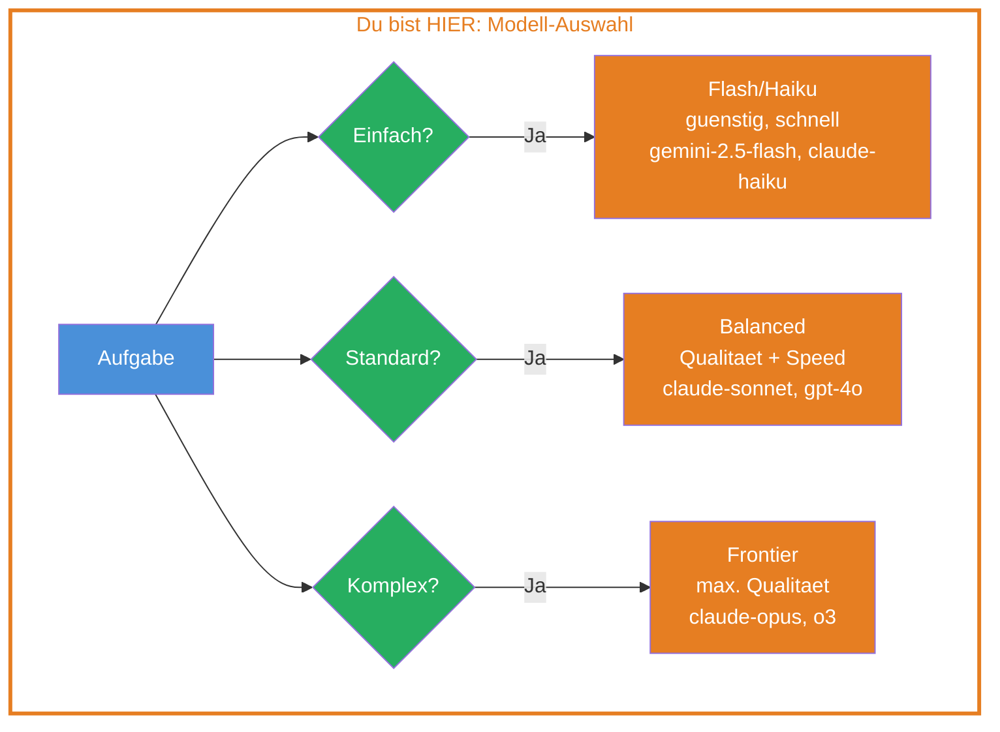
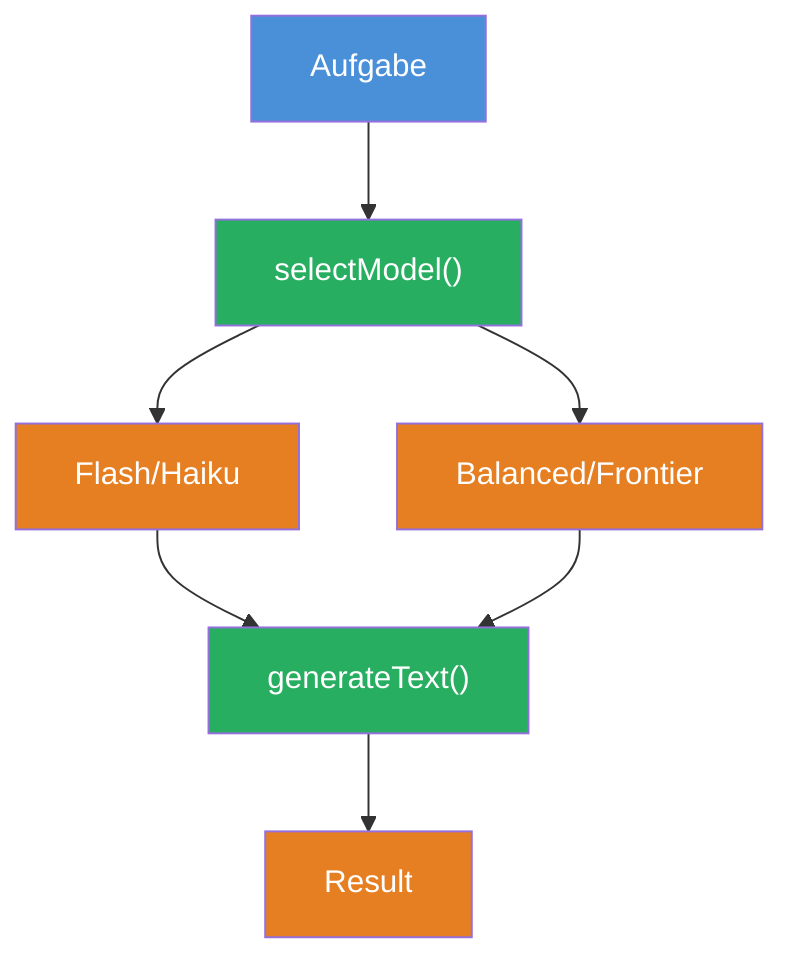

## THINK

Woran entscheidest Du, welches LLM Du fuer eine Aufgabe nutzt — Kosten, Qualitaet, Geschwindigkeit? Und was passiert, wenn Du spaeter den Provider wechseln willst?

## OVERVIEW



Die Modell-Auswahl ist eine bewusste Entscheidung: Welches Modell passt zu welcher Aufgabe? Die meisten Provider bieten drei Modell-Tiers an:

| Tier | Beispiele | Staerke | Einsatz |
|------|-----------|---------|---------|
| **Flash/Haiku** | Gemini Flash, Claude Haiku | Schnell, guenstig | Einfache Tasks, Klassifikation, Extraktion |
| **Balanced** | Claude Sonnet, GPT-4o | Gute Qualitaet bei moderaten Kosten | Alltagsaufgaben, Code, Analyse |
| **Frontier** | Claude Opus, o3 | Hoechste Qualitaet | Komplexes Reasoning, schwierige Probleme |

> **Wichtig:** "Sonnet" ist kein Synonym fuer "Pro". Claude Sonnet ist ein eigenes Modell im mittleren Tier — schnell und kosteneffizient, aber nicht das leistungsfaehigste Modell von Anthropic. Das waere Claude Opus.

Das AI SDK macht den Wechsel zwischen diesen Tiers trivial — nur Import und Model-Zeile aendern sich.

## WHY

**Ohne bewusste Modell-Wahl:** Du nutzt immer dasselbe Modell. Zu teuer fuer einfache Aufgaben (Titel generieren mit dem staerksten Modell), zu schlecht fuer komplexe Aufgaben (Code-Review mit dem guenstigsten Modell). Deine AI-Kosten explodieren oder Deine Qualitaet leidet.

**Mit bewusster Modell-Wahl:** Du nutzt das optimale Modell fuer jede Aufgabe. Flash/Haiku-Modelle fuer einfache Tasks, Balanced-Modelle wie Sonnet fuer den Alltag, Frontier-Modelle fuer die schwierigsten Probleme. Das AI SDK macht den Wechsel so einfach, dass Du verschiedene Modelle in einer Anwendung mischen kannst.

## WALKTHROUGH

### Schicht 1: Provider importieren

Jeder Provider ist ein eigenes npm Package. Du installierst nur die, die Du brauchst:

```typescript
import { anthropic } from '@ai-sdk/anthropic';  // ← npm install @ai-sdk/anthropic
import { openai } from '@ai-sdk/openai';          // ← npm install @ai-sdk/openai
import { google } from '@ai-sdk/google';          // ← npm install @ai-sdk/google
```

Jeder Import gibt Dir eine Funktion, die Modell-Instanzen erzeugt. Die Funktion heisst wie der Provider (`anthropic`, `openai`, `google`).

### Schicht 2: Modell instanziieren

Die Provider-Funktion nimmt einen Modell-Namen als String und gibt eine Modell-Instanz zurueck:

```typescript
const model1 = anthropic('claude-sonnet-4-5-20250514');  // ← Anthropic Claude Sonnet
const model2 = openai('gpt-4o');                          // ← OpenAI GPT-4o
const model3 = google('gemini-2.5-flash');                // ← Google Gemini Flash
```

Alle drei haben dasselbe Interface. Du kannst sie ueberall dort einsetzen, wo das AI SDK ein `model` erwartet — in `generateText`, `streamText`, `Output.object` und allen anderen Funktionen.

### Schicht 3: Provider wechseln

Der entscheidende Punkt: Nur Import und Model-Zeile aendern sich. Der gesamte restliche Code bleibt identisch.

**Vorher — Anthropic:**

```typescript
import { generateText } from 'ai';
import { anthropic } from '@ai-sdk/anthropic';       // ← Import: Anthropic

const result = await generateText({
  model: anthropic('claude-sonnet-4-5-20250514'),     // ← Modell: Claude Sonnet
  prompt: 'Erklaere Promises in JavaScript.',
});

console.log(result.text);
```

**Nachher — OpenAI:**

```typescript
import { generateText } from 'ai';
import { openai } from '@ai-sdk/openai';              // ← Import: OpenAI (geaendert)

const result = await generateText({
  model: openai('gpt-4o'),                            // ← Modell: GPT-4o (geaendert)
  prompt: 'Erklaere Promises in JavaScript.',          // ← Identisch
});

console.log(result.text);                              // ← Identisch
```

Zwei Zeilen geaendert, der Rest ist gleich. `result.text`, `result.usage`, `result.finishReason` — alles funktioniert identisch.

## TRY

**Aufgabe:** Erstelle ein Script, das ZWEI verschiedene Provider mit demselben Prompt aufruft und die Ergebnisse vergleicht.

```typescript
import { generateText } from 'ai';
// TODO 1: Importiere zwei verschiedene Provider
// import { ... } from '@ai-sdk/anthropic';
// import { ... } from '@ai-sdk/openai';  // oder @ai-sdk/google

const prompt = 'Was ist der Unterschied zwischen let und const in JavaScript?';

// TODO 2: Erster Call mit Provider 1
// const result1 = await generateText({
//   model: ???,
//   prompt,
// });

// TODO 3: Zweiter Call mit Provider 2
// const result2 = await generateText({
//   model: ???,
//   prompt,
// });

// TODO 4: Vergleiche die Ergebnisse
// console.log('--- Provider 1 ---');
// console.log('Text:', result1.text);
// console.log('Tokens:', result1.usage.totalTokens);
//
// console.log('--- Provider 2 ---');
// console.log('Text:', result2.text);
// console.log('Tokens:', result2.usage.totalTokens);
```

**Checkliste:**
- [ ] Zwei verschiedene Provider importiert
- [ ] Beide `generateText` Calls nutzen denselben Prompt
- [ ] Outputs beider Modelle werden geloggt
- [ ] Usage (Tokens) wird verglichen

<details>
<summary>Loesung anzeigen</summary>

```typescript
import { generateText } from 'ai';
import { anthropic } from '@ai-sdk/anthropic';
import { openai } from '@ai-sdk/openai';

const prompt = 'Was ist der Unterschied zwischen let und const in JavaScript?';

const result1 = await generateText({
  model: anthropic('claude-sonnet-4-5-20250514'),
  prompt,
});

const result2 = await generateText({
  model: openai('gpt-4o'),
  prompt,
});

console.log('--- Anthropic (Claude Sonnet) ---');
console.log('Text:', result1.text);
console.log('Tokens:', result1.usage.totalTokens);

console.log('\n--- OpenAI (GPT-4o) ---');
console.log('Text:', result2.text);
console.log('Tokens:', result2.usage.totalTokens);
```

**Erklaerung:** Beide Calls nutzen exakt denselben `prompt`. Nur `model` unterscheidet sich. Die Outputs zeigen Dir, wie unterschiedlich (oder aehnlich) verschiedene Modelle dieselbe Frage beantworten — und wie viele Tokens sie dafuer verbrauchen.

> **Nur einen API-Key?** Kein Problem — nutze zwei Modelle desselben Providers, z.B. `anthropic('claude-haiku-3-5-20241022')` und `anthropic('claude-sonnet-4-5-20250514')`.

**Ausfuehren:**

```bash
npx tsx challenge-1-2.ts
```

**Erwarteter Output (ungefaehr):**

```
--- Anthropic (Claude Sonnet) ---
Text: let erlaubt Neuzuweisung, const nicht...
Tokens: 87

--- OpenAI (GPT-4o) ---
Text: In JavaScript sind let und const...
Tokens: 102
```

</details>

## COMBINE



**Uebung:** Baue eine Funktion `selectModel(task: string)`, die basierend auf der Aufgabe ein passendes Modell zurueckgibt. Nutze den Entscheidungsbaum aus dem OVERVIEW als Logik.

```typescript
import { anthropic } from '@ai-sdk/anthropic';
import { google } from '@ai-sdk/google';
import type { LanguageModel } from 'ai';

function selectModel(task: string): LanguageModel {
  // Einfache Aufgaben: Flash-Modell (guenstig, schnell)
  if (task.includes('zusammenfassen') || task.includes('uebersetzen')) {
    return google('gemini-2.5-flash');
  }
  // Standard-Aufgaben: Balanced-Modell (Qualitaet + Speed)
  return anthropic('claude-sonnet-4-5-20250514');
}
```

Nutze `selectModel` in Kombination mit `generateText` aus Challenge 1.1. Teste mit verschiedenen Aufgaben und pruefe, ob das richtige Modell gewaehlt wird.

**Optional Stretch Goal:** Erweitere `selectModel` um eine dritte Kategorie — z.B. Code-Aufgaben, die ein spezialisiertes Modell nutzen.

## Quellen

- [Vercel AI SDK: Providers and Models](https://ai-sdk.dev/docs/foundations/providers-and-models)
- [Vercel AI SDK: Generating Text](https://ai-sdk.dev/docs/ai-sdk-core/generating-text)
- [ai-hero-dev Exercise 01.04](https://github.com/ai-hero-dev/ai-sdk-v6-crash-course/tree/main/exercises/01-ai-sdk-basics/01.04-choosing-your-model)
