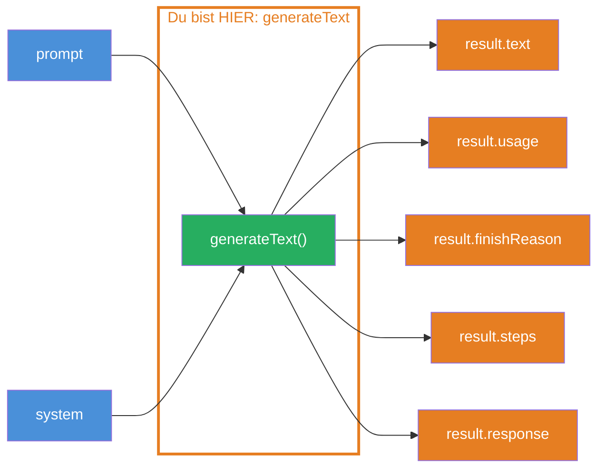
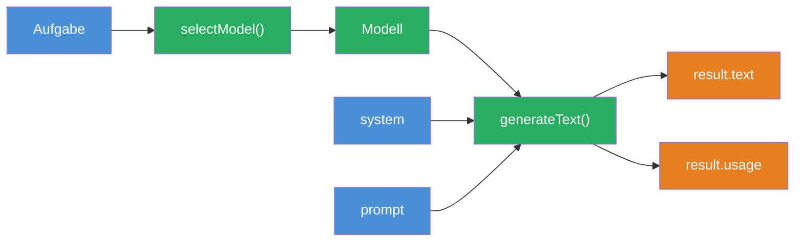

## THINK

Was bekommst Du zurueck, wenn Du ein LLM um Text bittest — nur den Text, oder mehr?

## OVERVIEW



`generateText` nimmt `model` + `prompt` als Input und gibt ein reichhaltiges Result-Objekt zurueck. Neben dem Text bekommst Du Token-Verbrauch, den Grund fuer das Stoppen, einzelne Schritte und die rohe Response.

## WHY

**Ohne Verstaendnis des Result-Objekts:** Du nutzt nur `result.text` und verpasst alles andere. Du hast keine Kontrolle ueber Kosten (Token-Tracking), kein Debugging (Finish Reason), kein Verstaendnis fuer Multi-Step-Verarbeitung (Steps). Wenn etwas schiefgeht, tappst Du im Dunkeln.

**Mit Verstaendnis des Result-Objekts:** Du trackst Token-Verbrauch fuer Kostenoptimierung, erkennst ueber `finishReason`, warum eine Antwort abgeschnitten wurde, und nutzt Callbacks fuer Logging und Monitoring. Volle Kontrolle statt Blackbox.

## WALKTHROUGH

### Schicht 1: generateText Basics

Die einfachste Form — `model` + `prompt` rein, `result` raus:

```typescript
import { generateText } from 'ai';
import { anthropic } from '@ai-sdk/anthropic';

const result = await generateText({
  model: anthropic('claude-sonnet-4-5-20250514'),
  prompt: 'Erklaere Promises in JavaScript.',
});
```

`generateText` ist eine async Funktion. Sie wartet, bis das LLM die komplette Antwort generiert hat, und gibt dann das Result-Objekt zurueck. Kein Streaming — alles auf einmal.

### Schicht 2: Das Result-Objekt im Detail

Das Result-Objekt hat fuenf wichtige Properties:

```typescript
// Der generierte Text als String
result.text
// → "Promises in JavaScript sind Objekte, die einen..."

// Token-Verbrauch — wichtig fuer Kostenberechnung
result.usage
// → { promptTokens: 12, completionTokens: 150, totalTokens: 162 }

// Warum hat das LLM aufgehoert zu generieren?
result.finishReason
// → 'stop'       — LLM ist fertig (normal)
// → 'length'     — Token-Limit erreicht (Antwort abgeschnitten!)
// → 'tool-calls' — LLM will ein Tool aufrufen

// Alle Schritte bei Multi-Step-Verarbeitung
result.steps
// → [{ text, usage, finishReason, ... }]

// Rohe Response (Headers, Messages)
result.response
// → { headers, messages, body }
```

Besonders wichtig: Wenn `finishReason` den Wert `'length'` hat, wurde die Antwort abgeschnitten. Das bedeutet, das Token-Limit wurde erreicht, bevor das LLM fertig war. Du siehst dann eine unvollstaendige Antwort.

### Schicht 3: Die system + prompt Kombination

Mit dem `system`-Parameter gibst Du dem LLM eine Rolle. Der `prompt` ist dann die eigentliche Aufgabe:

```typescript
const result = await generateText({
  model: anthropic('claude-sonnet-4-5-20250514'),
  system: 'Du bist ein erfahrener TypeScript-Entwickler. Erklaere kurz und praezise.',  // ← Rolle
  prompt: 'Erklaere Promises in JavaScript.',                                            // ← Aufgabe
});
```

`system` beeinflusst, WIE das LLM antwortet (Stil, Ton, Perspektive). `prompt` bestimmt, WORUEBER es antwortet (Inhalt). Die Trennung ist wichtig — `system` bleibt oft gleich, waehrend `prompt` sich aendert.

### Schicht 4: Callbacks — onFinish und onStepFinish

Callbacks werden aufgerufen, wenn die Generierung abgeschlossen ist. Nuetzlich fuer Logging, Kosten-Tracking oder Analytics:

```typescript
const result = await generateText({
  model: anthropic('claude-sonnet-4-5-20250514'),
  system: 'Du bist ein erfahrener TypeScript-Entwickler.',
  prompt: 'Erklaere Promises in JavaScript.',
  onFinish({ text, usage, finishReason }) {                  // ← Wird nach Abschluss aufgerufen
    console.log(`Tokens verbraucht: ${usage.totalTokens}`);  // ← Kosten tracken
    console.log(`Finish Reason: ${finishReason}`);           // ← Debugging
  },
  onStepFinish({ stepNumber, finishReason, usage }) {        // ← Pro Schritt (bei Multi-Step)
    console.log(`Schritt ${stepNumber} fertig.`);
  },
});
```

`onFinish` wird einmal am Ende aufgerufen. `onStepFinish` wird nach jedem einzelnen Schritt aufgerufen — relevant bei Tool Calls, wenn mehrere LLM-Aufrufe hintereinander passieren (das lernst Du in Level 3).

## TRY

**Aufgabe:** Generiere Text mit `system` + `prompt`, logge das vollstaendige Result-Objekt und implementiere einen `onFinish` Callback.

```typescript
import { generateText } from 'ai';
import { anthropic } from '@ai-sdk/anthropic';

// TODO 1: Rufe generateText auf mit:
//   - model: anthropic('claude-sonnet-4-5-20250514')
//   - system: Eine Rolle Deiner Wahl
//   - prompt: Eine Frage Deiner Wahl
//   - onFinish: Callback der Tokens loggt

// TODO 2: Logge result.text
// TODO 3: Logge result.usage.totalTokens
// TODO 4: Logge result.finishReason
```

**Checkliste:**
- [ ] `system` und `prompt` beide gesetzt
- [ ] `result.text` geloggt
- [ ] `result.usage.totalTokens` geloggt
- [ ] `result.finishReason` geloggt
- [ ] `onFinish` Callback implementiert

<details>
<summary>Loesung anzeigen</summary>

```typescript
import { generateText } from 'ai';
import { anthropic } from '@ai-sdk/anthropic';

const result = await generateText({
  model: anthropic('claude-sonnet-4-5-20250514'),
  system: 'Du bist ein erfahrener TypeScript-Entwickler. Erklaere Konzepte kurz und praezise mit Codebeispielen.',
  prompt: 'Was ist der Unterschied zwischen interface und type in TypeScript?',
  onFinish({ text, usage, finishReason }) {
    console.log(`\n--- onFinish Callback ---`);
    console.log(`Tokens verbraucht: ${usage.totalTokens}`);
    console.log(`Finish Reason: ${finishReason}`);
  },
});

console.log('--- Generierter Text ---');
console.log(result.text);

console.log('\n--- Details ---');
console.log('Total Tokens:', result.usage.totalTokens);
console.log('Prompt Tokens:', result.usage.promptTokens);
console.log('Completion Tokens:', result.usage.completionTokens);
console.log('Finish Reason:', result.finishReason);
```

**Erklaerung:** Der `onFinish` Callback wird aufgerufen, sobald die Generierung abgeschlossen ist — noch bevor Du `result.text` loggst. Das macht ihn ideal fuer Logging und Monitoring, weil er garantiert ausgefuehrt wird, egal was danach im Code passiert.

</details>

## COMBINE



**Uebung:** Kombiniere `generateText` mit der `selectModel`-Funktion aus Challenge 1.2. Generiere Text mit verschiedenen Modellen und vergleiche `usage.totalTokens`.

1. Nutze `selectModel('zusammenfassen')` fuer ein Flash-Modell
2. Nutze `selectModel('analysieren')` fuer ein Pro-Modell
3. Stelle denselben `prompt` an beide Modelle
4. Vergleiche: Welches Modell verbraucht mehr Tokens? Welches antwortet besser?

**Optional Stretch Goal:** Baue eine `trackCost`-Funktion, die `usage.totalTokens` in geschaetzte Kosten umrechnet (z.B. 1 Token = $0.000003 fuer Claude Sonnet). Nutze den `onFinish` Callback, um die Kosten zu loggen.

## Quellen

- [Vercel AI SDK: Generating Text](https://ai-sdk.dev/docs/ai-sdk-core/generating-text)
- [Vercel AI SDK: generateText API Reference](https://ai-sdk.dev/docs/reference/ai-sdk-core/generate-text)
- [ai-hero-dev Exercise 01.05](https://github.com/ai-hero-dev/ai-sdk-v6-crash-course/tree/main/exercises/01-ai-sdk-basics/01.05-generate-text)
