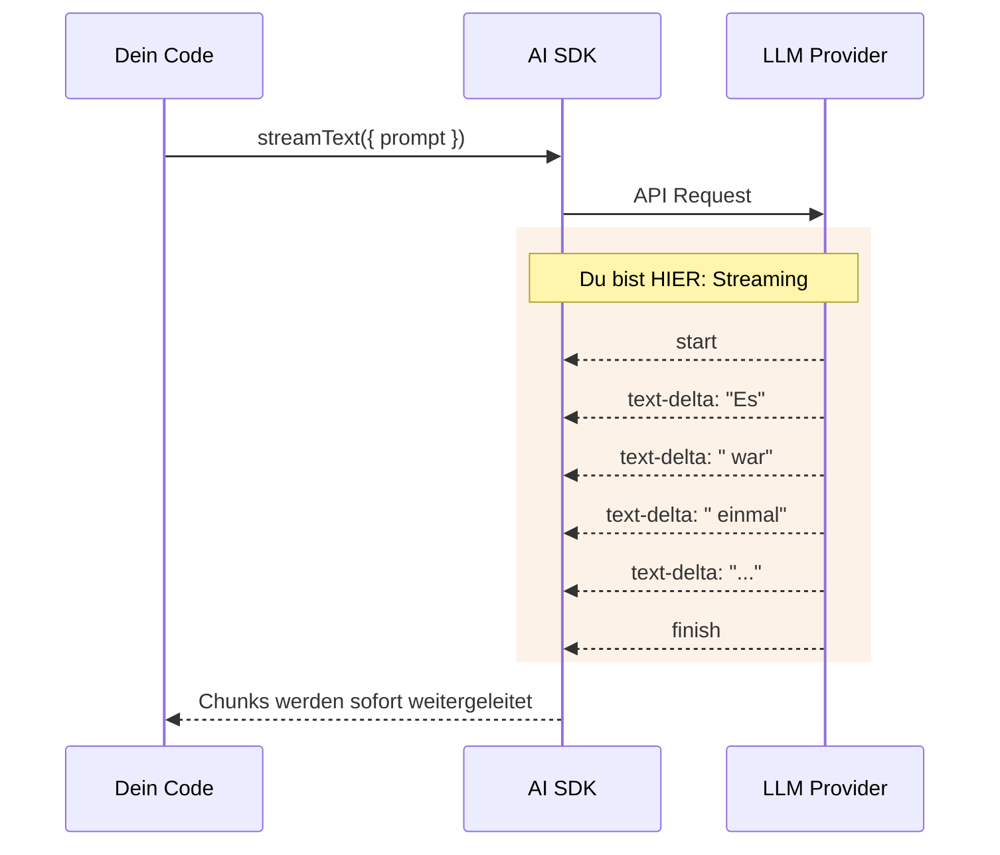
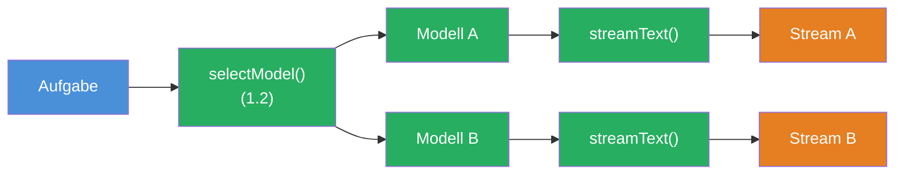

## THINK

Warum siehst Du in ChatGPT die Antwort Wort fuer Wort statt alles auf einmal? Und was passiert unter der Haube, damit das funktioniert?

## OVERVIEW



Das LLM generiert Token fuer Token. Mit `streamText` bekommst Du jeden Token sofort, statt auf die komplette Antwort zu warten. Die gestrichelten Pfeile zeigen: Daten fliessen stueckweise zurueck.

## WHY

**Ohne Streaming:** User wartet 5-10 Sekunden auf eine leere Seite, denkt die App haengt. Erst wenn das LLM komplett fertig ist, erscheint die gesamte Antwort auf einmal. Bei langen Antworten fuehlt sich das an wie ein Absturz.

**Mit Streaming:** Sofortiges Feedback. Der erste Token erscheint nach wenigen Millisekunden. Der User sieht, dass etwas passiert, und kann schon lesen, waehrend das LLM noch generiert. Gefuehlte Geschwindigkeit steigt massiv.

## WALKTHROUGH

### Schicht 1: streamText Basics

`streamText` funktioniert wie `generateText` — selbe Parameter, selbes Interface. Der Unterschied: Es gibt sofort ein Stream-Objekt zurueck, statt auf die komplette Antwort zu warten.

```typescript
import { streamText } from 'ai';
import { anthropic } from '@ai-sdk/anthropic';

const result = streamText({                          // ← Kein await noetig!
  model: anthropic('claude-sonnet-4-5-20250514'),
  prompt: 'Erzaehle eine kurze Geschichte.',
});
```

Wichtig: `streamText` wird **nicht** mit `await` aufgerufen. Die Funktion gibt synchron ein Result-Objekt zurueck, das mehrere Streams enthaelt. Das eigentliche Warten passiert beim Konsumieren der Streams.

### Schicht 2: textStream — AsyncIterable fuer Text-Chunks

`result.textStream` ist ein `AsyncIterable`, das Dir jeden Text-Chunk einzeln liefert. Du konsumierst es mit `for await...of`:

```typescript
for await (const chunk of result.textStream) {
  process.stdout.write(chunk);  // ← Schreibt jedes Wort sofort ins Terminal
}
```

Warum `process.stdout.write` statt `console.log`? Weil `console.log` nach jedem Aufruf einen Zeilenumbruch einfuegt. `process.stdout.write` schreibt den Text genau so, wie er ankommt — Wort fuer Wort in derselben Zeile.

### Schicht 3: fullStream — Alle Events, nicht nur Text

`textStream` gibt Dir nur den Text. `fullStream` gibt Dir **alle** Events — inklusive Start, Finish und Token-Verbrauch:

```typescript
for await (const part of result.fullStream) {
  switch (part.type) {
    case 'text-delta':                                // ← Ein Text-Chunk
      process.stdout.write(part.textDelta);
      break;
    case 'finish':                                    // ← Stream ist fertig
      console.log('\n\nTokens:', part.usage.totalTokens);
      console.log('Finish Reason:', part.finishReason);
      break;
    case 'error':                                     // ← Fehler im Stream
      console.error('Fehler:', part.error);
      break;
  }
}
```

Die wichtigsten Event-Typen:

| Event | Wann | Daten |
|-------|------|-------|
| `text-delta` | Bei jedem Text-Chunk | `part.textDelta` |
| `finish` | Stream ist fertig | `part.usage`, `part.finishReason` |
| `error` | Bei einem Fehler | `part.error` |
| `tool-call` | LLM ruft ein Tool auf | `part.toolName`, `part.args` (Level 3) |

### Schicht 4: toUIMessageStreamResponse — Vorschau auf spaetere Levels

Fuer Web-APIs (z.B. Next.js) gibt es `toUIMessageStreamResponse()`. Damit wird der Stream direkt in eine HTTP Response umgewandelt:

```typescript
// In einer Next.js API Route (spaetere Levels):
export async function POST(req: Request) {
  const result = streamText({
    model: anthropic('claude-sonnet-4-5-20250514'),
    prompt: 'Hallo!',
  });
  return result.toUIMessageStreamResponse();  // ← Stream als HTTP Response
}
```

Das brauchst Du jetzt noch nicht — aber es zeigt, warum Streaming so zentral ist: Es funktioniert vom Terminal bis zur Web-App mit demselben API.

## TRY

**Aufgabe:** Streame Text ins Terminal mit `textStream`. Dann wechsle zu `fullStream` und logge zusaetzlich das `finish`-Event.

```typescript
import { streamText } from 'ai';
import { anthropic } from '@ai-sdk/anthropic';

// TODO 1: Rufe streamText auf (ohne await!)
// const result = streamText({
//   model: ???,
//   prompt: 'Erklaere in 3 Saetzen, warum TypeScript besser als JavaScript ist.',
// });

// TODO 2: Konsumiere result.textStream mit for await...of
// for await (const chunk of result.textStream) {
//   // Schreibe jeden Chunk sofort ins Terminal
// }

// TODO 3 (Bonus): Ersetze textStream durch fullStream
// Logge text-delta UND das finish-Event mit Token-Verbrauch
```

**Checkliste:**
- [ ] `streamText` importiert und aufgerufen (ohne `await`)
- [ ] `textStream` mit `for await...of` konsumiert
- [ ] Text wird Chunk fuer Chunk ins Terminal geschrieben (mit `process.stdout.write`)
- [ ] Bonus: `fullStream` Events geloggt (text-delta + finish)

<details>
<summary>Loesung anzeigen</summary>

**Variante 1: textStream**

```typescript
import { streamText } from 'ai';
import { anthropic } from '@ai-sdk/anthropic';

const result = streamText({
  model: anthropic('claude-sonnet-4-5-20250514'),
  prompt: 'Erklaere in 3 Saetzen, warum TypeScript besser als JavaScript ist.',
});

for await (const chunk of result.textStream) {
  process.stdout.write(chunk);
}
console.log(); // Zeilenumbruch am Ende
```

**Variante 2: fullStream mit Events**

```typescript
import { streamText } from 'ai';
import { anthropic } from '@ai-sdk/anthropic';

const result = streamText({
  model: anthropic('claude-sonnet-4-5-20250514'),
  prompt: 'Erklaere in 3 Saetzen, warum TypeScript besser als JavaScript ist.',
});

for await (const part of result.fullStream) {
  switch (part.type) {
    case 'text-delta':
      process.stdout.write(part.textDelta);
      break;
    case 'finish':
      console.log('\n\n--- Stream beendet ---');
      console.log('Tokens:', part.usage.totalTokens);
      console.log('Finish Reason:', part.finishReason);
      break;
  }
}
```

**Erklaerung:** `streamText` gibt synchron ein Result-Objekt zurueck. Der eigentliche API-Call startet erst, wenn Du den Stream konsumierst (mit `for await`). `textStream` liefert nur Text-Chunks, `fullStream` liefert alle Event-Typen inklusive Metadaten wie Token-Verbrauch.

</details>

## COMBINE



**Uebung:** Kombiniere `streamText` mit der `selectModel`-Funktion aus Challenge 1.2. Streame denselben Prompt mit zwei verschiedenen Modellen nacheinander und vergleiche die gefuehlte Geschwindigkeit.

1. Nutze `selectModel` um ein Flash-Modell und ein Pro-Modell zu waehlen
2. Streame mit dem ersten Modell, dann mit dem zweiten
3. Miss die Zeit mit `performance.now()` oder `Date.now()` — welches Modell liefert den ersten Token schneller?
4. Nutze `fullStream`, um am Ende die Token-Verbraeuche beider Modelle zu vergleichen

**Optional Stretch Goal:** Baue eine Funktion `streamWithTimer(model, prompt)`, die den Stream konsumiert UND die "Time to First Token" (TTFT) misst — also die Zeit vom Aufruf bis zum ersten `text-delta` Event.

## Quellen

- [Vercel AI SDK: Generating Text — streamText](https://ai-sdk.dev/docs/ai-sdk-core/generating-text#streamtext)
- [Vercel AI SDK: streamText API Reference](https://ai-sdk.dev/docs/reference/ai-sdk-core/stream-text)
- [ai-hero-dev Exercises 01.06-01.08](https://github.com/ai-hero-dev/ai-sdk-v6-crash-course/tree/main/exercises/01-ai-sdk-basics)
