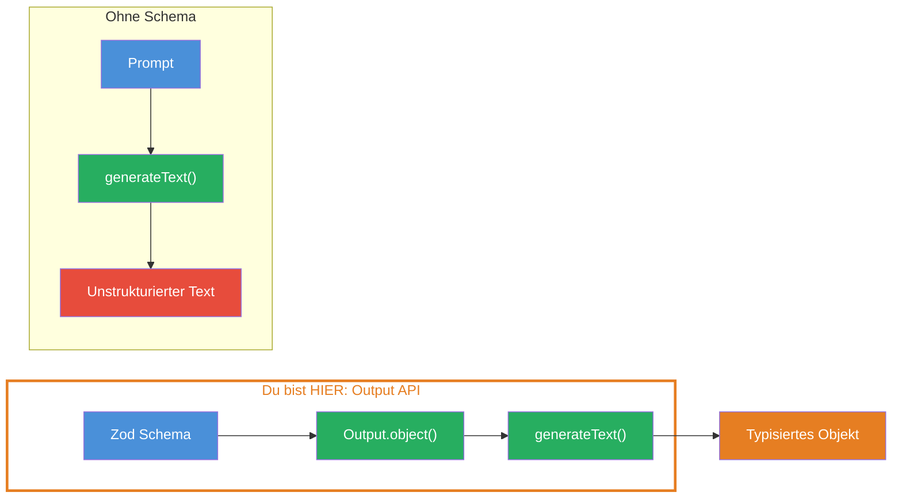
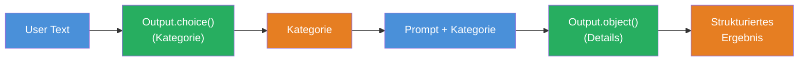

## THINK

Wie bringst Du ein LLM dazu, JSON statt Freitext zurueckzugeben — zuverlaessig, jedes Mal? Und wie stellst Du sicher, dass das JSON genau die Felder und Typen hat, die Du brauchst?

## OVERVIEW



Oben: Mit Zod Schema und `Output.object` bekommst Du ein typisiertes Objekt. Unten: Ohne Schema bekommst Du Freitext, den Du manuell parsen muestest.

## WHY

**Ohne Structured Output:** Du bittest das LLM um JSON, bekommst manchmal valides JSON, manchmal Freitext mit Markdown-Codeblock drumherum. `JSON.parse` bricht, Du baust Regex-Hacks, die Extraktion ist fragil. Jede Aenderung im Prompt kann das Format brechen.

**Mit Output API:** Das AI SDK garantiert Dir ein valides, typisiertes Objekt. Kein Parsing, kein Regex, kein `any`. Du definierst ein Zod Schema, und `result.output` hat genau die Typen, die Du definiert hast.

## WALKTHROUGH

### Schicht 1: Zod Schema definiert die Erwartung

Ein Zod Schema beschreibt die Struktur, die Du vom LLM erwartest. Es definiert Felder, Typen und optionale Beschreibungen:

```typescript
import { z } from 'zod';

const recipeSchema = z.object({
  name: z.string(),
  ingredients: z.array(z.string()),
  steps: z.array(z.string()),
  prepTime: z.number().describe('Zubereitungszeit in Minuten'),  // ← describe() hilft dem LLM
});
```

`z.describe()` ist besonders nuetzlich: Es gibt dem LLM einen Hinweis, was ein Feld bedeutet. Ohne Beschreibung muss das LLM den Zweck aus dem Feldnamen ableiten — mit Beschreibung wird es praeziser.

### Schicht 2: Output.object — verbindet Schema mit generateText

`Output.object` nimmt Dein Zod Schema und sagt dem AI SDK: "Ich erwarte ein Objekt mit dieser Struktur." Das Ergebnis steht in `result.output`:

```typescript
import { Output, generateText } from 'ai';
import { anthropic } from '@ai-sdk/anthropic';

const { output } = await generateText({
  model: anthropic('claude-sonnet-4-5-20250514'),
  output: Output.object({ schema: recipeSchema }),  // ← Schema verbinden
  prompt: 'Erstelle ein Rezept fuer Pasta Carbonara.',
});

console.log(output.name);         // ← string — typisiert!
console.log(output.ingredients);  // ← string[] — typisiert!
console.log(output.prepTime);    // ← number — typisiert!
```

Kein `JSON.parse`, kein `as any`, kein manuelles Casting. TypeScript kennt die Typen, weil sie aus dem Zod Schema abgeleitet werden.

### Schicht 3: Output.array — Liste von Objekten

Wenn Du mehrere Objekte desselben Typs brauchst, nutze `Output.array`:

```typescript
const { output } = await generateText({
  model: anthropic('claude-sonnet-4-5-20250514'),
  output: Output.array({
    element: z.object({
      city: z.string(),
      country: z.string(),
      population: z.number().describe('Einwohnerzahl'),
    }),
  }),
  prompt: 'Liste 5 Grossstaedte in Europa.',
});

// output ist ein typisiertes Array
for (const city of output) {
  console.log(`${city.city}, ${city.country}: ${city.population}`);
}
```

`Output.array` erzwingt ein Array von Objekten. Jedes Element im Array hat die Struktur des `element`-Schemas.

### Schicht 4: Output.choice — Auswahl aus Optionen

Fuer Klassifikation oder einfache Entscheidungen gibt es `Output.choice`:

```typescript
const { output } = await generateText({
  model: anthropic('claude-sonnet-4-5-20250514'),
  output: Output.choice({
    options: ['positive', 'negative', 'neutral'],  // ← Erlaubte Werte
  }),
  prompt: 'Sentiment: "Das Produkt ist grossartig!"',
});

console.log(output);  // → 'positive'
```

`Output.choice` ist ideal fuer Routing-Entscheidungen: Das LLM waehlt eine Option, und Du reagierst basierend auf der Wahl. Kein Freitext-Parsing, keine unsicheren `includes()`-Checks.

> **Tipp:** `z.describe()` funktioniert auf jeder Ebene — Felder, verschachtelte Objekte, Arrays. Je besser Deine Beschreibungen, desto praeziser das Ergebnis. Beschreibe nicht nur WAS ein Feld ist, sondern auch in welchem FORMAT oder BEREICH Du den Wert erwartest.

## TRY

**Aufgabe:** Extrahiere strukturierte Daten aus einer Produktbewertung. Definiere ein Zod Schema und nutze `Output.object`.

```typescript
import { z } from 'zod';
import { Output, generateText } from 'ai';
import { anthropic } from '@ai-sdk/anthropic';

// TODO 1: Definiere ein Zod Schema fuer eine Produktbewertung
// const reviewSchema = z.object({
//   name: ???,                    // Produktname
//   rating: ???,                  // Bewertung 1-5
//   pros: ???,                    // Vorteile (Array)
//   cons: ???,                    // Nachteile (Array)
//   summary: ???,                 // Zusammenfassung
// });

// TODO 2: Nutze Output.object mit dem Schema
// const { output } = await generateText({
//   model: ???,
//   output: ???,
//   prompt: 'Bewerte das iPhone 16 Pro. Sei ehrlich und nenne Vor- und Nachteile.',
// });

// TODO 3: Logge die typisierten Ergebnisse
// console.log('Produkt:', output.name);
// console.log('Bewertung:', output.rating);
// console.log('Vorteile:', output.pros);
// console.log('Nachteile:', output.cons);
// console.log('Fazit:', output.summary);
```

**Checkliste:**
- [ ] Zod Schema mit mindestens 4 Feldern definiert
- [ ] `Output.object` mit dem Schema verwendet
- [ ] Ergebnis ist typisiert (kein `any`)
- [ ] `z.describe()` fuer mindestens ein Feld genutzt

<details>
<summary>Loesung anzeigen</summary>

```typescript
import { z } from 'zod';
import { Output, generateText } from 'ai';
import { anthropic } from '@ai-sdk/anthropic';

const reviewSchema = z.object({
  name: z.string().describe('Name des Produkts'),
  rating: z.number().describe('Bewertung von 1 (schlecht) bis 5 (ausgezeichnet)'),
  pros: z.array(z.string()).describe('Liste der Vorteile'),
  cons: z.array(z.string()).describe('Liste der Nachteile'),
  summary: z.string().describe('Zusammenfassung der Bewertung in 1-2 Saetzen'),
});

const { output } = await generateText({
  model: anthropic('claude-sonnet-4-5-20250514'),
  output: Output.object({ schema: reviewSchema }),
  prompt: 'Bewerte das iPhone 16 Pro. Sei ehrlich und nenne Vor- und Nachteile.',
});

console.log('Produkt:', output.name);
console.log('Bewertung:', output.rating, '/ 5');
console.log('Vorteile:', output.pros);
console.log('Nachteile:', output.cons);
console.log('Fazit:', output.summary);
```

**Erklaerung:** Das Zod Schema definiert exakt, welche Felder und Typen Du erwartest. `Output.object` sorgt dafuer, dass das LLM ein valides Objekt generiert, das diesem Schema entspricht. `z.describe()` gibt dem LLM zusaetzlichen Kontext — besonders bei `rating` hilft es, den erwarteten Wertebereich zu kommunizieren.

</details>

## COMBINE



**Uebung:** Nutze `Output.choice` um erst die Kategorie eines Texts zu bestimmen (z.B. "bug-report", "feature-request", "question"), dann `Output.object` um strukturierte Details zu extrahieren. Zwei `generateText` Calls nacheinander — der Output des ersten bestimmt den Prompt des zweiten.

1. Erster Call: `Output.choice` mit Kategorien wie `['bug-report', 'feature-request', 'question']`
2. Zweiter Call: `Output.object` mit einem Schema, das zur erkannten Kategorie passt
3. Der Prompt des zweiten Calls enthaelt die Kategorie aus dem ersten Call

**Optional Stretch Goal:** Nutze die `selectModel`-Funktion aus Challenge 1.2, um fuer den Klassifikations-Call ein guenstiges Flash-Modell und fuer die Detail-Extraktion ein Pro-Modell zu waehlen.

## Quellen

- [Vercel AI SDK: Generating Structured Data](https://ai-sdk.dev/docs/ai-sdk-core/generating-structured-data)
- [Vercel AI SDK: Output API Reference](https://ai-sdk.dev/docs/reference/ai-sdk-core/output)
- [Zod Documentation](https://zod.dev)
- [ai-hero-dev Exercises 01.11-01.12](https://github.com/ai-hero-dev/ai-sdk-v6-crash-course/tree/main/exercises/01-ai-sdk-basics)
