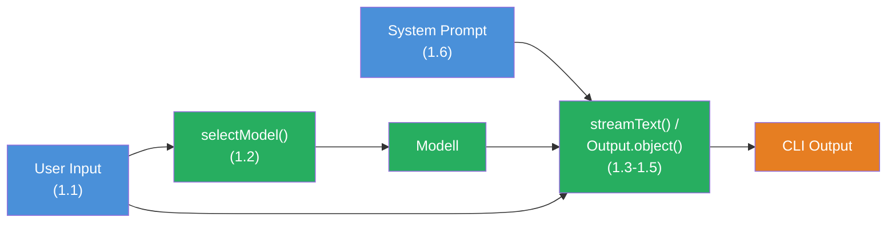

## Das Szenario

Du baust einen **interaktiven CLI-Chat** — ein Terminal-Programm, das wie ein Mini-ChatGPT funktioniert. Der Chat kombiniert alle sechs Bausteine aus Level 1: SDK Setup, Modell-Auswahl, System Prompt, Streaming und Structured Output.

Dein Chat soll sich so anfuehlen:

```
> Hallo! Wer bist Du?
Ich bin Dein AI-Assistent. Ich kann Dir bei Fragen helfen...

> /json Was ist TypeScript?
{
  "topic": "TypeScript",
  "summary": "TypeScript ist eine typisierte Erweiterung von JavaScript...",
  "keyPoints": ["Statische Typen", "Bessere IDE-Unterstuetzung", ...],
  "difficulty": "beginner"
}

> Tokens bisher: 342
```

> **Erwartete Dauer:** 30-45 Minuten. Erstelle eine Datei `chat.ts` und starte mit `npx tsx chat.ts`.

Dieses Projekt verbindet alle sechs Bausteine:



## Anforderungen

1. **Interaktive Eingabe** — Der User kann wiederholt Nachrichten eingeben (readline oder `process.stdin`). Das Programm laeuft bis der User "exit" tippt.
2. **System Prompt** (Challenge 1.6) — Der Chat hat eine definierte Rolle mit Regeln und Stil. Der System Prompt wird bei jedem Call mitgegeben.
3. **streamText fuer normale Antworten** (Challenge 1.4) — Normale Nachrichten werden mit `streamText` beantwortet. Text erscheint Token fuer Token im Terminal.
4. **Output.object + Zod Schema bei "/json"** (Challenge 1.5) — Wenn der User eine Nachricht mit `/json` beginnt, wird die Antwort als strukturiertes JSON-Objekt generiert (`generateText` + `Output.object`).
5. **selectModel basierend auf Nachrichtenlaenge** (Challenge 1.2) — Kurze Nachrichten (unter 50 Zeichen) nutzen ein guenstiges Flash-Modell. Lange Nachrichten nutzen ein Pro-Modell.
6. **Usage-Tracking** (Challenge 1.3) — Nach jeder Antwort werden die verbrauchten Tokens angezeigt. Ein Gesamtzaehler trackt die Session.

## Starter-Code

```typescript
import * as readline from 'readline';
// TODO: Importiere AI SDK Funktionen (generateText, streamText, Output)
// TODO: Importiere Provider (anthropic aus '@ai-sdk/anthropic')
// TODO: Importiere zod (z aus 'zod')
// Tipp: Wenn Du nur einen Provider hast, nutze verschiedene Modelle
// desselben Providers -- z.B. anthropic('claude-haiku-3-5-20241022')
// fuer kurze und anthropic('claude-sonnet-4-5-20250514') fuer lange Nachrichten.

// TODO: Definiere einen System Prompt mit Rolle und Regeln

// TODO: Definiere ein Zod Schema fuer den /json Modus

// TODO: Implementiere selectModel(message: string)

let totalTokens = 0;

const rl = readline.createInterface({
  input: process.stdin,
  output: process.stdout,
});

function askQuestion(): void {
  rl.question('\n> ', async (input) => {
    const message = input.trim();

    if (message === 'exit') {
      console.log(`\nSession beendet. Tokens gesamt: ${totalTokens}`);
      rl.close();
      return;
    }

    if (message === '') {
      askQuestion();
      return;
    }

    // TODO: Pruefe ob die Nachricht mit /json beginnt
    // TODO: Waehle das Modell basierend auf der Nachrichtenlaenge
    // TODO: Bei /json → generateText + Output.object
    // TODO: Sonst → streamText + textStream
    // TODO: Aktualisiere totalTokens

    askQuestion();
  });
}

console.log('CLI Chat gestartet. Tippe "exit" zum Beenden.');
console.log('Starte eine Nachricht mit /json fuer strukturierte Ausgabe.\n');
askQuestion();
```

## Bewertungskriterien

Dein Boss Fight ist bestanden, wenn:

- [ ] Der Chat laeuft interaktiv im Terminal und reagiert auf User-Eingaben
- [ ] Ein System Prompt definiert Rolle und Verhalten des Assistenten
- [ ] Normale Nachrichten werden mit `streamText` Token fuer Token ausgegeben
- [ ] Nachrichten mit `/json` erzeugen strukturierten Output mit `Output.object` und Zod Schema
- [ ] `selectModel` waehlt das Modell basierend auf der Nachrichtenlaenge
- [ ] Nach jeder Antwort wird der Token-Verbrauch angezeigt
- [ ] Ein Gesamtzaehler trackt die Tokens der gesamten Session
- [ ] "exit" beendet das Programm sauber mit Gesamtzaehler

## Hinweise

<details>
<summary>Hinweis 1: readline und async/await</summary>

Das `readline`-Callback ist nicht direkt `async`. Du kannst den Callback aber als `async` markieren — das funktioniert, weil `readline` den Rueckgabewert des Callbacks ignoriert. Alternativ kannst Du eine separate `async function handleMessage(message: string)` erstellen und sie aus dem Callback aufrufen.

</details>

<details>
<summary>Hinweis 2: Stream-Output ins Terminal schreiben</summary>

Fuer `streamText` nutze `process.stdout.write(chunk)` statt `console.log(chunk)`, damit der Text ohne Zeilenumbrueche Wort fuer Wort erscheint. Nach dem Stream einen `console.log()` fuer den finalen Zeilenumbruch. Den Token-Verbrauch bekommst Du aus `fullStream` (Event-Typ `finish`) oder ueber `result.usage` (ein Promise, das Du nach dem Stream awaiten kannst).

</details>

<details>
<summary>Hinweis 3: /json-Erkennung und Prompt-Extraktion</summary>

Pruefe mit `message.startsWith('/json')` ob der JSON-Modus aktiviert werden soll. Der eigentliche Prompt ist dann `message.slice(5).trim()` — alles nach "/json". Fuer den JSON-Modus nutze `generateText` (nicht `streamText`), weil `Output.object` ein vollstaendiges Objekt braucht, kein Stream.

</details>

## Quellen

- [Vercel AI SDK: Generating Text](https://ai-sdk.dev/docs/ai-sdk-core/generating-text)
- [Vercel AI SDK: Generating Structured Data](https://ai-sdk.dev/docs/ai-sdk-core/generating-structured-data)
- [Node.js: readline](https://nodejs.org/api/readline.html)
- [ai-hero-dev Exercises 01.01-01.13](https://github.com/ai-hero-dev/ai-sdk-v6-crash-course/tree/main/exercises/01-ai-sdk-basics)
