## Was Du gelernt hast

- **AI SDK:** TypeScript-Toolkit mit einheitlicher API fuer alle LLM-Provider — drei Bibliotheken (Core, UI, RSC), ein Interface
- **Provider-System:** Ein Import, ein Modell-Name — Provider wechseln ohne Code-Aenderung. `selectModel` fuer aufgabenbasierte Modellwahl
- **generateText:** Text generieren mit vollem Result-Objekt — `result.text`, `result.usage`, `result.finishReason` und Callbacks fuer Monitoring
- **streamText:** Echtzeit-Feedback durch Token-fuer-Token Streaming — `textStream` fuer Text, `fullStream` fuer alle Events
- **Structured Output:** Typisierte JSON-Objekte statt Freitext — Zod Schemas mit `Output.object`, `Output.array` und `Output.choice`
- **System Prompts:** Konsistentes LLM-Verhalten durch Rollendefinition — `system` fuer Persoenlichkeit, `prompt` fuer die Aufgabe

## Aktualisierter Skill Tree

```mermaid
graph LR
  subgraph "Freigeschaltet"
    L1["Level 1: AI SDK Basics"]
  end
  subgraph NEXT["Naechstes Level"]
    L2["Level 2: LLM Fundamentals"]
  end
  subgraph "Gesperrt"
    L3["Level 3: Agents & MCP"]
    L4["Level 4: Persistence"]
    L5["Level 5: Context Engineering"]
    L6["Level 6: Evals"]
    L7["Level 7: Streaming"]
    L8["Level 8: Workflows"]
    L9["Level 9: Advanced Patterns"]
  end
  L1 --> L2
  L2 -.-> L3
  L3 -.-> L4
  L4 -.-> L5
  L5 -.-> L6
  L6 -.-> L7
  L7 -.-> L8
  L8 -.-> L9
  style L1 fill:#27AE60,color:#fff
  style NEXT fill:none,stroke:#E67E22,stroke-width:3px,color:#E67E22
  style L2 fill:#E67E22,color:#fff
  style L3 fill:#95a5a6,color:#fff
  style L4 fill:#95a5a6,color:#fff
  style L5 fill:#95a5a6,color:#fff
  style L6 fill:#95a5a6,color:#fff
  style L7 fill:#95a5a6,color:#fff
  style L8 fill:#95a5a6,color:#fff
  style L9 fill:#95a5a6,color:#fff
```

## Naechstes Level

**Level 2: LLM Fundamentals** — Was passiert eigentlich INNERHALB des LLM? Tokens, Context Windows und warum Deine Kosten explodieren koennen. Du lernst die technischen Grundlagen, die Du brauchst, um AI-Anwendungen effizient und kostenoptimiert zu bauen.
