import { CardGrid, LinkCard } from '@astrojs/starlight/components';

## TL;DR

> Tokens, Context Windows und Caching — verstehe was innerhalb des LLM passiert und warum Deine Kosten so sind wie sie sind. In diesem Level lernst Du, wie LLMs Text in Tokens zerlegen, wie Du Token-Verbrauch trackst und Kosten berechnest, warum Context Windows begrenzt sind und wie Prompt Caching Deine Kosten um bis zu 90% senken kann.

## Skill Tree

```mermaid
graph LR
  subgraph "Freigeschaltet"
    L1["Level 1: AI SDK Basics"]
  end
  subgraph HIER["Aktuelles Level"]
    L2["Level 2: LLM Fundamentals"]
  end
  subgraph "Gesperrt"
    L3["Level 3: Agents & MCP"]
    L4["Level 4: Persistence"]
    L5["Level 5: Context Engineering"]
    L6["Level 6: Evals"]
    L7["Level 7: Streaming"]
    L8["Level 8: Workflows"]
    L9["Level 9: Advanced Patterns"]
  end
  L1 --> L2
  L2 -.-> L3
  L3 -.-> L4
  L4 -.-> L5
  L5 -.-> L6
  L6 -.-> L7
  L7 -.-> L8
  L8 -.-> L9
  style L1 fill:#27AE60,color:#fff
  style HIER fill:none,stroke:#E67E22,stroke-width:3px,stroke-dasharray:5 5
  style L2 fill:#E67E22,color:#fff
  style L3 fill:#95a5a6,color:#fff
  style L4 fill:#95a5a6,color:#fff
  style L5 fill:#95a5a6,color:#fff
  style L6 fill:#95a5a6,color:#fff
  style L7 fill:#95a5a6,color:#fff
  style L8 fill:#95a5a6,color:#fff
  style L9 fill:#95a5a6,color:#fff
```

## Was Du lernst

- **Was Tokens sind und wie Tokenisierung funktioniert** — Subword Units, Token IDs, warum Deutsch mehr Tokens braucht als Englisch
- **Wie Du Token-Verbrauch trackst und Kosten berechnest** — `result.usage`, Preis pro 1M Tokens, Kostenformeln
- **Warum Context Windows begrenzt sind** — was alles reinzaehlt, was bei Ueberschreitung passiert, Strategien bei vollem Fenster
- **Wie Prompt Caching Kosten drastisch senken kann** — Prefix Matching, Cache Tokens, Provider-Unterstuetzung

## Warum das wichtig ist

In Level 1 hast Du gelernt, wie Du mit dem AI SDK Text generierst. Aber Du hast `result.usage` nur als Zahl gesehen — ohne zu verstehen, was ein Token ist, warum die Zahlen so sind und wie Du sie kontrollierst.

Das konkrete Problem: Ohne Token-Verstaendnis kannst Du keine Kosten vorhersagen. Ohne Context-Window-Wissen fliegst Du mitten in der Konversation raus. Ohne Caching zahlst Du fuer denselben System Prompt jedes Mal den vollen Preis. Dieses Level gibt Dir die technischen Grundlagen, die Du fuer kosteneffiziente AI-Anwendungen brauchst.

## Voraussetzungen

- **Level 1 abgeschlossen** — `generateText`, `streamText`, `result.usage` muessen sitzen
- **Grundverstaendnis von API-Kosten** — Du weisst, dass LLM-Calls Geld kosten
- **Projektverzeichnis:** Arbeite im selben Projektverzeichnis wie Level 1 weiter — alle noetigen Packages (`ai`, `@ai-sdk/anthropic`, `tsx`) sind bereits installiert

> **Skip-Hinweis:** Du weisst bereits, was Subword Tokenization ist, kennst den Unterschied zwischen Input- und Output-Tokens und hast mit Prompt Caching gearbeitet? Spring direkt zur [Boss Fight](/de/level-2-llm-fundamentals/06-boss-fight/) und teste Dein Wissen.

## Challenges

<CardGrid>
  <LinkCard title="2.1 — Tokens" description="Was Tokens sind, wie Tokenisierung funktioniert, Token-Counting" href="/de/level-2-llm-fundamentals/02-tokens/" />
  <LinkCard title="2.2 — Usage Tracking" description="`result.usage`, Kostenberechnung, Extended Usage Details" href="/de/level-2-llm-fundamentals/03-usage-tracking/" />
  <LinkCard title="2.3 — Context Window" description="Context-Window-Groessen, was reinzaehlt, Strategien bei vollem Fenster" href="/de/level-2-llm-fundamentals/04-context-window/" />
  <LinkCard title="2.4 — Prompt Caching" description="Cache-Mechanik, `cacheReadTokens`, Kosten-Reduktion" href="/de/level-2-llm-fundamentals/05-prompt-caching/" />
</CardGrid>

## Boss Fight

Baue einen **Token-Budget-Rechner**: Ein Tool, das Tokens in System Prompt, User Message und erwartetem Output zaehlt, prueft ob alles ins Context Window passt, die erwarteten Kosten berechnet und die Cache-Hit-Rate ueber mehrere Calls trackt. Alle vier Bausteine dieses Levels in einem Projekt.

## Quellen fuer dieses Level

- [Vercel AI SDK: Generating Text](https://ai-sdk.dev/docs/ai-sdk-core/generating-text)
- [Anthropic: Token Counting](https://docs.anthropic.com/en/docs/build-with-claude/token-counting)
- [Anthropic: Prompt Caching](https://docs.anthropic.com/en/docs/build-with-claude/prompt-caching)
- [Vercel AI SDK: Provider Management](https://ai-sdk.dev/docs/foundations/providers-and-models)
