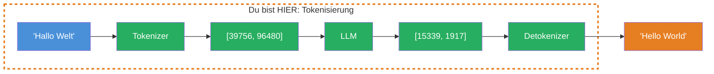
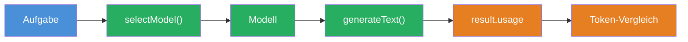

## THINK

Liest ein LLM Woerter wie Du — oder sieht es etwas ganz anderes?

## OVERVIEW



Ein LLM liest keinen Text. Es arbeitet mit Token IDs — Zahlen, die fuer Textfragmente (Subword Units) stehen. Der Tokenizer zerlegt Deinen Input in diese Fragmente, das LLM verarbeitet die IDs und der Detokenizer setzt die Ausgabe-IDs wieder zu lesbarem Text zusammen.

## WHY

**Ohne Token-Verstaendnis:** Deine Kosten sind unvorhersehbar. Du wunderst Dich, warum ein deutscher Prompt 40% mehr kostet als ein englischer. Du ueberschreitest das Context Window und bekommst kryptische Fehler. Du kannst nicht einschaetzen, ob Dein Prompt noch ins Budget passt.

**Mit Token-Verstaendnis:** Du kannst Kosten vorhersagen, bevor Du den API-Call machst. Du verstehst, warum Sprachen unterschiedlich viele Tokens brauchen. Du kannst Deine Prompts optimieren und weisst genau, wie viel Platz im Context Window noch frei ist.

## WALKTHROUGH

### Schicht 1: Was sind Tokens?

Tokens sind keine Woerter und keine Buchstaben — sie sind **Subword Units**. Der Tokenizer zerlegt Text in die haeufigsten Zeichenkombinationen seiner Trainingsdaten:

```
Eingabe:  "JavaScript ist fantastisch"
Tokens:   ["Java", "Script", " ist", " fant", "astisch"]
Anzahl:   5 Tokens
```

Haeufige Woerter wie "the" oder "ist" sind oft ein einzelner Token. Seltene Woerter werden in mehrere Teile zerlegt. Das ist der Grund, warum ein LLM kein Woerterbuch hat, sondern einen Tokenizer.

### Schicht 2: Die Faustregel — 1 Token in Zahlen

Fuer schnelle Schaetzungen:

| Sprache | Faustregel | Beispiel |
|---------|-----------|----------|
| Englisch | 1 Token ≈ 4 Zeichen | "Hello World" ≈ 3 Tokens |
| Deutsch | 1 Token ≈ 3 Zeichen | "Hallo Welt" ≈ 4 Tokens |
| Code | variabel | Klammern, Operatoren oft eigene Tokens |

Warum braucht Deutsch mehr Tokens? Deutsche Woerter sind im Durchschnitt laenger (Zusammensetzungen wie "Datenbankverbindung") und kommen seltener in den englisch-lastigen Trainingsdaten vor. Der Tokenizer muss sie in mehr Subword Units zerlegen.

### Schicht 3: Token-Counting mit dem AI SDK

Das AI SDK gibt Dir Token-Zahlen ueber `result.usage` zurueck — automatisch bei jedem Call:

```typescript
import { generateText } from 'ai';
import { anthropic } from '@ai-sdk/anthropic';

const result = await generateText({
  model: anthropic('claude-sonnet-4-5-20250514'),
  prompt: 'Erklaere was Tokens sind — in einem Satz.',
});

console.log(result.usage);
// → {
//     promptTokens: 18,       ← Tokens im Input (system + prompt)
//     completionTokens: 42,   ← Tokens im Output (generierter Text)
//     totalTokens: 60          ← Summe
//   }
```

`promptTokens` sind die Tokens, die Du zum LLM schickst. `completionTokens` sind die Tokens, die das LLM generiert. Beide zusammen ergeben `totalTokens` — und beide kosten Geld, aber zu unterschiedlichen Preisen.

> **Pre-Request Token Counting:** Du kannst Tokens auch **vor** einem API-Call zaehlen — z.B. mit [`client.messages.countTokens()`](https://docs.anthropic.com/en/docs/build-with-claude/token-counting) im Anthropic SDK. Das hilft, Kosten vorherzusagen und Context-Window-Limits einzuhalten, bevor du Geld ausgibst.
>
> ```typescript
> import Anthropic from '@anthropic-ai/sdk';
> const client = new Anthropic();
>
> const tokenCount = await client.messages.countTokens({
>   model: 'claude-sonnet-4-5-20250514',
>   messages: [{ role: 'user', content: 'Dein Prompt hier...' }],
> });
> console.log('Input tokens:', tokenCount.input_tokens);
> ```

### Schicht 4: Input- vs. Output-Tokens — unterschiedliche Preise

Die meisten Provider berechnen Input und Output unterschiedlich:

| Modell | Input (pro 1M Tokens) | Output (pro 1M Tokens) |
|--------|----------------------|------------------------|
| Claude Sonnet 4.5 | $3.00 | $15.00 |
| GPT-4o | $2.50 | $10.00 |
| Gemini 2.5 Flash | $0.15 | $0.60 |

Output-Tokens sind 3-5x teurer als Input-Tokens. Das bedeutet: Ein Prompt, der das LLM zu langen Antworten animiert, kostet ueberproportional mehr. Kurze, praezise Anweisungen ("Antworte in maximal 3 Saetzen") sparen echtes Geld.

## TRY

**Aufgabe:** Zaehle Tokens fuer verschiedene Texte und vergleiche Deutsch vs. Englisch.

Erstelle eine Datei `challenge-2-1.ts`:

```typescript
import { generateText } from 'ai';
import { anthropic } from '@ai-sdk/anthropic';

// TODO 1: Generiere eine kurze Antwort auf einen deutschen Prompt
// const resultDE = await generateText({
//   model: anthropic('claude-sonnet-4-5-20250514'),
//   prompt: 'Erklaere in 2 Saetzen, was eine Datenbank ist.',
// });

// TODO 2: Generiere eine kurze Antwort auf denselben Prompt auf Englisch
// const resultEN = await generateText({
//   model: anthropic('claude-sonnet-4-5-20250514'),
//   prompt: 'Explain in 2 sentences what a database is.',
// });

// TODO 3: Vergleiche die Token-Zahlen
// console.log('--- Deutsch ---');
// console.log('Prompt Tokens:', resultDE.usage.promptTokens);
// console.log('Completion Tokens:', resultDE.usage.completionTokens);
// console.log('Total Tokens:', resultDE.usage.totalTokens);

// console.log('--- English ---');
// console.log('Prompt Tokens:', resultEN.usage.promptTokens);
// console.log('Completion Tokens:', resultEN.usage.completionTokens);
// console.log('Total Tokens:', resultEN.usage.totalTokens);

// TODO 4: Berechne den Unterschied in Prozent
// const diff = ((resultDE.usage.totalTokens - resultEN.usage.totalTokens) / resultEN.usage.totalTokens * 100).toFixed(1);
// console.log(`\nDeutsch braucht ${diff}% mehr/weniger Tokens als Englisch`);
```

**Checkliste:**
- [ ] Deutscher und englischer Prompt mit gleichem Inhalt
- [ ] `result.usage` fuer beide geloggt
- [ ] Token-Zahlen verglichen (promptTokens und completionTokens)
- [ ] Prozentualer Unterschied berechnet

<details>
<summary>Loesung anzeigen</summary>

```typescript
import { generateText } from 'ai';
import { anthropic } from '@ai-sdk/anthropic';

const resultDE = await generateText({
  model: anthropic('claude-sonnet-4-5-20250514'),
  prompt: 'Erklaere in 2 Saetzen, was eine Datenbank ist.',
});

const resultEN = await generateText({
  model: anthropic('claude-sonnet-4-5-20250514'),
  prompt: 'Explain in 2 sentences what a database is.',
});

console.log('--- Deutsch ---');
console.log('Prompt Tokens:', resultDE.usage.promptTokens);
console.log('Completion Tokens:', resultDE.usage.completionTokens);
console.log('Total Tokens:', resultDE.usage.totalTokens);

console.log('\n--- English ---');
console.log('Prompt Tokens:', resultEN.usage.promptTokens);
console.log('Completion Tokens:', resultEN.usage.completionTokens);
console.log('Total Tokens:', resultEN.usage.totalTokens);

const diff = ((resultDE.usage.totalTokens - resultEN.usage.totalTokens) / resultEN.usage.totalTokens * 100).toFixed(1);
console.log(`\nDeutsch braucht ${diff}% mehr Tokens als Englisch`);
```

Ausfuehren mit:

```bash
npx tsx challenge-2-1.ts
```

**Erwarteter Output (ungefaehr):**
```
--- Deutsch ---
Prompt Tokens: 22
Completion Tokens: 55
Total Tokens: 77
--- English ---
Prompt Tokens: 18
Completion Tokens: 42
Total Tokens: 60

Deutsch braucht 28.3% mehr Tokens als Englisch
```

Die genauen Zahlen variieren bei jedem Aufruf (LLM-Output ist nicht deterministisch), aber der deutsche Prompt sollte konsistent 20-40% mehr Tokens verbrauchen.

**Erklaerung:** Das liegt an der Tokenizer-Verteilung — englische Woerter kommen haeufiger in den Trainingsdaten vor und werden effizienter kodiert.

</details>

## COMBINE



**Uebung:** Kombiniere Token-Counting mit der Modell-Auswahl aus Level 1. Stelle denselben Prompt an zwei verschiedene Modelle und vergleiche den Token-Verbrauch.

1. Nutze `selectModel('zusammenfassen')` fuer ein Flash-Modell (z.B. Gemini Flash)
2. Nutze `selectModel('analysieren')` fuer ein Pro-Modell (z.B. Claude Sonnet)
3. Stelle denselben Prompt an beide Modelle
4. Vergleiche `promptTokens` und `completionTokens` — unterschiedliche Tokenizer ergeben unterschiedliche Zahlen

**Optional Stretch Goal:** Berechne die geschaetzten Kosten fuer beide Modelle basierend auf der Preistabelle aus Schicht 4. Welches Modell ist guenstiger — und um wie viel?

## Quellen

- [Anthropic: Token Counting](https://docs.anthropic.com/en/docs/build-with-claude/token-counting)
- [Vercel AI SDK: Generating Text — Usage](https://ai-sdk.dev/docs/ai-sdk-core/generating-text)
- [OpenAI: Tokenizer](https://platform.openai.com/tokenizer)
