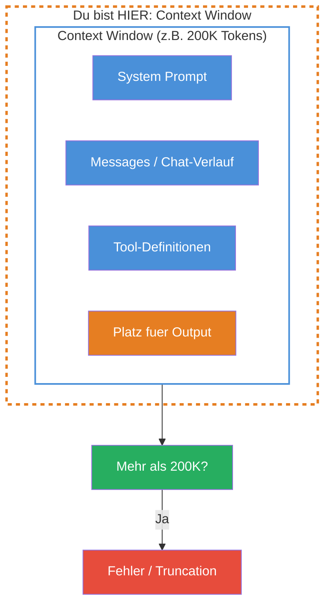
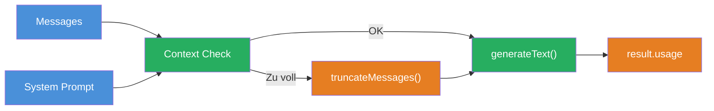

## THINK

Was passiert wenn Du einem LLM einen Roman schickst — kann es den komplett lesen?

## OVERVIEW



Das Context Window ist ein fester Rahmen — alles was das LLM gleichzeitig "sehen" kann. System Prompt, Chat-Verlauf, Tool-Definitionen UND der Platz fuer die Antwort muessen zusammen hineinpassen. Wenn nicht, gibt es Fehler oder Informationsverlust.

## WHY

**Ohne Context-Window-Verstaendnis:** Dein Chat funktioniert fuer 10 Nachrichten, bei Nachricht 30 bekommst Du ploetzlich Fehler. Du schickst ein langes Dokument mit und die Antwort bezieht sich nur auf die letzten Absaetze. Du verstehst nicht, warum das LLM Kontext "vergisst".

**Mit Context-Window-Verstaendnis:** Du planst strategisch, was ins Fenster kommt und was nicht. Du implementierst Truncation oder Summarization, bevor es zu Fehlern kommt. Du reservierst Platz fuer den Output und hast die volle Kontrolle ueber den Informationsfluss.

## WALKTHROUGH

### Schicht 1: Context-Window-Groessen im Ueberblick

Verschiedene Modelle haben verschiedene Limits:

| Modell | Context Window | Ca. in Text |
|--------|---------------|-------------|
| Claude Sonnet 4 | 200.000 Tokens | ~150.000 Woerter / ~500 Seiten |
| GPT-4o | 128.000 Tokens | ~96.000 Woerter / ~320 Seiten |
| Gemini 2.5 Flash | 1.048.576 Tokens | ~780.000 Woerter / ~2.600 Seiten |
| Claude Haiku | 200.000 Tokens | ~150.000 Woerter / ~500 Seiten |

200.000 Tokens klingt viel, aber in einer Chat-Anwendung summiert sich jede Nachricht. Ein System Prompt mit Tool-Definitionen kann leicht 2.000-5.000 Tokens verbrauchen — bei jedem einzelnen Call.

### Schicht 2: Was zaehlt alles rein?

Alles, was zum LLM geht, verbraucht Context-Window-Platz:

```typescript
import { generateText } from 'ai';
import { anthropic } from '@ai-sdk/anthropic';

const result = await generateText({
  model: anthropic('claude-sonnet-4-5-20250514'),

  // 1. System Prompt — zaehlt IMMER rein
  system: `Du bist ein Code-Review-Assistent.
    Pruefe Code auf Best Practices, Sicherheit und Performance.
    Antworte strukturiert mit Kategorien.`,              // ← ~40 Tokens

  // 2. Messages — jede Nachricht zaehlt
  messages: [
    { role: 'user', content: 'Review diesen Code: ...' },    // ← Tokens pro Nachricht
    { role: 'assistant', content: 'Hier mein Review: ...' },  // ← Auch alte Antworten!
    { role: 'user', content: 'Und dieser Code?' },            // ← Aktuelle Nachricht
  ],

  // 3. Platz fuer Output — muss auch reinpassen!
  maxTokens: 4096,                                             // ← Reserviert fuer Antwort
});
```

Die Rechnung: `system` + alle `messages` + Tool-Definitionen + `maxTokens` muss kleiner sein als das Context Window. Wenn Du `maxTokens` nicht setzt, reserviert das Modell einen Standardwert.

### Schicht 3: Was passiert bei Ueberschreitung?

Wenn der Input das Context Window ueberschreitet, reagieren Provider unterschiedlich:

```typescript
// Szenario: Du schickst 210.000 Tokens an ein 200K-Modell

// Anthropic: Klarer Fehler
// → Error: "prompt is too long: 210432 tokens > 200000 token limit"

// Manche Provider: Stille Truncation
// → Die aeltesten Messages werden abgeschnitten — OHNE Warnung!
```

Stille Truncation ist gefaehrlicher als ein Fehler. Das LLM antwortet normal, hat aber wichtigen Kontext verloren. Die Antwort wirkt korrekt, ist aber unvollstaendig oder falsch — weil das LLM nicht mehr alle Informationen hat.

### Schicht 4: Strategien bei vollem Context Window

Drei Strategien fuer lange Konversationen:

**Strategie 1: Truncation (aelteste Messages entfernen)**

```typescript
function truncateMessages(
  messages: Array<{ role: string; content: string }>,
  maxMessages: number,
): Array<{ role: string; content: string }> {
  if (messages.length <= maxMessages) return messages;

  // Behalte die erste Nachricht (oft wichtiger Kontext) + die neuesten
  const first = messages[0];
  const recent = messages.slice(-(maxMessages - 1));          // ← Neueste behalten
  return [first, ...recent];
}

const allMessages = [/* 50 Nachrichten aus dem Chat */];
const trimmed = truncateMessages(allMessages, 20);            // ← Nur 20 behalten
```

**Strategie 2: Token-basierte Truncation (praeziser)**

```typescript
function estimateTokens(text: string): number {
  // Faustregel: 1 Token ≈ 4 Zeichen (Englisch) / 3 Zeichen (Deutsch)
  return Math.ceil(text.length / 3.5);                        // ← Grober Durchschnitt
}

function truncateByTokenBudget(
  messages: Array<{ role: string; content: string }>,
  tokenBudget: number,
): Array<{ role: string; content: string }> {
  const result: Array<{ role: string; content: string }> = [];
  let currentTokens = 0;

  // Von hinten (neueste zuerst) auffuellen
  for (let i = messages.length - 1; i >= 0; i--) {
    const msgTokens = estimateTokens(messages[i].content);
    if (currentTokens + msgTokens > tokenBudget) break;      // ← Budget erschoepft
    result.unshift(messages[i]);
    currentTokens += msgTokens;
  }

  return result;
}
```

**Strategie 3: Zusammenfassung (Summarization)**

```typescript
import { generateText } from 'ai';
import { anthropic } from '@ai-sdk/anthropic';

async function summarizeOldMessages(
  messages: Array<{ role: string; content: string }>,
): Promise<string> {
  const oldMessages = messages.slice(0, -5);                  // ← Alte Nachrichten
  const text = oldMessages.map(m => `${m.role}: ${m.content}`).join('\n');

  const result = await generateText({
    model: anthropic('claude-sonnet-4-5-20250514'),
    prompt: `Fasse diese Konversation in 3-5 Saetzen zusammen:\n\n${text}`,
  });

  return result.text;                                          // ← Zusammenfassung als Kontext
}
```

## TRY

**Aufgabe:** Simuliere eine Konversation, die sich dem Context Limit naehert. Berechne die Token-Anzahl und pruefe, ob sie ins Fenster passt.

```typescript
import { generateText } from 'ai';
import { anthropic } from '@ai-sdk/anthropic';

const MODEL_CONTEXT_WINDOW = 200_000; // Claude Sonnet: 200K Tokens

// TODO 1: Definiere einen System Prompt (~50 Tokens)
// const systemPrompt = '...';

// TODO 2: Erstelle ein Array mit simulierten Chat-Messages
// Tipp: Erstelle 10+ Messages mit unterschiedlicher Laenge
// const messages = [
//   { role: 'user' as const, content: 'Erste Nachricht...' },
//   { role: 'assistant' as const, content: 'Antwort...' },
//   ...
// ];

// TODO 3: Implementiere estimateTokens(text)
// function estimateTokens(text: string): number { ... }

// TODO 4: Berechne den Gesamtverbrauch
// const systemTokens = estimateTokens(systemPrompt);
// const messageTokens = messages.reduce((sum, m) => sum + estimateTokens(m.content), 0);
// const outputReserve = 4096;
// const total = systemTokens + messageTokens + outputReserve;

// TODO 5: Pruefe gegen das Context Window
// const remainingTokens = MODEL_CONTEXT_WINDOW - total;
// console.log(`System: ${systemTokens} Tokens`);
// console.log(`Messages: ${messageTokens} Tokens`);
// console.log(`Output-Reserve: ${outputReserve} Tokens`);
// console.log(`Gesamt: ${total} Tokens`);
// console.log(`Verbleibend: ${remainingTokens} Tokens`);
// console.log(`Auslastung: ${(total / MODEL_CONTEXT_WINDOW * 100).toFixed(1)}%`);

// TODO 6: Warne bei >80% Auslastung
// if (total / MODEL_CONTEXT_WINDOW > 0.8) {
//   console.warn('WARNUNG: Context Window zu >80% ausgelastet!');
// }
```

**Checkliste:**
- [ ] System Prompt und Messages definiert
- [ ] `estimateTokens` implementiert
- [ ] Token-Verbrauch fuer System, Messages und Output-Reserve berechnet
- [ ] Gegen Context-Window-Limit geprueft
- [ ] Warnung bei >80% Auslastung

<details>
<summary>Loesung anzeigen</summary>

```typescript
const MODEL_CONTEXT_WINDOW = 200_000;

const systemPrompt = `Du bist ein Code-Review-Assistent. Pruefe Code auf Best Practices,
Sicherheit und Performance. Antworte strukturiert mit Kategorien und Prioritaeten.`;

const messages: Array<{ role: 'user' | 'assistant'; content: string }> = [
  { role: 'user', content: 'Review diesen Express-Server:\n```\nconst app = express();\napp.get("/users", async (req, res) => {\n  const users = await db.query("SELECT * FROM users WHERE id = " + req.query.id);\n  res.json(users);\n});\n```' },
  { role: 'assistant', content: 'Kritisch: SQL Injection in der Query. Nutze parametrisierte Queries: db.query("SELECT * FROM users WHERE id = $1", [req.query.id]). Ausserdem fehlt Error Handling und Input-Validierung.' },
  { role: 'user', content: 'Danke! Und wie sieht es mit dem Error Handling aus?' },
  { role: 'assistant', content: 'Wrape den async Handler in einen try/catch Block. Express faengt keine unbehandelten Promise-Rejections ab. Alternativ: ein Error-Handling-Middleware mit app.use((err, req, res, next) => {...}).' },
  { role: 'user', content: 'Kannst Du mir den ganzen Server refactored zeigen?' },
  { role: 'assistant', content: 'Hier der refactored Server mit parametrisierter Query, Error Handling, Input-Validierung mit zod und einem Health-Check Endpoint...' + 'x'.repeat(2000) },
  { role: 'user', content: 'Review jetzt auch mein Authentication-Modul:\n```\n' + 'x'.repeat(5000) + '\n```' },
  { role: 'assistant', content: 'Analyse des Auth-Moduls: 1) JWT-Secret ist hardcoded — nutze Environment Variables. 2) Kein Token-Expiry gesetzt. 3) Password-Hashing fehlt — nutze bcrypt...' + 'x'.repeat(3000) },
  { role: 'user', content: 'Und hier ist mein Database-Layer:\n```\n' + 'x'.repeat(8000) + '\n```' },
  { role: 'assistant', content: 'Database-Layer Review: Connection Pooling fehlt, keine Retry-Logik, Migrations nicht versioniert...' + 'x'.repeat(4000) },
];

function estimateTokens(text: string): number {
  return Math.ceil(text.length / 3.5);
}

const systemTokens = estimateTokens(systemPrompt);
const messageTokens = messages.reduce((sum, m) => sum + estimateTokens(m.content), 0);
const outputReserve = 4096;
const total = systemTokens + messageTokens + outputReserve;

const remainingTokens = MODEL_CONTEXT_WINDOW - total;
const utilization = (total / MODEL_CONTEXT_WINDOW) * 100;

console.log(`System: ${systemTokens} Tokens`);
console.log(`Messages: ${messageTokens} Tokens (${messages.length} Nachrichten)`);
console.log(`Output-Reserve: ${outputReserve} Tokens`);
console.log(`Gesamt: ${total} Tokens`);
console.log(`Verbleibend: ${remainingTokens} Tokens`);
console.log(`Auslastung: ${utilization.toFixed(1)}%`);

if (utilization > 80) {
  console.warn('\nWARNUNG: Context Window zu >80% ausgelastet!');
  console.warn('Empfehlung: Alte Messages zusammenfassen oder entfernen.');
}
```

**Erklaerung:** Die `estimateTokens`-Funktion nutzt die Faustregel 1 Token ≈ 3.5 Zeichen als Durchschnitt zwischen Deutsch und Englisch. In einer Produktionsanwendung wuerdest Du den Tokenizer des Providers verwenden fuer exakte Zahlen. Die 80%-Warnung gibt Dir einen Sicherheitspuffer, bevor es zu Fehlern kommt.

</details>

## COMBINE



**Uebung:** Baue einen Context Manager, der vor jedem Call prueft, ob der Input ins Context Window passt, und bei Ueberschreitung automatisch alte Messages entfernt.

1. Implementiere `estimateTokens(text)` mit der Faustregel
2. Berechne den Token-Verbrauch von System Prompt + Messages + Output-Reserve
3. Wenn >80% des Context Windows belegt: entferne die aeltesten Messages (behalte die erste und die neuesten 5)
4. Logge eine Warnung, wenn Messages entfernt werden
5. Erst dann den `generateText`-Call ausfuehren

**Optional Stretch Goal:** Statt Messages einfach zu entfernen, fasse die alten Messages mit einem `generateText`-Call zusammen und fuege die Zusammenfassung als erste "System-Nachricht" ein.

## Quellen

- [Anthropic: Models Overview](https://docs.anthropic.com/en/docs/about-claude/models)
- [Vercel AI SDK: Prompts](https://ai-sdk.dev/docs/foundations/prompts)
- [Anthropic: Long Context Window Tips](https://docs.anthropic.com/en/docs/build-with-claude/prompt-engineering/long-context-tips)
