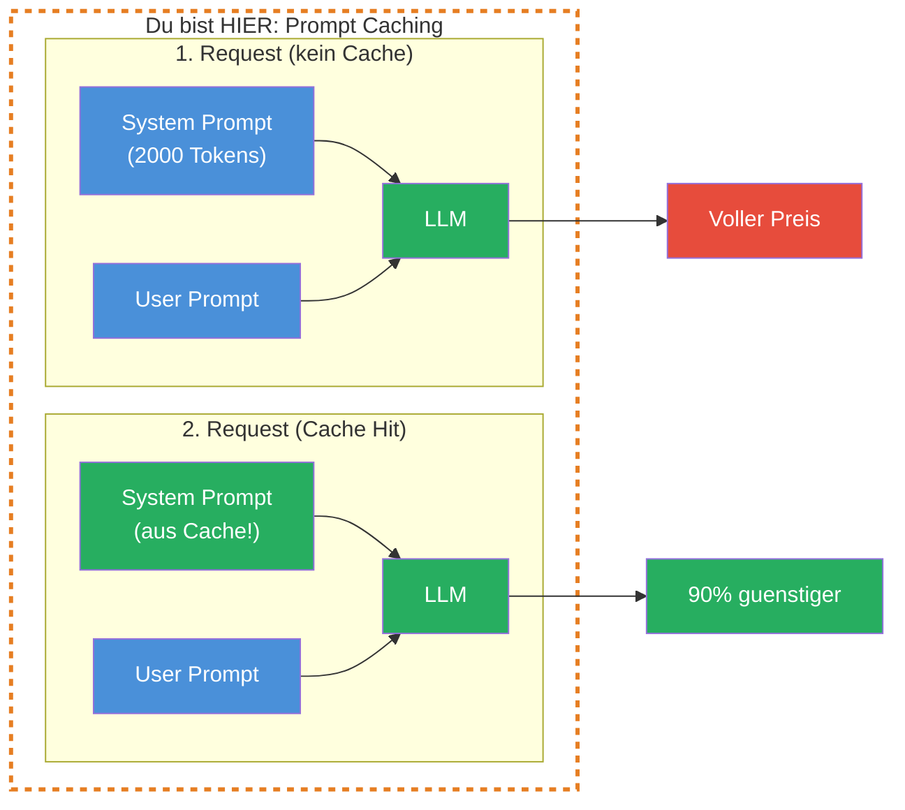
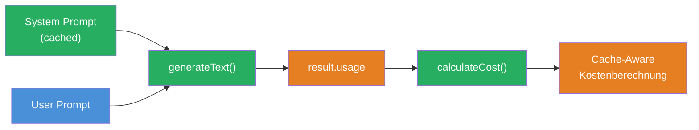

## THINK

Wenn Du denselben System Prompt bei jedem Request schickst — zahlt der Provider jedes Mal neu dafuer?

## OVERVIEW



Beim ersten Request wird der System Prompt normal berechnet und im Cache gespeichert. Ab dem zweiten Request erkennt der Provider das identische Prefix und liest es aus dem Cache — zu einem Bruchteil der Kosten.

## WHY

**Ohne Prompt Caching:** Du schickst denselben 2.000-Token System Prompt bei jedem Request. Bei 100 Requests pro Stunde zahlst Du 100x den vollen Preis fuer identischen Text. Das summiert sich schnell.

**Mit Prompt Caching:** Der System Prompt wird einmal berechnet, dann aus dem Cache gelesen. Bei Anthropic kostet ein Cache-Read nur 10% des normalen Input-Preises. Bei 100 Requests sparst Du 90% der System-Prompt-Kosten.

## WALKTHROUGH

### Schicht 1: Wie Prompt Caching funktioniert

Prompt Caching basiert auf **Prefix Matching**. Der Provider vergleicht den Anfang Deines Requests mit vorherigen Requests:

```
Request 1:  [System Prompt] + [User: "Was ist TypeScript?"]
            ^^^^^^^^^^^^^^^^
            Wird gecacht (= Prefix)

Request 2:  [System Prompt] + [User: "Erklaere Promises."]
            ^^^^^^^^^^^^^^^^
            Cache Hit! Nur User-Prompt wird neu berechnet.

Request 3:  [Anderer System Prompt] + [User: "Was ist TypeScript?"]
            ^^^^^^^^^^^^^^^^^^^^^^^^
            Cache Miss — Prefix hat sich geaendert.
```

Wichtig: Der Cache funktioniert nur fuer den **Anfang** (Prefix) des Requests. Sobald sich auch nur ein Zeichen im System Prompt aendert, ist der gesamte Cache ungueltig. Deshalb: System Prompt stabil halten, dynamische Teile ans Ende.

### Schicht 2: Provider-Unterstuetzung

Nicht alle Provider unterstuetzen Prompt Caching:

| Provider | Caching | Min. Prefix-Laenge | Cache-Dauer |
|----------|---------|-------------------|-------------|
| Anthropic | Ja | 1.024 Tokens (Sonnet), 2.048 (Haiku) | 5 Minuten (TTL — Time To Live, danach verfaellt der Cache) |
| Google (Gemini) | Ja | variabel | variabel |
| OpenAI | Automatisch | 1.024 Tokens | bis zu 1 Stunde |

Anthropic hat eine Mindestlaenge fuer den Cache-Prefix. Kurze System Prompts unter 1.024 Tokens werden nicht gecacht. Das ist ein bewusster Tradeoff — der Overhead fuer das Caching lohnt sich nur bei laengeren Prefixes.

### Schicht 3: Cache-Tokens im Usage-Objekt

Das AI SDK gibt Dir Cache-Informationen im `usage`-Objekt zurueck:

```typescript
import { generateText } from 'ai';
import { anthropic } from '@ai-sdk/anthropic';

// Ein langer System Prompt (>1024 Tokens fuer Cache-Eligibility)
const longSystemPrompt = `
Du bist ein erfahrener Code-Review-Assistent.

<rules>
- Pruefe jeden Code auf: Sicherheit, Performance, Lesbarkeit, Best Practices
- Kategorisiere Findings als: KRITISCH, WARNUNG, HINWEIS
- Gib fuer jedes Finding: Zeile, Problem, Loesung an
- Nutze die OWASP Top 10 als Sicherheits-Referenz
- Beachte TypeScript-spezifische Patterns und Anti-Patterns
- Pruefe auf proper Error Handling und Edge Cases
</rules>

<output-format>
## Review: [Dateiname]

### KRITISCH
- **Zeile X:** [Problem] → [Loesung]

### WARNUNG
- **Zeile X:** [Problem] → [Loesung]

### HINWEIS
- **Zeile X:** [Problem] → [Loesung]

### Zusammenfassung
[1-2 Saetze Gesamtbewertung]
</output-format>
`.trim();
// Dieser System Prompt hat ca. 150 Woerter ≈ 200-250 Tokens (unter dem 1024-Token-Minimum fuer Caching).
// Fuer die Demonstration der Mechanik reicht das — fuer echtes Caching muss der Prompt laenger sein (siehe TRY-Aufgabe).

// Erster Request — Cache wird erstellt
const result1 = await generateText({
  model: anthropic('claude-sonnet-4-5-20250514'),
  system: longSystemPrompt,
  prompt: 'Review: const x = eval(userInput);',
});

console.log('--- Request 1 (Cache Creation) ---');
console.log('Prompt Tokens:', result1.usage.promptTokens);
console.log('Completion Tokens:', result1.usage.completionTokens);

// Zweiter Request — selber System Prompt, Cache Hit erwartet
const result2 = await generateText({
  model: anthropic('claude-sonnet-4-5-20250514'),
  system: longSystemPrompt,                                   // ← Identisch!
  prompt: 'Review: app.get("/api", (req, res) => res.send(db.query(req.body.sql)));',
});

console.log('\n--- Request 2 (Cache Hit erwartet) ---');
console.log('Prompt Tokens:', result2.usage.promptTokens);
console.log('Completion Tokens:', result2.usage.completionTokens);
```

Beim zweiten Request solltest Du niedrigere effektive Kosten sehen, weil der System Prompt aus dem Cache gelesen wird.

### Schicht 4: Cache-Kosten berechnen

Die Preisstruktur mit Caching bei Anthropic:

| Token-Typ | Preis (Claude Sonnet 4) | Verhaeltnis |
|-----------|------------------------|-------------|
| Normal Input | $3.00 / 1M | 100% |
| Cache Write | $3.75 / 1M | 125% (einmalig teurer) |
| Cache Read | $0.30 / 1M | 10% (90% guenstiger!) |
| Output | $15.00 / 1M | — |

Der erste Request (Cache Write) ist sogar etwas teurer als normal. Aber ab dem zweiten Request sparst Du 90%. Die Break-Even-Rechnung (ab wann sich Caching lohnt):

```typescript
// Beispiel: 2000-Token System Prompt, Claude Sonnet
const systemTokens = 2000;
const normalCostPerCall = (systemTokens / 1_000_000) * 3.00;    // $0.006
const cacheWriteCost = (systemTokens / 1_000_000) * 3.75;       // $0.0075 (einmalig)
const cacheReadCost = (systemTokens / 1_000_000) * 0.30;        // $0.0006 pro Folge-Call

// Ohne Cache: 10 Calls = 10 × $0.006 = $0.060
const withoutCache = normalCostPerCall * 10;

// Mit Cache: 1 Write + 9 Reads = $0.0075 + 9 × $0.0006 = $0.0129
const withCache = cacheWriteCost + (cacheReadCost * 9);

console.log(`Ohne Cache (10 Calls): $${withoutCache.toFixed(4)}`);
console.log(`Mit Cache (10 Calls): $${withCache.toFixed(4)}`);
console.log(`Ersparnis: ${((1 - withCache / withoutCache) * 100).toFixed(0)}%`);
// → Ersparnis: 79%
```

Ab 2 Requests mit demselben Prefix lohnt sich Caching. Je mehr Requests, desto groesser die Ersparnis — asymptotisch gegen 90%.

## TRY

**Aufgabe:** Mache zwei Calls mit demselben langen System Prompt und vergleiche die Usage Details.

Erstelle eine Datei `challenge-2-4.ts`:

```typescript
import { generateText } from 'ai';
import { anthropic } from '@ai-sdk/anthropic';

// TODO 1: Erstelle einen langen System Prompt (>1024 Tokens)
// Tipp: Ein detailliertes Regelwerk mit XML Tags, Beispielen und Output-Format
// const systemPrompt = `...`;

// TODO 2: Erster Call — Cache wird erstellt
// const result1 = await generateText({
//   model: anthropic('claude-sonnet-4-5-20250514'),
//   system: systemPrompt,
//   prompt: 'Erste Frage...',
// });

// TODO 3: Zweiter Call — gleicher System Prompt, andere Frage
// const result2 = await generateText({
//   model: anthropic('claude-sonnet-4-5-20250514'),
//   system: systemPrompt,
//   prompt: 'Zweite Frage...',
// });

// TODO 4: Vergleiche die Usage
// console.log('--- Request 1 ---');
// console.log('Prompt Tokens:', result1.usage.promptTokens);
// console.log('Completion Tokens:', result1.usage.completionTokens);

// console.log('--- Request 2 ---');
// console.log('Prompt Tokens:', result2.usage.promptTokens);
// console.log('Completion Tokens:', result2.usage.completionTokens);
```

**Checkliste:**
- [ ] System Prompt ist lang genug fuer Caching (>1024 Tokens)
- [ ] Zwei Calls mit identischem System Prompt
- [ ] Usage-Vergleich geloggt
- [ ] Unterschied zwischen erstem und zweitem Call beobachtet

<details>
<summary>Loesung anzeigen</summary>

```typescript
import { generateText } from 'ai';
import { anthropic } from '@ai-sdk/anthropic';

const systemPrompt = `
<task-context>
Du bist ein erfahrener Software-Architekt mit 15 Jahren Erfahrung in TypeScript,
Node.js und Cloud-Architekturen. Du reviewst Code und Architekturen fuer
Enterprise-Anwendungen.
</task-context>

<rules>
- Pruefe jeden Code auf: Sicherheit, Performance, Lesbarkeit, Wartbarkeit
- Kategorisiere Findings als: KRITISCH, WARNUNG, HINWEIS, POSITIV
- Gib fuer jedes Finding an: Betroffene Stelle, Problem, Empfohlene Loesung
- Nutze die OWASP Top 10 als Sicherheits-Referenz
- Beachte TypeScript-spezifische Patterns: strict mode, type safety, generics
- Pruefe auf Error Handling, Edge Cases und Race Conditions
- Bewerte die Testbarkeit des Codes
- Achte auf SOLID-Prinzipien und Clean Architecture
- Pruefe Dependencies auf bekannte Vulnerabilities
- Bewerte die API-Design-Qualitaet (REST Best Practices)
- Achte auf proper Logging und Monitoring-Hooks
- Pruefe auf Memory Leaks und Resource Cleanup
</rules>

<examples>
Beispiel fuer ein KRITISCH-Finding:
- Stelle: Zeile 42, db.query()
- Problem: SQL Injection durch String-Concatenation
- Loesung: Parametrisierte Query verwenden

Beispiel fuer ein WARNUNG-Finding:
- Stelle: Zeile 15, catch(e) {}
- Problem: Leerer Catch-Block verschluckt Fehler
- Loesung: Error loggen und ggf. re-throwen

Beispiel fuer ein POSITIV-Finding:
- Stelle: Zeile 8, zod.parse()
- Problem: -
- Loesung: Gute Input-Validierung mit Zod
</examples>

<output-format>
## Code Review: [Kontext]

### KRITISCH
- **[Stelle]:** [Problem] → [Loesung]

### WARNUNG
- **[Stelle]:** [Problem] → [Loesung]

### HINWEIS
- **[Stelle]:** [Problem] → [Loesung]

### POSITIV
- **[Stelle]:** [Was gut ist]

### Zusammenfassung
[2-3 Saetze Gesamtbewertung mit Prioritaeten]
</output-format>
`.trim();

// Request 1 — Cache Creation
const result1 = await generateText({
  model: anthropic('claude-sonnet-4-5-20250514'),
  system: systemPrompt,
  prompt: 'Review: const secret = "sk-1234"; app.post("/login", (req, res) => { if (req.body.pw === secret) res.json({token: jwt.sign({}, secret)}); });',
});

console.log('--- Request 1 (Cache Creation) ---');
console.log('Prompt Tokens:', result1.usage.promptTokens);
console.log('Completion Tokens:', result1.usage.completionTokens);
console.log('Total:', result1.usage.totalTokens);

// Request 2 — Cache Hit erwartet
const result2 = await generateText({
  model: anthropic('claude-sonnet-4-5-20250514'),
  system: systemPrompt,
  prompt: 'Review: app.get("/users/:id", async (req, res) => { const user = await User.findById(req.params.id); res.json(user); });',
});

console.log('\n--- Request 2 (Cache Hit erwartet) ---');
console.log('Prompt Tokens:', result2.usage.promptTokens);
console.log('Completion Tokens:', result2.usage.completionTokens);
console.log('Total:', result2.usage.totalTokens);
```

Ausfuehren mit:

```bash
npx tsx challenge-2-4.ts
```

**Erwarteter Output (ungefaehr):**
```
--- Request 1 (Cache Creation) ---
Prompt Tokens: 380
Completion Tokens: 195
Total: 575

--- Request 2 (Cache Hit erwartet) ---
Prompt Tokens: 375
Completion Tokens: 180
Total: 555
```

Die `promptTokens`-Zahlen sind aehnlich, weil die Tokens trotzdem gezaehlt werden. Den Cache-Hit erkennst Du an den erweiterten Usage-Feldern: Pruefe `providerMetadata` fuer `cacheReadTokens` > 0 beim zweiten Call.

**Erklaerung:** Beide Requests nutzen denselben System Prompt. Beim zweiten Request liest der Provider den System Prompt aus dem Cache. Die effektiven Kosten sind niedriger, auch wenn die Token-Zahlen aehnlich aussehen.

</details>

## COMBINE



**Uebung:** Erweitere den Cost Calculator aus Challenge 2.2 um Cache-Awareness.

1. Fuehre mehrere Calls mit demselben System Prompt aus
2. Tracke, ob der erste Call teurer ist als Folge-Calls (Cache Write vs. Cache Read)
3. Berechne die theoretische Ersparnis gegenueber "kein Caching"
4. Logge nach jedem Call: "Call N: $X.XXXXXX (Cache: Hit/Miss)"

**Optional Stretch Goal:** Berechne die Break-Even-Analyse: Ab wie vielen Requests mit demselben Prefix lohnt sich Caching gegenueber keinem Caching? Zeige die Berechnung in der Konsole.

## Quellen

- [Anthropic: Prompt Caching](https://docs.anthropic.com/en/docs/build-with-claude/prompt-caching)
- [Vercel AI SDK: Generating Text](https://ai-sdk.dev/docs/ai-sdk-core/generating-text)
- [Anthropic: Pricing](https://docs.anthropic.com/en/docs/about-claude/pricing)
