## Was Du gelernt hast

- **Tokens:** LLMs lesen keinen Text — sie arbeiten mit Subword Units (Token IDs). 1 Token ≈ 4 Zeichen (EN) / 3 Zeichen (DE). Verschiedene Sprachen und Textarten verbrauchen unterschiedlich viele Tokens.
- **Usage Tracking:** Jeder `generateText`-Call liefert `result.usage` mit `promptTokens`, `completionTokens` und `totalTokens`. Kosten berechnen: Tokens / 1M * Preis. Output-Tokens sind 3-5x teurer als Input-Tokens.
- **Context Window:** Alles was zum LLM geht — System Prompt, Messages, Tool-Definitionen UND Platz fuer Output — muss ins Context Window passen. Bei Ueberschreitung: Fehler oder stille Truncation. Strategien: Message-Truncation, Token-Budget, Summarization.
- **Prompt Caching:** Identische Prompt-Prefixe werden nach dem ersten Request aus dem Cache gelesen — bei Anthropic zu 10% der normalen Input-Kosten. Cache-Hit-Rate tracken fuer Kostenoptimierung.

## Aktualisierter Skill Tree

```mermaid
graph LR
  subgraph "Freigeschaltet"
    L1["Level 1: AI SDK Basics"]
    L2["Level 2: LLM Fundamentals"]
  end
  subgraph NEXT["Naechstes Level"]
    L3["Level 3: Agents & MCP"]
  end
  subgraph "Gesperrt"
    L4["Level 4: Persistence"]
    L5["Level 5: Context Engineering"]
    L6["Level 6: Evals"]
    L7["Level 7: Streaming"]
    L8["Level 8: Workflows"]
    L9["Level 9: Advanced Patterns"]
  end
  L1 --> L2
  L2 --> L3
  L3 -.-> L4
  L4 -.-> L5
  L5 -.-> L6
  L6 -.-> L7
  L7 -.-> L8
  L8 -.-> L9
  style L1 fill:#27AE60,color:#fff
  style L2 fill:#27AE60,color:#fff
  style NEXT fill:none,stroke:#E67E22,stroke-width:3px,stroke-dasharray:5 5
  style L3 fill:#E67E22,color:#fff
  style L4 fill:#95a5a6,color:#fff
  style L5 fill:#95a5a6,color:#fff
  style L6 fill:#95a5a6,color:#fff
  style L7 fill:#95a5a6,color:#fff
  style L8 fill:#95a5a6,color:#fff
  style L9 fill:#95a5a6,color:#fff
```

## Naechstes Level

**Level 3: Agents & MCP** — Vom passiven Text-Generator zum aktiven Agenten. Du lernst, wie LLMs Tools aufrufen, wie der Tool-Call-Loop funktioniert und wie Du mit dem Model Context Protocol (MCP) externe Dienste anbindest. Dein LLM kann dann nicht nur antworten, sondern handeln.
