## TL;DR

> Agents nutzen Tools um Aufgaben autonom zu loesen. MCP standardisiert die Verbindung zu Tool-Servern. In diesem Level lernst Du beides — vom ersten Tool Call ueber Multi-Step Agents bis zum standardisierten Protokoll fuer externe Dienste.

## Skill Tree

```mermaid
graph LR
  subgraph "Freigeschaltet"
    L1["Level 1: AI SDK Basics"]
    L2["Level 2: LLM Fundamentals"]
  end
  subgraph HIER["Aktuelles Level"]
    L3["Level 3: Agents & MCP"]
  end
  subgraph "Gesperrt"
    L4["Level 4: Persistence"]
    L5["Level 5: Context Engineering"]
    L6["Level 6: Evals"]
    L7["Level 7: Streaming"]
    L8["Level 8: Workflows"]
    L9["Level 9: Advanced Patterns"]
  end
  L1 --> L2
  L2 --> L3
  L3 -.-> L4
  L4 -.-> L5
  L5 -.-> L6
  L6 -.-> L7
  L7 -.-> L8
  L8 -.-> L9
  style L1 fill:#27AE60,color:#fff
  style L2 fill:#27AE60,color:#fff
  style HIER fill:none,stroke:#E67E22,stroke-width:3px,color:#E67E22
  style L3 fill:#E67E22,color:#fff
  style L4 fill:#95a5a6,color:#fff
  style L5 fill:#95a5a6,color:#fff
  style L6 fill:#95a5a6,color:#fff
  style L7 fill:#95a5a6,color:#fff
  style L8 fill:#95a5a6,color:#fff
  style L9 fill:#95a5a6,color:#fff
```

## Was Du lernst

- **Tool Calling** — Wie ein LLM Funktionen aufruft, um Aktionen auszufuehren statt nur Text zu generieren
- **Tools im Frontend** — Wie Du Tool Calls im UI sichtbar machst mit Message Parts und Loading States
- **Tool Loop Agent** — Multi-Step Agents, die mehrere Tools nacheinander autonom nutzen
- **MCP (Model Context Protocol)** — Ein standardisiertes Protokoll fuer die Verbindung zu externen Tool-Servern
- **Tool Approval** — Human-in-the-Loop fuer kritische Operationen, damit Agents nicht unkontrolliert handeln

## Warum das wichtig ist

Ohne Tools kann ein LLM nur reden. Es hat kein Wissen ueber aktuelle Daten, kann keine Dateien lesen, keine APIs aufrufen, nichts berechnen. Tools machen aus einem Chatbot einen Agenten, der Aufgaben erledigt.

Das konkrete Problem: Du willst, dass Dein LLM echte Aufgaben erledigt — das Wetter abfragen, Daten aus einer Datenbank holen, Berechnungen durchfuehren. Dafuer braucht es Tools. Und wenn Du viele verschiedene externe Dienste anbinden willst, brauchst Du ein Protokoll dafuer — MCP.

## Voraussetzungen

- **Level 1 abgeschlossen** — `generateText`, `streamText`, System Prompts, Zod Schemas
- **Zod Grundkenntnisse** — Schema-Definition, `.describe()` fuer Parameter
- **async/await** — Tools sind asynchrone Funktionen

> **Skip-Hinweis:** Du kennst bereits `tool()`, `stopWhen: stepCountIs()` und `createMCPClient`? Spring direkt zur [Boss Fight](/de/level-3-agents/07-boss-fight/) und baue einen Research Agent mit MCP und Approval Flow.

## Challenges

| # | Challenge | Konzept |
|---|-----------|---------|
| 3.1 | [Tool Calling](/de/level-3-agents/02-tool-calling/) | `tool()`, Zod inputSchema, execute, Integration mit generateText |
| 3.2 | [Tools im Frontend](/de/level-3-agents/03-tools-in-frontend/) | Message Parts, tool-call/tool-result Events, UI-Rendering |
| 3.3 | [Tool Loop Agent](/de/level-3-agents/04-tool-loop-agent/) | Multi-Step Tool Calls, `stopWhen: stepCountIs()`, Steps Array |
| 3.4 | [MCP](/de/level-3-agents/05-mcp/) | `createMCPClient`, Transport Types, MCP Tools mit generateText |
| 3.5 | [Tool Approval](/de/level-3-agents/06-tool-approval/) | `needsApproval`, Human-in-the-Loop, dynamische Approval-Logik |

## Boss Fight

Baue einen **Research Agent** — ein Agent, der MCP-Tools nutzt, ueber mehrere Schritte recherchiert und vor dem Speichern von Ergebnissen eine Freigabe vom User einholt. Du kombinierst alle fuenf Bausteine dieses Levels in einem Projekt.

## Quellen fuer dieses Level

- [Vercel AI SDK: Tools and Tool Calling](https://ai-sdk.dev/docs/ai-sdk-core/tools-and-tool-calling)
- [Vercel AI SDK: Building Agents](https://ai-sdk.dev/docs/agents/building-agents)
- [Vercel AI SDK: MCP Tools](https://ai-sdk.dev/docs/ai-sdk-core/mcp-tools)
- [Vercel Blog: AI SDK 6](https://vercel.com/blog/ai-sdk-6)
- [Model Context Protocol](https://modelcontextprotocol.io)
- [ai-hero-dev Exercises 03.01-03.07](https://github.com/ai-hero-dev/ai-sdk-v6-crash-course/tree/main/exercises/03-agents-and-tools)
