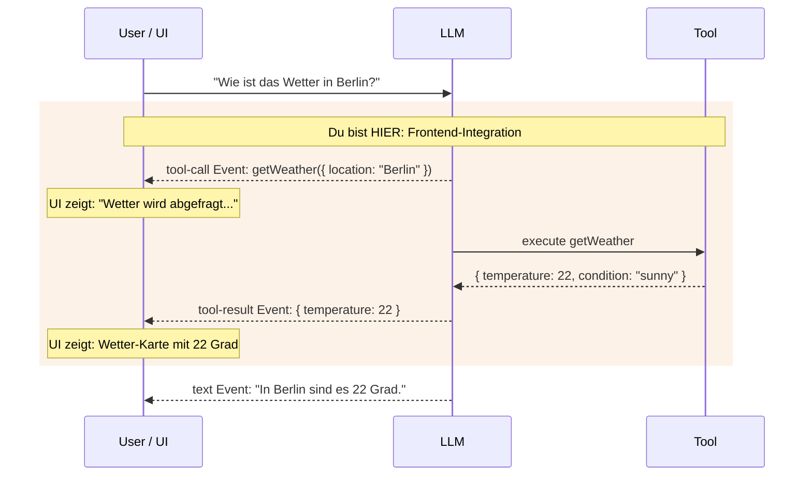
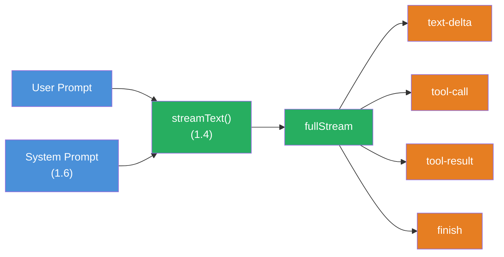

## THINK

Wenn ein LLM ein Tool aufruft — wie zeigst Du das dem User im UI? Sieht er nur die finale Antwort, oder auch was zwischendurch passiert?

## OVERVIEW



Beim Streaming bekommst Du nicht nur Text-Events, sondern auch `tool-call` und `tool-result` Events. Diese kannst Du im Frontend nutzen, um Loading States, spezifische Tool-UIs und transparente Zwischenschritte anzuzeigen.

## WHY

**Ohne Frontend-Integration:** Der User sieht eine lange Pause, dann die finale Antwort. Er weiss nicht, was das LLM gerade tut. Kein Feedback, keine Transparenz, kein Vertrauen.

**Mit Frontend-Integration:** Der User sieht in Echtzeit: "Wetter wird abgefragt...", dann eine Wetter-Karte, dann die finale Antwort. Transparenz schafft Vertrauen. Loading States ueberbruecken Wartezeiten. Tool-spezifische UIs (Karten, Charts, Tabellen) machen Ergebnisse greifbar.

## WALKTHROUGH

### Schicht 1: Message Parts — Die Bausteine einer Nachricht

Eine LLM-Antwort besteht nicht immer nur aus Text. Wenn Tools im Spiel sind, besteht eine Nachricht aus mehreren **Parts**:

```typescript
// Eine Nachricht kann mehrere Parts haben:
const messageParts = [
  { type: 'text', text: 'Ich schaue nach dem Wetter...' },           // ← Text-Part
  { type: 'tool-call', toolCallId: 'tc_1', toolName: 'weather',      // ← Tool-Call-Part
    args: { location: 'Berlin' } },
  { type: 'tool-result', toolCallId: 'tc_1', toolName: 'weather',    // ← Tool-Result-Part
    result: { temperature: 22, condition: 'sunny' } },
  { type: 'text', text: 'In Berlin sind es 22 Grad und sonnig.' },   // ← Finaler Text
];
```

Jede Nachricht ist ein Array von Parts. Das LLM kann Text und Tool Calls in beliebiger Reihenfolge mischen. Die `toolCallId` verbindet einen `tool-call` mit seinem `tool-result`.

### Schicht 2: Tool Events im Stream

Wenn Du `streamText` mit Tools nutzt, bekommst Du ueber `fullStream` spezifische Events:

```typescript
import { streamText, tool } from 'ai';
import { anthropic } from '@ai-sdk/anthropic';
import { z } from 'zod';

const weatherTool = tool({
  description: 'Get the weather in a location',
  inputSchema: z.object({
    location: z.string().describe('The city name'),
  }),
  execute: async ({ location }) => ({
    location, temperature: 22, condition: 'sunny',
  }),
});

const result = streamText({
  model: anthropic('claude-sonnet-4-5-20250514'),
  tools: { weather: weatherTool },
  prompt: 'Wie ist das Wetter in Berlin?',
});

for await (const part of result.fullStream) {
  switch (part.type) {
    case 'text-delta':                                   // ← Text-Chunk
      process.stdout.write(part.textDelta);
      break;
    case 'tool-call':                                    // ← LLM will ein Tool aufrufen
      console.log(`\n[Tool Call] ${part.toolName}(${JSON.stringify(part.args)})`);
      break;
    case 'tool-result':                                  // ← Tool-Ergebnis ist da
      console.log(`[Tool Result] ${JSON.stringify(part.result)}`);
      break;
    case 'finish':
      console.log(`\n[Fertig] Tokens: ${part.usage.totalTokens}`);
      break;
  }
}
```

Die Event-Reihenfolge ist immer: `tool-call` → (Tool wird ausgefuehrt) → `tool-result` → dann weiterer Text oder weitere Tool Calls.

### Schicht 3: Tool-Call vs. Tool-Result State

Zwischen `tool-call` und `tool-result` liegt die Ausfuehrungszeit des Tools. In dieser Phase kannst Du einen Loading State anzeigen:

```typescript
// Pseudo-Code fuer UI-Rendering:
for await (const part of result.fullStream) {
  switch (part.type) {
    case 'tool-call':
      // Loading State anzeigen
      console.log(`⏳ ${part.toolName} wird ausgefuehrt...`);
      console.log(`   Parameter: ${JSON.stringify(part.args)}`);
      break;
    case 'tool-result':
      // Loading State durch Ergebnis ersetzen
      console.log(`✓ ${part.toolName} abgeschlossen`);
      console.log(`   Ergebnis: ${JSON.stringify(part.result)}`);
      break;
  }
}
```

In einem echten Frontend (React, Next.js) wuerdest Du hier einen State-Wechsel ausloesen: Ein Spinner wird durch eine Ergebnis-Komponente ersetzt. Im Terminal zeigen wir das mit formatierter Ausgabe.

### Schicht 4: Mehrere Parts rendern

Eine vollstaendige Rendering-Logik muss alle Part-Typen behandeln. Hier ein Beispiel, das Text, Tool Calls und Tool Results formatiert ausgibt:

```typescript
import { streamText, tool } from 'ai';
import { anthropic } from '@ai-sdk/anthropic';
import { z } from 'zod';

const weatherTool = tool({
  description: 'Get the weather in a location',
  inputSchema: z.object({
    location: z.string().describe('The city name'),
  }),
  execute: async ({ location }) => ({
    location, temperature: 22, condition: 'sunny',
  }),
});

const result = streamText({
  model: anthropic('claude-sonnet-4-5-20250514'),
  tools: { weather: weatherTool },
  prompt: 'Wie ist das Wetter in Berlin und in Muenchen?',
});

const toolStates = new Map<string, string>();             // ← Trackt Tool-Status

for await (const part of result.fullStream) {
  switch (part.type) {
    case 'text-delta':
      process.stdout.write(part.textDelta);
      break;
    case 'tool-call':
      toolStates.set(part.toolCallId, 'running');
      console.log(`\n┌─ Tool: ${part.toolName}`);
      console.log(`│  Args: ${JSON.stringify(part.args)}`);
      console.log(`│  Status: ausfuehrend...`);
      break;
    case 'tool-result':
      toolStates.set(part.toolCallId, 'done');
      console.log(`│  Ergebnis: ${JSON.stringify(part.result)}`);
      console.log(`└─ Abgeschlossen`);
      break;
    case 'finish':
      console.log(`\n--- ${toolStates.size} Tool(s) ausgefuehrt ---`);
      console.log(`Tokens: ${part.usage.totalTokens}`);
      break;
  }
}
```

Die `Map` trackt den Status jedes Tool Calls ueber seine `toolCallId`. In einem echten Frontend wuerde das ein React State sein, der die UI aktualisiert.

## TRY

**Datei:** `challenge-3-2.ts`

**Aufgabe:** Nutze `fullStream` mit einem Tool und formatiere alle Events im Terminal — Text, Tool Calls und Tool Results getrennt.

```typescript
import { streamText, tool } from 'ai';
import { anthropic } from '@ai-sdk/anthropic';
import { z } from 'zod';

// Tool ist vorgegeben:
const weatherTool = tool({
  description: 'Get the weather in a location',
  inputSchema: z.object({
    location: z.string().describe('The city name'),
  }),
  execute: async ({ location }) => ({
    location,
    temperature: Math.floor(Math.random() * 30),
    condition: ['sunny', 'cloudy', 'rainy'][Math.floor(Math.random() * 3)],
  }),
});

// TODO 1: Rufe streamText auf mit dem weatherTool
// TODO 2: Iteriere ueber result.fullStream
// TODO 3: Behandle diese Event-Typen:
//   - 'text-delta': Text ins Terminal schreiben
//   - 'tool-call': Tool-Name und Parameter anzeigen
//   - 'tool-result': Ergebnis formatiert anzeigen
//   - 'finish': Token-Verbrauch anzeigen
```

**Checkliste:**
- [ ] `streamText` mit Tool aufgerufen
- [ ] `fullStream` mit `for await` konsumiert
- [ ] `text-delta` Events als Text ausgegeben
- [ ] `tool-call` Events mit Tool-Name und Args angezeigt
- [ ] `tool-result` Events mit formatiertem Ergebnis angezeigt
- [ ] `finish` Event mit Token-Verbrauch geloggt

<details>
<summary>Loesung anzeigen</summary>

```typescript
import { streamText, tool } from 'ai';
import { anthropic } from '@ai-sdk/anthropic';
import { z } from 'zod';

const weatherTool = tool({
  description: 'Get the weather in a location',
  inputSchema: z.object({
    location: z.string().describe('The city name'),
  }),
  execute: async ({ location }) => ({
    location,
    temperature: Math.floor(Math.random() * 30),
    condition: ['sunny', 'cloudy', 'rainy'][Math.floor(Math.random() * 3)],
  }),
});

const result = streamText({
  model: anthropic('claude-sonnet-4-5-20250514'),
  tools: { weather: weatherTool },
  prompt: 'Wie ist das Wetter in Berlin und Muenchen?',
});

for await (const part of result.fullStream) {
  switch (part.type) {
    case 'text-delta':
      process.stdout.write(part.textDelta);
      break;
    case 'tool-call':
      console.log(`\n[TOOL CALL] ${part.toolName}`);
      console.log(`  Parameter: ${JSON.stringify(part.args, null, 2)}`);
      break;
    case 'tool-result':
      console.log(`[TOOL RESULT] ${part.toolName}`);
      console.log(`  Ergebnis: ${JSON.stringify(part.result, null, 2)}`);
      break;
    case 'finish':
      console.log(`\n\n--- Stream beendet ---`);
      console.log(`Tokens: ${part.usage.totalTokens}`);
      console.log(`Finish Reason: ${part.finishReason}`);
      break;
  }
}
```

**Erklaerung:** Das LLM ruft `weather` fuer "Berlin" und "Muenchen" auf — moeglicherweise in separaten Tool Calls. Jeder Call erzeugt erst ein `tool-call` Event (mit Args), dann nach Ausfuehrung ein `tool-result` Event (mit Ergebnis). Am Ende kommt Text, der beide Ergebnisse zusammenfasst.

**Ausfuehren:** `npx tsx challenge-3-2.ts`

**Erwarteter Output (ungefaehr):**
```

[TOOL CALL] weather
  Parameter: { "location": "Berlin" }
[TOOL RESULT] weather
  Ergebnis: { "location": "Berlin", "temperature": 18, "condition": "sunny" }

[TOOL CALL] weather
  Parameter: { "location": "Muenchen" }
[TOOL RESULT] weather
  Ergebnis: { "location": "Muenchen", "temperature": 12, "condition": "cloudy" }

In Berlin sind es 18 Grad und sonnig, in Muenchen 12 Grad und bewoelkt.

--- Stream beendet ---
Tokens: ~350
Finish Reason: stop
```

</details>

## COMBINE



**Uebung:** Kombiniere das Tool-Event-Rendering mit `streamText` aus Challenge 1.4. Baue eine formatierte Terminal-Ausgabe, die Text und Tool-Events visuell unterscheidet.

1. Nutze das `weatherTool` und ein `calculatorTool` (aus Challenge 3.1) zusammen
2. Stelle eine Frage, die beide Tools erfordert: "Wie ist das Wetter in Berlin? Und rechne die Temperatur von Celsius in Fahrenheit um (Formel: C * 9/5 + 32)."
3. Formatiere die Ausgabe so, dass Tool Calls und Tool Results visuell hervorgehoben sind (z.B. mit `[TOOL]` Prefix)
4. Zeige am Ende eine Zusammenfassung: Wie viele Tools wurden aufgerufen, wie viele Tokens verbraucht?

**Optional Stretch Goal:** Baue einen `renderToolResult(toolName, result)` Helper, der fuer verschiedene Tools unterschiedliche Formatierungen ausgibt — z.B. eine Wetter-Anzeige fuer `weather` und eine Berechnung fuer `calculator`.

## Quellen

- [Vercel AI SDK: Tools and Tool Calling — Multi-Step Calls](https://ai-sdk.dev/docs/ai-sdk-core/tools-and-tool-calling)
- [Vercel AI SDK: Stream Helpers](https://ai-sdk.dev/docs/reference/ai-sdk-core/stream-text)
- [ai-hero-dev Exercise 03.02](https://github.com/ai-hero-dev/ai-sdk-v6-crash-course/tree/main/exercises/03-agents-and-tools/03.02-tool-call-rendering)
