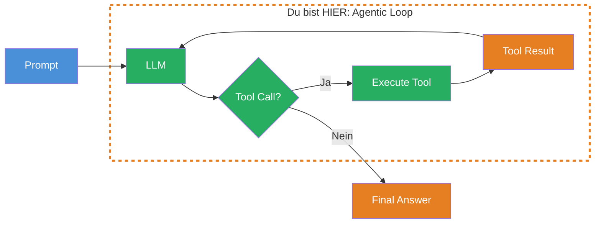
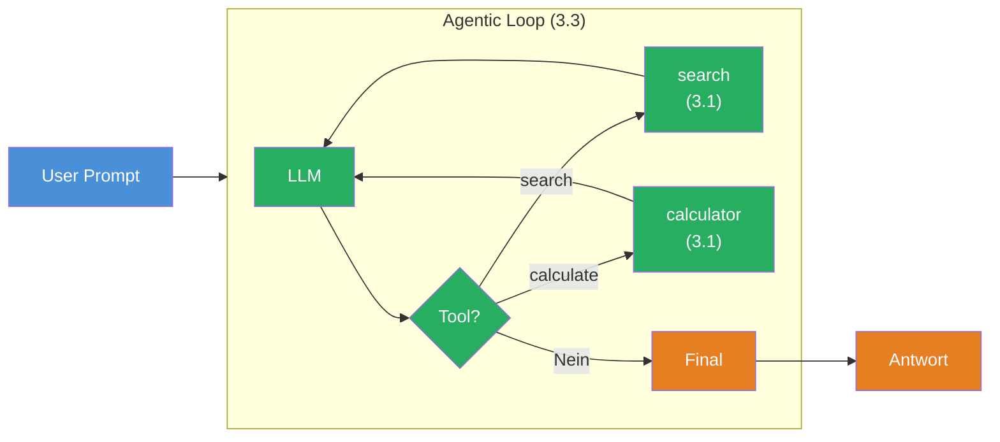

## THINK

Was wenn ein LLM mehrere Tools nacheinander aufrufen muss, um eine Aufgabe zu loesen — z.B. erst suchen, dann zusammenfassen, dann berechnen?

## OVERVIEW



Das ist der **Agentic Loop**: Das LLM generiert → prueft ob es ein Tool braucht → fuehrt das Tool aus → schickt das Ergebnis zurueck → generiert erneut. Das wiederholt sich, bis das LLM eine finale Antwort hat oder ein Limit erreicht ist.

## WHY

**Ohne Loop:** Nur ein einziger Tool Call pro Request. Das LLM kann eine Frage beantworten die ein Tool braucht, aber keine komplexen Aufgaben, die mehrere Schritte erfordern. "Recherchiere X, fasse es zusammen und berechne Y" — unmoeglich in einem Schritt.

**Mit Loop:** Autonome Multi-Step Agents. Das LLM entscheidet selbst, welches Tool es als naechstes braucht, wie oft es iteriert und wann es fertig ist. Es kann Zwischenergebnisse nutzen, um den naechsten Schritt zu planen.

## WALKTHROUGH

### Schicht 1: Multi-Step Tool Calls mit `stopWhen`

Der Schluessel zum Agentic Loop ist `stopWhen: stepCountIs(n)`. Damit erlaubst Du dem LLM, bis zu `n` Schritte zu machen — jeder Schritt kann einen oder mehrere Tool Calls enthalten:

```typescript
import { generateText, tool, stepCountIs } from 'ai';
import { anthropic } from '@ai-sdk/anthropic';
import { z } from 'zod';

const searchTool = tool({
  description: 'Search for information on a topic',
  inputSchema: z.object({
    query: z.string().describe('The search query'),
  }),
  execute: async ({ query }) => ({
    results: [`Ergebnis 1 zu "${query}"`, `Ergebnis 2 zu "${query}"`],
  }),
});

const result = await generateText({
  model: anthropic('claude-sonnet-4-5-20250514'),
  tools: { search: searchTool },
  stopWhen: stepCountIs(5),                              // ← Max 5 Schritte
  prompt: 'Recherchiere die Geschichte der Programmiersprache Rust.',
});

console.log(result.text);                                // ← Finale Antwort nach allen Schritten
```

Ohne `stopWhen` fuehrt `generateText` nur einen einzelnen Tool Call aus. Mit `stopWhen: stepCountIs(5)` darf das LLM bis zu 5 Schritte machen — es entscheidet selbst, wann es genug Informationen hat und eine finale Antwort generiert.

> **Was ist ein Step?** Ein Step = ein LLM-Aufruf. Jeder Step kann mehrere Tool Calls enthalten (wenn das LLM parallel Tools aufruft). Nach jedem Step werden die Tool Results zurueckgegeben, und das LLM entscheidet, ob es einen weiteren Step braucht.

### Schicht 2: Steps auswerten

Jeder Schritt im Loop wird im `steps` Array gespeichert. Damit kannst Du nachvollziehen, was der Agent getan hat:

```typescript
const { text, steps } = await generateText({
  model: anthropic('claude-sonnet-4-5-20250514'),
  tools: { search: searchTool },
  stopWhen: stepCountIs(5),
  prompt: 'Recherchiere die Geschichte von Rust.',
});

// Alle Tool Calls ueber alle Schritte extrahieren
const allToolCalls = steps.flatMap(step => step.toolCalls);

console.log(`Agent hat ${steps.length} Schritte gemacht`);
console.log(`Insgesamt ${allToolCalls.length} Tool Calls:`);

for (const call of allToolCalls) {
  console.log(`  - ${call.toolName}(${JSON.stringify(call.args)})`);
}

// Token-Verbrauch ueber alle Schritte
const totalTokens = steps.reduce(
  (sum, step) => sum + step.usage.totalTokens, 0
);
console.log(`Tokens gesamt: ${totalTokens}`);
```

`steps.flatMap(s => s.toolCalls)` ist das zentrale Pattern: Es sammelt alle Tool Calls aus allen Schritten in ein flaches Array. Genauso funktioniert es fuer `toolResults`.

### Schicht 3: Mehrere Tools im Loop

Die wahre Staerke des Agentic Loop zeigt sich mit mehreren Tools. Das LLM waehlt pro Schritt das passende Tool:

```typescript
import { generateText, tool, stepCountIs } from 'ai';
import { anthropic } from '@ai-sdk/anthropic';
import { z } from 'zod';

const searchTool = tool({
  description: 'Search for information on a topic',
  inputSchema: z.object({
    query: z.string().describe('The search query'),
  }),
  execute: async ({ query }) => ({
    results: [`Info zu "${query}": Rust wurde 2010 von Mozilla vorgestellt.`],
  }),
});

const summarizeTool = tool({
  description: 'Summarize a text into key points',
  inputSchema: z.object({
    text: z.string().describe('The text to summarize'),
  }),
  execute: async ({ text }) => ({
    summary: `Zusammenfassung: ${text.slice(0, 100)}...`,
    keyPoints: ['Punkt 1', 'Punkt 2'],
  }),
});

const calculatorTool = tool({
  description: 'Perform a math calculation with two numbers',
  inputSchema: z.object({
    operation: z.enum(['add', 'subtract', 'multiply']).describe('The math operation'),
    a: z.number().describe('First number'),
    b: z.number().describe('Second number'),
  }),
  execute: async ({ operation, a, b }) => {
    const ops = { add: a + b, subtract: a - b, multiply: a * b };
    return { operation, a, b, result: ops[operation] };  // ← Sicher, kein eval()
  },
});

const { text, steps } = await generateText({
  model: anthropic('claude-sonnet-4-5-20250514'),
  tools: { search: searchTool, summarize: summarizeTool, calculator: calculatorTool },
  stopWhen: stepCountIs(5),
  prompt: 'Seit wann gibt es Rust? Wie viele Jahre ist das her? Fasse die Geschichte zusammen.',
});

console.log('Finale Antwort:', text);
console.log(`\nAgent-Verlauf (${steps.length} Schritte):`);
for (const [i, step] of steps.entries()) {
  const tools = step.toolCalls.map(tc => tc.toolName).join(', ');
  console.log(`  Schritt ${i + 1}: ${tools || 'Finale Antwort'}`);
}
```

Das LLM koennte so vorgehen: Schritt 1 → `search("Rust Geschichte")` → Schritt 2 → `calculator({ operation: 'subtract', a: 2026, b: 2010 })` → Schritt 3 → `summarize(...)` → Schritt 4 → Finale Antwort. Die Reihenfolge entscheidet das LLM autonom.

### Schicht 4: onStepFinish Callback

Mit `onStepFinish` bekommst Du nach jedem Schritt einen Callback. Ideal fuer Echtzeit-Monitoring:

```typescript
const { text, steps } = await generateText({
  model: anthropic('claude-sonnet-4-5-20250514'),
  tools: { search: searchTool, summarize: summarizeTool },
  stopWhen: stepCountIs(5),
  prompt: 'Recherchiere und fasse zusammen: Was ist WebAssembly?',
  onStepFinish({ stepNumber, text, toolCalls, usage }) {
    console.log(`--- Schritt ${stepNumber} abgeschlossen ---`);
    if (toolCalls.length > 0) {
      console.log(`  Tools: ${toolCalls.map(tc => tc.toolName).join(', ')}`);
    }
    if (text) {
      console.log(`  Text: ${text.slice(0, 80)}...`);
    }
    console.log(`  Tokens: ${usage.totalTokens}`);
  },
});
```

`onStepFinish` wird nach jedem Schritt aufgerufen — egal ob der Schritt einen Tool Call oder Text enthielt. Das gibt Dir Live-Feedback ueber den Fortschritt des Agents.

## TRY

**Datei:** `challenge-3-3.ts`

**Aufgabe:** Baue einen Research Agent mit `search` und `summarize` Tools. Der Agent soll in bis zu 3 Schritten recherchieren und zusammenfassen.

```typescript
import { generateText, tool, stepCountIs } from 'ai';
import { anthropic } from '@ai-sdk/anthropic';
import { z } from 'zod';

// TODO 1: Definiere ein searchTool
// - description: Sucht nach Informationen
// - inputSchema: query (string)
// - execute: Gibt simulierte Suchergebnisse zurueck

// TODO 2: Definiere ein summarizeTool
// - description: Fasst Text zusammen
// - inputSchema: text (string)
// - execute: Gibt eine simulierte Zusammenfassung zurueck

// TODO 3: Nutze generateText mit:
// - Beiden Tools
// - stopWhen: stepCountIs(3)
// - onStepFinish: Logge jeden Schritt
// - prompt: 'Recherchiere was TypeScript ist und fasse es zusammen.'

// TODO 4: Logge:
// - result.text (finale Antwort)
// - Anzahl der Schritte
// - Alle Tool Calls ueber alle Schritte
```

**Checkliste:**
- [ ] Zwei Tools definiert (search + summarize)
- [ ] `stopWhen: stepCountIs(3)` gesetzt
- [ ] `onStepFinish` Callback implementiert
- [ ] `steps.flatMap(s => s.toolCalls)` fuer alle Tool Calls
- [ ] Agent nutzt beide Tools autonom

<details>
<summary>Loesung anzeigen</summary>

```typescript
import { generateText, tool, stepCountIs } from 'ai';
import { anthropic } from '@ai-sdk/anthropic';
import { z } from 'zod';

const searchTool = tool({
  description: 'Search for information on a topic',
  inputSchema: z.object({
    query: z.string().describe('The search query'),
  }),
  execute: async ({ query }) => ({
    results: [
      `TypeScript ist eine von Microsoft entwickelte Programmiersprache.`,
      `TypeScript erweitert JavaScript um statische Typen.`,
      `TypeScript wurde 2012 veroeffentlicht und wird aktiv weiterentwickelt.`,
    ],
    source: `search: "${query}"`,
  }),
});

const summarizeTool = tool({
  description: 'Summarize collected information into key points',
  inputSchema: z.object({
    text: z.string().describe('The text to summarize'),
  }),
  execute: async ({ text }) => ({
    summary: `Zusammenfassung von ${text.length} Zeichen`,
    keyPoints: [
      'Microsoft-Entwicklung seit 2012',
      'Statische Typen fuer JavaScript',
      'Aktive Weiterentwicklung',
    ],
  }),
});

const { text, steps } = await generateText({
  model: anthropic('claude-sonnet-4-5-20250514'),
  tools: { search: searchTool, summarize: summarizeTool },
  stopWhen: stepCountIs(3),
  prompt: 'Recherchiere was TypeScript ist und fasse es zusammen.',
  onStepFinish({ stepNumber, toolCalls, usage }) {
    console.log(`--- Schritt ${stepNumber} ---`);
    if (toolCalls.length > 0) {
      console.log(`  Tools: ${toolCalls.map(tc => tc.toolName).join(', ')}`);
    } else {
      console.log(`  Finale Antwort generiert`);
    }
    console.log(`  Tokens: ${usage.totalTokens}`);
  },
});

const allToolCalls = steps.flatMap(step => step.toolCalls);

console.log('\n=== Ergebnis ===');
console.log(`Schritte: ${steps.length}`);
console.log(`Tool Calls: ${allToolCalls.length}`);
for (const call of allToolCalls) {
  console.log(`  - ${call.toolName}(${JSON.stringify(call.args).slice(0, 60)}...)`);
}
console.log(`\nAntwort:\n${text}`);
```

**Erklaerung:** Der Agent durchlaeuft den Agentic Loop: Schritt 1 → `search` aufrufen → Suchergebnisse erhalten → Schritt 2 → `summarize` mit den Ergebnissen → Zusammenfassung erhalten → Schritt 3 → Finale Antwort formulieren. Das LLM entscheidet die Reihenfolge autonom.

**Ausfuehren:** `npx tsx challenge-3-3.ts`

**Erwarteter Output (ungefaehr):**
```
--- Schritt 1 ---
  Tools: search
  Tokens: ~200
--- Schritt 2 ---
  Tools: summarize
  Tokens: ~250
--- Schritt 3 ---
  Finale Antwort generiert
  Tokens: ~300

=== Ergebnis ===
Schritte: 3
Tool Calls: 2
  - search({"query":"TypeScript"})
  - summarize({"text":"TypeScript ist..."})

Antwort:
TypeScript ist eine von Microsoft entwickelte Programmiersprache...
```

</details>

## COMBINE



**Uebung:** Erweitere den Research Agent um das Calculator-Tool aus Challenge 3.1. Der Agent soll sowohl recherchieren als auch rechnen koennen.

1. Nimm das `searchTool` und `summarizeTool` von oben
2. Fuege das `calculatorTool` aus Challenge 3.1 hinzu
3. Setze `stopWhen: stepCountIs(5)` fuer mehr Schritte
4. Prompt: "Recherchiere wann TypeScript veroeffentlicht wurde. Berechne wie viele Jahre das her ist. Fasse alles zusammen."
5. Logge den vollstaendigen Agent-Verlauf: Welches Tool wurde in welchem Schritt genutzt?

**Optional Stretch Goal:** Fuege `onStepFinish` hinzu und berechne die kumulative Token-Nutzung ueber alle Schritte. Zeige nach jedem Schritt an: "Schritt X: Y Tokens (gesamt: Z Tokens)."

## Quellen

- [Vercel AI SDK: Building Agents](https://ai-sdk.dev/docs/agents/building-agents)
- [Vercel AI SDK: Multi-Step Calls](https://ai-sdk.dev/docs/ai-sdk-core/tools-and-tool-calling#multi-step-calls)
- [Vercel AI SDK: stepCountIs](https://ai-sdk.dev/docs/reference/ai-sdk-core/step-count-is)
- [ai-hero-dev Exercise 03.03](https://github.com/ai-hero-dev/ai-sdk-v6-crash-course/tree/main/exercises/03-agents-and-tools/03.03-agentic-loop)
