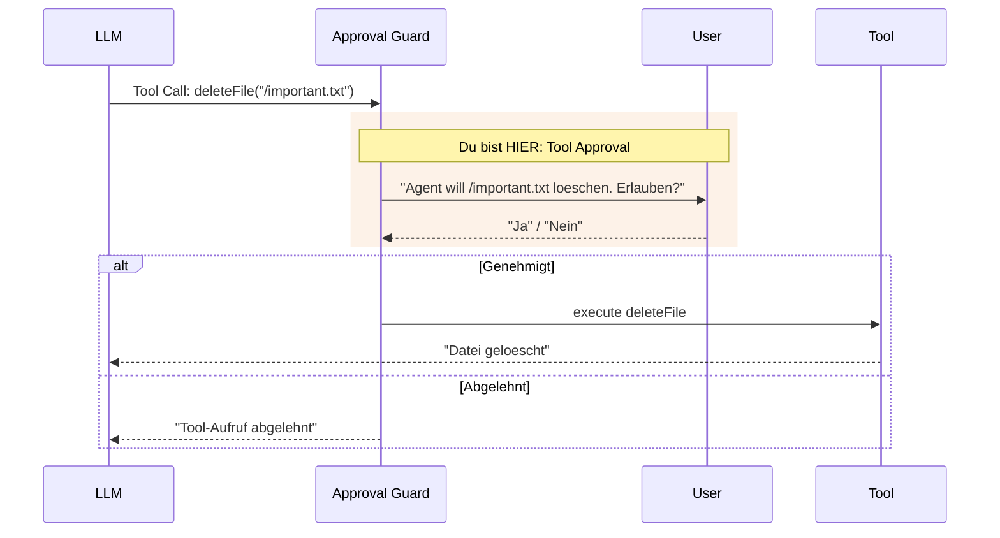
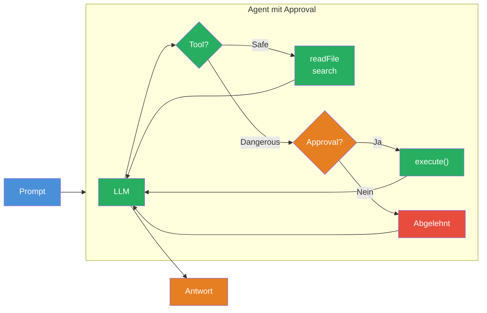

## THINK

Wuerdest Du einem Agenten erlauben, ohne Rueckfrage Dateien zu loeschen, E-Mails zu versenden oder Daten in einer Datenbank zu aendern?

## OVERVIEW



Zwischen Tool Call und Tool Execution sitzt ein **Approval Guard**. Wenn ein Tool als kritisch markiert ist, fragt der Guard den User um Erlaubnis, bevor das Tool ausgefuehrt wird. Das ist Human-in-the-Loop — der Mensch behaelt die Kontrolle ueber gefaehrliche Aktionen.

## WHY

**Ohne Approval:** Der Agent fuehrt alles aus, was das LLM entscheidet. Dateien loeschen, E-Mails versenden, Daten ueberschreiben — ohne Rueckfrage. Ein Fehler im Prompt oder eine Halluzination kann irreversiblen Schaden anrichten.

**Mit Approval:** Kritische Operationen werden erst nach menschlicher Freigabe ausgefuehrt. Du definierst, welche Tools sicher sind (automatisch ausfuehren) und welche gefaehrlich sind (erst fragen). Der Agent bleibt nuetzlich, aber kontrollierbar.

## WALKTHROUGH

### Schicht 1: Statisches Approval mit `needsApproval: true`

Die einfachste Form: Jeder Aufruf dieses Tools braucht eine Freigabe:

```typescript
import { tool } from 'ai';
import { z } from 'zod';

const deleteFileTool = tool({
  description: 'Delete a file from the filesystem',
  inputSchema: z.object({
    path: z.string().describe('The file path to delete'),
  }),
  needsApproval: true,                                   // ← Immer Freigabe noetig
  execute: async ({ path }) => {
    // In Production: fs.unlink(path)
    return { deleted: path, status: 'success' };
  },
});
```

Wenn `needsApproval: true` gesetzt ist, wird `execute` NICHT automatisch aufgerufen. Stattdessen muss der Aufrufer (Dein Code) die Freigabe erteilen, bevor die Ausfuehrung stattfindet.

### Schicht 2: Dynamisches Approval

Manchmal soll die Approval-Logik vom Kontext abhaengen — z.B. nur bei bestimmten Pfaden oder ab einem bestimmten Betrag:

```typescript
const deleteFileTool = tool({
  description: 'Delete a file from the filesystem',
  inputSchema: z.object({
    path: z.string().describe('The file path to delete'),
  }),
  needsApproval: async ({ path }) => {                   // ← Async Funktion
    // Nur Freigabe noetig fuer kritische Verzeichnisse
    return path.startsWith('/important/') || path.startsWith('/config/');
  },
  execute: async ({ path }) => {
    return { deleted: path, status: 'success' };
  },
});
```

Die `needsApproval`-Funktion bekommt die gleichen Parameter wie `execute`. Sie gibt `true` zurueck, wenn eine Freigabe noetig ist, und `false`, wenn das Tool direkt ausgefuehrt werden darf.

### Schicht 3: Approval Flow mit generateText

Bei `generateText` wird der Approval Flow ueber die `toolCallApproval` Option gesteuert:

```typescript
import { generateText, tool, stepCountIs } from 'ai';
import { anthropic } from '@ai-sdk/anthropic';
import { z } from 'zod';
import * as readline from 'readline';

const readFileTool = tool({
  description: 'Read a file from the filesystem',
  inputSchema: z.object({
    path: z.string().describe('The file path to read'),
  }),
  execute: async ({ path }) => ({
    content: `Inhalt von ${path}: Lorem ipsum...`,
  }),
});

const deleteFileTool = tool({
  description: 'Delete a file from the filesystem',
  inputSchema: z.object({
    path: z.string().describe('The file path to delete'),
  }),
  needsApproval: true,
  execute: async ({ path }) => ({
    deleted: path, status: 'success',
  }),
});

// Hilfsfunktion: User im Terminal fragen
function askUser(question: string): Promise<boolean> {
  const rl = readline.createInterface({
    input: process.stdin,
    output: process.stdout,
  });
  return new Promise((resolve) => {
    rl.question(question, (answer) => {
      rl.close();
      resolve(answer.toLowerCase() === 'y' || answer.toLowerCase() === 'ja');
    });
  });
}

const result = await generateText({
  model: anthropic('claude-sonnet-4-5-20250514'),
  tools: { readFile: readFileTool, deleteFile: deleteFileTool },
  stopWhen: stepCountIs(5),
  prompt: 'Lies die Datei /tmp/test.txt und loesche sie danach.',
  toolCallApproval: async ({ toolCall }) => {            // ← Approval Handler
    const approved = await askUser(
      `Agent will ${toolCall.toolName}(${JSON.stringify(toolCall.args)}) ausfuehren. Erlauben? (y/n): `
    );
    return approved ? 'approve' : 'reject';              // ← 'approve' oder 'reject'
  },
});

console.log(result.text);
```

`toolCallApproval` wird nur fuer Tools mit `needsApproval` aufgerufen. Tools ohne `needsApproval` werden weiterhin automatisch ausgefuehrt. Die Funktion muss `'approve'` oder `'reject'` zurueckgeben.

### Schicht 4: Das Dangerous/Safe Tool Pattern

Ein bewaehrtes Pattern: Trenne Tools in sichere und gefaehrliche Kategorien:

```typescript
import { tool } from 'ai';
import { z } from 'zod';

// Sichere Tools — automatisch ausfuehren
const searchTool = tool({
  description: 'Search for information (read-only)',
  inputSchema: z.object({
    query: z.string().describe('Search query'),
  }),
  execute: async ({ query }) => ({
    results: [`Ergebnis fuer "${query}"`],
  }),
});

const readFileTool = tool({
  description: 'Read a file (read-only)',
  inputSchema: z.object({
    path: z.string().describe('File path'),
  }),
  execute: async ({ path }) => ({
    content: `Inhalt von ${path}`,
  }),
});

// Gefaehrliche Tools — immer Freigabe
const writeFileTool = tool({
  description: 'Write content to a file (destructive)',
  inputSchema: z.object({
    path: z.string().describe('File path'),
    content: z.string().describe('Content to write'),
  }),
  needsApproval: true,
  execute: async ({ path, content }) => ({
    written: path,
    bytes: content.length,
  }),
});

const deleteFileTool = tool({
  description: 'Delete a file (destructive, irreversible)',
  inputSchema: z.object({
    path: z.string().describe('File path'),
  }),
  needsApproval: true,
  execute: async ({ path }) => ({
    deleted: path,
  }),
});

// Alle Tools zusammen nutzen:
const tools = {
  search: searchTool,         // ← auto
  readFile: readFileTool,     // ← auto
  writeFile: writeFileTool,   // ← needs approval
  deleteFile: deleteFileTool, // ← needs approval
};
```

**Faustregel:** Read-only Operationen sind sicher. Alles was schreibt, loescht oder versendet braucht Approval. Im Zweifelsfall: Approval einbauen.

## TRY

**Aufgabe:** Baue ein File-Management-Tool-Set mit einem `readFile` (sicher) und einem `deleteFile` (mit Approval). Simuliere den Approval Flow im Terminal.

```typescript
import { generateText, tool, stepCountIs } from 'ai';
import { anthropic } from '@ai-sdk/anthropic';
import { z } from 'zod';
import * as readline from 'readline';

// TODO 1: Definiere readFileTool (kein Approval noetig)
// - description: Datei lesen
// - inputSchema: path (string)
// - execute: Gibt simulierten Inhalt zurueck

// TODO 2: Definiere deleteFileTool (mit needsApproval: true)
// - description: Datei loeschen
// - inputSchema: path (string)
// - needsApproval: true
// - execute: Gibt Loesch-Bestaetigung zurueck

// TODO 3: Erstelle eine askUser() Hilfsfunktion
// - Fragt im Terminal nach Freigabe
// - Gibt true/false zurueck

// TODO 4: Nutze generateText mit toolCallApproval
// - tools: { readFile, deleteFile }
// - stopWhen: stepCountIs(5)
// - toolCallApproval: Fragt den User bei kritischen Tools
// - prompt: 'Lies /tmp/notes.txt und loesche die Datei danach.'

// TODO 5: Logge result.text und alle Tool Calls
```

**Checkliste:**
- [ ] `readFileTool` ohne Approval definiert
- [ ] `deleteFileTool` mit `needsApproval: true` definiert
- [ ] `askUser()` Hilfsfunktion implementiert
- [ ] `toolCallApproval` Handler gibt `'approve'` oder `'reject'` zurueck
- [ ] Bei "Nein": Tool wird nicht ausgefuehrt, Agent reagiert darauf

<details>
<summary>Loesung anzeigen</summary>

```typescript
import { generateText, tool, stepCountIs } from 'ai';
import { anthropic } from '@ai-sdk/anthropic';
import { z } from 'zod';
import * as readline from 'readline';

const readFileTool = tool({
  description: 'Read a file from the filesystem (safe, read-only)',
  inputSchema: z.object({
    path: z.string().describe('The file path to read'),
  }),
  execute: async ({ path }) => ({
    path,
    content: `Inhalt von ${path}: Dies sind wichtige Notizen.`,
    size: 42,
  }),
});

const deleteFileTool = tool({
  description: 'Delete a file from the filesystem (destructive, irreversible)',
  inputSchema: z.object({
    path: z.string().describe('The file path to delete'),
  }),
  needsApproval: true,
  execute: async ({ path }) => ({
    deleted: path,
    status: 'success',
  }),
});

function askUser(question: string): Promise<boolean> {
  const rl = readline.createInterface({
    input: process.stdin,
    output: process.stdout,
  });
  return new Promise((resolve) => {
    rl.question(question, (answer) => {
      rl.close();
      resolve(answer.toLowerCase() === 'y' || answer.toLowerCase() === 'ja');
    });
  });
}

const { text, steps } = await generateText({
  model: anthropic('claude-sonnet-4-5-20250514'),
  tools: { readFile: readFileTool, deleteFile: deleteFileTool },
  stopWhen: stepCountIs(5),
  prompt: 'Lies die Datei /tmp/notes.txt und loesche sie danach.',
  toolCallApproval: async ({ toolCall }) => {
    console.log(`\n--- Approval Request ---`);
    console.log(`Tool: ${toolCall.toolName}`);
    console.log(`Parameter: ${JSON.stringify(toolCall.args)}`);
    const approved = await askUser('Ausfuehren? (y/n): ');
    console.log(approved ? 'Genehmigt.' : 'Abgelehnt.');
    return approved ? 'approve' : 'reject';
  },
});

const allToolCalls = steps.flatMap(s => s.toolCalls);
console.log('\n=== Ergebnis ===');
console.log(`Schritte: ${steps.length}`);
console.log(`Tool Calls: ${allToolCalls.length}`);
for (const call of allToolCalls) {
  console.log(`  - ${call.toolName}(${JSON.stringify(call.args)})`);
}
console.log(`\nAntwort: ${text}`);
```

**Erklaerung:** Der Agent liest zuerst `/tmp/notes.txt` (automatisch, kein Approval noetig) und versucht dann die Datei zu loeschen. Beim `deleteFile` Call greift der Approval Guard: Der User wird im Terminal gefragt. Bei "y" wird geloescht, bei "n" bekommt das LLM die Ablehnung und reagiert darauf — z.B. mit "Die Datei wurde nicht geloescht, da die Aktion abgelehnt wurde."

</details>

## COMBINE



**Uebung:** Erweitere den Research Agent aus Challenge 3.3 um einen Approval-Schritt fuer das Speichern von Ergebnissen.

1. Nimm den Agent aus Challenge 3.3 mit `searchTool` und `summarizeTool`
2. Fuege ein `saveResultsTool` hinzu mit `needsApproval: true`
3. Prompt: "Recherchiere TypeScript, fasse zusammen und speichere die Ergebnisse in /tmp/research.txt."
4. Der Agent soll erst recherchieren und zusammenfassen (automatisch), dann vor dem Speichern fragen
5. Logge ob der User die Speicherung genehmigt oder abgelehnt hat

**Optional Stretch Goal:** Implementiere dynamisches Approval: `needsApproval` als Funktion, die nur bei Pfaden ausserhalb von `/tmp/` eine Freigabe verlangt. Teste mit verschiedenen Pfaden.

## Quellen

- [Vercel AI SDK: Tool Calling — Human in the Loop](https://ai-sdk.dev/docs/ai-sdk-core/tools-and-tool-calling#human-in-the-loop)
- [Anthropic: Agentic Systems — Autonomy vs. Safety](https://platform.claude.com)
- [ai-hero-dev Exercise 03.06](https://github.com/ai-hero-dev/ai-sdk-v6-crash-course/tree/main/exercises/03-agents-and-tools/03.06-tool-approval)
