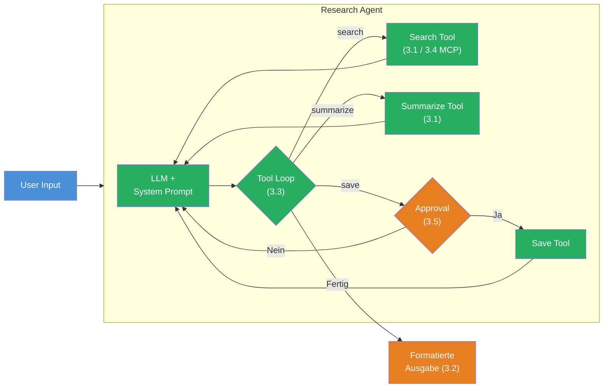

## Das Szenario

Du baust einen **Research Agent** — ein Terminal-Programm, das autonom zu einem Thema recherchiert, Ergebnisse zusammenfasst und sie nach menschlicher Freigabe speichert. Der Agent kombiniert alle fuenf Bausteine aus Level 3.

Dein Agent soll sich so anfuehlen:

```
Recherchiere: Welche neuen Features hat TypeScript 5.8?

[TOOL] search("TypeScript 5.8 features")
  → 3 Ergebnisse gefunden

[TOOL] search("TypeScript 5.8 release notes")
  → 2 Ergebnisse gefunden

[TOOL] summarize(...)
  → Zusammenfassung erstellt

--- Approval Request ---
Agent will saveResults("/tmp/research-typescript-5.8.txt") ausfuehren.
Erlauben? (y/n): y
Genehmigt.

[TOOL] saveResults("/tmp/research-typescript-5.8.txt")
  → Datei gespeichert

=== Ergebnis ===
TypeScript 5.8 bringt folgende neue Features: ...
(3 Schritte, 4 Tool Calls, 847 Tokens)
```

Dieses Projekt verbindet alle fuenf Bausteine:



## Anforderungen

1. **Search Tool** (Challenge 3.1 oder 3.4) — Der Agent hat ein `search`-Tool, das zu einem Thema Informationen findet. Du kannst es als lokales Tool mit simulierten Ergebnissen bauen oder als MCP Tool (Bonus) anbinden.

2. **Summarize Tool** (Challenge 3.1) — Ein `summarize`-Tool, das gesammelte Informationen in Key Points zusammenfasst.

3. **Save Results Tool mit Approval** (Challenge 3.5) — Ein `saveResults`-Tool mit `needsApproval: true`, das die Ergebnisse in eine Datei speichert. Der User muss im Terminal bestaetigen.

4. **Agentic Loop** (Challenge 3.3) — Der Agent nutzt `stopWhen: stepCountIs(n)` und entscheidet autonom, welche Tools er in welcher Reihenfolge aufruft.

5. **Formatierte Ausgabe** (Challenge 3.2) — Jeder Tool Call und jedes Tool Result wird formatiert im Terminal angezeigt. Der User sieht in Echtzeit, was der Agent tut.

6. **System Prompt** — Der Agent hat eine definierte Rolle: "Du bist ein Research Agent. Recherchiere gruendlich, fasse zusammen und speichere die Ergebnisse."

7. **Agent-Verlauf** — Am Ende wird eine Zusammenfassung angezeigt: Anzahl Schritte, alle Tool Calls, Token-Verbrauch.

8. **Interaktive Eingabe** — Der User gibt das Recherche-Thema im Terminal ein. "exit" beendet das Programm.

## Starter-Code

```typescript
import { generateText, tool, stepCountIs } from 'ai';
import { anthropic } from '@ai-sdk/anthropic';
import { z } from 'zod';
import * as readline from 'readline';

// TODO: System Prompt definieren

// TODO: searchTool definieren (lokal oder MCP)

// TODO: summarizeTool definieren

// TODO: saveResultsTool definieren (mit needsApproval: true)

// TODO: askUser() Hilfsfunktion fuer Terminal-Approval

// TODO: Hauptfunktion:
// 1. User-Input lesen (readline)
// 2. generateText mit allen Tools, stopWhen, toolCallApproval
// 3. Tool Events formatiert ausgeben (onStepFinish)
// 4. Agent-Verlauf anzeigen (Schritte, Tool Calls, Tokens)
```

## Bewertungskriterien

Dein Boss Fight ist bestanden, wenn:

- [ ] Mindestens 3 Tools definiert (search, summarize, saveResults)
- [ ] `saveResults` hat `needsApproval: true` — User wird vor dem Speichern gefragt
- [ ] `stopWhen: stepCountIs(n)` begrenzt die Schritte
- [ ] `toolCallApproval` Handler fragt im Terminal nach Freigabe
- [ ] Agent nutzt Tools autonom in sinnvoller Reihenfolge (erst suchen, dann zusammenfassen, dann speichern)
- [ ] Jeder Tool Call wird formatiert im Terminal angezeigt (Name, Parameter, Ergebnis)
- [ ] Am Ende: Zusammenfassung mit Schritten, Tool Calls und Token-Verbrauch
- [ ] Programm laeuft interaktiv und reagiert auf User-Eingaben

## Hinweise

<details>
<summary>Hinweis 1: Tool-Beschreibungen sind entscheidend</summary>

Die `description` der Tools beeinflusst stark, in welcher Reihenfolge das LLM sie nutzt. Formuliere die Beschreibungen so, dass klar wird: `search` ist fuer Informationsbeschaffung, `summarize` fuer Zusammenfassung von gesammelten Daten, und `saveResults` fuer das Speichern am Ende. Der System Prompt kann die Reihenfolge zusaetzlich lenken: "Recherchiere zuerst, fasse dann zusammen, speichere am Ende."

</details>

<details>
<summary>Hinweis 2: onStepFinish fuer Live-Ausgabe</summary>

Nutze `onStepFinish` fuer die formatierte Ausgabe waehrend der Agent-Ausfuehrung. In diesem Callback hast Du Zugriff auf `stepNumber`, `toolCalls`, `toolResults` und `usage`. Du kannst dort jeden Tool Call mit seinem Ergebnis formatiert ins Terminal schreiben.

</details>

<details>
<summary>Hinweis 3: Approval bei Ablehnung</summary>

Wenn der User einen Tool Call ablehnt (return `'reject'`), bekommt das LLM die Information, dass der Tool Call abgelehnt wurde. Es kann dann darauf reagieren — z.B. die Ergebnisse trotzdem als Text ausgeben, ohne sie zu speichern. Teste beide Pfade: Genehmigung und Ablehnung.

</details>

## Quellen

- [Vercel AI SDK: Tools and Tool Calling](https://ai-sdk.dev/docs/ai-sdk-core/tools-and-tool-calling)
- [Vercel AI SDK: Building Agents](https://ai-sdk.dev/docs/agents/building-agents)
- [Vercel AI SDK: MCP Tools](https://ai-sdk.dev/docs/ai-sdk-core/mcp-tools)
- [ai-hero-dev Exercises 03.01-03.07](https://github.com/ai-hero-dev/ai-sdk-v6-crash-course/tree/main/exercises/03-agents-and-tools)
