## Level 3 geschafft!

Du hast Deinen ersten autonomen Agenten gebaut — einen Research Agent, der selbststaendig recherchiert, zusammenfasst und erst nach Deiner Freigabe speichert. Das ist ein grosser Schritt: Vom Chatbot zum handlungsfaehigen Agent.

## Was Du gelernt hast

- **Tool Calling:** Tools mit `tool()` definieren — Zod inputSchema, `.describe()` fuer Parameter, `execute` fuer die Ausfuehrung. Das LLM entscheidet autonom, wann und mit welchen Parametern ein Tool aufgerufen wird.
- **Tools im Frontend:** Message Parts (`text`, `tool-call`, `tool-result`) fuer transparente UIs. `fullStream` liefert alle Events fuer Loading States und Tool-spezifische Darstellung.
- **Tool Loop Agent:** Multi-Step Agents mit `stopWhen: stepCountIs(n)`. Das LLM iteriert autonom durch den Agentic Loop — Tool Call, Execute, Result, naechster Schritt — bis die Aufgabe erledigt ist.
- **MCP (Model Context Protocol):** Standardisiertes Protokoll fuer externe Tool-Server. `createMCPClient` mit HTTP oder stdio Transport, `client.tools()` laedt alle verfuegbaren Tools automatisch.
- **Tool Approval:** Human-in-the-Loop mit `needsApproval`. Statisch (`true`) oder dynamisch (async Funktion). `toolCallApproval` Handler fuer kontrollierte Ausfuehrung kritischer Operationen.

## Aktualisierter Skill Tree

```mermaid
graph LR
  subgraph "Freigeschaltet"
    L1["Level 1: AI SDK Basics"]
    L2["Level 2: LLM Fundamentals"]
    L3["Level 3: Agents & MCP"]
  end
  subgraph NEXT["Naechstes Level"]
    L4["Level 4: Persistence"]
  end
  subgraph "Gesperrt"
    L5["Level 5: Context Engineering"]
    L6["Level 6: Evals"]
    L7["Level 7: Streaming"]
    L8["Level 8: Workflows"]
    L9["Level 9: Advanced Patterns"]
  end
  L1 --> L2
  L2 --> L3
  L3 --> L4
  L4 -.-> L5
  L5 -.-> L6
  L6 -.-> L7
  L7 -.-> L8
  L8 -.-> L9
  style L1 fill:#27AE60,color:#fff
  style L2 fill:#27AE60,color:#fff
  style L3 fill:#27AE60,color:#fff
  style NEXT fill:none,stroke:#E67E22,stroke-width:3px,color:#E67E22
  style L4 fill:#E67E22,color:#fff
  style L5 fill:#95a5a6,color:#fff
  style L6 fill:#95a5a6,color:#fff
  style L7 fill:#95a5a6,color:#fff
  style L8 fill:#95a5a6,color:#fff
  style L9 fill:#95a5a6,color:#fff
```

## Naechstes Level

**Level 4: Persistence** — Dein Agent kann jetzt handeln, aber er vergisst alles nach jedem Request. Wie speicherst Du Chat-Verlaeufe, stellst Konversationen wieder her und baust persistente Agents? Du lernst Datenbank-Integration, Message History und Session Management.
