import { CardGrid, LinkCard } from '@astrojs/starlight/components';

## TL;DR

> Chats speichern, laden und fortsetzen — ohne Persistence verliert Dein AI-System bei jedem Reload sein Gedaechtnis. In diesem Level lernst Du, wie Du mit `onFinish` Ergebnisse abfaengst, Chat-Sessions per ID verwaltest, Messages in einer Datenbank persistierst und eingehende Nachrichten validierst.

## Skill Tree

```mermaid
graph LR
  subgraph "Freigeschaltet"
    L1["Level 1: AI SDK Basics"]
    L2["Level 2: LLM Fundamentals"]
    L3["Level 3: Agents & MCP"]
  end
  subgraph HIER["Aktuelles Level"]
    L4["Level 4: Persistence"]
  end
  subgraph "Gesperrt"
    L5["Level 5: Context Engineering"]
    L6["Level 6: Evals"]
    L7["Level 7: Streaming"]
    L8["Level 8: Workflows"]
    L9["Level 9: Advanced Patterns"]
  end
  L1 --> L2
  L2 --> L3
  L3 --> L4
  L4 -.-> L5
  L5 -.-> L6
  L6 -.-> L7
  L7 -.-> L8
  L8 -.-> L9
  style HIER fill:none,stroke:#E67E22,stroke-width:3px,stroke-dasharray:5 5
  style L4 fill:#E67E22,color:#fff
  style L1 fill:#27AE60,color:#fff
  style L2 fill:#27AE60,color:#fff
  style L3 fill:#27AE60,color:#fff
  style L5 fill:#95a5a6,color:#fff
  style L6 fill:#95a5a6,color:#fff
  style L7 fill:#95a5a6,color:#fff
  style L8 fill:#95a5a6,color:#fff
  style L9 fill:#95a5a6,color:#fff
```

## Was Du lernst

- **On Finish Callback** — Ergebnisse eines LLM-Calls automatisch abfangen und speichern, bevor die Response zurueckgeht
- **Chat ID** — Sessions identifizieren, damit Dein Backend weiss, zu welchem Chat eine Nachricht gehoert
- **Persistence** — Messages in einer Datenbank speichern und bei Reload wieder laden
- **Message Validation** — Eingehende Nachrichten gegen ein Schema validieren, bevor sie gespeichert oder ans LLM geschickt werden

## Warum das wichtig ist

Jedes Chatbot-Projekt laeuft am Anfang im Speicher — und das fuehlt sich gut an. Bis jemand die Seite neu laedt und der gesamte Verlauf weg ist. Oder bis Du keinen Ueberblick hast, welche Chats laufen und was sie kosten. Oder bis kaputte Messages Deine Datenbank verseuchen.

Das konkrete Problem: Ohne Persistence ist Dein Chat ein Goldfish — kein Gedaechtnis ueber den aktuellen Request hinaus. Nutzer verlieren ihren Verlauf, Du verlierst Insights ueber Token-Verbrauch, und Dein System hat keine Grundlage fuer Features wie Chat-History, Analytics oder Debugging.

## Voraussetzungen

- **Level 1: AI SDK Basics** — `generateText`, `streamText`, Result-Objekt und Callbacks muessen sitzen
- **TypeScript Grundkenntnisse** — async/await, Interfaces, Map/Object
- **Grundverstaendnis von APIs** — Request/Response, JSON Body

> **Skip-Hinweis:** Du baust bereits Chat-Systeme mit Datenbank-Anbindung, Chat IDs und Message Validation? Spring direkt zur [Boss Fight](/de/level-4-persistence/06-boss-fight/) und teste, ob Du den vollstaendigen Persistence-Cycle beherrschst.

## Challenges

<CardGrid>
  <LinkCard title="4.1 — On Finish" description="`onFinish` Callback, automatisches Speichern nach Completion" href="/de/level-4-persistence/02-on-finish/" />
  <LinkCard title="4.2 — Chat ID" description="Session-Management, Chat-Zuordnung per ID" href="/de/level-4-persistence/03-chat-id/" />
  <LinkCard title="4.3 — Persistence" description="Messages speichern, laden, Chat fortsetzen" href="/de/level-4-persistence/04-persistence/" />
  <LinkCard title="4.4 — Message Validation" description="Zod Schema, Validation vor dem Speichern" href="/de/level-4-persistence/05-message-validation/" />
</CardGrid>

## Boss Fight

Baue einen **persistenten Chat mit Reload**: Ein System, das eine Chat-ID generiert, Messages speichert, nach einem simulierten Reload den Verlauf laedt und das Gespraech nahtlos fortsetzt. Du kombinierst alle vier Bausteine dieses Levels in einem Projekt.

## Quellen fuer dieses Level

- [Vercel AI SDK: Chatbot Persistence](https://ai-sdk.dev/docs/ai-sdk-ui/chatbot-persistence)
- [Vercel AI SDK: generateText API Reference](https://ai-sdk.dev/docs/reference/ai-sdk-core/generate-text)
- [ai-hero-dev Exercises 04.01-04.04](https://github.com/ai-hero-dev/ai-sdk-v6-crash-course/tree/main/exercises/04-persistence)
