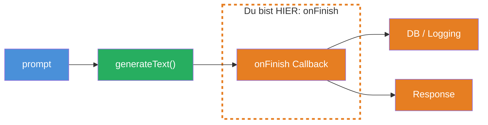
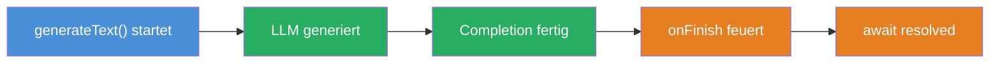
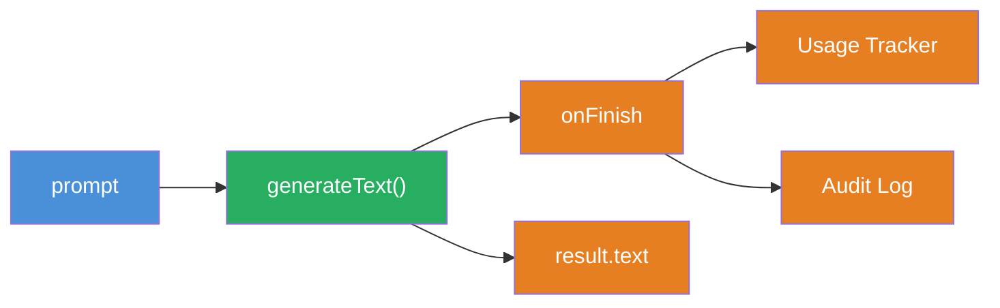

## THINK

Wie speicherst Du das Ergebnis eines LLM-Calls — NACHDEM er fertig ist, aber BEVOR die Response an den User zurueckgeht?

## OVERVIEW



`generateText` ruft nach der vollstaendigen Completion einen `onFinish` Callback auf. In diesem Callback hast Du Zugriff auf `text`, `usage`, `finishReason` und die vollstaendige `response` — der perfekte Ort, um Ergebnisse zu speichern, Tokens zu tracken oder Logs zu schreiben.

## WHY

**Ohne `onFinish`:** Du musst Ergebnisse manuell nach dem `await` speichern. Das funktioniert, aber wenn zwischen `generateText` und Deinem Speicher-Code ein Fehler passiert, sind die Daten weg. Kein automatisches Logging, kein Audit Trail, kein Token-Tracking "out of the box".

**Mit `onFinish`:** Das Speichern passiert automatisch, direkt nachdem das LLM fertig ist. Der Callback wird garantiert aufgerufen — egal was danach im Code passiert. Du hast einen zentralen Ort fuer Logging, Analytics und Persistence.

## WALKTHROUGH

### Schicht 1: Der onFinish Callback

`onFinish` ist ein optionaler Parameter von `generateText`. Er wird einmal aufgerufen, nachdem die Completion abgeschlossen ist:

```typescript
import { generateText } from 'ai';
import { anthropic } from '@ai-sdk/anthropic';

const result = await generateText({
  model: anthropic('claude-sonnet-4-5-20250514'),
  prompt: 'Was ist TypeScript?',
  onFinish({ text, usage, finishReason, response }) {  // ← Wird nach Completion aufgerufen
    console.log('Text:', text.substring(0, 50) + '...');
    console.log('Tokens:', usage.totalTokens);
    console.log('Finish Reason:', finishReason);
  },
});
```

Der Callback bekommt ein Objekt mit vier wichtigen Properties:

| Property | Typ | Beschreibung |
|----------|-----|-------------|
| `text` | `string` | Der generierte Text |
| `usage` | `{ promptTokens, completionTokens, totalTokens }` | Token-Verbrauch |
| `finishReason` | `'stop' \| 'length' \| 'tool-calls'` | Warum das LLM aufgehoert hat |
| `response` | `{ messages, headers }` | Vollstaendige Response mit allen Messages |

### Schicht 2: Wann feuert onFinish?

Der Timing ist entscheidend:



`onFinish` wird aufgerufen, **nachdem** die Completion fertig ist und **bevor** das `await` resolved. Das bedeutet: Dein Speicher-Code im Callback laeuft, bevor der restliche Code nach `await generateText(...)` ausgefuehrt wird.

### Schicht 3: Typische Einsaetze

**Token-Tracking fuer Kostenberechnung:**

```typescript
let sessionTokens = 0;

const result = await generateText({
  model: anthropic('claude-sonnet-4-5-20250514'),
  prompt: 'Erklaere Promises.',
  onFinish({ usage }) {
    sessionTokens += usage.totalTokens;                          // ← Session-Zaehler
    console.log(`Request: ${usage.totalTokens} Tokens`);
    console.log(`Session gesamt: ${sessionTokens} Tokens`);
  },
});
```

**Logging mit Timestamp:**

```typescript
const result = await generateText({
  model: anthropic('claude-sonnet-4-5-20250514'),
  prompt: 'Erklaere Promises.',
  onFinish({ text, usage, finishReason }) {
    const logEntry = {
      timestamp: new Date().toISOString(),
      promptTokens: usage.promptTokens,
      completionTokens: usage.completionTokens,
      totalTokens: usage.totalTokens,
      finishReason,
      textLength: text.length,
    };
    console.log('LOG:', JSON.stringify(logEntry));               // ← Strukturiertes Log
  },
});
```

**Simuliertes DB-Speichern:**

```typescript
// Simulierte Datenbank (in-memory)
const chatLog: Array<{ role: string; content: string; tokens: number }> = [];

const result = await generateText({
  model: anthropic('claude-sonnet-4-5-20250514'),
  prompt: 'Was ist TypeScript?',
  onFinish({ text, usage }) {
    chatLog.push({                                               // ← In "DB" speichern
      role: 'assistant',
      content: text,
      tokens: usage.totalTokens,
    });
    console.log(`Gespeichert. ${chatLog.length} Eintraege in DB.`);
  },
});
```

### Schicht 4: onFinish bei streamText

`onFinish` funktioniert auch mit `streamText` — wird aufgerufen, nachdem der gesamte Stream abgeschlossen ist:

```typescript
import { streamText } from 'ai';
import { anthropic } from '@ai-sdk/anthropic';

const result = streamText({
  model: anthropic('claude-sonnet-4-5-20250514'),
  prompt: 'Erklaere Promises.',
  onFinish({ text, usage, finishReason }) {                      // ← Nach Stream-Ende
    console.log(`Stream fertig. ${usage.totalTokens} Tokens.`);
  },
});

for await (const chunk of result.textStream) {
  process.stdout.write(chunk);
}
```

Bei `streamText` feuert `onFinish` erst, wenn der letzte Chunk gestreamt wurde. Der vollstaendige `text` ist dann im Callback verfuegbar.

## TRY

**Aufgabe:** Implementiere einen `generateText`-Call mit `onFinish` Callback, der Usage und Finish Reason loggt und das Ergebnis in ein simuliertes Log-Array speichert.

```typescript
import { generateText } from 'ai';
import { anthropic } from '@ai-sdk/anthropic';

// Simuliertes Log
const auditLog: Array<{
  timestamp: string;
  tokens: number;
  finishReason: string;
  textPreview: string;
}> = [];

// TODO 1: Rufe generateText auf mit:
//   - model: anthropic('claude-sonnet-4-5-20250514')
//   - prompt: Eine Frage Deiner Wahl
//   - onFinish: Callback der:
//     a) usage.totalTokens loggt
//     b) finishReason loggt
//     c) einen Eintrag ins auditLog pushed (timestamp, tokens, finishReason, textPreview)

// TODO 2: Logge result.text (erste 100 Zeichen)
// TODO 3: Logge das auditLog Array
```

**Checkliste:**
- [ ] `onFinish` Callback implementiert
- [ ] `usage.totalTokens` geloggt
- [ ] `finishReason` geloggt
- [ ] Eintrag ins `auditLog` gepushed
- [ ] `result.text` nach dem `await` geloggt

<details>
<summary>Loesung anzeigen</summary>

```typescript
import { generateText } from 'ai';
import { anthropic } from '@ai-sdk/anthropic';

const auditLog: Array<{
  timestamp: string;
  tokens: number;
  finishReason: string;
  textPreview: string;
}> = [];

const result = await generateText({
  model: anthropic('claude-sonnet-4-5-20250514'),
  prompt: 'Erklaere den Unterschied zwischen let und const in JavaScript.',
  onFinish({ text, usage, finishReason }) {
    console.log(`--- onFinish ---`);
    console.log(`Tokens: ${usage.totalTokens}`);
    console.log(`Finish Reason: ${finishReason}`);

    auditLog.push({
      timestamp: new Date().toISOString(),
      tokens: usage.totalTokens,
      finishReason,
      textPreview: text.substring(0, 80) + '...',
    });
  },
});

console.log(`\n--- Result ---`);
console.log(result.text.substring(0, 100) + '...');

console.log(`\n--- Audit Log ---`);
console.log(JSON.stringify(auditLog, null, 2));
```

**Erklaerung:** Der `onFinish` Callback wird automatisch nach der Completion aufgerufen. Er loggt die Token-Nutzung und den Finish Reason und speichert einen Audit-Eintrag. Das `auditLog` ist nach dem `await` befuellt, weil `onFinish` vor dem Resolve laeuft.

</details>

## COMBINE



**Uebung:** Verbinde `onFinish` mit dem Usage Tracking aus Level 2. Baue einen einfachen Cost Tracker, der im `onFinish` Callback die Kosten pro Request berechnet und kumuliert.

1. Erstelle eine Variable `totalCost` die ueber mehrere Calls hinweg addiert
2. Im `onFinish` Callback: Berechne die Kosten pro Request (`usage.promptTokens * inputRate + usage.completionTokens * outputRate`)
3. Fuehre 2-3 verschiedene `generateText`-Calls aus
4. Logge nach jedem Call: Kosten des Requests + Gesamtkosten

**Beispiel-Raten (Claude Sonnet):**
- Input: $3 / 1M Tokens → `0.000003` pro Token
- Output: $15 / 1M Tokens → `0.000015` pro Token

**Optional Stretch Goal:** Baue eine `withCostTracking`-Wrapper-Funktion, die `generateText`-Optionen entgegennimmt und automatisch einen `onFinish` Callback fuer Cost-Tracking injiziert.

## Quellen

- [Vercel AI SDK: Generating Text — Callbacks](https://ai-sdk.dev/docs/ai-sdk-core/generating-text#callbacks)
- [Vercel AI SDK: generateText API Reference](https://ai-sdk.dev/docs/reference/ai-sdk-core/generate-text)
- [ai-hero-dev Exercise 04.01](https://github.com/ai-hero-dev/ai-sdk-v6-crash-course/tree/main/exercises/04-persistence)
