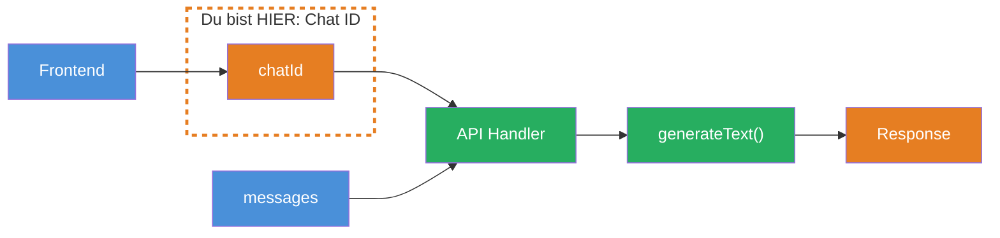
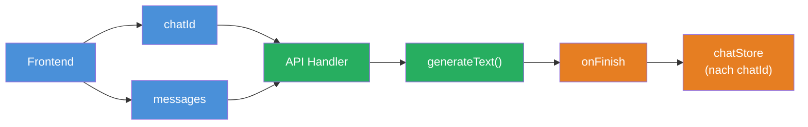

## THINK

Wie weiss Dein Backend, zu welchem Chat eine neue Nachricht gehoert?

## OVERVIEW



Jeder Chat braucht eine eindeutige ID. Das Frontend generiert sie beim Start eines neuen Chats und schickt sie mit jedem Request mit. Das Backend nutzt die ID, um Messages zuzuordnen, Verlaeufe zu laden und Sessions zu verwalten.

## WHY

**Ohne Chat ID:** Jede Nachricht ist fuer Dein Backend ein neuer, anonymer Request. Es gibt keinen Zusammenhang zwischen "Hallo" und der Folgefrage "Was meinst Du damit?". Du kannst keinen Verlauf laden, keine Session fortsetzen, kein Chat-Management bauen.

**Mit Chat ID:** Jede Nachricht gehoert zu einem identifizierbaren Chat. Du kannst den Verlauf laden, neue Messages anhaengen, mehrere parallele Chats verwalten und dem User eine Chat-History anbieten.

## WALKTHROUGH

### Schicht 1: Chat ID generieren

Eine Chat ID ist ein eindeutiger String. Der Standard: `crypto.randomUUID()` — erzeugt eine UUID v4:

```typescript
// Im Frontend: Neue Chat ID beim Start
const chatId = crypto.randomUUID();
// → "a1b2c3d4-e5f6-7890-abcd-ef1234567890"
```

`crypto.randomUUID()` ist in Node.js (ab v19) und allen modernen Browsern verfuegbar. Die Wahrscheinlichkeit einer Kollision ist praktisch null (2^122 moegliche Werte).

### Schicht 2: Chat ID im Request mitschicken

Das Frontend schickt die Chat ID zusammen mit den Messages an das Backend:

```typescript
// Frontend: Request an die API
const response = await fetch('/api/chat', {
  method: 'POST',
  headers: { 'Content-Type': 'application/json' },
  body: JSON.stringify({
    chatId,                                                      // ← Chat ID mitschicken
    messages: [
      { role: 'user', content: 'Was ist TypeScript?' },
    ],
  }),
});
```

Die Chat ID bleibt fuer die gesamte Konversation gleich. Neue Nachrichten werden mit derselben ID geschickt. Ein neuer Chat bekommt eine neue ID.

### Schicht 3: Chat ID im Backend lesen

Das Backend extrahiert die Chat ID aus dem Request und nutzt sie fuer die Zuordnung:

```typescript
// Backend: API Handler (z.B. Express, Next.js Route Handler)
async function handleChatRequest(req: Request): Promise<Response> {
  const { chatId, messages } = await req.json();                 // ← Chat ID auslesen

  console.log(`Chat ${chatId}: ${messages.length} neue Message(s)`);

  // Messages sind jetzt einem Chat zugeordnet
  // → Verlauf laden, neue Messages anhaengen, speichern
  return new Response(JSON.stringify({ chatId, status: 'ok' }));
}
```

### Schicht 4: Mehrere Chats verwalten

Mit Chat IDs kannst Du mehrere parallele Chats verwalten:

```typescript
// Simulierte Chat-Verwaltung
const chatSessions = new Map<string, Array<{ role: string; content: string }>>();

function getOrCreateChat(chatId: string) {
  if (!chatSessions.has(chatId)) {
    chatSessions.set(chatId, []);                                // ← Neuer Chat
    console.log(`Neuer Chat erstellt: ${chatId}`);
  }
  return chatSessions.get(chatId)!;
}

function addMessage(chatId: string, role: string, content: string) {
  const chat = getOrCreateChat(chatId);
  chat.push({ role, content });                                  // ← Message zuordnen
  console.log(`Chat ${chatId}: ${chat.length} Messages`);
}

// Drei verschiedene Chats
const chat1 = crypto.randomUUID();
const chat2 = crypto.randomUUID();

addMessage(chat1, 'user', 'Was ist TypeScript?');
addMessage(chat2, 'user', 'Erklaere mir React.');
addMessage(chat1, 'user', 'Und worin unterscheidet es sich von JavaScript?');

// chat1 hat 2 Messages, chat2 hat 1 Message — sauber getrennt
```

## TRY

**Aufgabe:** Baue einen minimalen API-Handler, der `chatId` und `messages` aus einem Request liest und nach Chat ID gruppiert loggt.

```typescript
// Simulierte "Datenbank"
const chatStore = new Map<string, Array<{ role: string; content: string }>>();

// TODO 1: Schreibe eine Funktion handleChat(chatId: string, messages: Array<{ role: string; content: string }>)
//   - Wenn der Chat noch nicht existiert: neuen Eintrag in chatStore anlegen
//   - Messages an den bestehenden Chat anhaengen
//   - Logge: Chat ID (gekuerzt auf 8 Zeichen), Anzahl neuer Messages, Gesamtzahl Messages

// TODO 2: Simuliere 3 Requests:
//   - Chat A: User fragt "Was ist TypeScript?"
//   - Chat B: User fragt "Erklaere React."
//   - Chat A: User fragt "Und was ist der Unterschied zu JavaScript?"

// TODO 3: Logge den Inhalt von chatStore — wie viele Chats, wie viele Messages pro Chat?
```

**Checkliste:**
- [ ] `handleChat`-Funktion erstellt
- [ ] Neue Chats werden automatisch angelegt
- [ ] Messages werden dem richtigen Chat zugeordnet
- [ ] Chat A hat 2 Messages, Chat B hat 1 Message
- [ ] Log zeigt Chat ID und Message-Anzahl

<details>
<summary>Loesung anzeigen</summary>

```typescript
const chatStore = new Map<string, Array<{ role: string; content: string }>>();

function handleChat(
  chatId: string,
  messages: Array<{ role: string; content: string }>,
) {
  if (!chatStore.has(chatId)) {
    chatStore.set(chatId, []);
    console.log(`Neuer Chat: ${chatId.substring(0, 8)}...`);
  }

  const chat = chatStore.get(chatId)!;
  chat.push(...messages);

  console.log(
    `Chat ${chatId.substring(0, 8)}...: +${messages.length} Message(s), gesamt: ${chat.length}`,
  );
}

// Simuliere 3 Requests
const chatA = crypto.randomUUID();
const chatB = crypto.randomUUID();

handleChat(chatA, [{ role: 'user', content: 'Was ist TypeScript?' }]);
handleChat(chatB, [{ role: 'user', content: 'Erklaere React.' }]);
handleChat(chatA, [
  { role: 'user', content: 'Und was ist der Unterschied zu JavaScript?' },
]);

// Status
console.log(`\n--- Chat Store ---`);
console.log(`Anzahl Chats: ${chatStore.size}`);
for (const [id, messages] of chatStore) {
  console.log(`Chat ${id.substring(0, 8)}...: ${messages.length} Messages`);
}
```

**Erklaerung:** `crypto.randomUUID()` generiert eindeutige IDs. Die `Map` speichert Messages gruppiert nach Chat ID. Durch das Kuerzen der ID im Log bleibt die Ausgabe lesbar. Chat A hat zwei Messages, Chat B eine — sauber getrennt.

</details>

## COMBINE



**Uebung:** Verbinde Chat ID mit `onFinish` — speichere die Assistant-Antwort im `onFinish` Callback, gruppiert nach Chat ID.

1. Erstelle einen `chatStore` als `Map<string, Array<{ role: string; content: string }>>`
2. Schreibe eine `chat`-Funktion die `chatId` und `userMessage` entgegennimmt
3. Speichere die User-Message im Store
4. Rufe `generateText` auf mit dem `chatStore`-Verlauf als `messages`
5. Im `onFinish` Callback: Speichere die Assistant-Antwort im Store unter der gleichen `chatId`
6. Fuehre 2 Nachrichten im selben Chat aus und logge den Verlauf

**Optional Stretch Goal:** Baue eine `listChats()`-Funktion, die alle Chat IDs mit Erstellungsdatum und Anzahl Messages anzeigt.

## Quellen

- [Vercel AI SDK: Chatbot Persistence](https://ai-sdk.dev/docs/ai-sdk-ui/chatbot-persistence)
- [MDN: crypto.randomUUID()](https://developer.mozilla.org/en-US/docs/Web/API/Crypto/randomUUID)
- [ai-hero-dev Exercise 04.02](https://github.com/ai-hero-dev/ai-sdk-v6-crash-course/tree/main/exercises/04-persistence)
