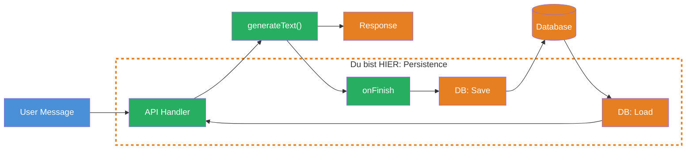
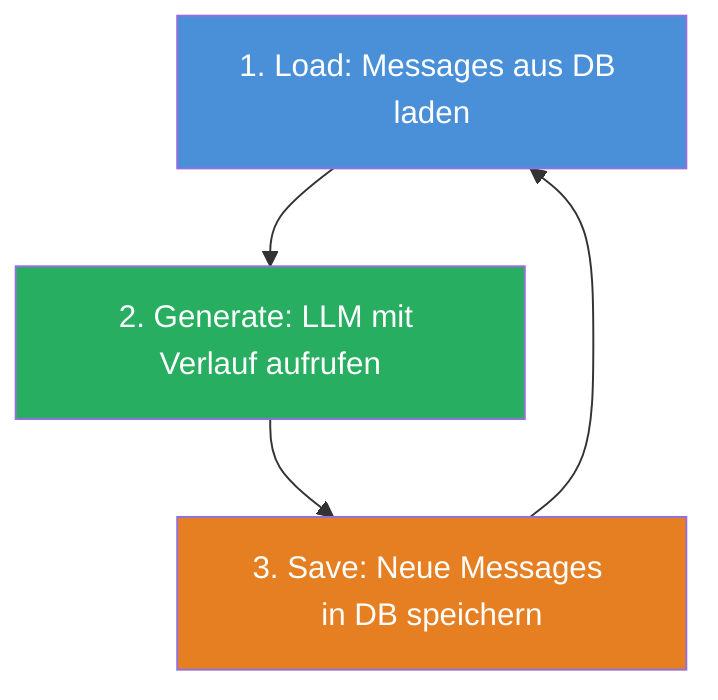
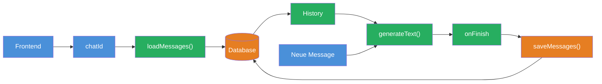

## THINK

Was passiert mit Deinem Chat-Verlauf wenn Du die Seite neu laedst?

## OVERVIEW



Persistence bedeutet: Messages werden nach jedem LLM-Call gespeichert und beim naechsten Request (oder nach einem Reload) wieder geladen. Der Chat "erinnert sich" an alles, was vorher gesagt wurde.

## WHY

**Ohne Persistence:** Der Chat-Verlauf lebt nur im Arbeitsspeicher. Bei Reload, Server-Neustart oder Deployment ist alles weg. Der User muss von vorn anfangen. Multi-Turn-Conversations funktionieren nur innerhalb einer Session.

**Mit Persistence:** Der Verlauf ueberlebt Reloads, Server-Neustarts und Deployments. Der User kann einen Chat jederzeit fortsetzen. Du hast eine Grundlage fuer Chat-History, Suche und Analytics.

## WALKTHROUGH

### Schicht 1: Der Persistence-Cycle

Der vollstaendige Cycle besteht aus drei Schritten:



1. **Load:** Vor dem LLM-Call die bisherigen Messages aus der Datenbank laden
2. **Generate:** `generateText` mit den geladenen Messages + der neuen User-Message aufrufen
3. **Save:** Im `onFinish` Callback die neuen Messages (User + Assistant) speichern

### Schicht 2: Messages speichern (Save)

Nach jedem LLM-Call speicherst Du die neuen Messages in der Datenbank:

```typescript
import { generateText } from 'ai';
import { anthropic } from '@ai-sdk/anthropic';

// Simulierte Datenbank (Map als In-Memory DB)
const db = new Map<string, Array<{ role: string; content: string }>>();

async function saveMessages(
  chatId: string,
  messages: Array<{ role: string; content: string }>,
) {
  db.set(chatId, messages);                                      // ← Alle Messages speichern
  console.log(`Saved ${messages.length} messages for chat ${chatId.substring(0, 8)}...`);
}

const chatId = crypto.randomUUID();
const userMessage = 'Was ist TypeScript?';

// User-Message + LLM-Call
const messages: Array<{ role: string; content: string }> = [
  { role: 'user', content: userMessage },
];

const result = await generateText({
  model: anthropic('claude-sonnet-4-5-20250514'),
  messages,
  onFinish({ text }) {
    messages.push({ role: 'assistant', content: text });         // ← Assistant-Antwort anhaengen
    saveMessages(chatId, messages);                              // ← In DB speichern
  },
});
```

### Schicht 3: Messages laden (Load)

Beim naechsten Request (oder nach Reload) laedt das Backend den bisherigen Verlauf:

```typescript
async function loadMessages(
  chatId: string,
): Promise<Array<{ role: string; content: string }>> {
  return db.get(chatId) || [];                                   // ← Leeres Array wenn kein Chat
}

// Nach "Reload": Verlauf laden
const history = await loadMessages(chatId);
console.log(`Loaded ${history.length} messages`);
// → "Loaded 2 messages" (user + assistant von vorher)
```

### Schicht 4: Chat fortsetzen

Jetzt kommt alles zusammen — laden, neue Message anhaengen, generieren, speichern:

```typescript
async function continueChat(chatId: string, userMessage: string) {
  // 1. Load: Bisherigen Verlauf laden
  const history = await loadMessages(chatId);

  // 2. Neue User-Message anhaengen
  const messages = [...history, { role: 'user' as const, content: userMessage }];

  // 3. Generate: LLM mit komplettem Verlauf aufrufen
  const result = await generateText({
    model: anthropic('claude-sonnet-4-5-20250514'),
    messages,
    onFinish({ text }) {
      // 4. Save: Kompletten Verlauf speichern
      messages.push({ role: 'assistant', content: text });
      saveMessages(chatId, messages);
    },
  });

  return result.text;
}

// Erster Call
await continueChat(chatId, 'Was ist TypeScript?');
// DB: [user: "Was ist TypeScript?", assistant: "TypeScript ist..."]

// Zweiter Call — Chat "erinnert sich" an den ersten
await continueChat(chatId, 'Und worin unterscheidet es sich von JavaScript?');
// DB: [user: "Was ist TypeScript?", assistant: "TypeScript ist...",
//      user: "Und worin unterscheidet es sich?", assistant: "Der Hauptunterschied..."]
```

Das LLM bekommt bei jedem Call den gesamten Verlauf und kann auf fruehere Nachrichten Bezug nehmen. Ohne Persistence wuerde es die zweite Frage ohne Kontext beantworten.

### Schicht 5: Normalisiertes DB-Schema (Ausblick)

In Production nutzt Du statt einer `Map` eine richtige Datenbank mit normalisiertem Schema:

```typescript
// Konzeptuelle Tabellenstruktur (z.B. SQLite, PostgreSQL)

// Tabelle: chats
interface Chat {
  id: string;           // UUID
  createdAt: Date;
  title: string;        // Erste User-Message oder generierter Titel
}

// Tabelle: messages
interface Message {
  id: string;           // UUID
  chatId: string;       // Foreign Key → chats.id
  role: 'user' | 'assistant' | 'system';
  content: string;
  tokens: number;       // Token-Verbrauch dieser Message
  createdAt: Date;
}
```

Zwei getrennte Tabellen: `chats` fuer Metadaten, `messages` fuer den Inhalt. Verknuepft ueber `chatId`. Das ermoeglicht effiziente Queries wie "alle Chats des Users" oder "Token-Verbrauch pro Chat".

## TRY

**Aufgabe:** Simuliere den vollstaendigen Persistence-Cycle mit einer `Map` als In-Memory-Datenbank: Messages speichern, laden und einen Chat fortsetzen.

Erstelle eine Datei `challenge-4-3.ts`:

```typescript
import { generateText } from 'ai';
import { anthropic } from '@ai-sdk/anthropic';

// In-Memory "Datenbank"
const db = new Map<string, Array<{ role: string; content: string }>>();

// TODO 1: Implementiere saveMessages(chatId, messages) — speichert in der Map
// TODO 2: Implementiere loadMessages(chatId) — liest aus der Map (leeres Array als Fallback)
// TODO 3: Implementiere continueChat(chatId, userMessage):
//   a) Verlauf laden mit loadMessages
//   b) Neue User-Message anhaengen
//   c) generateText aufrufen mit messages
//   d) Im onFinish: Assistant-Antwort anhaengen + saveMessages aufrufen
//   e) result.text zurueckgeben

// TODO 4: Teste den Cycle:
//   a) Neuen chatId generieren
//   b) Erste Nachricht: "Was ist TypeScript?"
//   c) Zweite Nachricht: "Nenne mir 3 Vorteile."
//   d) Logge den gespeicherten Verlauf — er sollte 4 Messages haben
```

**Checkliste:**
- [ ] `saveMessages` speichert Messages in der Map
- [ ] `loadMessages` liest Messages (mit leeres-Array-Fallback)
- [ ] `continueChat` laedt, generiert und speichert
- [ ] Nach 2 Calls: 4 Messages im Verlauf (2x user + 2x assistant)
- [ ] Das LLM bezieht sich in der zweiten Antwort auf die erste Frage

**Ausfuehren mit:** `npx tsx challenge-4-3.ts`

<details>
<summary>Loesung anzeigen</summary>

```typescript
import { generateText } from 'ai';
import { anthropic } from '@ai-sdk/anthropic';

const db = new Map<string, Array<{ role: string; content: string }>>();

function saveMessages(
  chatId: string,
  messages: Array<{ role: string; content: string }>,
) {
  db.set(chatId, [...messages]); // Kopie speichern
  console.log(
    `Saved: Chat ${chatId.substring(0, 8)}... → ${messages.length} messages`,
  );
}

function loadMessages(
  chatId: string,
): Array<{ role: string; content: string }> {
  return db.get(chatId) || [];
}

async function continueChat(chatId: string, userMessage: string) {
  const history = loadMessages(chatId);
  const messages: Array<{ role: string; content: string }> = [
    ...history,
    { role: 'user', content: userMessage },
  ];

  const result = await generateText({
    model: anthropic('claude-sonnet-4-5-20250514'),
    messages,
    onFinish({ text }) {
      messages.push({ role: 'assistant', content: text });
      saveMessages(chatId, messages);
    },
  });

  return result.text;
}

// Test
const chatId = crypto.randomUUID();

console.log('--- Erste Nachricht ---');
const answer1 = await continueChat(chatId, 'Was ist TypeScript?');
console.log(answer1.substring(0, 100) + '...\n');

console.log('--- Zweite Nachricht (Chat erinnert sich) ---');
const answer2 = await continueChat(chatId, 'Nenne mir 3 Vorteile.');
console.log(answer2.substring(0, 200) + '...\n');

console.log('--- Gespeicherter Verlauf ---');
const stored = loadMessages(chatId);
console.log(`Messages: ${stored.length}`);
stored.forEach((m, i) =>
  console.log(`  ${i + 1}. [${m.role}] ${m.content.substring(0, 60)}...`),
);
```

**Erwarteter Output (ungefaehr — LLM-Antworten variieren):**

```
--- Erste Nachricht ---
Saved: Chat a1b2c3d4... → 2 messages
TypeScript ist eine typisierte Erweiterung von JavaScript...

--- Zweite Nachricht (Chat erinnert sich) ---
Saved: Chat a1b2c3d4... → 4 messages
Drei Vorteile von TypeScript sind: 1. Statische Typen...

--- Gespeicherter Verlauf ---
Messages: 4
  1. [user] Was ist TypeScript?...
  2. [assistant] TypeScript ist eine typisierte Erweiterung von JavaScript...
  3. [user] Nenne mir 3 Vorteile....
  4. [assistant] Drei Vorteile von TypeScript sind: 1. Statische Typen...
```

**Erklaerung:** `continueChat` implementiert den vollstaendigen Persistence-Cycle: Load → Generate → Save. Das LLM bekommt bei jedem Call den gesamten Verlauf und kann auf fruehere Nachrichten Bezug nehmen. Die `Map` simuliert eine Datenbank — in Production wuerde hier ein SQL INSERT / SELECT stehen.

</details>

## COMBINE



**Uebung:** Verbinde Persistence mit Chat ID — lade einen Chat by ID, fuege neue Messages hinzu und speichere alles.

1. Erstelle eine `ChatDB`-Klasse mit `save`, `load` und `list`-Methoden
2. `save(chatId, messages)` speichert den vollstaendigen Verlauf
3. `load(chatId)` gibt den Verlauf zurueck (leeres Array als Fallback)
4. `list()` gibt alle Chat IDs mit Message-Anzahl zurueck
5. Baue eine `chat(db, chatId, userMessage)`-Funktion die den Cycle ausfuehrt
6. Erstelle 2 verschiedene Chats, fuehre je 2 Nachrichten aus
7. Nutze `list()` um alle Chats mit Message-Count anzuzeigen

**Optional Stretch Goal:** Fuege eine `delete(chatId)`-Methode hinzu und eine `getTokenCount(chatId)`-Methode, die den Gesamt-Token-Verbrauch eines Chats berechnet (erfordert: Token-Counts in den Messages mitspeichern).

## Quellen

- [Vercel AI SDK: Chatbot Persistence](https://ai-sdk.dev/docs/ai-sdk-ui/chatbot-message-persistence)
- [Vercel AI SDK: generateText API Reference](https://ai-sdk.dev/docs/reference/ai-sdk-core/generate-text)
- [ai-hero-dev Exercise 04.03](https://github.com/ai-hero-dev/ai-sdk-v6-crash-course/tree/main/exercises/04-persistence)
