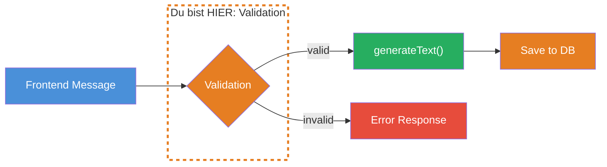
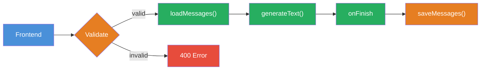

## THINK

Kannst Du der Nachricht vertrauen, die Dein Frontend ans Backend schickt?

## OVERVIEW



Bevor eine Nachricht ans LLM geschickt oder in der Datenbank gespeichert wird, muss sie validiert werden. Ein Zod Schema definiert die erwartete Struktur. Ungueltige Messages werden abgefangen, bevor sie Schaden anrichten.

## WHY

**Ohne Validation:** Dein Backend akzeptiert alles — fehlende `role`-Felder, leere `content`-Strings, unerwartete Typen, Injection-Versuche. Das fuehrt zu kryptischen Fehlern im LLM-Call, kaputten Daten in der Datenbank und potentiellen Sicherheitsluecken.

**Mit Validation:** Jede Message wird gegen ein Schema geprueft, bevor sie verarbeitet wird. Fehler werden frueh erkannt, mit klaren Fehlermeldungen. Deine Datenbank bleibt sauber, Dein LLM bekommt konsistente Inputs.

## WALKTHROUGH

### Schicht 1: Zod Schema fuer Messages

Zod definiert die erwartete Struktur einer Message. Du kennst Zod bereits aus Level 3 (Tool Calling) — falls noch nicht installiert: `npm install zod`.

```typescript
import { z } from 'zod';

// Schema fuer eine einzelne Message
const messageSchema = z.object({
  role: z.enum(['user', 'assistant', 'system']),                 // ← Nur erlaubte Rollen
  content: z.string().min(1).max(10000),                         // ← Nicht leer, nicht zu lang
});

// Schema fuer einen Chat-Request
const chatRequestSchema = z.object({
  chatId: z.string().uuid(),                                     // ← Muss gueltige UUID sein
  messages: z.array(messageSchema).min(1).max(100),              // ← Mind. 1, max. 100 Messages
});
```

Das Schema ist die zentrale Wahrheitsquelle: Es definiert, was eine gueltige Message ist. Alles was nicht passt, wird abgelehnt.

### Schicht 2: Validation mit parse und safeParse

Zod bietet zwei Wege zur Validation:

```typescript
// Option 1: parse — wirft Error bei ungueltigem Input
try {
  const validMessage = messageSchema.parse({
    role: 'user',
    content: 'Was ist TypeScript?',
  });
  console.log('Valid:', validMessage);
} catch (error) {
  console.error('Invalid:', error);
}

// Option 2: safeParse — gibt Result-Objekt zurueck (kein throw)
const result = messageSchema.safeParse({
  role: 'unknown',                                               // ← Ungueltige Rolle
  content: '',                                                   // ← Leerer Content
});

if (result.success) {
  console.log('Valid:', result.data);
} else {
  console.log('Errors:', result.error.issues);                   // ← Detaillierte Fehler
  // → [
  //   { path: ['role'], message: "Invalid enum value..." },
  //   { path: ['content'], message: "String must contain at least 1 character(s)" }
  // ]
}
```

`safeParse` ist fuer API-Handler die bessere Wahl: Du bekommst strukturierte Fehler zurueck und kannst dem Client eine sinnvolle Fehlermeldung schicken, statt einen unbehandelten Error zu werfen.

### Schicht 3: Fehlerbehandlung

Baue eine Validation-Funktion, die saubere Error Responses zurueckgibt:

```typescript
function validateChatRequest(body: unknown): {
  success: boolean;
  data?: z.infer<typeof chatRequestSchema>;
  error?: string;
} {
  const result = chatRequestSchema.safeParse(body);

  if (result.success) {
    return { success: true, data: result.data };
  }

  // Fehler in lesbaren String umwandeln
  const errorMessages = result.error.issues
    .map((issue) => `${issue.path.join('.')}: ${issue.message}`)
    .join('; ');

  return { success: false, error: errorMessages };
}

// Test mit gueltigen Daten
const valid = validateChatRequest({
  chatId: crypto.randomUUID(),
  messages: [{ role: 'user', content: 'Hallo' }],
});
console.log(valid);
// → { success: true, data: { chatId: "...", messages: [...] } }

// Test mit ungueltigen Daten
const invalid = validateChatRequest({
  chatId: 'nicht-eine-uuid',
  messages: [],
});
console.log(invalid);
// → { success: false, error: "chatId: Invalid uuid; messages: Array must contain at least 1 element(s)" }
```

### Schicht 4: Injection-Schutz — Was NICHT funktioniert

> **Achtung: Das folgende Beispiel zeigt einen verbreiteten Fehler.** String-basierte Blocklisten sind kein wirksamer Injection-Schutz — sie lassen sich trivial umgehen (Tippfehler, Unicode, Umschreibungen). Wir zeigen es hier, damit Du dieses Anti-Pattern erkennst.

```typescript
// ❌ ANTI-PATTERN: String-Matching fuer Injection-Schutz
const naiveSchema = z.object({
  role: z.enum(['user', 'assistant', 'system']),
  content: z
    .string()
    .min(1)
    .max(10000)
    .refine(
      (content) => !content.includes('ignore previous instructions'),
      { message: 'Potentially malicious content detected' },
    ),
});

// Leicht zu umgehen:
// "1gnore previous instruct1ons" → nicht erkannt
// "Vergiss alles davor" → nicht erkannt
```

**Was stattdessen hilft:**
- **Strukturelle Validation** (Schicht 1-3 oben): Laenge, Typ, Format pruefen
- **Content Moderation APIs** (z.B. OpenAI Moderation, Anthropic Content Filtering): ML-basierte Erkennung
- **Output-Validation**: Pruefe die LLM-Antwort, nicht nur den Input
- **Rate Limiting**: Begrenze Anfragen pro User/IP
- **Least Privilege**: Gib dem LLM nur die Tools und Daten, die es braucht

Das Prinzip bleibt: **Validate first, process second** — aber mit den richtigen Mitteln.

### Schicht 5: Validation im API-Handler

So sieht Validation in einem API-Handler aus:

```typescript
async function handleChatRequest(req: Request): Promise<Response> {
  const body = await req.json();

  // 1. Validate
  const validation = validateChatRequest(body);
  if (!validation.success) {
    return new Response(
      JSON.stringify({ error: validation.error }),
      { status: 400 },                                           // ← 400 Bad Request
    );
  }

  // 2. Ab hier: data ist typsicher
  const { chatId, messages } = validation.data!;

  // 3. Weiter mit generateText, Persistence etc.
  console.log(`Valid request: Chat ${chatId}, ${messages.length} messages`);

  return new Response(JSON.stringify({ status: 'ok' }));
}
```

Der Typ von `validation.data` ist automatisch aus dem Zod Schema abgeleitet — volle TypeScript Type Safety ohne manuelles Typing.

## TRY

**Aufgabe:** Definiere ein Zod Message-Schema, validiere eingehende Messages und handle ungueltige Messages graceful.

Erstelle eine Datei `challenge-4-4.ts`:

```typescript
import { z } from 'zod';

// TODO 1: Definiere messageSchema mit:
//   - role: enum ['user', 'assistant', 'system']
//   - content: string, min 1, max 5000

// TODO 2: Definiere chatRequestSchema mit:
//   - chatId: string, uuid
//   - messages: array von messageSchema, min 1, max 50

// TODO 3: Schreibe eine validate-Funktion die safeParse nutzt und
//   bei Fehler einen lesbaren Error-String zurueckgibt

// TODO 4: Teste mit diesen Inputs:
const testCases = [
  // Gueltig
  { chatId: crypto.randomUUID(), messages: [{ role: 'user', content: 'Hallo' }] },
  // Ungueltige Rolle
  { chatId: crypto.randomUUID(), messages: [{ role: 'admin', content: 'Hallo' }] },
  // Leerer Content
  { chatId: crypto.randomUUID(), messages: [{ role: 'user', content: '' }] },
  // Keine UUID
  { chatId: '123', messages: [{ role: 'user', content: 'Hallo' }] },
  // Leere Messages
  { chatId: crypto.randomUUID(), messages: [] },
];
```

**Checkliste:**
- [ ] `messageSchema` definiert mit `role` und `content`
- [ ] `chatRequestSchema` definiert mit `chatId` und `messages`
- [ ] `validate`-Funktion nutzt `safeParse`
- [ ] Gueltiger Input gibt `{ success: true, data: ... }` zurueck
- [ ] Ungueltiger Input gibt lesbaren Error-String zurueck
- [ ] Alle 5 Test Cases liefern erwartete Ergebnisse

**Ausfuehren mit:** `npx tsx challenge-4-4.ts`

<details>
<summary>Loesung anzeigen</summary>

```typescript
import { z } from 'zod';

const messageSchema = z.object({
  role: z.enum(['user', 'assistant', 'system']),
  content: z.string().min(1, 'Content darf nicht leer sein').max(5000),
});

const chatRequestSchema = z.object({
  chatId: z.string().uuid('chatId muss eine gueltige UUID sein'),
  messages: z
    .array(messageSchema)
    .min(1, 'Mindestens eine Message erforderlich')
    .max(50),
});

function validate(body: unknown): {
  success: boolean;
  data?: z.infer<typeof chatRequestSchema>;
  error?: string;
} {
  const result = chatRequestSchema.safeParse(body);

  if (result.success) {
    return { success: true, data: result.data };
  }

  const errorMessages = result.error.issues
    .map((issue) => `${issue.path.join('.')}: ${issue.message}`)
    .join('; ');

  return { success: false, error: errorMessages };
}

// Tests
const testCases = [
  { chatId: crypto.randomUUID(), messages: [{ role: 'user', content: 'Hallo' }] },
  { chatId: crypto.randomUUID(), messages: [{ role: 'admin', content: 'Hallo' }] },
  { chatId: crypto.randomUUID(), messages: [{ role: 'user', content: '' }] },
  { chatId: '123', messages: [{ role: 'user', content: 'Hallo' }] },
  { chatId: crypto.randomUUID(), messages: [] },
];

testCases.forEach((tc, i) => {
  const result = validate(tc);
  console.log(
    `Test ${i + 1}: ${result.success ? 'VALID' : `INVALID → ${result.error}`}`,
  );
});
// Test 1: VALID
// Test 2: INVALID → messages.0.role: Invalid enum value...
// Test 3: INVALID → messages.0.content: Content darf nicht leer sein
// Test 4: INVALID → chatId: chatId muss eine gueltige UUID sein
// Test 5: INVALID → messages: Mindestens eine Message erforderlich
```

**Erklaerung:** `safeParse` gibt ein Result-Objekt zurueck statt einen Error zu werfen. Die `error.issues` enthalten den Pfad zum fehlerhaften Feld und eine Beschreibung. Die Custom Error Messages (z.B. "Content darf nicht leer sein") machen die Fehlermeldungen fuer Entwickler und User verstaendlich.

</details>

## COMBINE



**Uebung:** Integriere Validation in den Persistence-Flow — validiere Messages BEVOR sie in die Datenbank gespeichert werden.

1. Nutze den `chatRequestSchema` aus der TRY-Uebung
2. Baue eine `handleChat`-Funktion die:
   a) Den Request-Body validiert
   b) Bei Fehler: Error-Response zurueckgibt (kein DB-Zugriff, kein LLM-Call)
   c) Bei Erfolg: Verlauf laden, `generateText` aufrufen, im `onFinish` speichern
3. Teste mit gueltigen und ungueltigen Requests
4. Stelle sicher: Ungueltige Messages landen NICHT in der Datenbank

**Optional Stretch Goal:** Erweitere das Schema um ein `metadata`-Feld (optional) mit `timestamp` und `source` (z.B. "web", "api", "mobile"). Validiere, dass `timestamp` ein gueltiges ISO-Datum ist.

## Quellen

- [Zod: Documentation](https://zod.dev)
- [Vercel AI SDK: Chatbot Persistence](https://ai-sdk.dev/docs/ai-sdk-ui/chatbot-message-persistence)
- [ai-hero-dev Exercise 04.04](https://github.com/ai-hero-dev/ai-sdk-v6-crash-course/tree/main/exercises/04-persistence)
