## Was Du gelernt hast

- **On Finish Callback:** Ergebnisse automatisch nach der Completion abfangen — `onFinish` liefert `text`, `usage`, `finishReason` und `response` fuer Logging, Analytics und Persistence
- **Chat ID:** Sessions eindeutig identifizieren mit `crypto.randomUUID()` — das Frontend schickt die ID mit jedem Request, das Backend ordnet Messages dem richtigen Chat zu
- **Persistence:** Messages in einer Datenbank speichern und bei Reload laden — der vollstaendige Cycle: Load → Generate → Save. Chats ueberleben Server-Neustarts und Deployments
- **Message Validation:** Eingehende Nachrichten mit Zod Schemas validieren, bevor sie verarbeitet werden — `safeParse` fuer strukturierte Fehlerbehandlung, Schutz vor Schema-Drift und Injection

## Aktualisierter Skill Tree

```mermaid
graph LR
  subgraph "Freigeschaltet"
    L1["Level 1: AI SDK Basics"]
    L2["Level 2: LLM Fundamentals"]
    L3["Level 3: Agents & MCP"]
    L4["Level 4: Persistence"]
  end
  subgraph NEXT["Naechstes Level"]
    L5["Level 5: Context Engineering"]
  end
  subgraph "Gesperrt"
    L6["Level 6: Evals"]
    L7["Level 7: Streaming"]
    L8["Level 8: Workflows"]
    L9["Level 9: Advanced Patterns"]
  end
  L1 --> L2
  L2 --> L3
  L3 --> L4
  L4 --> L5
  L5 -.-> L6
  L6 -.-> L7
  L7 -.-> L8
  L8 -.-> L9
  style L1 fill:#27AE60,color:#fff
  style L2 fill:#27AE60,color:#fff
  style L3 fill:#27AE60,color:#fff
  style L4 fill:#27AE60,color:#fff
  style NEXT fill:none,stroke:#E67E22,stroke-width:3px,color:#E67E22
  style L5 fill:#E67E22,color:#fff
  style L6 fill:#95a5a6,color:#fff
  style L7 fill:#95a5a6,color:#fff
  style L8 fill:#95a5a6,color:#fff
  style L9 fill:#95a5a6,color:#fff
```

## Naechstes Level

**Level 5: Context Engineering** — Du weisst jetzt, wie Du Chats speicherst und laedt. Aber was genau schickst Du ans LLM? Context Engineering ist die Kunst, dem LLM den optimalen Input zu geben — von strukturierten Prompt Templates ueber Few-Shot Learning bis zu RAG und Chain of Thought. Du lernst, wie Du aus vagen Prompts praezise, reproduzierbare Ergebnisse machst.
