## TL;DR

> Context Engineering ist die Kunst, einem LLM den optimalen Input zu geben. Du lernst, Prompts als wiederverwendbare Templates zu strukturieren (XML Tags), mit Beispielen konsistente Ausgaben zu erzeugen (Few-Shot), externes Wissen einzubinden (RAG) und das LLM zum Nachdenken zu bringen (Chain of Thought). Nach diesem Level kannst Du alle fuenf Techniken in einem Prompt kombinieren.

## Skill Tree

```mermaid
graph LR
  subgraph "Freigeschaltet"
    L1["Level 1: AI SDK Basics"]
    L2["Level 2: LLM Fundamentals"]
    L3["Level 3: Agents & MCP"]
    L4["Level 4: Persistence"]
  end
  subgraph "Aktuelles Level"
    L5["Level 5: Context Engineering"]
  end
  subgraph "Gesperrt"
    L6["Level 6: Evals"]
    L7["Level 7: Streaming"]
    L8["Level 8: Workflows"]
    L9["Level 9: Advanced Patterns"]
  end
  L1 --> L2
  L2 --> L3
  L3 --> L4
  L4 --> L5
  L5 -.-> L6
  L6 -.-> L7
  L7 -.-> L8
  L8 -.-> L9
  style L5 fill:#E67E22,color:#fff
  style L1 fill:#27AE60,color:#fff
  style L2 fill:#27AE60,color:#fff
  style L3 fill:#27AE60,color:#fff
  style L4 fill:#27AE60,color:#fff
  style L6 fill:#95a5a6,color:#fff
  style L7 fill:#95a5a6,color:#fff
  style L8 fill:#95a5a6,color:#fff
  style L9 fill:#95a5a6,color:#fff
```

## Was Du lernst

- **The Template:** System Prompts als wiederverwendbare, parametrisierte Templates mit XML Tags strukturieren
- **Basic Prompting:** Vage Prompts in klare, strukturierte Anweisungen mit dem Anthropic Prompt Template umwandeln
- **Exemplars (Few-Shot Learning):** Dem LLM mit konkreten Input-Output-Beispielen zeigen, was Du erwartest
- **Retrieval (RAG):** Externes Wissen dynamisch laden und als Kontext in den Prompt einfuegen
- **Chain of Thought:** Das LLM zum schrittweisen Nachdenken bringen, bevor es antwortet

## Warum das wichtig ist

> "The hottest new programming skill is not prompting, it's context engineering."
> — Simon Willison

Ein LLM weiss nur, was Du ihm gibst. Zu wenig Kontext bedeutet Halluzinationen. Zu viel Kontext bedeutet Rauschen, hohe Kosten und verlorener Fokus. Context Engineering ist der Unterschied zwischen einem Chatbot, der ratet, und einem AI-System, das zuverlaessig arbeitet.

Das konkrete Problem: Ohne strukturierte Prompts schreibst Du fuer jeden API-Call einen neuen Prompt per Copy-Paste. Die Ergebnisse sind inkonsistent, nicht testbar und schwer zu warten. Mit Context Engineering baust Du ein System, das bei 20 verschiedenen Calls konsistente, reproduzierbare Ergebnisse liefert.

## Voraussetzungen

- **Level 1: AI SDK Basics** — `generateText` und `streamText` muessen sitzen
- **Grundverstaendnis was ein LLM ist** — Du weisst, dass ein LLM Text basierend auf Input generiert

> **Skip-Hinweis:** Du arbeitest bereits mit strukturierten System Prompts, nutzt XML Tags und hast Erfahrung mit Few-Shot Prompting? Dann spring direkt zur [Boss Fight](/de/level-5-context-engineering/07-boss-fight/) und pruefe, ob Du alle Konzepte kombinieren kannst.

## Challenges

| # | Challenge | Konzept |
|---|-----------|---------|
| 5.1 | [The Template](/de/level-5-context-engineering/02-the-template/) | System Prompts als wiederverwendbare Templates strukturieren |
| 5.2 | [Basic Prompting](/de/level-5-context-engineering/03-basic-prompting/) | Vage Prompts in klare Anweisungen mit XML Tags umwandeln |
| 5.3 | [Exemplars](/de/level-5-context-engineering/04-exemplars/) | Few-Shot Learning mit Input-Output-Beispielen |
| 5.4 | [Retrieval (RAG)](/de/level-5-context-engineering/05-retrieval/) | Externes Wissen dynamisch in den Prompt laden |
| 5.5 | [Chain of Thought](/de/level-5-context-engineering/06-chain-of-thought/) | Das LLM zum schrittweisen Nachdenken bringen |

## Boss Fight

Baue einen **Documentation Assistant**: Ein System, das Dokumente aus einer lokalen Quelle laedt (RAG), mit einem strukturierten Prompt Template arbeitet, Exemplars fuer konsistente Antworten nutzt und Chain of Thought fuer komplexe Fragen einsetzt. Alle fuenf Bausteine in einem System.

## Quellen fuer dieses Level

- [Anthropic: Prompt Engineering Guide](https://docs.anthropic.com/en/docs/build-with-claude/prompt-engineering)
- [Vercel AI SDK: Prompts](https://ai-sdk.dev/docs/foundations/prompts)
- [ai-hero-dev Exercises 05.01-05.05](https://github.com/ai-hero-dev/ai-sdk-v6-crash-course/tree/main/exercises/05-context-engineering)
