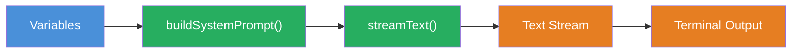

## THINK

Wenn Du einen System Prompt schreibst — wie stellst Du sicher, dass er bei 20 verschiedenen API-Calls konsistent bleibt?

## OVERVIEW

```mermaid
graph LR
  subgraph HIER["Du bist HIER: Prompt Template"]
    subgraph Template["Prompt Template"]
      TC["&lt;task-context&gt;"]
      BD["&lt;background-data&gt;"]
      EX["&lt;examples&gt;"]
      R["&lt;rules&gt;"]
      CH["&lt;conversation-history&gt;"]
      TA["&lt;the-ask&gt;"]
      OF["&lt;output-format&gt;"]
    end
  end
  V["Variables<br/>(role, audience, tone)"] --> Template
  Template --> GT["generateText()"]
  GT --> LLM["LLM"]
  LLM --> OUT["Konsistenter Output"]
  style HIER fill:none,stroke:#E67E22,stroke-width:3px,color:#E67E22
  style V fill:#4A90D9,color:#fff
  style TC fill:#27AE60,color:#fff
  style BD fill:#27AE60,color:#fff
  style EX fill:#27AE60,color:#fff
  style R fill:#27AE60,color:#fff
  style CH fill:#27AE60,color:#fff
  style TA fill:#27AE60,color:#fff
  style OF fill:#27AE60,color:#fff
  style GT fill:#27AE60,color:#fff
  style LLM fill:#27AE60,color:#fff
  style OUT fill:#E67E22,color:#fff
```



Das Diagramm zeigt die Kernidee: Ein Prompt Template definiert eine feste Struktur mit XML Tags. Variablen werden dynamisch injiziert. Das Ergebnis ist ein konsistenter, wiederverwendbarer Prompt fuer beliebig viele API-Calls.

## WHY

**Ohne Template:** Du kopierst Prompts per Copy-Paste in jede Datei. Jeder Prompt sieht leicht anders aus. Aenderungen am Ton oder Format muessen an 20 Stellen gleichzeitig gemacht werden. Das Ergebnis ist inkonsistent und nicht testbar.

**Mit Template:** Ein Prompt, eine Stelle, viele Aufgaben. Du aenderst die Variablen — der Rest bleibt gleich. DRY (Don't Repeat Yourself), testbar, wartbar.

## WALKTHROUGH

### Schicht 1: Die Grundstruktur (XML Tags fuer Sections)

Anthropic empfiehlt, Prompts mit XML Tags zu strukturieren. Jeder Tag hat eine bestimmte Funktion und Position — die Reihenfolge folgt der Aufmerksamkeitsverteilung von LLMs:

```xml
<task-context>
Rolle und Aufgabe — steht am ANFANG (hoher Einfluss)
</task-context>

<background-data>
Dokumente, Kontext — steht in der MITTE
</background-data>

<examples>
Few-Shot Beispiele — steht in der MITTE
</examples>

<rules>
Detaillierte Anweisungen — steht in der MITTE
</rules>

<conversation-history>
Chat-Verlauf — steht in der MITTE
</conversation-history>

<the-ask>
Die eigentliche Frage — steht am ENDE (hoher Einfluss)
</the-ask>

<output-format>
Ausgabeformat — steht am ENDE (hoher Einfluss)
</output-format>
```

LLMs gewichten Anfang und Ende staerker als die Mitte. Deshalb stehen `<task-context>` und `<output-format>` an den Raendern — dort, wo sie den groessten Einfluss haben.

### Schicht 2: Variables und dynamische Inhalte

Die XML-Struktur allein ist statisch. Um sie wiederverwendbar zu machen, nutzt Du TypeScript Template Literals. Variablen werden an den richtigen Stellen injiziert:

```typescript
// Template Literal: Variablen werden zur Laufzeit eingesetzt
const systemPrompt = `
<task-context>
Du bist ein ${config.role}.                // ← Variable: Rolle dynamisch
Deine Zielgruppe: ${config.audience}.      // ← Variable: Zielgruppe dynamisch
</task-context>

<rules>
- Schreibe ${config.tone}                  // ← Variable: Ton dynamisch
- Fachbegriffe beim ersten Auftreten erklaeren
- Keine Annahmen ohne Kennzeichnung
</rules>

<output-format>
Formatiere Deine Antwort als: ${config.outputFormat}  // ← Variable: Format dynamisch
</output-format>
`;
```

Jede Variable macht den Prompt flexibel, ohne die Struktur zu veraendern. Derselbe Prompt funktioniert fuer einen "technischen Redakteur" genauso wie fuer einen "Marketing-Texter" — nur die Variablen aendern sich.

### Schicht 3: Die buildSystemPrompt Funktion

Die letzte Schicht kapselt alles in einer wiederverwendbaren Funktion:

```typescript
import { generateText } from 'ai';
import { anthropic } from '@ai-sdk/anthropic';

interface PromptConfig {
  role: string;
  audience: string;
  tone: string;
  outputFormat: string;
}

function buildSystemPrompt(config: PromptConfig): string {  // ← Reusable Funktion
  return `
<task-context>
Du bist ein ${config.role}.
Deine Zielgruppe: ${config.audience}.
</task-context>

<rules>
- Schreibe ${config.tone}
- Fachbegriffe beim ersten Auftreten erklaeren
- Keine Annahmen ohne Kennzeichnung
- Codebeispiele muessen lauffaehig sein
</rules>

<output-format>
Formatiere Deine Antwort als: ${config.outputFormat}
</output-format>
  `.trim();
}

// Derselbe Prompt, verschiedene Konfigurationen:
const result = await generateText({
  model: anthropic('claude-sonnet-4-5-20250514'),
  system: buildSystemPrompt({                              // ← Template wird hier genutzt
    role: 'technischer Redakteur',
    audience: 'Entwickler mit 2 Jahren Erfahrung',
    tone: 'professionell aber zugaenglich',
    outputFormat: 'Markdown mit Codebeispielen',
  }),
  prompt: 'Erklaere, was Context Engineering ist.',
});

console.log(result.text);
```

Die Funktion nimmt ein `PromptConfig`-Objekt und gibt einen vollstaendigen System Prompt als String zurueck. Du kannst sie in Tests mocken, in verschiedenen Kontexten wiederverwenden und an einer Stelle aendern.

## TRY

**Aufgabe:** Baue Deine eigene `buildSystemPrompt`-Funktion. Sie soll ein Template mit XML Tags zurueckgeben, das mindestens vier Sektionen hat.

```typescript
import { generateText } from 'ai';
import { anthropic } from '@ai-sdk/anthropic';

interface PromptConfig {
  role: string;
  audience: string;
  tone: string;
  outputFormat: string;
}

// TODO: Implementiere buildSystemPrompt
// 1. Nutze Template Literals (Backticks)
// 2. Setze XML Tags fuer die Struktur ein:
//    - <task-context> fuer Rolle und Zielgruppe
//    - <rules> fuer Tonalitaet und Einschraenkungen
//    - <output-format> fuer das gewuenschte Format
// 3. Injiziere die config-Variablen an den richtigen Stellen
function buildSystemPrompt(config: PromptConfig): string {
  // Dein Code hier
  return '';
}

const result = await generateText({
  model: anthropic('claude-sonnet-4-5-20250514'),
  system: buildSystemPrompt({
    role: 'technischer Redakteur',
    audience: 'Entwickler mit 2 Jahren Erfahrung',
    tone: 'professionell aber zugaenglich',
    outputFormat: 'Markdown mit Codebeispielen',
  }),
  prompt: 'Erklaere, was Context Engineering ist.',
});

console.log(result.text);
```

**Checkliste:**
- [ ] Template nutzt XML Tags fuer Struktur
- [ ] Mindestens 4 Sektionen (role, audience, tone, format)
- [ ] Funktion gibt einen String zurueck
- [ ] Code laeuft mit `generateText`

<details>
<summary>Loesung anzeigen</summary>

```typescript
import { generateText } from 'ai';
import { anthropic } from '@ai-sdk/anthropic';

interface PromptConfig {
  role: string;
  audience: string;
  tone: string;
  outputFormat: string;
}

function buildSystemPrompt(config: PromptConfig): string {
  return `
<task-context>
Du bist ein ${config.role}.
Deine Zielgruppe: ${config.audience}.
</task-context>

<rules>
- Schreibe ${config.tone}
- Fachbegriffe beim ersten Auftreten erklaeren
- Keine Annahmen ohne Kennzeichnung
- Codebeispiele muessen lauffaehig sein
</rules>

<output-format>
Formatiere Deine Antwort als: ${config.outputFormat}
</output-format>
  `.trim();
}

const result = await generateText({
  model: anthropic('claude-sonnet-4-5-20250514'),
  system: buildSystemPrompt({
    role: 'technischer Redakteur',
    audience: 'Entwickler mit 2 Jahren Erfahrung',
    tone: 'professionell aber zugaenglich',
    outputFormat: 'Markdown mit Codebeispielen',
  }),
  prompt: 'Erklaere, was Context Engineering ist.',
});

console.log(result.text);
```

**Erklaerung:** Die Funktion nutzt `<task-context>` am Anfang fuer maximalen Einfluss auf die Rolle und `<output-format>` am Ende fuer maximale Kontrolle ueber das Format. Die `<rules>` stehen in der Mitte. Alle vier `config`-Variablen werden dynamisch injiziert.

</details>

## COMBINE



**Uebung:** Nutze Dein Template jetzt mit `streamText` statt `generateText`. Streame die Antwort ins Terminal.

Du brauchst:
1. Ersetze `generateText` durch `streamText`
2. Iteriere ueber `result.textStream` mit `for await...of`
3. Gib jeden Chunk mit `process.stdout.write(chunk)` aus

**Optional Stretch Goal:** Fuege einen zweiten Aufruf hinzu, der dasselbe Template mit einer anderen Konfiguration nutzt (z.B. `role: 'Marketing-Texter'`). Vergleiche die Outputs.

## Quellen

- [Anthropic: Prompt Engineering Guide](https://docs.anthropic.com/en/docs/build-with-claude/prompt-engineering)
- [Vercel AI SDK: Prompts](https://ai-sdk.dev/docs/foundations/prompts)
- [ai-hero-dev Exercise 05.01](https://github.com/ai-hero-dev/ai-sdk-v6-crash-course/tree/main/exercises/05-context-engineering/05.01-the-template)
