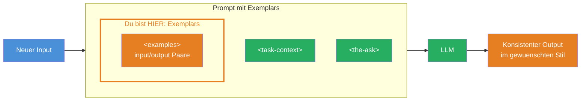
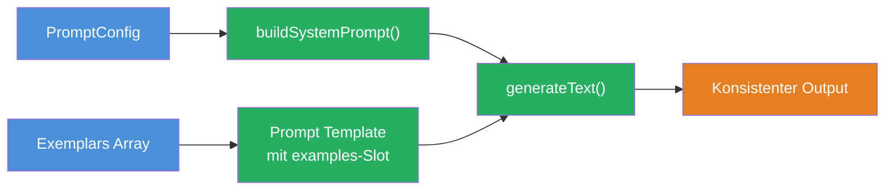

## THINK

Wie wuerdest Du einem neuen Mitarbeiter einen bestimmten Schreibstil erklaeren — mit Regeln oder mit Beispielen?

## OVERVIEW



Der `<examples>`-Tag ist der Baustein, der in dieser Challenge hinzukommt. Er enthaelt konkrete Input-Output-Paare, an denen sich das LLM orientiert. Zusammen mit `<task-context>` und `<the-ask>` aus den vorherigen Challenges ergibt sich ein Prompt, der konsistente Ergebnisse im gewuenschten Stil liefert.

## WHY

**Ohne Exemplars:** Das LLM interpretiert Stil und Format frei. Du schreibst ausfuehrliche Regeln ("Titel sollen maximal 30 Zeichen haben, in Title Case, ohne Punkt am Ende"), aber das LLM haelt sich nicht immer daran. Die Ausgaben variieren.

**Mit Exemplars:** Du zeigst dem LLM konkrete Beispiele: "So soll das Ergebnis aussehen." Das LLM erkennt das Muster und wendet es auf neue Inputs an. Weniger Regeln noetig, konsistentere Ergebnisse. Zeigen statt Beschreiben.

## WALKTHROUGH

### Schicht 1: Was sind Exemplars (Few-Shot Learning Prinzip)

Few-Shot Learning bedeutet: Du gibst dem LLM ein paar Beispiele (shots) und es lernt daraus das Muster. Statt Regeln zu formulieren, zeigst Du dem LLM 2-5 konkrete Input-Output-Paare.

Das Prinzip ist einfach: Wenn Du einem neuen Mitarbeiter zeigst, wie drei fertige E-Mails aussehen, versteht er den gewuenschten Stil sofort — ohne 20 Regeln lesen zu muessen. Genauso funktioniert es mit LLMs.

### Schicht 2: Die examples XML Tag Struktur

Anthropic empfiehlt, Exemplars in einer klaren XML-Struktur zu verpacken:

```xml
<examples>
  <example>
    <input>Was ist der Unterschied zwischen TypeScript und JavaScript?</input>
    <output>TypeScript vs JavaScript</output>
  </example>
  <example>
    <input>Ich will anfangen zu investieren, bin aber Anfaenger.</input>
    <output>Beginner Investment Options</output>
  </example>
  <example>
    <input>Wie konfiguriere ich ESLint mit TypeScript?</input>
    <output>ESLint TypeScript Setup</output>
  </example>
</examples>
```

Jedes `<example>` hat ein `<input>` (was reingeht) und ein `<output>` (was rauskommen soll). Das LLM erkennt aus den Beispielen implizit:
- Die gewuenschte Laenge (3-4 Woerter)
- Das Format (Title Case)
- Den Stil (keine Satzzeichen, keine Erklaerung)

### Schicht 3: Wie viele Exemplars braucht man?

Die Faustregel: **2-5 Exemplars sind optimal.**

- **1 Exemplar:** Reicht fuer einfache Formate, aber das LLM koennte es als Einzelfall interpretieren
- **2-3 Exemplars:** Gut fuer die meisten Faelle — das Muster wird klar
- **4-5 Exemplars:** Ideal fuer komplexe Formate oder wenn Randfaelle abgedeckt werden muessen
- **Mehr als 5:** Sinkender Ertrag — mehr Tokens, kaum bessere Ergebnisse

Wichtig: Die Exemplars sollten **verschiedene Faelle** abdecken. Wenn alle Beispiele aehnlich sind, lernt das LLM nur diesen einen Fall.

In TypeScript kannst Du Exemplars dynamisch in den Prompt einbauen:

```typescript
const exemplars = [
  {
    input: 'What is the difference between TypeScript and JavaScript?',
    output: 'TypeScript vs JavaScript',
  },
  {
    input: 'I want to start investing but I am a complete beginner.',
    output: 'Beginner Investment Options',
  },
  {
    input: 'How do I configure ESLint with TypeScript in a monorepo?',
    output: 'ESLint TypeScript Setup',
  },
];

// Exemplars dynamisch in XML Tags umwandeln
const exemplarsXml = exemplars
  .map(
    (e) => `  <example>
    <input>${e.input}</input>
    <output>${e.output}</output>
  </example>`
  )
  .join('\n');

const prompt = `
<task-context>
You are a helpful assistant that generates titles for conversations.
</task-context>

<examples>
${exemplarsXml}
</examples>

<conversation-history>
${INPUT}
</conversation-history>

<the-ask>
Generate a title for the conversation.
</the-ask>
`;
```

Beachte: Mit guten Exemplars kannst Du oft auf `<rules>` und `<output-format>` verzichten. Die Beispiele transportieren Format, Laenge und Stil implizit.

## TRY

**Aufgabe:** Baue einen Sentiment Classifier mit Exemplars. Das LLM soll Texte in eine von drei Kategorien einordnen: `positiv`, `negativ` oder `neutral`. Nutze mindestens 3 Exemplars, die alle drei Faelle abdecken.

```typescript
import { generateText } from 'ai';
import { anthropic } from '@ai-sdk/anthropic';

// TODO: Definiere mindestens 3 Exemplars als Array
// Jedes Exemplar braucht einen input (Text) und output (positiv/negativ/neutral)
const exemplars = [
  // TODO: 1 positives Beispiel
  // TODO: 1 negatives Beispiel
  // TODO: 1 neutrales Beispiel
];

const NEW_INPUT = 'Das Produkt ist okay, nichts Besonderes aber auch nicht schlecht.';

// TODO: Baue den Prompt mit <examples> XML Tags
// Nutze .map() um die Exemplars in XML zu verwandeln
const result = await generateText({
  model: anthropic('claude-sonnet-4-5-20250514'),
  prompt: `
    // TODO: Dein strukturierter Prompt hier
    // Verwende <task-context>, <examples> und <the-ask>
  `,
});

console.log(result.text);
```

**Checkliste:**
- [ ] Mindestens 3 Exemplars
- [ ] Jedes Exemplar hat input und output
- [ ] Exemplars decken verschiedene Faelle ab (positiv, negativ, neutral)
- [ ] LLM-Ausgabe folgt dem Muster der Exemplars

<details>
<summary>Loesung anzeigen</summary>

```typescript
import { generateText } from 'ai';
import { anthropic } from '@ai-sdk/anthropic';

const exemplars = [
  {
    input: 'Das neue Update ist fantastisch! Endlich funktioniert alles schnell und zuverlaessig.',
    output: 'positiv',
  },
  {
    input: 'Der Kundenservice war eine Katastrophe. Drei Stunden Wartezeit und keine Loesung.',
    output: 'negativ',
  },
  {
    input: 'Das Meeting hat um 14 Uhr stattgefunden. Es wurden drei Punkte besprochen.',
    output: 'neutral',
  },
];

const exemplarsXml = exemplars
  .map(
    (e) => `  <example>
    <input>${e.input}</input>
    <output>${e.output}</output>
  </example>`
  )
  .join('\n');

const NEW_INPUT = 'Das Produkt ist okay, nichts Besonderes aber auch nicht schlecht.';

const result = await generateText({
  model: anthropic('claude-sonnet-4-5-20250514'),
  prompt: `
<task-context>
Du bist ein Sentiment Classifier. Du ordnest Texte in genau eine Kategorie ein.
</task-context>

<examples>
${exemplarsXml}
</examples>

<the-ask>
Klassifiziere den folgenden Text: ${NEW_INPUT}
</the-ask>
  `.trim(),
});

console.log(result.text); // Erwartete Ausgabe: "neutral"
```

**Erklaerung:** Die drei Exemplars decken alle drei Kategorien ab. Das LLM erkennt aus den Beispielen, dass die Ausgabe genau ein Wort sein soll (`positiv`, `negativ` oder `neutral`). Der Text "okay, nichts Besonderes aber auch nicht schlecht" wird korrekt als `neutral` klassifiziert — ohne dass wir explizite Regeln dafuer definieren mussten.

</details>

## COMBINE



**Uebung:** Erweitere das Template aus Challenge 5.1 um einen `examples`-Slot. Baue eine Funktion, die Exemplars als Parameter akzeptiert und ins Template einfuegt.

Konkret:
1. Erweitere das `PromptConfig`-Interface um ein `exemplars`-Feld (Array mit `input`/`output`-Paaren)
2. In `buildSystemPrompt()`: Wandle die Exemplars mit `.map()` in `<examples>` XML um
3. Fuege den `<examples>`-Block an der richtigen Stelle im Template ein (nach `<task-context>`, vor `<rules>`)
4. Teste mit dem Chat Title Generator und vergleiche das Ergebnis mit und ohne Exemplars

**Optional Stretch Goal:** Mach die Exemplars optional — wenn keine uebergeben werden, soll der `<examples>`-Block weggelassen werden.

## Quellen

- [Anthropic: Prompt Engineering — Use Examples](https://docs.anthropic.com/en/docs/build-with-claude/prompt-engineering/use-examples)
- [ai-hero-dev Exercise 05.03](https://github.com/ai-hero-dev/ai-sdk-v6-crash-course/tree/main/exercises/05-context-engineering/05.03-exemplars)
