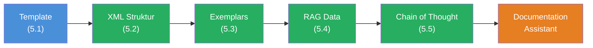

## Das Szenario

Du baust einen **Documentation Assistant** — ein AI-System, das technische Dokumentation analysiert und Entwickler-Fragen beantwortet. Der Assistant muss zuverlaessig arbeiten: quellenbasierte Antworten, konsistentes Format, nachvollziehbarer Denkprozess. Keine Halluzinationen.

Dieses Projekt kombiniert alle fuenf Bausteine aus Level 5:



## Anforderungen

1. Eine `buildDocAssistantPrompt`-Funktion die alle 5 Konzepte vereint
2. Dokumentation als `<background-data>` mit Quellenangabe (`<url>` und `<content>`)
3. Mindestens 2 Exemplars im `<examples>`-Abschnitt, die das gewuenschte Antwort-Format demonstrieren
4. `<thinking-instructions>` die das LLM bei komplexen Fragen zum strukturierten Denken bringen
5. `<rules>` die Halluzinationen verhindern: nur bereitgestellte Daten verwenden, ehrlich bei Wissensluecken
6. `streamText` fuer die Ausgabe ins Terminal

## Starter-Code

```typescript
import { streamText } from 'ai';
import { anthropic } from '@ai-sdk/anthropic';

// Simulierte Dokumentation — in Production: fs.readFileSync oder Vector DB
const documentation = `
# Authentication API

## Setup
Install the auth package: \`npm install @example/auth\`

## Configuration
Create an auth.config.ts file in your project root:

\`\`\`typescript
import { defineConfig } from '@example/auth';

export default defineConfig({
  providers: ['github', 'google'],
  secret: process.env.AUTH_SECRET,
  database: process.env.DATABASE_URL,
});
\`\`\`

## Middleware
Add the auth middleware to your server:

\`\`\`typescript
import { authMiddleware } from '@example/auth';

app.use(authMiddleware());
\`\`\`

## Protected Routes
Use the \`requireAuth\` helper:

\`\`\`typescript
app.get('/dashboard', requireAuth(), (req, res) => {
  res.json({ user: req.user });
});
\`\`\`

## Error Handling
The middleware throws AuthError for invalid tokens.
Catch it in your error handler.
`;

const question = 'How do I protect a route that only admins can access?';

// Deine Aufgabe: Baue den vollstaendigen Documentation Assistant.
// Nutze ALLE 5 Techniken aus Level 5.

// 1. buildDocAssistantPrompt() — wiederverwendbare Template-Funktion
// 2. XML Tags — strukturierter Prompt
// 3. Exemplars — mindestens 2 Beispiele fuer das Antwort-Format
// 4. background-data — die Dokumentation als Kontext
// 5. thinking-instructions — Denkprozess vor der Antwort
// 6. streamText — Ausgabe ins Terminal

const result = await streamText({
  model: anthropic('claude-sonnet-4-5-20250514'),
  prompt: '// Dein Prompt hier',
});

for await (const chunk of result.textStream) {
  process.stdout.write(chunk);
}
```

## Bewertungskriterien

Dein Boss Fight ist bestanden, wenn:

- [ ] Der Prompt wird von einer wiederverwendbaren `buildDocAssistantPrompt`-Funktion generiert (Template, 5.1)
- [ ] Der Prompt nutzt XML Tags in der richtigen Reihenfolge: `<task-context>` → `<background-data>` → `<examples>` → `<rules>` → `<the-ask>` → `<thinking-instructions>` → `<output-format>` (XML Struktur, 5.2)
- [ ] Mindestens 2 Exemplars zeigen das gewuenschte Antwort-Format mit `<thinking>` Block und strukturierter Antwort (Exemplars, 5.3)
- [ ] Die Dokumentation steht in `<background-data>` mit `<url>` und `<content>` Tags (RAG, 5.4)
- [ ] `<thinking-instructions>` definieren wie das LLM die Doku durchsuchen und die Frage analysieren soll (CoT, 5.5)
- [ ] `<rules>` verhindern Halluzinationen: nur Doku-Inhalt nutzen, Zitate verwenden, ehrlich bei Wissensluecken
- [ ] `<output-format>` definiert die Antwortstruktur klar
- [ ] Der Code laeuft mit `streamText` und gibt eine sinnvolle Antwort

## Hinweise

<details>
<summary>Hinweis 1: Die Funktion strukturieren</summary>

Deine `buildDocAssistantPrompt`-Funktion braucht ein Config-Objekt mit mindestens diesen Feldern: `docUrl`, `docContent`, `question`, `exemplars`. Die Funktion gibt einen String zurueck, der alle XML Tags in der richtigen Reihenfolge enthaelt. Schau Dir die `buildSystemPrompt`-Funktion aus Challenge 5.1 an — dieselbe Idee, nur mit mehr Tags.

</details>

<details>
<summary>Hinweis 2: Exemplars fuer den Documentation Assistant</summary>

Deine Exemplars sollten das vollstaendige Antwort-Format zeigen: erst ein `<thinking>` Block mit dem Suchprozess in der Doku, dann die strukturierte Antwort mit Zitaten. Zeige mindestens einen Fall, in dem die Frage beantwortbar ist, und einen Fall, in dem die Doku keine Antwort hat. So lernt das LLM beide Pfade.

</details>

<details>
<summary>Hinweis 3: Die Anti-Halluzinations-Regel</summary>

Die wichtigste Regel in `<rules>` ist: "If the question cannot be answered from the provided documentation, say so honestly and suggest where the user might find the answer." Ohne diese Regel wird das LLM versuchen, auch Fragen zu beantworten, die nicht in der Doku stehen — mit erfundenen Antworten.

</details>

## Quellen

- [Anthropic: Prompt Engineering Guide](https://docs.anthropic.com/en/docs/build-with-claude/prompt-engineering)
- [Anthropic: RAG Overview](https://docs.anthropic.com/en/docs/build-with-claude/retrieval-augmented-generation)
- [Vercel AI SDK: Prompts](https://ai-sdk.dev/docs/foundations/prompts)
- [ai-hero-dev Exercises 05.01-05.05](https://github.com/ai-hero-dev/ai-sdk-v6-crash-course/tree/main/exercises/05-context-engineering)
