## Was Du gelernt hast

> Level 5 abgeschlossen! Du beherrschst jetzt die fuenf Kernbausteine des Context Engineering — von wiederverwendbaren Templates ueber Few-Shot Learning bis zu RAG und Chain of Thought. Dein Documentation Assistant aus der Boss Fight zeigt, dass Du alle Techniken in einem System kombinieren kannst.

- **Templates:** System Prompts als wiederverwendbare, testbare Vorlagen mit `buildSystemPrompt()` strukturieren
- **XML Tags:** Strukturierte Prompts mit klaren Sektionen — `<task-context>`, `<rules>`, `<output-format>` und mehr
- **Exemplars:** Few-Shot Learning fuer konsistente Ausgaben — zeigen statt beschreiben
- **RAG:** Externes Wissen dynamisch in den Prompt laden mit `<background-data>`, Halluzinationen verhindern
- **Chain of Thought:** Strukturiertes Denken fuer komplexe Aufgaben mit `<thinking-instructions>`

## Aktualisierter Skill Tree

```mermaid
graph LR
  subgraph "Freigeschaltet"
    L1["Level 1: AI SDK Basics"]
    L2["Level 2: LLM Fundamentals"]
    L3["Level 3: Agents & MCP"]
    L4["Level 4: Persistence"]
    L5["Level 5: Context Engineering"]
  end
  subgraph "Naechstes Level"
    L6["Level 6: Evals"]
  end
  subgraph "Gesperrt"
    L7["Level 7: Streaming"]
    L8["Level 8: Workflows"]
    L9["Level 9: Advanced Patterns"]
  end
  L1 --> L2
  L2 --> L3
  L3 --> L4
  L4 --> L5
  L5 --> L6
  L6 -.-> L7
  L7 -.-> L8
  L8 -.-> L9
  style L1 fill:#27AE60,color:#fff
  style L2 fill:#27AE60,color:#fff
  style L3 fill:#27AE60,color:#fff
  style L4 fill:#27AE60,color:#fff
  style L5 fill:#27AE60,color:#fff
  style L6 fill:#E67E22,color:#fff
  style L7 fill:#95a5a6,color:#fff
  style L8 fill:#95a5a6,color:#fff
  style L9 fill:#95a5a6,color:#fff
```

## Naechstes Level

**Level 6: Evals** — Wie misst Du, ob Dein AI-System gut funktioniert? Automatisierte Tests fuer LLM-Anwendungen. Du lernst, Prompts systematisch zu bewerten, Regressionen zu erkennen und Qualitaet messbar zu machen.
