import { CardGrid, LinkCard } from '@astrojs/starlight/components';

## TL;DR

> Evals sind automatisierte Tests fuer LLM-Anwendungen. Statt richtig/falsch messen sie Qualitaet auf einer Skala. Evalite ist Dein Vitest fuer AI.

## Skill Tree

```mermaid
graph LR
  subgraph "Freigeschaltet"
    L1["Level 1: AI SDK Basics"]
    L2["Level 2: LLM Fundamentals"]
    L3["Level 3: Agents & MCP"]
    L4["Level 4: Persistence"]
    L5["Level 5: Context Engineering"]
  end
  subgraph HIER["Aktuelles Level"]
    L6["Level 6: Evals"]
  end
  subgraph "Gesperrt"
    L7["Level 7: Streaming"]
    L8["Level 8: Workflows"]
    L9["Level 9: Advanced Patterns"]
  end
  L1 --> L2
  L2 --> L3
  L3 --> L4
  L4 --> L5
  L5 --> L6
  L6 -.-> L7
  L7 -.-> L8
  L8 -.-> L9
  style HIER fill:none,stroke:#E67E22,stroke-width:3px,stroke-dasharray:5 5
  style L6 fill:#E67E22,color:#fff
  style L1 fill:#27AE60,color:#fff
  style L2 fill:#27AE60,color:#fff
  style L3 fill:#27AE60,color:#fff
  style L4 fill:#27AE60,color:#fff
  style L5 fill:#27AE60,color:#fff
  style L7 fill:#95a5a6,color:#fff
  style L8 fill:#95a5a6,color:#fff
  style L9 fill:#95a5a6,color:#fff
```

## Was Du lernst

- **Evalite Basics** — Das TypeScript-native Eval-Framework einrichten und Deine erste Eval schreiben
- **Deterministic Eval** — Schnelle, guenstige Scorer ohne LLM: String-Vergleich, Contains-Check, Custom Scorer
- **LLM-as-a-Judge** — Ein LLM bewertet die Ausgabe eines anderen LLM — fuer offene Antworten ohne eindeutig richtige Loesung
- **Dataset Management** — Repraesentative Test-Daten sammeln, pflegen und kritisch bewerten
- **Langfuse** — Production-Observability: Traces, Kosten und Qualitaet in Echtzeit ueberwachen

## Warum das wichtig ist

> "Your App Is Only As Good As Its Evals" — Matt Pocock

Ohne Evals aenderst Du einen Prompt und hoffst, dass es besser wird. Du liest manuell durch, ob die Antworten noch gut sind. Bei einer Aenderung bricht etwas anderes — und Du merkst es erst, wenn sich ein User beschwert.

Das konkrete Problem: LLM-Ausgaben sind nicht deterministisch. Derselbe Prompt kann unterschiedliche Ergebnisse liefern. Klassische Unit Tests mit `expect(result).toBe("...")` funktionieren nicht. Du brauchst ein neues Test-Paradigma — Scorer, die Qualitaet auf einer Skala messen statt binaerem richtig/falsch.

## Voraussetzungen

- **Level 1: AI SDK Basics** — `generateText` muss sitzen, das ist Deine Task-Funktion in Evals
- **Level 5: Context Engineering** — System Prompts und Prompt Templates, die Du mit Evals iterativ verbessern wirst

> **Skip-Hinweis:** Du arbeitest bereits mit Evalite oder einem anderen Eval-Framework und kennst den Unterschied zwischen deterministischen und LLM-as-Judge Scorern? Spring direkt zur [Boss Fight](/de/level-6-evals/07-boss-fight/) und baue eine komplette Eval-Pipeline.

## Challenges

<CardGrid>
  <LinkCard title="6.1 — Evalite Basics" description="Installation, `.eval.ts` Dateikonvention, evalite() Grundstruktur" href="/de/level-6-evals/02-evalite-basics/" />
  <LinkCard title="6.2 — Deterministic Eval" description="Inline Scorer, createScorer, Levenshtein, Contains-Check" href="/de/level-6-evals/03-deterministic-eval/" />
  <LinkCard title="6.3 — LLM-as-a-Judge" description="Factuality Scorer, Score-Skala A-E, Rationale" href="/de/level-6-evals/04-llm-as-judge/" />
  <LinkCard title="6.4 — Dataset Management" description="Repraesentative Datasets, Edge Cases, Dataset Critiquing" href="/de/level-6-evals/05-dataset-management/" />
  <LinkCard title="6.5 — Langfuse Basics" description="Traces, Generations, Scores, Production-Monitoring" href="/de/level-6-evals/06-langfuse/" />
</CardGrid>

## Boss Fight

Baue eine **Eval-Pipeline fuer Chat Titles**: Ein komplettes Evaluierungssystem fuer einen Chat-Titel-Generator. Du erstellst ein Dataset mit diversen Chat-Verlaeufen, kombinierst deterministische Scorer (Titellaenge) mit LLM-as-Judge (Relevanz) und trackst alles mit `traceAISDKModel`. Alle fuenf Bausteine in einer Pipeline.

## Quellen fuer dieses Level

- [github.com/mattpocock/evalite](https://github.com/mattpocock/evalite) — Evalite Repo + Docs
- [npmjs.com/package/evalite](https://www.npmjs.com/package/evalite)
- [Autoevals Library (Braintrust)](https://github.com/braintrustdata/autoevals)
- [Langfuse: Evaluation Overview](https://langfuse.com/docs/evaluation/overview)
- [ai-hero-dev Exercises 06.01-06.07](https://github.com/ai-hero-dev/ai-sdk-v6-crash-course/tree/main/exercises/06-evals)
