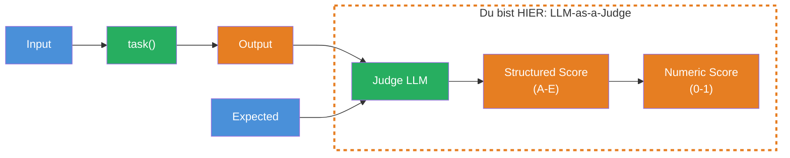
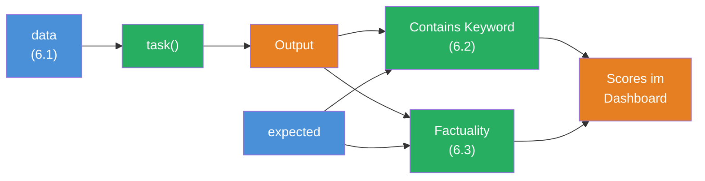

## THINK

Wie bewertest Du, ob eine Zusammenfassung "gut" ist — wenn es keine eindeutig richtige Antwort gibt? "Paris" als Hauptstadt von Frankreich laesst sich mit `includes()` pruefen. Aber "Erklaere Machine Learning" hat tausend gueltige Antworten.

## OVERVIEW



Das Prinzip: Ein zweites LLM (der "Judge") bekommt den Output und den erwarteten Wert und bewertet, wie faktisch korrekt die Antwort ist. Das Ergebnis ist ein strukturierter Score mit einer Begruendung (Rationale).

## WHY

**Ohne LLM-as-Judge:** Du muesstest jede offene Antwort selbst lesen und bewerten. Bei 50 Test-Cases dauert das Stunden. Und bei jeder Prompt-Aenderung nochmal. Menschliche Bewertung skaliert nicht.

**Mit LLM-as-Judge:** Du definierst einmal, WAS "gut" bedeutet (eine Score-Skala), und das Judge-LLM bewertet automatisch. 50 Test-Cases in Sekunden statt Stunden. Nicht perfekt — aber gut genug, um Regressionen zu erkennen und Fortschritt zu messen.

## WALKTHROUGH

### Schicht 1: Das Problem mit offenen Antworten

Betrachte diesen Test-Case:

```typescript
{
  input: 'Erklaere was Machine Learning ist.',
  expected: 'Machine Learning ist ein Teilgebiet der KI, bei dem Algorithmen aus Daten lernen.',
}
```

Eine gueltige Antwort koennte sein:
- "ML ist ein Bereich der kuenstlichen Intelligenz, der statistische Methoden nutzt, um Muster in Daten zu erkennen."
- "Machine Learning ermoeglicht es Computern, aus Erfahrung zu lernen, ohne explizit programmiert zu werden."

Beide sind korrekt, aber keiner matcht den `expected`-Wert exakt. `Levenshtein` wuerde niedrige Scores geben. Ein LLM kann bewerten: "Inhaltlich deckungsgleich, nur anders formuliert."

### Schicht 2: Die Score-Skala

Der Factuality Scorer nutzt eine 5-stufige Skala:

| Grade | Bedeutung | Score | Beschreibung |
|-------|-----------|-------|-------------|
| **A** | Subset | 0.4 | Antwort ist eine Teilmenge der Expertenmeinung — korrekt, aber unvollstaendig |
| **B** | Superset | 0.6 | Antwort enthaelt alles aus der Expertenmeinung plus Zusaetzliches — korrekt und ausfuehrlicher |
| **C** | Identical | 1.0 | Antwort und Expertenmeinung sind inhaltlich identisch |
| **D** | Conflict | 0.0 | Antwort widerspricht der Expertenmeinung — faktisch falsch |
| **E** | Irrelevant | 0.0 | Antwort hat nichts mit der Frage zu tun |

Die Skala erlaubt Abstufungen: Eine unvollstaendige Antwort (A: 0.4) ist besser als eine falsche (D: 0.0), aber schlechter als eine perfekte (C: 1.0).

### Schicht 3: Der Factuality Scorer — Schritt fuer Schritt

Der Scorer nutzt `generateObject` aus dem AI SDK, um eine strukturierte Bewertung vom Judge-LLM zu bekommen:

```typescript
import { createScorer } from 'evalite';
import { generateObject } from 'ai';
import { openai } from '@ai-sdk/openai';
import { z } from 'zod';

const Factuality = createScorer<string, string, string>({
  name: 'Factuality',
  description: 'Bewertet faktische Korrektheit der Antwort im Vergleich zur Expertenantwort.',
  scorer: async ({ input, expected, output }) => {
    // 1. Das Judge-LLM bekommt Input, Expected und Output
    const { object } = await generateObject({
      model: openai('gpt-4o'),
      prompt: `You are comparing a submitted answer to an expert answer on a given question.

[BEGIN DATA]
[Question]: ${input}
[Expert]: ${expected}
[Submission]: ${output}
[END DATA]

Compare the factual content of the submitted answer with the expert answer.
Ignore differences in style, grammar, or punctuation.
Select one:
(A) The submission is a subset of the expert answer and is fully consistent with it.
(B) The submission is a superset of the expert answer and is fully consistent with it.
(C) The submission contains all the same details as the expert answer.
(D) There is a disagreement between the submission and the expert answer.
(E) The answers differ, but these differences don't matter from the perspective of factuality.`,
      schema: z.object({
        answer: z.enum(['A', 'B', 'C', 'D', 'E']),  // ← Strukturierte Antwort
        rationale: z.string(),                         // ← Begruendung
      }),
    });

    // 2. Grade in numerischen Score umrechnen
    const scores: Record<string, number> = {
      A: 0.4,  // Subset — korrekt, aber unvollstaendig
      B: 0.6,  // Superset — korrekt und ausfuehrlicher
      C: 1.0,  // Identical — perfekt
      D: 0.0,  // Conflict — falsch
      E: 1.0,  // Irrelevant diff — Unterschiede egal
    };

    // 3. Score + Metadata zurueckgeben
    return {
      score: scores[object.answer],
      metadata: {
        rationale: object.rationale,  // ← Nachvollziehbarkeit!
        grade: object.answer,
      },
    };
  },
});
```

**Drei kritische Punkte:**
1. `generateObject` mit Zod Schema erzwingt eine strukturierte Antwort — kein Freitext-Parsing noetig
2. Die `rationale` gibt Dir Nachvollziehbarkeit — Du siehst, WARUM der Judge so bewertet hat
3. Die Score-Zuordnung (A→0.4, B→0.6, etc.) bildet die inhaltliche Bewertung auf einen numerischen Wert ab

### Schicht 4: Factuality Scorer einsetzen

```typescript
import { evalite } from 'evalite';
import { traceAISDKModel } from 'evalite/ai-sdk';
import { generateText } from 'ai';
import { openai } from '@ai-sdk/openai';

evalite('Knowledge Check', {
  data: async () => [
    {
      input: 'What is TypeScript?',
      expected: 'TypeScript is a typed superset of JavaScript that compiles to plain JavaScript.',
    },
    {
      input: 'What is the difference between let and const?',
      expected: 'let allows reassignment, const does not. Both are block-scoped.',
    },
  ],
  task: async (input) => {
    const result = await generateText({
      model: traceAISDKModel(openai('gpt-4o-mini')),
      system: 'Answer technical questions concisely in one sentence.',
      prompt: input,
    });
    return result.text;
  },
  scorers: [Factuality],
});
```

Im Dashboard siehst Du jetzt pro Test-Case den Factuality-Score UND die Rationale des Judges. Wenn ein Score niedrig ist, liest Du die Begruendung und verstehst, was schiefgelaufen ist.

### Schicht 5: Kosten und Trade-offs

LLM-as-Judge ist maechtig, aber nicht kostenlos:

| Aspekt | Deterministic | LLM-as-Judge |
|--------|--------------|--------------|
| **Geschwindigkeit** | Mikrosekunden | Sekunden |
| **Kosten** | 0 | Tokens pro Bewertung |
| **Reproduzierbarkeit** | 100% identisch | ~95% konsistent |
| **Flexibilitaet** | Nur exakte Checks | Offene Bewertungen |

**Faustregel:** Wenn Du die Bewertung als `if`-Statement schreiben kannst, nimm einen deterministischen Scorer. Wenn nicht, nimm LLM-as-Judge.

## TRY

**Aufgabe:** Baue einen Factuality Scorer und teste ihn mit korrekten und inkorrekten Antworten.

```typescript
// factuality.eval.ts

import { evalite } from 'evalite';
import { createScorer } from 'evalite';
import { generateObject } from 'ai';
import { openai } from '@ai-sdk/openai';
import { z } from 'zod';

// TODO 1: Implementiere den Factuality Scorer mit createScorer
//   - Nutze generateObject mit dem Prompt aus dem Walkthrough
//   - Schema: { answer: z.enum(['A','B','C','D','E']), rationale: z.string() }
//   - Mappe die Grades auf Scores: A→0.4, B→0.6, C→1.0, D→0.0, E→1.0
//   - Gib { score, metadata: { rationale, grade } } zurueck

// TODO 2: Erstelle eine evalite() mit dem Namen 'Factuality Test'
//   - data: 3 Test-Cases — eine korrekte, eine teilweise richtige,
//     eine falsche Antwort (als simulierte task)
//   - scorers: [Factuality]

// TODO 3: Pruefe im Dashboard die Rationale des Judges
//   - Stimmt die Begruendung? Ist sie nachvollziehbar?
```

**Checkliste:**
- [ ] Factuality Scorer mit `createScorer` implementiert
- [ ] `generateObject` mit Zod Schema fuer strukturierte Bewertung
- [ ] Score-Mapping (A-E → 0-1) implementiert
- [ ] `metadata` mit `rationale` zurueckgegeben
- [ ] Mindestens 3 Test-Cases mit unterschiedlicher Qualitaet

<details>
<summary>Loesung anzeigen</summary>

```typescript
// factuality.eval.ts

import { evalite } from 'evalite';
import { createScorer } from 'evalite';
import { generateObject } from 'ai';
import { openai } from '@ai-sdk/openai';
import { z } from 'zod';

const Factuality = createScorer<string, string, string>({
  name: 'Factuality',
  description: 'Bewertet faktische Korrektheit mit LLM-as-Judge.',
  scorer: async ({ input, expected, output }) => {
    const { object } = await generateObject({
      model: openai('gpt-4o'),
      prompt: `You are comparing a submitted answer to an expert answer on a given question.

[BEGIN DATA]
[Question]: ${input}
[Expert]: ${expected}
[Submission]: ${output}
[END DATA]

Compare the factual content of the submitted answer with the expert answer.
Ignore differences in style, grammar, or punctuation.
Select one:
(A) The submission is a subset of the expert answer and is fully consistent with it.
(B) The submission is a superset of the expert answer and is fully consistent with it.
(C) The submission contains all the same details as the expert answer.
(D) There is a disagreement between the submission and the expert answer.
(E) The answers differ, but these differences don't matter from the perspective of factuality.`,
      schema: z.object({
        answer: z.enum(['A', 'B', 'C', 'D', 'E']),
        rationale: z.string(),
      }),
    });

    const scores: Record<string, number> = { A: 0.4, B: 0.6, C: 1.0, D: 0.0, E: 1.0 };
    return {
      score: scores[object.answer],
      metadata: { rationale: object.rationale, grade: object.answer },
    };
  },
});

evalite('Factuality Test', {
  data: async () => [
    {
      input: 'What is the capital of France?',
      expected: 'Paris is the capital of France.',
    },
    {
      input: 'What is TypeScript?',
      expected: 'TypeScript is a typed superset of JavaScript that compiles to plain JavaScript.',
    },
    {
      input: 'What is the speed of light?',
      expected: 'The speed of light is approximately 300,000 km/s.',
    },
  ],
  task: async (input) => {
    // Simulierte Antworten mit unterschiedlicher Qualitaet
    const answers: Record<string, string> = {
      'What is the capital of France?': 'The capital of France is Paris.',         // ← Korrekt (C)
      'What is TypeScript?': 'TypeScript adds types to JavaScript.',               // ← Teilweise (A)
      'What is the speed of light?': 'The speed of light is 500,000 km/s.',       // ← Falsch (D)
    };
    return answers[input] ?? 'I do not know.';
  },
  scorers: [Factuality],
});
```

**Erklaerung:** Die drei Test-Cases decken verschiedene Qualitaetsstufen ab:
- "The capital of France is Paris." → Grade C (1.0) — inhaltlich identisch
- "TypeScript adds types to JavaScript." → Grade A (0.4) — korrekt, aber unvollstaendig (fehlt "compiles to plain JavaScript")
- "The speed of light is 500,000 km/s." → Grade D (0.0) — faktisch falsch

Im Dashboard siehst Du die Rationale, die erklaert, warum der Judge so entschieden hat.

</details>

## COMBINE



**Uebung:** Kombiniere einen deterministischen Scorer (Challenge 6.2) mit dem Factuality Scorer (Challenge 6.3) in einer Eval. Teste mit einem echten LLM-Call.

1. Erstelle eine Eval mit 5 Wissensfragen (z.B. Programmierkonzepte)
2. Nutze `generateText` mit `traceAISDKModel` als `task`
3. Scorer: `containsKeyword` (aus 6.2) UND `Factuality` (aus 6.3)
4. Vergleiche im Dashboard: Wo stimmen beide Scorer ueberein? Wo nicht?

**Frage zum Nachdenken:** Gibt es Faelle, wo `containsKeyword` eine 1 gibt, aber `Factuality` eine 0? Und umgekehrt?

## Quellen

- [Evalite: Custom Scorers](https://github.com/mattpocock/evalite)
- [Braintrust: Autoevals](https://github.com/braintrustdata/autoevals)
- [ai-hero-dev Exercise 06.03](https://github.com/ai-hero-dev/ai-sdk-v6-crash-course/tree/main/exercises/06-evals/06.03-llm-as-a-judge)
