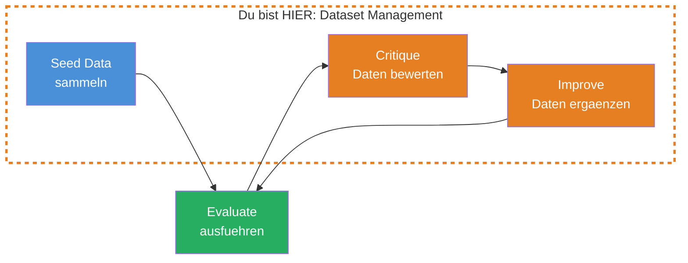
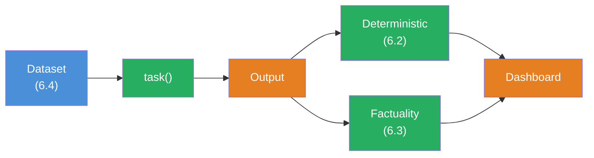

## THINK

Wie viele Test-Cases brauchst Du — und woher weisst Du, ob sie gut genug sind? 3 Beispiele, die alle aehnlich aussehen, testen nur den Normalfall. Was passiert mit Edge Cases, unerwarteten Inputs oder leeren Eingaben?

## OVERVIEW



Dataset Management ist ein Zyklus: Du sammelst Seed-Daten, fuehrst Evals aus, bewertest die Qualitaet Deiner Test-Daten, ergaenzt fehlende Faelle und evaluierst erneut. Die Daten werden mit jedem Durchlauf besser.

## WHY

**Ohne gute Datasets:** Deine Evals messen das Falsche. 5 Test-Cases, die alle aus der gleichen Kategorie stammen, geben Dir false confidence. Der Score sagt 0.95 — aber bei einem Edge Case halluziniert das LLM. Du merkst es nicht, weil der Edge Case nicht im Dataset ist.

**Mit guten Datasets:** 20-50 diverse Test-Cases decken Normalfaelle, Edge Cases und Grenzfaelle ab. Wenn der Score 0.85 sagt, weisst Du, dass er repraesentativ ist. Du erkennst Schwaechen frueh und kannst gezielt verbessern.

## WALKTHROUGH

### Schicht 1: Dataset als async Function

In Evalite kannst Du `data` als async Function definieren. Das erlaubt dynamisches Laden — aus Dateien, APIs oder Datenbanken:

```typescript
import { evalite } from 'evalite';

evalite('Chat Titles', {
  data: async () => {
    // Kann aus einer JSON-Datei laden, API anfragen, etc.
    return [
      {
        input: 'Hey, ich brauche Hilfe mit TypeScript Generics.',
        expected: 'TypeScript Generics',
      },
      {
        input: 'Wie konfiguriere ich ESLint fuer ein React-Projekt?',
        expected: 'ESLint React Setup',
      },
    ];
  },
  task: async (input) => { /* ... */ return ''; },
  scorers: [],
});
```

Die async Function wird bei jedem Eval-Lauf aufgerufen. So kannst Du Test-Daten aus externen Quellen laden, ohne sie hart zu kodieren.

### Schicht 2: Dataset-Groesse und Diversitaet

Wie viele Test-Cases brauchst Du? Die Faustregel:

| Phase | Anzahl | Zweck |
|-------|--------|-------|
| **Prototyp** | 5-10 | Schnelles Feedback, grundlegende Funktion pruefen |
| **Entwicklung** | 20-50 | Repraesentative Abdeckung, Edge Cases einbeziehen |
| **Production** | 50-200+ | Statistisch aussagekraeftig, alle Kategorien abgedeckt |

Wichtiger als die Anzahl ist die **Diversitaet**. 50 aehnliche Test-Cases sind weniger wert als 20 diverse:

```typescript
data: async () => [
  // Normalfaelle
  { input: 'Erklaere React Hooks.', expected: 'React Hooks' },
  { input: 'Wie funktioniert async/await?', expected: 'Async/Await in JavaScript' },

  // Kurze Inputs
  { input: 'TypeScript?', expected: 'TypeScript' },
  { input: 'hilfe', expected: 'Allgemeine Hilfe' },

  // Lange Inputs
  { input: 'Ich habe ein Problem mit meinem Next.js Projekt. Wenn ich versuche, eine API Route zu erstellen, bekomme ich einen 500 Error. Der Server startet, aber die Route antwortet nicht. Ich nutze die App Router Architektur.', expected: 'Next.js API Route Error' },

  // Mehrdeutige Inputs
  { input: 'Das funktioniert nicht', expected: 'Fehlerbehebung' },
  { input: 'Kannst du das nochmal machen?', expected: 'Wiederholung' },

  // Sonderzeichen und Formatierung
  { input: 'Was ist O(n log n)?', expected: 'Algorithmus-Komplexitaet' },
  { input: 'Unterschied: map() vs forEach()?', expected: 'Array-Methoden Vergleich' },

  // Leere oder triviale Inputs
  { input: '', expected: 'Leere Eingabe' },
  { input: '   ', expected: 'Leere Eingabe' },
],
```

### Schicht 3: Kategorien systematisch abdecken

Definiere Kategorien fuer Dein Dataset und stelle sicher, dass jede abgedeckt ist:

```typescript
// Dataset-Kategorien fuer einen Chat-Title-Generator
const categories = {
  technical: [
    { input: 'Wie funktioniert Git Rebase?', expected: 'Git Rebase' },
    { input: 'Was ist ein Docker Container?', expected: 'Docker Container' },
  ],
  conversational: [
    { input: 'Hey, ich brauche Hilfe!', expected: 'Hilfe-Anfrage' },
    { input: 'Danke, das hat geholfen.', expected: 'Feedback' },
  ],
  edgeCases: [
    { input: '', expected: 'Leere Eingabe' },
    { input: 'a', expected: 'Einzelzeichen' },
    { input: '🚀🔥💡', expected: 'Emoji-Eingabe' },
  ],
  multilingual: [
    { input: 'Comment faire du café?', expected: 'Kaffee-Frage (FR)' },
    { input: 'What is the meaning of life?', expected: 'Sinnfrage (EN)' },
  ],
};

evalite('Chat Titles', {
  data: async () => [
    ...categories.technical,
    ...categories.conversational,
    ...categories.edgeCases,
    ...categories.multilingual,
  ],
  task: async (input) => { /* ... */ return ''; },
  scorers: [],
});
```

### Schicht 4: Dataset Critiquing

Eine fortgeschrittene Technik: Lass ein LLM die Qualitaet Deiner Test-Daten bewerten. "Sind meine Test-Cases repraesentativ genug? Welche Faelle fehlen?"

```typescript
import { generateObject } from 'ai';
import { openai } from '@ai-sdk/openai';
import { z } from 'zod';

async function critiqueDataset(
  dataset: Array<{ input: string; expected: string }>
) {
  const { object } = await generateObject({
    model: openai('gpt-4o'),
    prompt: `You are a QA expert reviewing a test dataset for a chat title generator.
The system takes a user message as input and generates a short title.

Here is the current dataset:
${JSON.stringify(dataset, null, 2)}

Analyze the dataset for:
1. Coverage: Are important categories missing?
2. Edge cases: Are boundary conditions tested?
3. Diversity: Are the inputs diverse enough?
4. Quality: Are the expected values reasonable?

Suggest specific test cases that should be added.`,
    schema: z.object({
      overallAssessment: z.string(),
      missingCategories: z.array(z.string()),
      suggestedTestCases: z.array(z.object({
        input: z.string(),
        expected: z.string(),
        reason: z.string(),
      })),
      qualityScore: z.number().min(0).max(1),
    }),
  });

  return object;
}
```

Das Ergebnis sagt Dir, welche Kategorien fehlen und schlaegt konkrete Test-Cases vor. Du pruefst die Vorschlaege, uebernimmst die sinnvollen und fuehrst die Evals erneut aus.

### Schicht 5: Dataset versionieren

Dein Dataset aendert sich ueber die Zeit. Versioniere es wie Code:

```typescript
// datasets/chat-titles-v1.ts
export const chatTitleDataset = [
  { input: 'Erklaere React Hooks.', expected: 'React Hooks' },
  // ...
];

// Versionsinformation
export const datasetMeta = {
  version: '1.0',
  lastUpdated: '2026-03-08',
  totalCases: 25,
  categories: ['technical', 'conversational', 'edgeCases'],
};
```

```typescript
// chat-titles.eval.ts
import { evalite } from 'evalite';
import { chatTitleDataset } from './datasets/chat-titles-v1';

evalite('Chat Titles', {
  data: async () => chatTitleDataset,
  task: async (input) => { /* ... */ return ''; },
  scorers: [],
});
```

So kannst Du spaeter vergleichen: Hat sich der Score mit Dataset v2 veraendert?

## TRY

**Aufgabe:** Erstelle ein Dataset fuer einen Chat-Title-Generator mit mindestens 15 Test-Cases aus verschiedenen Kategorien.

Erstelle die Datei `dataset.eval.ts` und fuehre sie mit `pnpm eval:dev` aus.

```typescript
// dataset.eval.ts

import { evalite } from 'evalite';
import { Levenshtein } from 'autoevals';

// TODO 1: Erstelle ein Dataset mit mindestens 15 Test-Cases
//   Kategorien:
//   - Technical (mind. 4 Cases)
//   - Conversational (mind. 3 Cases)
//   - Edge Cases (mind. 3 Cases): leere Strings, Sonderzeichen, sehr lange Inputs
//   - Multilingual (mind. 2 Cases)
//   - Mehrdeutig (mind. 3 Cases)

// TODO 2: Definiere eine evalite() mit:
//   - data: Dein Dataset
//   - task: Simulierte Titel-Generierung (z.B. die ersten 5 Woerter des Inputs)
//   - scorers: [Levenshtein]

// TODO 3: Ueberlege: Welche Kategorien fehlen noch?
//   Welche Edge Cases hast Du nicht abgedeckt?
```

**Checkliste:**
- [ ] Mindestens 15 Test-Cases
- [ ] Mindestens 4 verschiedene Kategorien
- [ ] Edge Cases enthalten (leerer Input, Sonderzeichen, langer Input)
- [ ] Expected-Werte sind realistische Titel (kurz, beschreibend)
- [ ] Keine doppelten oder fast identischen Test-Cases

<details>
<summary>Loesung anzeigen</summary>

```typescript
// chat-title-dataset.eval.ts

import { evalite } from 'evalite';
import { Levenshtein } from 'autoevals';

const chatTitleDataset = [
  // Technical (5)
  { input: 'Wie funktioniert Git Rebase?', expected: 'Git Rebase' },
  { input: 'Erklaere mir React useEffect mit Cleanup.', expected: 'React useEffect Cleanup' },
  { input: 'Was ist der Unterschied zwischen REST und GraphQL?', expected: 'REST vs GraphQL' },
  { input: 'Hilfe bei TypeScript Generics mit mehreren Constraints.', expected: 'TypeScript Generics' },
  { input: 'Docker Container startet nicht — Port schon belegt.', expected: 'Docker Port-Konflikt' },

  // Conversational (3)
  { input: 'Hey, kannst du mir helfen?', expected: 'Hilfe-Anfrage' },
  { input: 'Danke, das hat super funktioniert!', expected: 'Positives Feedback' },
  { input: 'Ich verstehe das nicht, kannst du es nochmal erklaeren?', expected: 'Erklaerung wiederholen' },

  // Edge Cases (4)
  { input: '', expected: 'Leere Nachricht' },
  { input: '???', expected: 'Unklare Anfrage' },
  { input: 'a', expected: 'Minimale Eingabe' },
  { input: 'Ich habe ein wirklich kompliziertes Problem mit meinem Next.js Projekt das den App Router verwendet und bei dem die API Routes nicht funktionieren weil der Server einen 500 Error zurueckgibt wenn ich versuche eine POST Request zu senden mit einem JSON Body der verschachtelte Objekte enthaelt und TypeScript Fehler wirft.', expected: 'Next.js API Route Error' },

  // Multilingual (2)
  { input: 'How do I deploy to Vercel?', expected: 'Vercel Deployment' },
  { input: 'Comment configurer ESLint?', expected: 'ESLint Konfiguration' },

  // Mehrdeutig (3)
  { input: 'Das funktioniert nicht.', expected: 'Fehlerbehebung' },
  { input: 'Mach das nochmal.', expected: 'Wiederholung' },
  { input: 'Weiter.', expected: 'Fortsetzung' },
];

evalite('Chat Titles', {
  data: async () => chatTitleDataset,
  task: async (input) => {
    // Simulierte Titel-Generierung: Erste 5 Woerter oder Fallback
    if (!input.trim()) return 'Leere Nachricht';
    const words = input.split(' ').slice(0, 5).join(' ');
    return words.length > 50 ? words.slice(0, 50) : words;
  },
  scorers: [Levenshtein],
});
```

**Erklaerung:** Die Levenshtein-Scores werden niedrig sein, weil die simulierte `task` nur die ersten 5 Woerter nimmt — nicht den idealen Titel. Das ist der Punkt: Mit dem Dataset siehst Du, WO die Task versagt, und kannst iterativ verbessern. Fehlende Kategorien koennten sein: Code-Snippets als Input, URLs, Fragen in Nicht-Lateinischen Schriften.

</details>

## COMBINE



**Uebung:** Nutze Dein Chat-Title-Dataset (6.4) mit den Scorern aus Challenge 6.2 und 6.3.

1. Nimm Dein Dataset aus der TRY-Uebung
2. Fuelle die `task` mit einem echten LLM-Call (System Prompt: "Generate a short, descriptive title for this chat message. Max 50 characters. Only the title, nothing else.")
3. Scorer 1: `containsKeyword` (aus 6.2) — enthaelt der Titel ein Schluesselwort?
4. Scorer 2: `Factuality` (aus 6.3) — ist der Titel inhaltlich passend?
5. Pruefe: Bei welchen Kategorien versagt die `task`?

**Optional Stretch Goal:** Fuehre `critiqueDataset` aus Schicht 4 auf Dein Dataset aus. Uebernimm 3 der vorgeschlagenen Test-Cases und vergleiche die Scores vorher/nachher.

## Quellen

- [Evalite: Data](https://github.com/mattpocock/evalite)
- [ai-hero-dev Exercise 06.04](https://github.com/ai-hero-dev/ai-sdk-v6-crash-course/tree/main/exercises/06-evals/06.04-dataset-management)
- [ai-hero-dev Exercise 06.06](https://github.com/ai-hero-dev/ai-sdk-v6-crash-course/tree/main/exercises/06-evals/06.06-critiquing-datasets)
