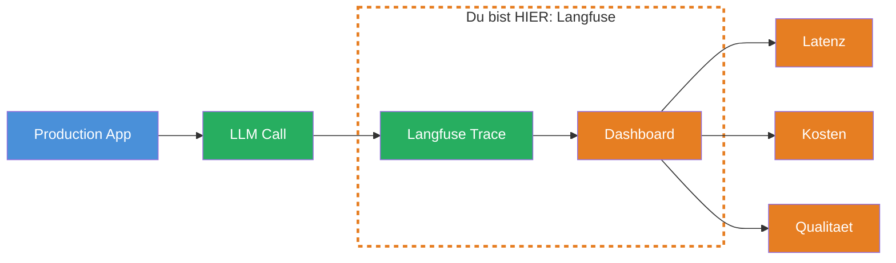
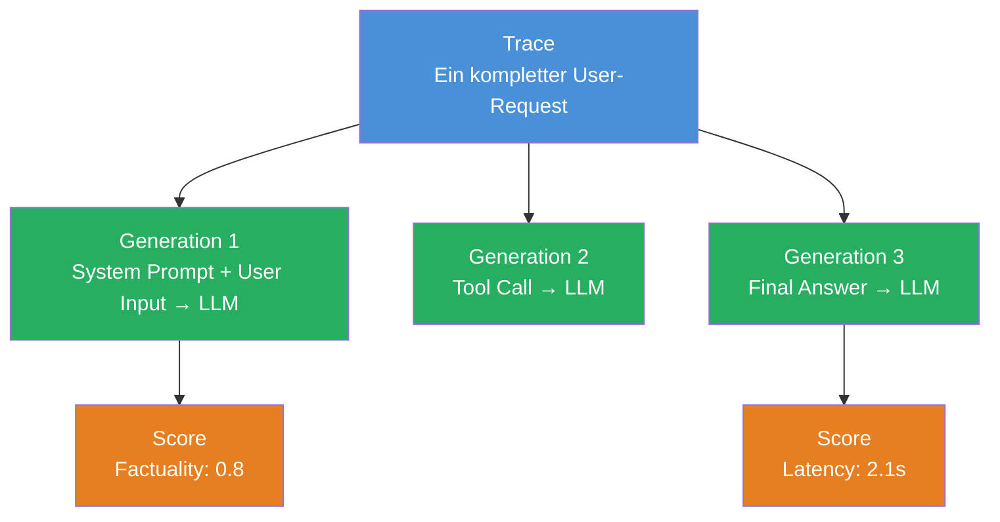
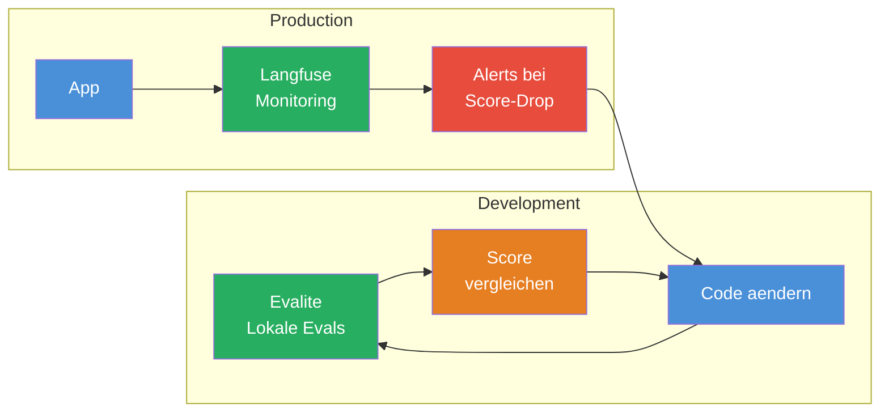
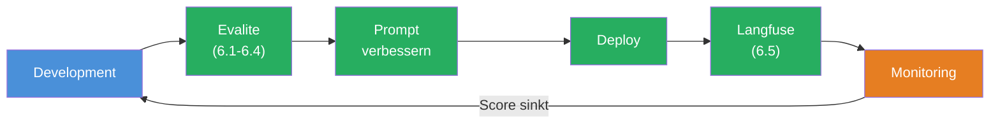

## THINK

Deine Evals laufen lokal — aber was passiert mit LLM-Calls in Production? Wie merkst Du, dass Dein System langsamer wird, die Kosten explodieren oder die Qualitaet sinkt — bevor ein User sich beschwert?

## OVERVIEW



Langfuse ist ein Open-Source Observability-Tool fuer LLM-Anwendungen. Es erfasst jeden LLM-Call in Production und zeigt Dir Latenz, Token-Kosten und Qualitaet in einem Dashboard. Wie Datadog oder Sentry — aber speziell fuer LLMs.

## WHY

**Ohne Observability:** Dein LLM-System laeuft in Production. Ein User meldet: "Die Antworten sind schlecht." Du schaust in die Logs — nichts. Du weisst nicht, welcher Prompt gesendet wurde, wie das LLM geantwortet hat, oder wie viel es gekostet hat. Du bist blind.

**Mit Observability:** Du oeffnest das Langfuse Dashboard und siehst: Trace #4721, Prompt "Erklaere X", Antwort "...", Latenz 3.2s, Kosten $0.003, Score 0.4. Du siehst sofort, wo das Problem liegt — und kannst es im Eval nachstellen.

## WALKTHROUGH

### Schicht 1: Langfuse Kernkonzepte

Langfuse organisiert Daten in drei Ebenen:



| Konzept | Was | Beispiel |
|---------|-----|---------|
| **Trace** | Ein kompletter Request-Lifecycle | User fragt "Was ist TypeScript?" → Antwort |
| **Generation** | Ein einzelner LLM-Call innerhalb eines Trace | `generateText({ prompt: '...' })` |
| **Score** | Eine Bewertung eines Trace oder einer Generation | Factuality: 0.8, Latenz: 2.1s |
| **Span** | Ein beliebiger Code-Abschnitt (nicht-LLM) | Datenbank-Query, Retrieval-Schritt |

Ein Trace kann mehrere Generations enthalten — zum Beispiel bei einem Agent, der mehrere Tool Calls macht (Level 3).

### Schicht 2: Was Langfuse erfasst

Pro Generation speichert Langfuse:

```typescript
// Das erfasst Langfuse automatisch bei jedem LLM-Call:
{
  // Input
  model: 'gpt-4o',
  input: {
    system: 'Du bist ein hilfreicher Assistent.',
    messages: [{ role: 'user', content: 'Was ist TypeScript?' }],
  },

  // Output
  output: 'TypeScript ist eine typisierte Erweiterung von JavaScript...',

  // Metriken
  usage: {
    promptTokens: 42,
    completionTokens: 128,
    totalTokens: 170,
  },
  latency: 1842,       // ms
  cost: 0.00085,        // USD (berechnet aus Token-Preisen)

  // Metadata
  traceId: 'trace_abc123',
  timestamp: '2026-03-08T14:30:00Z',
}
```

### Schicht 3: Integration mit dem AI SDK

Langfuse bietet zwei Integrationswege: Die empfohlene **OpenTelemetry-basierte Variante** (`LangfuseExporter`) und die manuelle SDK-Variante. Der folgende Code zeigt die manuelle Variante, um die Konzepte (Trace, Generation, Score) explizit zu machen. In Production wuerdest Du die OTel-Integration nutzen — sie erfasst AI SDK Calls automatisch ohne manuelles Logging.

```typescript
import { Langfuse } from 'langfuse';

// 1. Langfuse Client initialisieren
const langfuse = new Langfuse({
  publicKey: process.env.LANGFUSE_PUBLIC_KEY,
  secretKey: process.env.LANGFUSE_SECRET_KEY,
  baseUrl: 'https://cloud.langfuse.com',  // oder self-hosted URL
});

// 2. Trace erstellen
const trace = langfuse.trace({
  name: 'chat-completion',
  userId: 'user_123',
  metadata: { feature: 'chat-titles' },
});

// 3. Generation loggen
const generation = trace.generation({
  name: 'generate-title',
  model: 'gpt-4o-mini',
  input: { prompt: 'Generate a title for: ...' },
});

// 4. Nach dem LLM-Call: Output und Metriken loggen
generation.end({
  output: 'TypeScript Generics erklaert',
  usage: { promptTokens: 42, completionTokens: 8 },
});

// 5. Optional: Score hinzufuegen
trace.score({
  name: 'title-quality',
  value: 0.85,
  comment: 'Title is concise and relevant.',
});

// 6. Am Ende: Flush (wichtig bei serverless/Edge!)
await langfuse.flushAsync();
```

**Wichtig:** In serverless Environments (Vercel, Cloudflare Workers) musst Du `flushAsync()` aufrufen, bevor die Funktion beendet wird. Sonst gehen Traces verloren.

### Schicht 4: Dashboard-Features

Das Langfuse Dashboard bietet:

| Feature | Was Du siehst |
|---------|--------------|
| **Traces** | Alle Requests mit Timeline — klicke rein fuer Details |
| **Generations** | Jeder LLM-Call mit Input, Output, Tokens, Latenz |
| **Scores** | Durchschnittliche Qualitaet ueber die Zeit |
| **Cost Analytics** | Token-Verbrauch und Kosten pro Tag, Modell, Feature |
| **Latency Distribution** | P50, P95, P99 Latenzen — wo sind Deine Bottlenecks? |
| **User Analytics** | Welche User generieren die meisten Costs? |

### Schicht 5: Evalite vs. Langfuse

Evalite und Langfuse sind komplementaer — sie decken verschiedene Phasen ab:



| Aspekt | Evalite | Langfuse |
|--------|---------|---------|
| **Wann** | Entwicklung, CI/CD | Production |
| **Wo** | Lokal, deine Maschine | Cloud oder self-hosted |
| **Was** | Definierte Test-Cases mit bekanntem Expected | Echte User-Requests |
| **Zweck** | Prompt-Iteration, Regression-Detection | Monitoring, Debugging, Kosten-Kontrolle |
| **Daten** | Dein Dataset | Echte Production-Daten |

**Der Workflow:** Du iterierst mit Evalite (lokal), bis der Score gut genug ist. Dann deployest Du. Langfuse ueberwacht in Production. Wenn die Scores dort sinken, gehst Du zurueck zu Evalite und fixst das Problem.

## TRY

**Aufgabe:** Mache Dich mit den Langfuse-Konzepten vertraut — Traces, Generations, Scores.

1. Gehe zu [langfuse.com](https://langfuse.com) und erstelle einen kostenlosen Account
2. Erkunde das Demo-Projekt im Dashboard:
   - Oeffne einen Trace und folge dem Request-Lifecycle
   - Schau Dir die Generation-Details an: Input, Output, Tokens, Latenz
   - Finde die Cost Analytics: Welches Modell kostet am meisten?
3. Beantworte fuer Dich:
   - Was ist der Unterschied zwischen einem Trace und einer Generation?
   - Wo wuerdest Du einen Score hinzufuegen — am Trace oder an der Generation?
   - Wann wuerdest Du einen Alert einrichten?

**Checkliste:**
- [ ] Langfuse Account erstellt (oder Demo-Projekt angeschaut)
- [ ] Einen Trace im Dashboard geoeffnet und verstanden
- [ ] Unterschied Trace vs. Generation erklaert
- [ ] Cost Analytics gefunden und interpretiert
- [ ] Eigene Notizen: Wo wuerdest Du Langfuse in Deinem Projekt einsetzen?

<details>
<summary>Hinweis: Kein Coding in dieser Challenge</summary>

Diese Challenge ist bewusst konzeptuell. Die Integration von Langfuse mit dem AI SDK erfordert OpenTelemetry-Setup, das je nach Hosting-Environment (Node.js, Vercel, Cloudflare) unterschiedlich ist. Der Fokus liegt hier auf dem Verstaendnis der Konzepte — die praktische Integration kommt, wenn Du Dein erstes Projekt in Production deployest.

Falls Du trotzdem hands-on arbeiten willst: Langfuse bietet ein [Quickstart-Guide](https://langfuse.com/docs/get-started) mit dem Du einen lokalen Trace in unter 5 Minuten erstellen kannst.

</details>

## COMBINE



**Uebung:** Zeichne fuer Dich den Eval-Driven Development Workflow auf:

1. Du hast einen Chat-Title-Generator (aus den vorherigen Challenges)
2. Wie wuerdest Du den Evalite-Langfuse Workflow aufsetzen?
   - Wann laeuft Evalite? (lokal, CI/CD)
   - Wann laeuft Langfuse? (Production)
   - Was passiert, wenn ein Langfuse-Alert feuert?
3. Ueberlege: Welche Scores wuerdest Du in Production tracken?
   - Latenz? Kosten pro Request? Titel-Qualitaet?

**Frage zum Nachdenken:** Langfuse erfasst echte User-Requests. Koennte man diese Daten automatisch in das Evalite-Dataset zurueckfuehren, um die Test-Daten zu verbessern?

:::note[Alternativen zu Langfuse]
Neben Langfuse gibt es weitere Observability-Tools fuer LLM-Anwendungen, z.B. [Braintrust](https://braintrust.dev), [LangSmith](https://smith.langchain.com) oder [Weights & Biases Weave](https://wandb.ai/site/weave). Die Konzepte (Traces, Spans, Scores) sind aehnlich — wenn Du eines verstehst, findest Du Dich in den anderen schnell zurecht.
:::

## Quellen

- [Langfuse: Docs Overview](https://langfuse.com/docs)
- [Langfuse: Get Started](https://langfuse.com/docs/get-started)
- [Langfuse: Evaluation Overview](https://langfuse.com/docs/evaluation/overview)
- [Langfuse: AI SDK Integration](https://langfuse.com/docs/integrations/vercel-ai-sdk)
- [ai-hero-dev Exercise 06.07](https://github.com/ai-hero-dev/ai-sdk-v6-crash-course/tree/main/exercises/06-evals/06.07-langfuse)
