## Was Du gelernt hast

- **Evalite Basics:** Das TypeScript-native Eval-Framework mit `data`, `task` und `scorers` — `.eval.ts` Dateien, `traceAISDKModel` fuer AI SDK Integration, Dashboard unter localhost:3006
- **Deterministic Eval:** Schnelle, guenstige Scorer ohne LLM — Inline Scorer, `createScorer` fuer Wiederverwendbarkeit, Levenshtein aus der Autoevals Library, abgestufte Scores (0-1)
- **LLM-as-a-Judge:** Ein LLM bewertet die Ausgabe eines anderen — Factuality Scorer mit `generateObject` und Zod Schema, Score-Skala (A-E), Rationale fuer Nachvollziehbarkeit
- **Dataset Management:** Repraesentative, diverse Test-Daten mit 20-50 Cases fuer die Entwicklung — Kategorien systematisch abdecken, Edge Cases einbeziehen, Dataset Critiquing mit LLM
- **Langfuse:** Production-Observability fuer LLM-Anwendungen — Traces, Generations, Scores, Kosten-Monitoring. Evalite fuer Development, Langfuse fuer Production

## Aktualisierter Skill Tree

```mermaid
graph LR
  subgraph "Freigeschaltet"
    L1["Level 1: AI SDK Basics"]
    L2["Level 2: LLM Fundamentals"]
    L3["Level 3: Agents & MCP"]
    L4["Level 4: Persistence"]
    L5["Level 5: Context Engineering"]
    L6["Level 6: Evals"]
  end
  subgraph NEXT["Naechstes Level"]
    L7["Level 7: Streaming"]
  end
  subgraph "Gesperrt"
    L8["Level 8: Workflows"]
    L9["Level 9: Advanced Patterns"]
  end
  L1 --> L2
  L2 --> L3
  L3 --> L4
  L4 --> L5
  L5 --> L6
  L6 --> L7
  L7 -.-> L8
  L8 -.-> L9
  style L1 fill:#27AE60,color:#fff
  style L2 fill:#27AE60,color:#fff
  style L3 fill:#27AE60,color:#fff
  style L4 fill:#27AE60,color:#fff
  style L5 fill:#27AE60,color:#fff
  style L6 fill:#27AE60,color:#fff
  style NEXT fill:none,stroke:#E67E22,stroke-width:3px,color:#E67E22
  style L7 fill:#E67E22,color:#fff
  style L8 fill:#95a5a6,color:#fff
  style L9 fill:#95a5a6,color:#fff
```

## Naechstes Level

**Level 7: Streaming** — Wie lieferst Du LLM-Antworten in Echtzeit an den User? Du lernst Stream Events, partielle Updates und wie Du Streaming-UIs baust, die sich anfuehlen, als wuerde das LLM live tippen.
