## TL;DR

> Fortgeschrittenes Streaming — Custom Data Parts, Message Metadata, Stream Transforms und Error Handling fuer Production-Apps. Du lernst, wie Du neben Text auch strukturierte Daten im Stream transportierst, Metadaten sauber vom LLM-Content trennst, stotternde Streams glaettest und Fehler abfaengst, ohne dass Deine App crasht.

## Skill Tree

```mermaid
graph LR
  subgraph "Freigeschaltet"
    L1["Level 1: AI SDK Basics"]
    L2["Level 2: LLM Fundamentals"]
    L3["Level 3: Agents & MCP"]
    L4["Level 4: Persistence"]
    L5["Level 5: Context Engineering"]
    L6["Level 6: Evals"]
  end
  subgraph HIER["Aktuelles Level"]
    L7["Level 7: Streaming"]
  end
  subgraph "Gesperrt"
    L8["Level 8: Workflows"]
    L9["Level 9: Advanced Patterns"]
  end
  L1 --> L2
  L2 --> L3
  L3 --> L4
  L4 --> L5
  L5 --> L6
  L6 --> L7
  L7 -.-> L8
  L8 -.-> L9
  style L1 fill:#27AE60,color:#fff
  style L2 fill:#27AE60,color:#fff
  style L3 fill:#27AE60,color:#fff
  style L4 fill:#27AE60,color:#fff
  style L5 fill:#27AE60,color:#fff
  style L6 fill:#27AE60,color:#fff
  style HIER fill:none,stroke:#E67E22,stroke-width:3px,stroke-dasharray:5 5
  style L7 fill:#E67E22,color:#fff
  style L8 fill:#95a5a6,color:#fff
  style L9 fill:#95a5a6,color:#fff
```

## Was Du lernst

- **Custom Data Parts** — strukturierte Daten parallel zum Text im Stream transportieren (Fortschrittsbalken, Status-Updates, Quellen)
- **Message Metadata** — zusaetzliche Informationen an Messages anhaengen, die das LLM nicht sieht
- **Stream Transforms** — stotternde Streams mit `smoothStream` glaetten und eigene Transforms schreiben
- **Error Handling** — Fehler im Stream abfangen, User-freundliche Meldungen und Retry-Strategien

## Warum das wichtig ist

In Level 1 hast Du `streamText` kennengelernt — Token fuer Token ins Terminal schreiben. Das reicht fuer Prototypen. In Production brauchst Du mehr: strukturierte Daten neben dem Text, saubere Metadaten-Trennung, fluessige Ausgabe und robuste Fehlerbehandlung.

Das konkrete Problem: Dein Stream liefert nur rohen Text. Aber Deine UI braucht Fortschrittsanzeigen, Quellenangaben und Status-Updates — und wenn der Provider mitten im Stream abstuerzt, sieht Dein User eine weisse Seite.

## Voraussetzungen

- **Level 1: AI SDK Basics** — insbesondere `streamText`, `textStream` und `fullStream` (Challenge 1.4)
- **TypeScript** — async/await, AsyncIterable, Generics
- **Grundverstaendnis von Web Streams** — `TransformStream`, `ReadableStream` (hilfreich, aber nicht zwingend)

> **Skip-Hinweis:** Du nutzt `smoothStream`, Custom Data Parts und `onError` bereits in Production? Spring direkt zur [Boss Fight](/de/level-7-streaming/06-boss-fight/) und teste Dein Wissen.

## Challenges

| # | Challenge | Konzept |
|---|-----------|---------|
| 7.1 | [Custom Data Parts](/de/level-7-streaming/02-custom-data-parts/) | Strukturierte Daten im Stream, Data Part Types, Frontend-Konsum |
| 7.2 | [Message Metadata](/de/level-7-streaming/03-message-metadata/) | Metadaten an Messages, Trennung von LLM-Content, Use Cases |
| 7.3 | [Stream Transforms](/de/level-7-streaming/04-stream-transforms/) | `smoothStream`, Custom TransformStream, Transform-Chains |
| 7.4 | [Error Handling](/de/level-7-streaming/05-error-handling/) | `onError`, NoSuchToolError, Retry-Strategien, Graceful Degradation |

## Boss Fight

Baue ein **Real-Time Dashboard**: Ein Streaming-System, das Custom Data Parts fuer Status-Updates sendet, Message Metadata fuer Session-Tracking nutzt, `smoothStream` fuer fluessige Ausgabe anwendet und Fehler graceful abfaengt — alles in einem Projekt.

## Quellen fuer dieses Level

- [Vercel AI SDK: Streaming](https://ai-sdk.dev/docs/ai-sdk-core/generating-text#streamtext)
- [Vercel AI SDK: Stream Helpers](https://ai-sdk.dev/docs/ai-sdk-core/stream-helpers)
- [Vercel Blog: AI SDK 6](https://vercel.com/blog/ai-sdk-6)
- [ai-hero-dev Exercises 07.01-07.04](https://github.com/ai-hero-dev/ai-sdk-v6-crash-course/tree/main/exercises/07-production-streaming)
