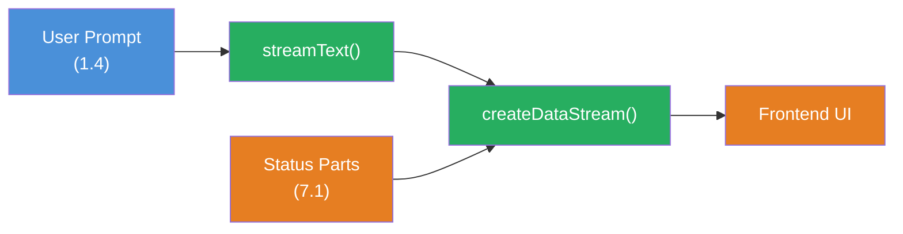

## THINK

Was wenn Du neben Text auch strukturierte Daten im Stream transportieren willst — z.B. einen Fortschrittsbalken, der anzeigt wie viele von 5 Recherche-Schritten abgeschlossen sind?

## OVERVIEW

```mermaid
sequenceDiagram
  participant Client as Frontend
  participant Server as API Route
  participant LLM as LLM Provider

  Client->>Server: POST /api/chat
  Server->>LLM: streamText()

  rect rgba(230, 126, 34, 0.1)
    Note over Server,LLM: Stream Events
    LLM-->>Server: text-delta: "Die Analyse"
    LLM-->>Server: text-delta: " zeigt..."
    Note over Server: custom-data: { progress: 1/3 }
    LLM-->>Server: text-delta: " Ergebnis:"
    Note over Server: custom-data: { progress: 2/3 }
    LLM-->>Server: text-delta: " fertig."
    Note over Server: custom-data: { progress: 3/3 }
  end

  subgraph HIER["Du bist HIER: Custom Data Parts"]
    Note over Client: UI rendert Text UND<br/>Fortschrittsbalken
  end

  Server-->>Client: UI Message Stream

  style HIER fill:none,stroke:#E67E22,stroke-width:3px,stroke-dasharray:5 5
```

Im Stream fliessen nicht nur Text-Chunks. Custom Data Parts lassen Dich strukturierte Daten — Fortschritt, Quellen, Status — parallel zum Text an das Frontend senden.

## WHY

**Ohne Custom Data Parts:** Dein Stream liefert nur Text. Wenn Du dem User Fortschritt, Quellen oder Status anzeigen willst, musst Du diese Informationen entweder in den Text einbetten (haesslich, schwer parsbar) oder ueber einen separaten Kanal senden (komplex, Race Conditions).

**Mit Custom Data Parts:** Strukturierte Daten fliessen im selben Stream wie der Text. Das Frontend bekommt typisierte Objekte und kann sie direkt in der UI rendern — Fortschrittsbalken, Quellenangaben, Status-Badges. Ein Stream, ein Kanal, alles synchron.

## WALKTHROUGH

### Schicht 1: Die Data Part Types

Jeder Chunk im `fullStream` hat einen `type`. Die wichtigsten Standard-Typen:

| Type | Beschreibung | Daten |
|------|-------------|-------|
| `text-delta` | Text-Chunk | `chunk.textDelta` |
| `reasoning` | Reasoning/Chain-of-Thought | `chunk.textDelta` |
| `source` | Quellenangabe | `chunk.source` |
| `tool-call` | Tool wird aufgerufen | `chunk.toolName`, `chunk.args` |
| `tool-result` | Tool-Ergebnis | `chunk.toolName`, `chunk.result` |
| `data` | Custom Data Part | `chunk.data` (beliebiges Objekt) |

Die ersten fuenf kennst Du teilweise aus Level 1 und 3. Der `data`-Type ist neu — damit sendest Du eigene strukturierte Daten.

### Schicht 2: Custom Data Parts senden

Du sendest Custom Data Parts ueber `sendDataPart` auf dem Stream-Result oder ueber die `onChunk`/`onStepFinish` Callbacks. Der einfachste Weg ist `mergeIntoDataStream` in Kombination mit `createDataStream`:

```typescript
import { createDataStream, streamText } from 'ai';

export async function POST(req: Request) {
  const { messages } = await req.json();

  const dataStream = createDataStream({
    execute(dataStream) {                             // ← dataStream Controller
      // Custom Data Part senden BEVOR der LLM-Stream startet
      dataStream.writeData({ status: 'searching' }); // ← Beliebiges JSON-Objekt

      const result = streamText({
        model: anthropic('claude-sonnet-4-5-20250514'),
        messages,
        onFinish() {
          dataStream.writeData({ status: 'done' });  // ← Nach Abschluss
        },
      });

      result.mergeIntoDataStream(dataStream);         // ← LLM-Stream einfuegen
    },
  });

  return dataStream.toDataStreamResponse();
}
```

`createDataStream` oeffnet einen Kanal, in den Du sowohl eigene Daten (`writeData`) als auch den LLM-Stream (`mergeIntoDataStream`) einspeisen kannst. Das Frontend bekommt alles in der richtigen Reihenfolge.

### Schicht 3: Custom Data Parts im Frontend konsumieren

> **Web-App Kontext:** Der folgende Code zeigt Custom Data Parts in einer Next.js/React App. Deine TRY-Uebung weiter unten arbeitet im Terminal (CLI).

Im Frontend empfaengst Du Custom Data Parts ueber den `data`-Array im `useChat`-Hook:

```typescript
'use client';
import { useChat } from '@ai-sdk/react';

export function Chat() {
  const { messages, input, handleInputChange, handleSubmit, data } = useChat();

  // data enthaelt alle Custom Data Parts als Array
  const latestStatus = data?.at(-1);                  // ← Letztes Data Part

  return (
    <div>
      {latestStatus?.status === 'searching' && (
        <div className="status-bar">Suche laeuft...</div>
      )}

      {messages.map((m) => (
        <div key={m.id}>
          <strong>{m.role}:</strong> {m.content}
        </div>
      ))}

      {latestStatus?.status === 'done' && (
        <div className="status-bar">Fertig!</div>
      )}

      <form onSubmit={handleSubmit}>
        <input value={input} onChange={handleInputChange} />
      </form>
    </div>
  );
}
```

### Schicht 4: Typisierte Data Parts mit writeData

Du kannst beliebige JSON-Objekte senden. Hier ein Beispiel mit Fortschrittsanzeige und Quellenangaben:

```typescript
// Fortschritt senden
dataStream.writeData({
  type: 'progress',                                   // ← Eigener Typ zur Unterscheidung
  current: 2,
  total: 5,
  label: 'Recherche-Schritt 2 von 5',
});

// Quellenangabe senden
dataStream.writeData({
  type: 'source',
  url: 'https://ai-sdk.dev/docs/streaming',
  title: 'AI SDK Streaming Docs',
});

// Status-Update senden
dataStream.writeData({
  type: 'status',
  phase: 'analyzing',
  timestamp: Date.now(),
});
```

Im Frontend filterst Du dann nach Typ:

```typescript
const progressParts = data?.filter((d) => d.type === 'progress') ?? [];
const sourceParts = data?.filter((d) => d.type === 'source') ?? [];
const latestProgress = progressParts.at(-1);
```

## TRY

**Aufgabe:** Baue einen Stream, der per `createDataStream` einen Status ("searching", "analyzing", "done") UND den LLM-Stream sendet. Konsumiere die Data Parts im Terminal.

Erstelle die Datei `custom-data-parts.ts`:

```typescript
import { createDataStream, streamText } from 'ai';
import { anthropic } from '@ai-sdk/anthropic';

// TODO 1: Erstelle einen dataStream mit createDataStream
// const dataStream = createDataStream({
//   execute(dataStream) {
//     // TODO 2: Sende ein Data Part mit status: 'searching'
//     // dataStream.writeData({ ??? });
//
//     // TODO 3: Starte streamText
//     // const result = streamText({
//     //   model: anthropic('claude-sonnet-4-5-20250514'),
//     //   prompt: 'Erklaere Custom Data Parts im AI SDK.',
//     //   onFinish() {
//     //     // TODO 4: Sende ein Data Part mit status: 'done'
//     //   },
//     // });
//
//     // TODO 5: Merge den LLM-Stream in den dataStream
//     // result.mergeIntoDataStream(dataStream);
//   },
// });

// Fuer CLI-Test: Den dataStream als ReadableStream konsumieren
// const reader = dataStream.toDataStream().getReader();
// const decoder = new TextDecoder();
// while (true) {
//   const { done, value } = await reader.read();
//   if (done) break;
//   console.log(decoder.decode(value));
// }
```

**Checkliste:**
- [ ] `createDataStream` erstellt und `execute` Callback implementiert
- [ ] Mindestens ein `writeData` Aufruf mit einem JSON-Objekt
- [ ] `streamText` gestartet und in den `dataStream` gemerged
- [ ] Data Part mit Status "done" wird in `onFinish` gesendet

Fuehre aus: `npx tsx custom-data-parts.ts`

<details>
<summary>Loesung anzeigen</summary>

```typescript
import { createDataStream, streamText } from 'ai';
import { anthropic } from '@ai-sdk/anthropic';

const dataStream = createDataStream({
  execute(dataStream) {
    // Status: Suche startet
    dataStream.writeData({ type: 'status', status: 'searching', timestamp: Date.now() });

    const result = streamText({
      model: anthropic('claude-sonnet-4-5-20250514'),
      prompt: 'Erklaere Custom Data Parts im AI SDK in 3 Saetzen.',
      onFinish() {
        // Status: Fertig
        dataStream.writeData({ type: 'status', status: 'done', timestamp: Date.now() });
      },
    });

    result.mergeIntoDataStream(dataStream);
  },
});

// Den Stream als ReadableStream konsumieren
const reader = dataStream.toDataStream().getReader();
const decoder = new TextDecoder();

while (true) {
  const { done, value } = await reader.read();
  if (done) break;
  const chunk = decoder.decode(value);
  process.stdout.write(chunk);
}

console.log('\n--- Stream beendet ---');
```

**Erklaerung:** `createDataStream` oeffnet einen gemischten Kanal. `writeData` sendet Custom Data Parts als JSON, `mergeIntoDataStream` fuegt den LLM-Text-Stream ein. Im Output siehst Du abwechselnd Data Parts (als JSON-Zeilen) und Text-Chunks — alles in einem Stream, in der richtigen Reihenfolge.

**Erwarteter Output (ungefaehr):**

```
2:["status","searching"]
0:"Custom Data Parts "
0:"sind ein Mechanismus "
0:"im AI SDK..."
2:["status","done"]
--- Stream beendet ---
```

> Die Zeilen mit `2:` sind Data Parts (JSON-Objekte), die mit `0:` sind Text-Chunks. Der genaue Text variiert (LLM-Output).

</details>

## COMBINE



**Uebung:** Kombiniere Custom Data Parts mit dem `streamText`-Wissen aus Level 1.4. Baue einen Stream, der:

1. Einen Status "thinking" sendet, bevor der LLM-Call startet
2. Waehrend der LLM-Generierung einen Fortschritts-Counter alle 2 Sekunden hochzaehlt (via `setInterval` im `execute` Callback)
3. Nach Abschluss den finalen Token-Verbrauch als Data Part sendet
4. Den LLM-Text-Stream parallel dazu streamt

**Optional Stretch Goal:** Baue ein Frontend mit `useChat`, das den Fortschritts-Counter als animierten Fortschrittsbalken rendert und den Token-Verbrauch am Ende anzeigt.

## Quellen

- [Vercel AI SDK: Data Streams](https://ai-sdk.dev/docs/ai-sdk-core/data-streams)
- [Vercel AI SDK: createDataStream API Reference](https://ai-sdk.dev/docs/reference/ai-sdk-core/create-data-stream)
- [ai-hero-dev Exercise 07.01](https://github.com/ai-hero-dev/ai-sdk-v6-crash-course/tree/main/exercises/07-production-streaming/07.01-custom-data-parts)
