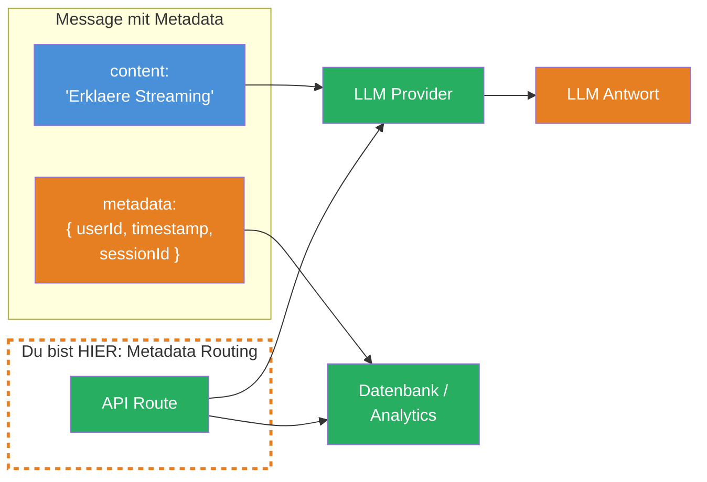
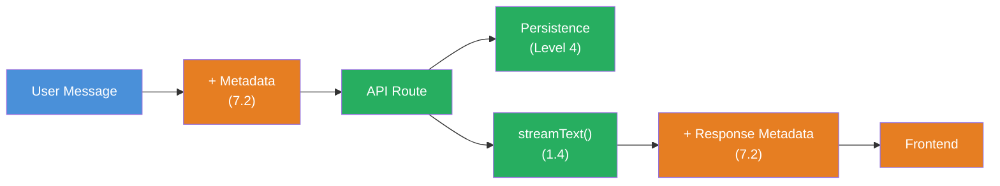

## THINK

Wie haengst Du zusaetzliche Infos an eine Message an, die NICHT zum LLM gehen sollen — z.B. einen Timestamp, die User-ID oder die IP-Adresse? Alles in den Message-Content zu packen waere Verschwendung von Tokens und koennte das LLM verwirren.

## OVERVIEW



Message Metadata lebt neben dem Content, wird aber NICHT an das LLM gesendet. Der Content geht zum LLM, die Metadata bleibt in Deiner App — fuer Logging, Persistence, Analytics.

## WHY

**Ohne Metadata:** Du packst alles in den Message-Content. Das LLM sieht irrelevante Informationen ("userId: abc123, timestamp: 1709..."), verschwendet Tokens und wird moeglicherweise verwirrt. Oder Du speicherst Metadaten in einer separaten Datenstruktur und musst sie manuell mit den Messages synchron halten — fehleranfaellig und umstaendlich.

**Mit Metadata:** Saubere Trennung. Der Content enthaelt nur, was das LLM sehen soll. Die Metadata enthaelt alles, was Deine App braucht — Timestamps, User-IDs, Session-Daten, Bewertungen. Beides reist zusammen in einer Message, aber nur der Content geht ans LLM.

## WALKTHROUGH

### Schicht 1: Das Metadata-Konzept

Jede Message im AI SDK hat eine optionale `metadata`-Property. Diese ist ein frei definierbares Objekt:

```typescript
import type { UIMessage } from 'ai';

const message: UIMessage = {
  id: 'msg-1',
  role: 'user',
  content: 'Erklaere Streaming im AI SDK.',
  parts: [{ type: 'text', text: 'Erklaere Streaming im AI SDK.' }],
  metadata: {                                         // ← Metadata: Geht NICHT zum LLM
    userId: 'user-42',
    timestamp: Date.now(),
    sessionId: 'session-abc',
    source: 'web-app',
  },
};
```

Die `metadata`-Property wird vom AI SDK beim Senden an den LLM-Provider automatisch ignoriert. Sie ist ausschliesslich fuer Deine Anwendungslogik.

### Schicht 2: Metadata auf der Server-Seite nutzen

> **Web-App Kontext:** Die folgenden Beispiele zeigen Metadata in einer Next.js/React App. Deine TRY-Uebung weiter unten arbeitet im Terminal (CLI).

In Deiner API Route kannst Du die Metadata lesen, bevor Du den LLM-Call startest:

```typescript
import { streamText } from 'ai';
import { anthropic } from '@ai-sdk/anthropic';

export async function POST(req: Request) {
  const { messages } = await req.json();

  // Metadata der letzten User-Message lesen
  const lastMessage = messages.at(-1);
  const metadata = lastMessage?.metadata ?? {};

  // Fuer Logging / Analytics
  console.log(`User ${metadata.userId} fragt:`, lastMessage?.content);
  console.log(`Session: ${metadata.sessionId}`);
  console.log(`Timestamp: ${new Date(metadata.timestamp).toISOString()}`);

  // Nur der Content geht ans LLM — Metadata bleibt hier
  const result = streamText({
    model: anthropic('claude-sonnet-4-5-20250514'),
    messages,                                         // ← SDK filtert metadata raus
  });

  return result.toUIMessageStreamResponse();
}
```

### Schicht 3: Metadata in der Antwort setzen

Du kannst auch Metadata an die Antwort-Messages haengen. Das passiert ueber `messageMetadata` in `toUIMessageStreamResponse`:

```typescript
const result = streamText({
  model: anthropic('claude-sonnet-4-5-20250514'),
  messages,
});

return result.toUIMessageStreamResponse({
  messageMetadata: ({ part }) => {                    // ← Callback, nicht Objekt!
    if (part.type === 'start') {
      return {
        generatedAt: Date.now(),
        modelId: 'claude-sonnet-4-5-20250514',
        cached: false,
      };
    }
  },
});
```

Im Frontend ist die Metadata dann auf der Assistant-Message verfuegbar:

```typescript
const { messages } = useChat();

messages.map((m) => {
  if (m.role === 'assistant') {
    console.log('Generiert am:', m.metadata?.generatedAt);
    console.log('Modell:', m.metadata?.modelId);
  }
});
```

### Schicht 4: Metadata fuer Persistence

Metadata ist besonders wertvoll in Kombination mit Persistence (Level 4). Du kannst Timestamps, Versionen und User-Daten direkt an der Message speichern:

```typescript
// Beim Speichern in die Datenbank
async function saveMessage(message: UIMessage) {
  await db.insert('messages', {
    id: message.id,
    role: message.role,
    content: message.content,
    // Metadata wird MIT der Message gespeichert
    userId: message.metadata?.userId,
    timestamp: message.metadata?.timestamp,
    sessionId: message.metadata?.sessionId,
    modelId: message.metadata?.modelId,
  });
}

// Beim Laden aus der Datenbank — Metadata wird rekonstruiert
async function loadMessages(chatId: string): Promise<UIMessage[]> {
  const rows = await db.select('messages', { chatId });
  return rows.map((row) => ({
    id: row.id,
    role: row.role,
    content: row.content,
    parts: [{ type: 'text', text: row.content }],
    metadata: {
      userId: row.userId,
      timestamp: row.timestamp,
      sessionId: row.sessionId,
      modelId: row.modelId,
    },
  }));
}
```

## TRY

**Aufgabe:** Erstelle Messages mit Metadata (userId, timestamp) und logge die Metadata serverseitig, bevor der LLM-Call startet. Verifiziere, dass das LLM die Metadata nicht sieht.

Erstelle die Datei `message-metadata.ts`:

```typescript
import { streamText } from 'ai';
import { anthropic } from '@ai-sdk/anthropic';
import type { UIMessage } from 'ai';

// TODO 1: Erstelle eine Message mit metadata
// const messages: UIMessage[] = [
//   {
//     id: 'msg-1',
//     role: 'user',
//     content: 'Was siehst Du in dieser Nachricht? Liste ALLES auf.',
//     parts: [{ type: 'text', text: 'Was siehst Du in dieser Nachricht? Liste ALLES auf.' }],
//     metadata: {
//       // TODO: Fuege userId, timestamp und sessionId hinzu
//     },
//   },
// ];

// TODO 2: Logge die Metadata der letzten Message
// const lastMessage = messages.at(-1);
// console.log('Metadata:', lastMessage?.metadata);

// TODO 3: Sende an streamText und pruefe ob das LLM die Metadata erwaehnt
// const result = streamText({
//   model: anthropic('claude-sonnet-4-5-20250514'),
//   messages,
// });

// TODO 4: Konsumiere den Stream und pruefe die Antwort
// for await (const chunk of result.textStream) {
//   process.stdout.write(chunk);
// }
```

**Checkliste:**
- [ ] Message mit `metadata` Objekt erstellt (mindestens userId und timestamp)
- [ ] Metadata auf der "Server-Seite" geloggt
- [ ] `streamText` mit den Messages aufgerufen
- [ ] Verifiziert: LLM erwaehnt userId/timestamp NICHT in der Antwort

Fuehre aus: `npx tsx message-metadata.ts`

<details>
<summary>Loesung anzeigen</summary>

```typescript
import { streamText } from 'ai';
import { anthropic } from '@ai-sdk/anthropic';
import type { UIMessage } from 'ai';

const messages: UIMessage[] = [
  {
    id: 'msg-1',
    role: 'user',
    content: 'Was siehst Du in dieser Nachricht? Liste ALLES auf, was Du sehen kannst.',
    parts: [{ type: 'text', text: 'Was siehst Du in dieser Nachricht? Liste ALLES auf, was Du sehen kannst.' }],
    metadata: {
      userId: 'user-42',
      timestamp: Date.now(),
      sessionId: 'session-abc-123',
      source: 'level-7-test',
    },
  },
];

// Metadata loggen (bleibt in der App)
const lastMessage = messages.at(-1)!;
console.log('--- App-Metadata (geht NICHT zum LLM) ---');
console.log('userId:', lastMessage.metadata?.userId);
console.log('timestamp:', new Date(lastMessage.metadata?.timestamp as number).toISOString());
console.log('sessionId:', lastMessage.metadata?.sessionId);
console.log('');

// LLM-Call — Metadata wird NICHT mitgesendet
const result = streamText({
  model: anthropic('claude-sonnet-4-5-20250514'),
  messages,
});

console.log('--- LLM-Antwort ---');
for await (const chunk of result.textStream) {
  process.stdout.write(chunk);
}
console.log('\n');

// Pruefe: Die Antwort sollte NUR den Text-Content erwaehnen,
// NICHT userId, sessionId oder timestamp.
```

**Erklaerung:** Das LLM sieht nur den `content` der Message: "Was siehst Du in dieser Nachricht? Liste ALLES auf, was Du sehen kannst." Die Metadata (`userId`, `timestamp`, `sessionId`) wird vom AI SDK herausgefiltert und erscheint nicht in der LLM-Antwort. Damit kannst Du Metadaten sicher transportieren, ohne Tokens zu verschwenden oder das LLM zu verwirren.

**Erwarteter Output (ungefaehr):**

```
--- App-Metadata (geht NICHT zum LLM) ---
userId: user-42
timestamp: 2026-03-09T14:30:00.000Z
sessionId: session-abc-123

--- LLM-Antwort ---
In dieser Nachricht sehe ich eine Frage, die mich bittet aufzulisten,
was ich sehen kann. Ich sehe den Text "Was siehst Du in dieser
Nachricht? Liste ALLES auf, was Du sehen kannst."
```

> Das LLM sollte **nur** den Text-Content erwaehnen — keine userId, kein timestamp, keine sessionId. Falls es Metadata erwaehnt, pruefe ob `metadata` korrekt als Eigenschaft (nicht im `content`) steht.

</details>

## COMBINE



**Uebung:** Kombiniere Message Metadata mit dem Persistence-Konzept aus Level 4. Baue eine Funktion, die:

1. User-Messages mit Metadata (userId, timestamp) erstellt
2. Die Metadata beim Senden an `streamText` automatisch herausfiltert (passiert durch das SDK)
3. Die LLM-Antwort mit eigener Metadata anreichert (modelId, generatedAt, tokenCount)
4. Beide Messages (User + Assistant) inklusive Metadata in ein Array speichert

**Optional Stretch Goal:** Baue eine `getSessionStats(sessionId)`-Funktion, die aus den gespeicherten Messages die Gesamtanzahl der Tokens, die Dauer der Session und die Anzahl der Nachrichten berechnet — alles aus der Metadata, ohne den Content zu parsen.

## Quellen

- [Vercel AI SDK: UI Messages](https://ai-sdk.dev/docs/ai-sdk-ui/chatbot#messages)
- [Vercel AI SDK: Message Metadata](https://ai-sdk.dev/docs/ai-sdk-ui/chatbot-message-metadata)
- [ai-hero-dev Exercise 07.03](https://github.com/ai-hero-dev/ai-sdk-v6-crash-course/tree/main/exercises/07-production-streaming/07.03-message-metadata)
