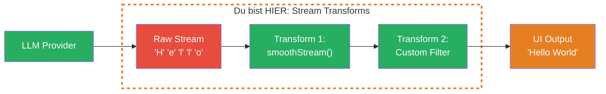
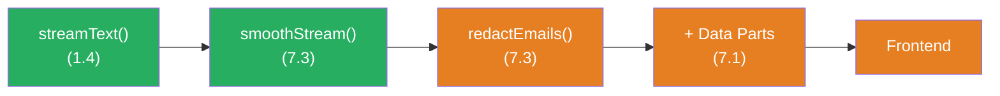

## THINK

Hast Du bemerkt, dass LLM-Streams manchmal stottern — einzelne Buchstaben statt fluessiger Woerter? Und was wenn Du den Stream nachbearbeiten willst, bevor er beim User ankommt — z.B. bestimmte Woerter ersetzen oder filtern?

## OVERVIEW



Stream Transforms sitzen zwischen dem LLM und Deiner UI. Sie transformieren, filtern oder glaetten die Chunks, bevor sie beim User ankommen. Du kannst Built-in Transforms wie `smoothStream` nutzen oder eigene schreiben.

## WHY

**Ohne Transforms:** Der Raw-Stream vom LLM kommt manchmal buchstabenweise ("H", "e", "l", "l", "o"), manchmal in grossen Bloecken. Die Ausgabe stottert, fuehlt sich unpoliert an. Wenn Du den Stream nachbearbeiten willst (filtern, formatieren, anreichern), musst Du das manuell nach dem Empfang tun — unflexibel und fehleranfaellig.

**Mit Transforms:** `smoothStream()` buffert einzelne Zeichen und gibt sie in natuerlichen Wortgruppen aus. Custom Transforms lassen Dich jeden Chunk modifizieren, bevor er weitergeleitet wird. Und mit der `experimental_transform` Option kannst Du mehrere Transforms verketten wie eine Pipeline.

## WALKTHROUGH

### Schicht 1: smoothStream — das Built-in Smoothing

`smoothStream()` ist eine eingebaute Transform-Funktion. Sie sammelt einzelne Zeichen und gibt sie in laengeren, natuerlicheren Chunks aus:

```typescript
import { smoothStream, streamText } from 'ai';
import { anthropic } from '@ai-sdk/anthropic';

const result = streamText({
  model: anthropic('claude-sonnet-4-5-20250514'),
  prompt: 'Erklaere Stream Transforms.',
  experimental_transform: smoothStream(),             // ← Eine Zeile, grosser Effekt
});

for await (const chunk of result.textStream) {
  process.stdout.write(chunk);                        // ← Fluessigere Ausgabe
}
```

Ohne `smoothStream`: `"S"` `"t"` `"r"` `"e"` `"a"` `"m"` `" T"` `"r"` `"a"` `"n"` `"s"` ...
Mit `smoothStream`: `"Stream "` `"Transforms "` `"sind ein "` `"Mechanismus..."` ...

`smoothStream` akzeptiert optionale Konfiguration:

```typescript
experimental_transform: smoothStream({
  delayInMs: 10,                                      // ← Verzoegerung zwischen Chunks (Default: 10)
  chunking: 'word',                                   // ← 'word' oder 'line' oder RegExp
}),
```

| Option | Default | Beschreibung |
|--------|---------|-------------|
| `delayInMs` | `10` | Millisekunden zwischen Chunk-Emissionen |
| `chunking` | `'word'` | Wie gruppiert wird: `'word'`, `'line'` oder eine eigene RegExp |

### Schicht 2: Custom TransformStream

Ein Custom Transform ist eine Funktion, die eine `TransformStream`-Factory zurueckgibt. Jeder Chunk durchlaeuft die `transform`-Methode:

```typescript
// Custom Transform: Alle Buchstaben in Grossbuchstaben
const upperCase = () =>                               // ← Factory-Funktion
  (options: { tools: Record<string, unknown> }) =>    // ← Bekommt Tool-Infos
    new TransformStream({
      transform(chunk, controller) {
        // Nur text-delta Chunks transformieren, Rest durchlassen
        if (chunk.type === 'text-delta') {
          controller.enqueue({                        // ← Modifizierten Chunk weiterleiten
            ...chunk,
            textDelta: chunk.textDelta.toUpperCase(), // ← Text transformieren
          });
        } else {
          controller.enqueue(chunk);                  // ← Andere Chunks unveraendert
        }
      },
    });
```

Die Struktur ist immer gleich:
1. **Aeussere Funktion:** Gibt die Factory zurueck (Konfigurationsebene)
2. **Innere Funktion:** Bekommt Options (Tools etc.), gibt `TransformStream` zurueck
3. **transform-Methode:** Verarbeitet jeden einzelnen Chunk

### Schicht 3: Transforms verketten

Mit `experimental_transform` als Array kannst Du mehrere Transforms hintereinanderschalten. Jeder Chunk durchlaeuft alle Transforms in Reihenfolge:

```typescript
import { smoothStream, streamText } from 'ai';

// Custom Transform: Filtert Chunks die "[INTERN]" enthalten
const filterInternal = () => (options: { tools: Record<string, unknown> }) =>
  new TransformStream({
    transform(chunk, controller) {
      if (chunk.type === 'text-delta' && chunk.textDelta.includes('[INTERN]')) {
        // Chunk verschlucken — nicht weiterleiten
        return;
      }
      controller.enqueue(chunk);
    },
  });

const result = streamText({
  model: anthropic('claude-sonnet-4-5-20250514'),
  prompt: 'Erklaere Streaming.',
  experimental_transform: [                           // ← Array = Pipeline
    smoothStream(),                                   // ← Erst glaetten
    filterInternal(),                                 // ← Dann filtern
  ],
});
```

Die Reihenfolge ist wichtig: Der erste Transform verarbeitet den Raw-Stream, der zweite bekommt den Output des ersten. Wie Pipes in der Unix-Shell.

### Schicht 4: Praxisbeispiel — Sensitive Daten filtern

Ein realistischer Use Case: Du willst verhindern, dass E-Mail-Adressen im Stream erscheinen:

```typescript
const redactEmails = () => (options: { tools: Record<string, unknown> }) =>
  new TransformStream({
    transform(chunk, controller) {
      if (chunk.type === 'text-delta') {
        const redacted = chunk.textDelta.replace(
          /[\w.-]+@[\w.-]+\.\w+/g,                    // ← Simple E-Mail RegExp
          '[EMAIL REDACTED]',
        );
        controller.enqueue({ ...chunk, textDelta: redacted });
      } else {
        controller.enqueue(chunk);
      }
    },
  });

const result = streamText({
  model: anthropic('claude-sonnet-4-5-20250514'),
  prompt: 'Nenne mir Kontaktdaten von Vercel.',
  experimental_transform: [
    smoothStream(),
    redactEmails(),                                   // ← E-Mails werden maskiert
  ],
});
```

**Achtung:** Stream Transforms arbeiten chunk-weise. Eine E-Mail-Adresse koennte ueber zwei Chunks verteilt sein ("user@" + "example.com"). Fuer robuste Filterung brauchst Du einen Buffer im Transform — das ist eine fortgeschrittene Technik.

## TRY

**Aufgabe:** Wende `smoothStream` an, dann schreibe einen Custom Transform, der alle Text-Chunks in Grossbuchstaben umwandelt.

Erstelle die Datei `stream-transforms.ts`:

```typescript
import { smoothStream, streamText } from 'ai';
import { anthropic } from '@ai-sdk/anthropic';

// TODO 1: Schreibe einen upperCase Transform
// const upperCase = () => (options) =>
//   new TransformStream({
//     transform(chunk, controller) {
//       // TODO: text-delta Chunks transformieren, Rest durchlassen
//     },
//   });

// TODO 2: Nutze experimental_transform mit smoothStream UND upperCase
// const result = streamText({
//   model: anthropic('claude-sonnet-4-5-20250514'),
//   prompt: 'Erklaere in 2 Saetzen, was Stream Transforms sind.',
//   experimental_transform: [???],
// });

// TODO 3: Konsumiere den Stream
// for await (const chunk of result.textStream) {
//   process.stdout.write(chunk);
// }
```

**Checkliste:**
- [ ] `smoothStream()` als erster Transform konfiguriert
- [ ] Custom `upperCase` Transform geschrieben mit `TransformStream`
- [ ] Nur `text-delta` Chunks transformiert, andere Typen durchgelassen
- [ ] Beide Transforms in `experimental_transform` Array verkettet
- [ ] Output zeigt glatten, grossgeschriebenen Text

Fuehre aus: `npx tsx stream-transforms.ts`

<details>
<summary>Loesung anzeigen</summary>

```typescript
import { smoothStream, streamText } from 'ai';
import { anthropic } from '@ai-sdk/anthropic';

// Custom Transform: Grossbuchstaben
const upperCase = () => (options: { tools: Record<string, unknown> }) =>
  new TransformStream({
    transform(chunk, controller) {
      if (chunk.type === 'text-delta') {
        controller.enqueue({
          ...chunk,
          textDelta: chunk.textDelta.toUpperCase(),
        });
      } else {
        controller.enqueue(chunk);
      }
    },
  });

const result = streamText({
  model: anthropic('claude-sonnet-4-5-20250514'),
  prompt: 'Erklaere in 2 Saetzen, was Stream Transforms sind.',
  experimental_transform: [
    smoothStream(),   // Erst glaetten
    upperCase(),      // Dann in Grossbuchstaben
  ],
});

for await (const chunk of result.textStream) {
  process.stdout.write(chunk);
}
console.log(); // Zeilenumbruch am Ende
```

**Erklaerung:** `smoothStream()` sammelt die einzelnen Buchstaben vom LLM und gibt sie in Wortgruppen weiter. Dann transformiert `upperCase()` jeden Text-Chunk in Grossbuchstaben. Nicht-Text-Chunks (wie `finish` oder `tool-call`) werden unveraendert durchgereicht. Die Reihenfolge im Array bestimmt die Pipeline-Reihenfolge.

**Erwarteter Output (ungefaehr):**

```
STREAM TRANSFORMS SIND EIN MECHANISMUS, DER CHUNKS ZWISCHEN DEM LLM
UND DEINER UI VERARBEITET. SIE ERMOEGLICHEN ES, DEN TEXT ZU GLAETTEN,
ZU FILTERN ODER ZU TRANSFORMIEREN, BEVOR ER BEIM USER ANKOMMT.
```

> Der gesamte Text erscheint in Grossbuchstaben und fliesst in Wortgruppen statt einzelnen Buchstaben. Der genaue Text variiert (LLM-Output).

</details>

## COMBINE



**Uebung:** Kombiniere Stream Transforms mit Custom Data Parts aus Challenge 7.1. Baue einen Stream, der:

1. `smoothStream()` fuer fluessige Ausgabe nutzt
2. Einen Custom Transform hat, der bestimmte Woerter (z.B. "TODO", "FIXME") aus dem Text filtert und durch "[REDACTED]" ersetzt
3. Per `createDataStream` einen Data Part sendet, der zaehlt, wie viele Woerter gefiltert wurden

**Optional Stretch Goal:** Baue einen `wordCounter` Transform, der mitzaehlt, wie viele Woerter insgesamt gestreamt wurden, und alle 50 Woerter ein Data Part mit dem aktuellen Zaehlerstand sendet.

## Quellen

- [Vercel AI SDK: smoothStream](https://ai-sdk.dev/docs/reference/ai-sdk-core/smooth-stream)
- [Vercel AI SDK: streamText — experimental_transform](https://ai-sdk.dev/docs/reference/ai-sdk-core/stream-text#experimental-transform)
- [MDN: TransformStream](https://developer.mozilla.org/en-US/docs/Web/API/TransformStream)
- [ai-hero-dev Exercises 07.01-07.04](https://github.com/ai-hero-dev/ai-sdk-v6-crash-course/tree/main/exercises/07-production-streaming) (Stream Transforms basiert auf der offiziellen AI SDK Dokumentation)
