Du beherrschst jetzt Production-Streaming. Deine Apps liefern nicht mehr nur rohen Text — sondern strukturierte Echtzeit-Erlebnisse mit Fortschrittsanzeigen, Metadaten, fluessiger Ausgabe und robuster Fehlerbehandlung.

## Was Du gelernt hast

- **Custom Data Parts:** Strukturierte Daten parallel zum Text im Stream transportieren — `createDataStream`, `writeData`, `mergeIntoDataStream`. Ein Kanal fuer Text und Metadaten, synchron und typisiert.
- **Message Metadata:** Zusaetzliche Informationen an Messages anhaengen, die das LLM nicht sieht — userId, Timestamps, Session-Daten. Saubere Trennung von Content und App-Daten, ideal fuer Persistence und Analytics.
- **Stream Transforms:** Stotternde Streams mit `smoothStream()` glaetten und eigene `TransformStream`-Pipelines bauen — filtern, transformieren, anreichern. `experimental_transform` als Array fuer verkettete Verarbeitung.
- **Error Handling:** Fehler im Stream abfangen mit `onError` in `streamText` (Server-Logging) und `toUIMessageStreamResponse` (User-Meldung). Typisierte Error-Klassen wie `NoSuchToolError`, Retry mit Exponential Backoff, try/catch als letzter Fallback.

## Aktualisierter Skill Tree

```mermaid
graph LR
  subgraph "Freigeschaltet"
    L1["Level 1: AI SDK Basics"]
    L2["Level 2: LLM Fundamentals"]
    L3["Level 3: Agents & MCP"]
    L4["Level 4: Persistence"]
    L5["Level 5: Context Engineering"]
    L6["Level 6: Evals"]
    L7["Level 7: Streaming"]
  end
  subgraph NEXT["Naechstes Level"]
    L8["Level 8: Workflows"]
  end
  subgraph "Gesperrt"
    L9["Level 9: Advanced Patterns"]
  end
  L1 --> L2
  L2 --> L3
  L3 --> L4
  L4 --> L5
  L5 --> L6
  L6 --> L7
  L7 --> L8
  L8 -.-> L9
  style L1 fill:#27AE60,color:#fff
  style L2 fill:#27AE60,color:#fff
  style L3 fill:#27AE60,color:#fff
  style L4 fill:#27AE60,color:#fff
  style L5 fill:#27AE60,color:#fff
  style L6 fill:#27AE60,color:#fff
  style L7 fill:#27AE60,color:#fff
  style NEXT fill:none,stroke:#E67E22,stroke-width:3px,stroke-dasharray:5 5
  style L8 fill:#E67E22,color:#fff
  style L9 fill:#95a5a6,color:#fff
```

## Naechstes Level

**Level 8: Workflows** — Einzelne LLM-Calls sind maechtig. Aber was, wenn eine Aufgabe mehrere Schritte braucht — Recherche, Analyse, Zusammenfassung? Du lernst, wie Du sequentielle und parallele Workflows baust, eigene Agent-Loops implementierst und Loops gezielt abbrichst, wenn das Ergebnis gut genug ist.
