## TL;DR

> Workflows orchestrieren mehrere LLM-Calls zu komplexen Pipelines. Statt einem grossen Prompt: viele kleine, spezialisierte Schritte. Du lernst, wie Du sequentielle Workflows baust, Fortschritt ans Frontend streamst, eigene Agent-Loops implementierst und Loops gezielt abbrichst, bevor sie ausser Kontrolle geraten.

## Skill Tree

```mermaid
graph LR
  subgraph "Freigeschaltet"
    L1["Level 1: AI SDK Basics"]
    L2["Level 2: LLM Fundamentals"]
    L3["Level 3: Agents & MCP"]
    L4["Level 4: Persistence"]
    L5["Level 5: Context Engineering"]
    L6["Level 6: Evals"]
    L7["Level 7: Streaming"]
  end
  subgraph HIER["Aktuelles Level"]
    L8["Level 8: Workflows"]
  end
  subgraph "Gesperrt"
    L9["Level 9: Advanced Patterns"]
  end
  L1 --> L2
  L2 --> L3
  L3 --> L4
  L4 --> L5
  L5 --> L6
  L6 --> L7
  L7 --> L8
  L8 -.-> L9
  style L1 fill:#27AE60,color:#fff
  style L2 fill:#27AE60,color:#fff
  style L3 fill:#27AE60,color:#fff
  style L4 fill:#27AE60,color:#fff
  style L5 fill:#27AE60,color:#fff
  style L6 fill:#27AE60,color:#fff
  style L7 fill:#27AE60,color:#fff
  style HIER fill:none,stroke:#E67E22,stroke-width:3px,stroke-dasharray:5 5
  style L8 fill:#E67E22,color:#fff
  style L9 fill:#95a5a6,color:#fff
```

## Was Du lernst

- **Workflows** — mehrere `generateText`-Calls sequentiell verketten, wobei der Output von Step N zum Input von Step N+1 wird
- **Streaming to Frontend** — Workflow-Fortschritt in Echtzeit ans Frontend streamen mit `createDataStream` und Custom Data Parts
- **Custom Loop** — eigene Agent-Loops bauen mit voller Kontrolle ueber Abbruchbedingungen, State-Tracking und Messages-Array
- **Breaking the Loop** — Endlosschleifen verhindern mit Max-Iterations, Timeout, Cost Guard und Quality Checks

## Warum das wichtig ist

In Level 3 hast Du Agents kennengelernt, die Tools autonom nutzen. Aber was, wenn die Aufgabe nicht nur ein Tool braucht, sondern eine ganze Pipeline — erst recherchieren, dann zusammenfassen, dann formatieren? Ein einzelner riesiger Prompt wird schnell unzuverlaessig. Workflows zerlegen komplexe Aufgaben in spezialisierte Schritte, die Du einzeln testen, debuggen und optimieren kannst.

Das konkrete Problem: Du willst eine Research-Pipeline bauen, die Quellen sucht, Ergebnisse zusammenfasst und einen fertigen Report erstellt. Ein einzelner LLM-Call produziert inkonsistente Ergebnisse. Mit Workflows steuerst Du jeden Schritt separat — und wenn etwas schiefgeht, weisst Du genau, wo.

## Voraussetzungen

- **Level 3: Agents & MCP** — Tool Calling, Multi-Step Agents, `stopWhen` (Challenge 3.1-3.3)
- **Level 7: Streaming** — Custom Data Parts, `createDataStream`, `writeData`, `mergeIntoDataStream` (Challenge 7.1)
- **TypeScript** — async/await, while-Loops, AbortController

> **Skip-Hinweis:** Du baust bereits Custom Agent Loops mit eigenen Abbruchbedingungen, streamst Fortschritt ans Frontend und hast Timeout-Guards implementiert? Spring direkt zur [Boss Fight](/de/level-8-workflows/06-boss-fight/) und baue eine Multi-Step Research Pipeline.

## Challenges

| # | Challenge | Konzept |
|---|-----------|---------|
| 8.1 | [Workflow](/de/level-8-workflows/02-workflow/) | Sequentielle `generateText`-Calls, Output-Verkettung, spezialisierte Steps |
| 8.2 | [Streaming to Frontend](/de/level-8-workflows/03-streaming-to-frontend/) | `createDataStream` + `writeData` fuer Step-Fortschritt, Frontend-Konsum |
| 8.3 | [Custom Loop](/de/level-8-workflows/04-custom-loop/) | Eigener while-Loop, Messages-Array, State-Tracking, finishReason-Check |
| 8.4 | [Breaking the Loop](/de/level-8-workflows/05-breaking-the-loop/) | Max-Iterations, Timeout, Cost Guard, Quality Check, Partial Results |

## Boss Fight

Baue eine **Multi-Step Research Pipeline** — ein System, das ein Thema recherchiert (Custom Loop mit Tools), Fortschritt in Echtzeit streamt, die Ergebnisse zusammenfasst (Workflow) und mit Safeguards geschuetzt ist (Max-Iterations, Timeout, Cost Limit). Du kombinierst alle vier Bausteine dieses Levels in einem Projekt.

## Quellen fuer dieses Level

- [Vercel AI SDK: Generating Text](https://ai-sdk.dev/docs/ai-sdk-core/generating-text)
- [Vercel AI SDK: Building Agents](https://ai-sdk.dev/docs/agents/building-agents)
- [Vercel AI SDK: Data Streams](https://ai-sdk.dev/docs/ai-sdk-core/data-streams)
- [Vercel Blog: AI SDK 6](https://vercel.com/blog/ai-sdk-6)
- [ai-hero-dev Exercises 08.01-08.04](https://github.com/ai-hero-dev/ai-sdk-v6-crash-course/tree/main/exercises/08-workflows)
