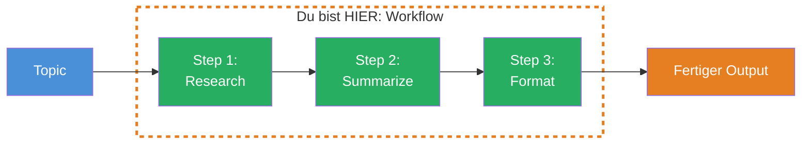
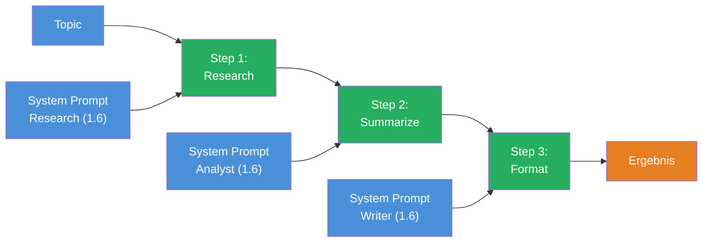

## THINK

Was wenn eine Aufgabe zu komplex fuer einen einzigen LLM-Call ist — z.B. recherchieren, zusammenfassen und formatieren? Wuerdest Du alles in einen Prompt packen, oder die Aufgabe aufteilen?

## OVERVIEW



Ein Workflow verkettet mehrere `generateText`-Calls. Der Output von Step 1 wird zum Input von Step 2. Jeder Schritt hat seinen eigenen Prompt, seine eigene Rolle — und kann einzeln getestet werden.

## WHY

**Ohne Workflows:** Ein riesiger Prompt, der gleichzeitig recherchieren, zusammenfassen und formatieren soll. Schwer zu debuggen — wenn das Ergebnis schlecht ist, weisst Du nicht, welcher Teilschritt versagt hat. Keine Zwischenergebnisse, kein Step-fuer-Step-Testing.

**Mit Workflows:** Spezialisierte Steps, jeder mit eigenem System Prompt. Du kannst Step 2 isoliert testen, indem Du ihm einen festen Input gibst. Du siehst Zwischenergebnisse nach jedem Schritt. Und wenn Step 3 schlechte Ergebnisse liefert, weisst Du: Das Problem liegt im Format-Prompt, nicht in der Recherche.

## WALKTHROUGH

### Schicht 1: Der einfachste Workflow

Drei `generateText`-Calls hintereinander. Der Output von Step N wird zum Input von Step N+1:

```typescript
import { generateText } from 'ai';
import { anthropic } from '@ai-sdk/anthropic';

const model = anthropic('claude-sonnet-4-5-20250514');

// Step 1: Recherchieren
const research = await generateText({
  model,
  system: 'Du bist ein Research-Assistent. Sammle Fakten und Daten zum Thema.',
  prompt: 'Recherchiere die aktuellen Trends im Bereich Edge Computing.',
});

console.log('--- Step 1: Research ---');
console.log(research.text);

// Step 2: Zusammenfassen
const summary = await generateText({
  model,
  system: 'Du bist ein Analyst. Fasse die folgenden Recherche-Ergebnisse in 3-5 Kernaussagen zusammen.',
  prompt: research.text,  // ← Output von Step 1 wird Input von Step 2
});

console.log('--- Step 2: Summary ---');
console.log(summary.text);

// Step 3: Formatieren
const email = await generateText({
  model,
  system: 'Du bist ein Business-Writer. Formatiere die Zusammenfassung als professionelle E-Mail an das Management-Team.',
  prompt: summary.text,  // ← Output von Step 2 wird Input von Step 3
});

console.log('--- Step 3: Formatted Email ---');
console.log(email.text);
```

Drei Calls, drei Rollen, drei spezialisierte Outputs. Der entscheidende Punkt: Jeder `system`-Prompt definiert eine andere Expertise. Step 1 sammelt Fakten, Step 2 analysiert, Step 3 formatiert.

### Schicht 2: Als Funktion kapseln

Damit der Workflow wiederverwendbar wird, kapseln wir ihn in eine Funktion:

```typescript
import { generateText } from 'ai';
import { anthropic } from '@ai-sdk/anthropic';

const model = anthropic('claude-sonnet-4-5-20250514');

async function contentPipeline(topic: string) {
  // Step 1: Research
  const research = await generateText({
    model,
    system: 'Du bist ein Research-Assistent. Sammle Fakten und Daten zum gegebenen Thema. Nenne konkrete Zahlen und Beispiele.',
    prompt: `Recherchiere: ${topic}`,
  });

  // Step 2: Summarize
  const summary = await generateText({
    model,
    system: 'Du bist ein Analyst. Fasse die folgenden Informationen in maximal 5 praegnanten Kernaussagen zusammen. Jede Aussage in einem Satz.',
    prompt: `Fasse zusammen:\n\n${research.text}`,
  });

  // Step 3: Format as Email
  const email = await generateText({
    model,
    system: 'Du bist ein Business-Writer. Formatiere den folgenden Inhalt als professionelle E-Mail. Betreff, Anrede, Kernpunkte, Gruss.',
    prompt: `Formatiere als E-Mail an das Team:\n\n${summary.text}`,
  });

  return {
    research: research.text,
    summary: summary.text,
    email: email.text,
    totalTokens:
      research.usage.totalTokens +
      summary.usage.totalTokens +
      email.usage.totalTokens,
  };
}

// Ausfuehren
const result = await contentPipeline('Edge Computing Trends 2026');
console.log(result.email);
console.log(`\nTotal Tokens: ${result.totalTokens}`);
```

Die Funktion gibt alle Zwischenergebnisse zurueck. Das ist wichtig fuer Debugging — wenn die E-Mail schlecht ist, pruefst Du `result.summary`. Wenn die Zusammenfassung schlecht ist, pruefst Du `result.research`. Jede Schicht einzeln debuggbar.

### Schicht 3: Token-Tracking ueber die Pipeline

Ein Workflow mit drei Steps verbraucht dreimal so viele API-Calls wie ein einzelner. Token-Tracking ist wichtig:

```typescript
async function trackedPipeline(topic: string) {
  const steps: Array<{ name: string; tokens: number; duration: number }> = [];

  async function runStep(name: string, system: string, prompt: string) {
    const start = Date.now();
    const result = await generateText({ model, system, prompt });
    steps.push({
      name,
      tokens: result.usage.totalTokens,
      duration: Date.now() - start,
    });
    return result.text;
  }

  const research = await runStep(
    'research',
    'Du bist ein Research-Assistent. Sammle Fakten zum Thema.',
    `Recherchiere: ${topic}`,
  );

  const summary = await runStep(
    'summarize',
    'Fasse die Informationen in 3-5 Kernaussagen zusammen.',
    research,
  );

  const formatted = await runStep(
    'format',
    'Formatiere als professionelle E-Mail.',
    summary,
  );

  // Step-Statistiken loggen
  for (const step of steps) {
    console.log(`${step.name}: ${step.tokens} Tokens, ${step.duration}ms`);
  }

  const totalTokens = steps.reduce((sum, s) => sum + s.tokens, 0);
  const totalDuration = steps.reduce((sum, s) => sum + s.duration, 0);
  console.log(`\nGesamt: ${totalTokens} Tokens, ${totalDuration}ms`);

  return { result: formatted, steps };
}

await trackedPipeline('Edge Computing Trends 2026');
```

Die `runStep`-Hilfsfunktion kapselt den gemeinsamen Code: `generateText` aufrufen, Tokens und Dauer messen, Ergebnis zurueckgeben. Das reduziert Boilerplate und macht das Token-Tracking einheitlich.

## TRY

**Aufgabe:** Baue eine 3-Step Content-Pipeline: research, summarize, translate (auf Englisch). Tracke die Tokens pro Step.

```typescript
import { generateText } from 'ai';
import { anthropic } from '@ai-sdk/anthropic';

const model = anthropic('claude-sonnet-4-5-20250514');

// TODO 1: Definiere eine async Funktion contentPipeline(topic: string)

// TODO 2: Step 1 — Research
//   system: 'Du bist ein Research-Assistent. Sammle Fakten zum Thema.'
//   prompt: `Recherchiere: ${topic}`

// TODO 3: Step 2 — Summarize
//   system: 'Fasse die Informationen in 3-5 Kernaussagen zusammen.'
//   prompt: Output von Step 1

// TODO 4: Step 3 — Translate
//   system: 'Translate the following German text to English. Keep it professional.'
//   prompt: Output von Step 2

// TODO 5: Tracke die Tokens pro Step und gib sie am Ende aus

// TODO 6: Rufe die Pipeline auf
// const result = await contentPipeline('Kuenstliche Intelligenz in der Medizin');
```

**Checkliste:**
- [ ] 3 sequentielle `generateText`-Calls implementiert
- [ ] Output von Step N wird Input von Step N+1
- [ ] Jeder Step hat einen eigenen `system`-Prompt
- [ ] Token-Verbrauch pro Step wird geloggt
- [ ] Gesamter Token-Verbrauch wird berechnet

<details>
<summary>Loesung anzeigen</summary>

```typescript
import { generateText } from 'ai';
import { anthropic } from '@ai-sdk/anthropic';

const model = anthropic('claude-sonnet-4-5-20250514');

async function contentPipeline(topic: string) {
  const steps: Array<{ name: string; tokens: number }> = [];

  // Step 1: Research (Deutsch)
  const research = await generateText({
    model,
    system: 'Du bist ein Research-Assistent. Sammle Fakten und aktuelle Entwicklungen zum gegebenen Thema. Nenne konkrete Beispiele.',
    prompt: `Recherchiere: ${topic}`,
  });
  steps.push({ name: 'research', tokens: research.usage.totalTokens });

  // Step 2: Summarize (Deutsch)
  const summary = await generateText({
    model,
    system: 'Du bist ein Analyst. Fasse die folgenden Informationen in exakt 5 praegnanten Kernaussagen zusammen. Jede Aussage in einem Satz.',
    prompt: `Fasse zusammen:\n\n${research.text}`,
  });
  steps.push({ name: 'summarize', tokens: summary.usage.totalTokens });

  // Step 3: Translate (Englisch)
  const translated = await generateText({
    model,
    system: 'You are a professional translator. Translate the following German text to English. Keep the bullet-point structure and professional tone.',
    prompt: `Translate to English:\n\n${summary.text}`,
  });
  steps.push({ name: 'translate', tokens: translated.usage.totalTokens });

  // Statistiken ausgeben
  for (const step of steps) {
    console.log(`${step.name}: ${step.tokens} Tokens`);
  }
  const totalTokens = steps.reduce((sum, s) => sum + s.tokens, 0);
  console.log(`\nGesamt: ${totalTokens} Tokens`);

  return {
    research: research.text,
    summary: summary.text,
    translated: translated.text,
    totalTokens,
  };
}

const result = await contentPipeline('Kuenstliche Intelligenz in der Medizin');
console.log('\n--- Ergebnis (Englisch) ---');
console.log(result.translated);
```

**Erklaerung:** Drei spezialisierte Steps — jeder mit eigener Rolle. Step 1 recherchiert auf Deutsch, Step 2 fasst zusammen, Step 3 uebersetzt ins Englische. Der Token-Verbrauch wird pro Step getrackt. Du kannst jeden Step einzeln testen, indem Du ihm einen festen Input gibst.

</details>

## COMBINE



**Uebung:** Kombiniere den Workflow mit System Prompts aus Level 1.6. Baue eine Pipeline mit drei unterschiedlichen Rollen:

1. **Step 1 — Researcher:** `system: 'Du bist ein Experte fuer [Dein Thema]. Recherchiere gruendlich und nenne Zahlen und Quellen.'`
2. **Step 2 — Critic:** `system: 'Du bist ein kritischer Reviewer. Pruefe die folgenden Aussagen auf Schwachstellen und Luecken. Benenne was fehlt.'`
3. **Step 3 — Writer:** `system: 'Du bist ein erfahrener Autor. Schreibe einen ausgewogenen Artikel, der sowohl die Fakten als auch die Kritikpunkte integriert.'`

Durch den Critic-Step bekommt der finale Artikel mehr Substanz als ein einfacher Research-to-Format Workflow.

**Optional Stretch Goal:** Fuege einen 4. Step hinzu, der den fertigen Artikel mit `Output.object` und einem Zod Schema in strukturierte Metadaten umwandelt (Titel, Zusammenfassung, Tags, Lesezeit). Nutze dafuer `Output.object` aus Level 1.5.

## Quellen

- [Vercel AI SDK: Generating Text](https://ai-sdk.dev/docs/ai-sdk-core/generating-text)
- [Vercel AI SDK: generateText API Reference](https://ai-sdk.dev/docs/reference/ai-sdk-core/generate-text)
- [ai-hero-dev Exercise 08.01](https://github.com/ai-hero-dev/ai-sdk-v6-crash-course/tree/main/exercises/08-workflows/08.01-workflow)
