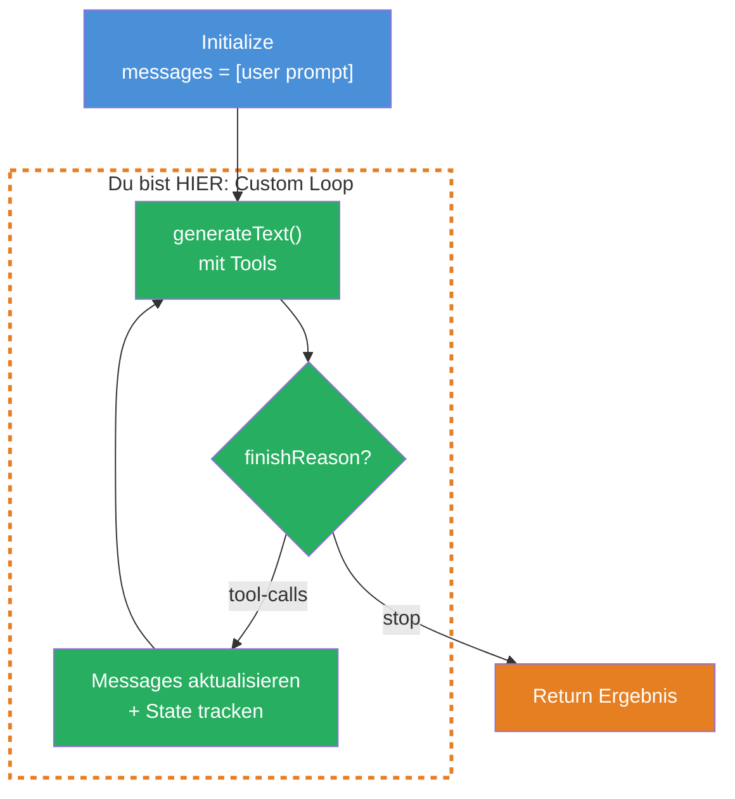
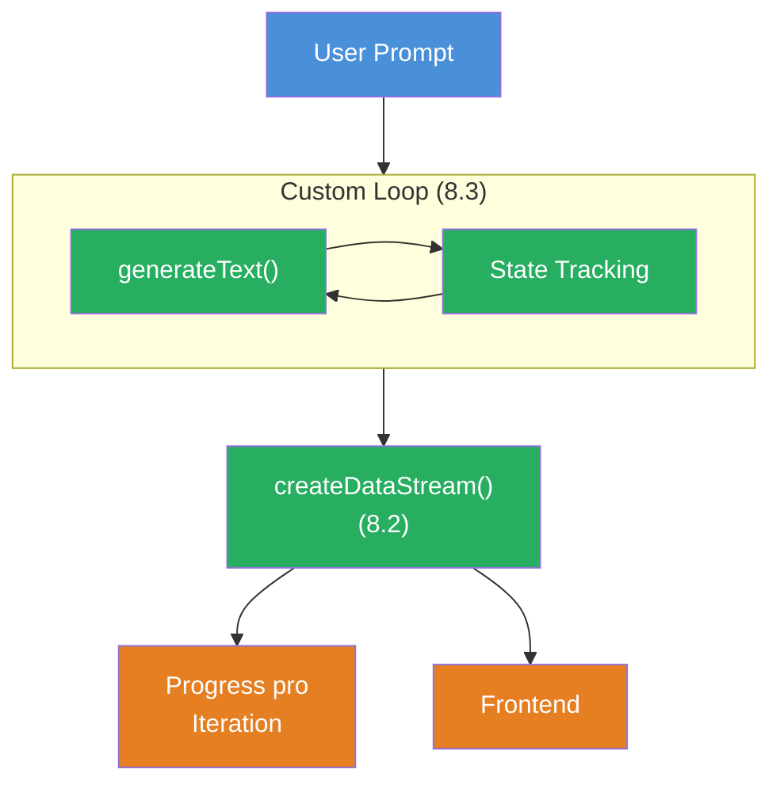

## THINK

Was wenn Du mehr Kontrolle brauchst als `ToolLoopAgent` bietet — z.B. eigene Abbruchbedingungen, State-Tracking oder Entscheidungen zwischen Loop-Iterationen?

## OVERVIEW



Ein Custom Loop gibt Dir volle Kontrolle ueber den Agent-Lifecycle. Du verwaltest das Messages-Array, pruefst den `finishReason`, trackst eigenen State und entscheidest nach jeder Iteration, ob der Loop weiterlaeuft.

## WHY

**Ohne Custom Loop:** Du nutzt `ToolLoopAgent` oder `generateText` mit `stopWhen: stepCountIs(N)`. Das reicht fuer Standard-Faelle. Aber: Du kannst nur nach Step-Count abbrechen, keinen eigenen State zwischen Iterationen tracken und keine Entscheidungen basierend auf Tool-Ergebnissen treffen.

**Mit Custom Loop:** Volle Kontrolle ueber den Agent-Lifecycle. Du entscheidest nach jeder Iteration: Weitermachen oder stoppen? Du trackst, welche Tools aufgerufen wurden, wie oft, mit welchen Ergebnissen. Du kannst basierend auf einem bestimmten Tool-Ergebnis abbrechen — nicht nur nach N Steps.

## WALKTHROUGH

### Schicht 1: Der einfachste Custom Loop

Ein while-Loop, der `generateText` aufruft, bis das LLM `finishReason: 'stop'` zurueckgibt (also keinen Tool Call mehr machen will):

```typescript
import { generateText } from 'ai';
import { anthropic } from '@ai-sdk/anthropic';
import { tool } from 'ai';
import { z } from 'zod';

const model = anthropic('claude-sonnet-4-5-20250514');

// Ein einfaches Tool
const searchTool = tool({
  description: 'Search for information on a topic',
  inputSchema: z.object({
    query: z.string().describe('The search query'),
  }),
  execute: async ({ query }) => {
    // Simulierte Suche
    return { results: [`Ergebnis fuer "${query}": Wichtige Fakten...`] };
  },
});

// Custom Loop
const messages: Array<any> = [
  { role: 'user', content: 'Recherchiere die Vorteile von Edge Computing.' },
];

let done = false;

while (!done) {
  const result = await generateText({
    model,
    tools: { search: searchTool },
    messages,
  });

  if (result.finishReason === 'stop') {          // ← LLM ist fertig, kein Tool Call mehr
    done = true;
    console.log('--- Finale Antwort ---');
    console.log(result.text);
  } else {
    messages.push(...result.response.messages);   // ← Tool Calls + Results zum Messages-Array
    console.log(`Loop: ${messages.length} Messages`);
  }
}
```

Der Kern: `result.response.messages` enthaelt die Assistant-Message (mit Tool Calls) und die Tool-Result-Messages. Diese werden zum `messages`-Array gepusht, damit das LLM in der naechsten Iteration den Kontext hat.

### Schicht 2: State-Tracking

Der eigentliche Vorteil des Custom Loops — Du kannst eigenen State tracken:

```typescript
import { generateText, tool } from 'ai';
import { anthropic } from '@ai-sdk/anthropic';
import { z } from 'zod';

const model = anthropic('claude-sonnet-4-5-20250514');

const searchTool = tool({
  description: 'Search for information',
  inputSchema: z.object({ query: z.string() }),
  execute: async ({ query }) => ({
    results: [`Fakten zu "${query}"...`],
  }),
});

const saveTool = tool({
  description: 'Save the final research result',
  inputSchema: z.object({ content: z.string() }),
  execute: async ({ content }) => {
    console.log('Gespeichert:', content.slice(0, 100) + '...');
    return { saved: true };
  },
});

// State-Tracking
const state = {
  toolCallCount: 0,
  toolsUsed: new Set<string>(),
  iterations: 0,
};

const messages: Array<any> = [
  { role: 'user', content: 'Recherchiere Edge Computing und speichere das Ergebnis.' },
];

let done = false;

while (!done) {
  state.iterations++;

  const result = await generateText({
    model,
    tools: { search: searchTool, save: saveTool },
    messages,
  });

  // Tool Calls zaehlen und tracken
  if (result.toolCalls.length > 0) {
    state.toolCallCount += result.toolCalls.length;
    for (const tc of result.toolCalls) {
      state.toolsUsed.add(tc.toolName);
    }
  }

  if (result.finishReason === 'stop') {
    done = true;
    console.log('--- Finale Antwort ---');
    console.log(result.text);
  } else {
    messages.push(...result.response.messages);
  }

  // State loggen
  console.log(`Iteration ${state.iterations}: ${state.toolCallCount} Tool Calls, Tools: [${[...state.toolsUsed].join(', ')}]`);
}

console.log('\n--- Statistik ---');
console.log(`Iterationen: ${state.iterations}`);
console.log(`Tool Calls gesamt: ${state.toolCallCount}`);
console.log(`Tools verwendet: ${[...state.toolsUsed].join(', ')}`);
```

Jetzt siehst Du nach jedem Loop-Durchlauf: Wie viele Tool Calls wurden gemacht? Welche Tools wurden genutzt? Das ist mit `ToolLoopAgent` nicht moeglich — dort bekommst Du diese Informationen erst am Ende.

### Schicht 3: Abbruch basierend auf Tool-Ergebnis

Der maechtigste Aspekt: Du pruefst ein spezifisches Tool-Ergebnis und brichst ab, wenn eine Bedingung erfuellt ist:

```typescript
import { generateText, tool } from 'ai';
import { anthropic } from '@ai-sdk/anthropic';
import { z } from 'zod';

const model = anthropic('claude-sonnet-4-5-20250514');

const checkQualityTool = tool({
  description: 'Check if the research quality is sufficient',
  inputSchema: z.object({
    content: z.string().describe('The research content to check'),
  }),
  execute: async ({ content }) => {
    // Qualitaetspruefung (hier simuliert)
    const wordCount = content.split(' ').length;
    const hasSources = content.includes('Quelle') || content.includes('Source');
    const score = (wordCount > 100 ? 50 : 20) + (hasSources ? 50 : 0);
    return { score, sufficient: score >= 70 };
  },
});

const searchTool = tool({
  description: 'Search for information',
  inputSchema: z.object({ query: z.string() }),
  execute: async ({ query }) => ({
    results: [`Detaillierte Ergebnisse zu "${query}". Quelle: Fachjournal 2026...`],
  }),
});

const messages: Array<any> = [
  {
    role: 'user',
    content: 'Recherchiere Edge Computing. Nutze search fuer Recherche und checkQuality um die Qualitaet zu pruefen. Stoppe erst wenn die Qualitaet ausreicht.',
  },
];

let done = false;
let qualityScore = 0;

while (!done) {
  const result = await generateText({
    model,
    tools: { search: searchTool, checkQuality: checkQualityTool },
    messages,
  });

  // Pruefe ob checkQuality aufgerufen wurde und das Ergebnis ausreichend ist
  for (const tc of result.toolResults) {
    if (tc.toolName === 'checkQuality' && tc.result.sufficient) {
      qualityScore = tc.result.score;
      done = true;                                // ← Abbruch basierend auf Tool-Ergebnis
      console.log(`Qualitaet ausreichend: Score ${qualityScore}`);
    }
  }

  if (result.finishReason === 'stop') {
    done = true;
  } else if (!done) {
    messages.push(...result.response.messages);
  }
}
```

Das ist der Kernvorteil: Du brichst nicht nach N Steps ab, sondern wenn ein bestimmtes Tool ein bestimmtes Ergebnis liefert. Das LLM recherchiert solange, bis die Qualitaet stimmt.

## TRY

**Aufgabe:** Baue einen Custom Agent Loop, der trackt wie viele Tool Calls gemacht wurden. Der Loop stoppt, wenn das `save`-Tool aufgerufen wird und `{ saved: true }` zurueckgibt.

```typescript
import { generateText, tool } from 'ai';
import { anthropic } from '@ai-sdk/anthropic';
import { z } from 'zod';

const model = anthropic('claude-sonnet-4-5-20250514');

// TODO 1: Definiere ein search-Tool
// const searchTool = tool({ ... });

// TODO 2: Definiere ein save-Tool, das { saved: true } zurueckgibt
// const saveTool = tool({ ... });

// TODO 3: Initialisiere das messages-Array mit einer User-Message
// const messages = [{ role: 'user', content: '...' }];

// TODO 4: Initialisiere State-Tracking (toolCallCount, iterations)

// TODO 5: Implementiere den while-Loop:
//   - generateText mit tools aufrufen
//   - toolCallCount hochzaehlen
//   - Pruefe ob save-Tool mit { saved: true } aufgerufen wurde → done = true
//   - Wenn finishReason === 'stop' → done = true
//   - Sonst: messages.push(...result.response.messages)

// TODO 6: Logge die Statistiken am Ende
```

**Checkliste:**
- [ ] Messages-Array korrekt initialisiert
- [ ] while-Loop prueft `finishReason`
- [ ] `result.response.messages` wird zum Messages-Array gepusht
- [ ] Tool Call Count wird getrackt
- [ ] Loop bricht ab, wenn `save`-Tool `{ saved: true }` zurueckgibt

<details>
<summary>Loesung anzeigen</summary>

```typescript
import { generateText, tool } from 'ai';
import { anthropic } from '@ai-sdk/anthropic';
import { z } from 'zod';

const model = anthropic('claude-sonnet-4-5-20250514');

const searchTool = tool({
  description: 'Search for information on a topic',
  inputSchema: z.object({
    query: z.string().describe('The search query'),
  }),
  execute: async ({ query }) => ({
    results: [`Detaillierte Ergebnisse zu "${query}": Fakten und Daten...`],
  }),
});

const saveTool = tool({
  description: 'Save the final research result when research is complete',
  inputSchema: z.object({
    content: z.string().describe('The final content to save'),
  }),
  execute: async ({ content }) => {
    console.log(`\nGespeichert (${content.length} Zeichen)`);
    return { saved: true };
  },
});

const messages: Array<any> = [
  {
    role: 'user',
    content: 'Recherchiere die Vorteile von Edge Computing. Nutze search fuer die Recherche. Wenn Du genug Informationen hast, nutze save um das Ergebnis zu speichern.',
  },
];

let done = false;
let toolCallCount = 0;
let iterations = 0;

while (!done) {
  iterations++;

  const result = await generateText({
    model,
    tools: { search: searchTool, save: saveTool },
    messages,
  });

  // Tool Calls zaehlen
  toolCallCount += result.toolCalls.length;

  // Pruefe ob save mit { saved: true } aufgerufen wurde
  for (const tr of result.toolResults) {
    if (tr.toolName === 'save' && tr.result.saved === true) {
      done = true;
      console.log('Save-Tool hat saved: true zurueckgegeben. Loop beendet.');
    }
  }

  if (result.finishReason === 'stop') {
    done = true;
    console.log('--- Finale Antwort ---');
    console.log(result.text);
  } else if (!done) {
    messages.push(...result.response.messages);
  }

  console.log(`Iteration ${iterations}: ${toolCallCount} Tool Calls`);
}

console.log(`\n--- Statistik ---`);
console.log(`Iterationen: ${iterations}`);
console.log(`Tool Calls gesamt: ${toolCallCount}`);
console.log(`Messages im Array: ${messages.length}`);
```

**Erklaerung:** Der while-Loop laeuft, bis entweder das `save`-Tool `{ saved: true }` zurueckgibt oder `finishReason === 'stop'`. Nach jeder Iteration werden die Response-Messages zum Array gepusht, damit das LLM den vollen Kontext hat. Die Tool Calls werden gezaehlt und am Ende als Statistik ausgegeben.

</details>

## COMBINE



**Uebung:** Kombiniere den Custom Loop mit dem Fortschritts-Streaming aus Challenge 8.2. Nach jeder Loop-Iteration:

1. Sende ein Custom Data Part mit der aktuellen Iteration und dem Tool Call Count
2. Sende den Namen des zuletzt aufgerufenen Tools
3. Am Ende: Sende die Gesamt-Statistik als Data Part

```typescript
// Pro Iteration:
dataStream.writeData({
  type: 'iteration',
  iteration: state.iterations,
  toolCallCount: state.toolCallCount,
  lastTool: result.toolCalls.at(-1)?.toolName ?? 'none',
});
```

**Optional Stretch Goal:** Streame den finalen Text des Agents (die letzte `result.text` wenn `finishReason === 'stop'`) mit `streamText` statt `generateText`, damit der User das Endergebnis in Echtzeit sieht.

## Quellen

- [Vercel AI SDK: Building Agents](https://ai-sdk.dev/docs/agents/building-agents)
- [Vercel AI SDK: generateText API Reference](https://ai-sdk.dev/docs/reference/ai-sdk-core/generate-text)
- [ai-hero-dev Exercise 08.03](https://github.com/ai-hero-dev/ai-sdk-v6-crash-course/tree/main/exercises/08-workflows/08.03-custom-loop)
