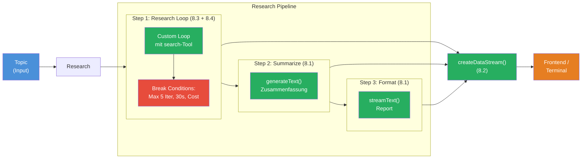

## Das Szenario

Du baust eine **Multi-Step Research Pipeline** — ein System, das ein Thema autonom recherchiert, den Fortschritt in Echtzeit streamt, die Ergebnisse zusammenfasst und mit Safeguards vor unkontrolliertem Verhalten geschuetzt ist.

Deine Pipeline soll sich so anfuehlen:

```
[Step 1/3: Research] Recherche laeuft...
  Iteration 1: search("Edge Computing Vorteile") — 342 Tokens
  Iteration 2: search("Edge Computing vs Cloud") — 289 Tokens
  Iteration 3: search("Edge Computing Use Cases 2026") — 311 Tokens
[Step 1/3: Research] Fertig. 3 Iterationen, 942 Tokens.

[Step 2/3: Summarize] Zusammenfassung...
  5 Kernaussagen generiert.
[Step 2/3: Summarize] Fertig. 187 Tokens.

[Step 3/3: Format] Formatierung als Report...
  Edge Computing hat sich als Schluessel-Technologie etabliert...
  Die wichtigsten Vorteile sind: geringere Latenz, Datenschutz...
[Step 3/3: Format] Fertig.

[Pipeline] Abgeschlossen in 12.4s. Gesamt: 1.547 Tokens. Abbruchgrund: complete.
```

Dieses Projekt verbindet alle vier Bausteine:



## Anforderungen

1. **Research Loop** (Challenge 8.3 + 8.4) — Step 1 ist ein Custom Agent Loop mit einem `search`-Tool. Das LLM entscheidet, welche Suchbegriffe es verwendet. Der Loop hat drei Break Conditions: maximal 5 Iterationen, 30 Sekunden Timeout, 5.000 Tokens Cost Limit. Der Loop gibt Partial Results zurueck, wenn ein Limit greift.

2. **Workflow** (Challenge 8.1) — Step 2 nimmt die Recherche-Ergebnisse aus Step 1 und fasst sie mit `generateText` in 5 Kernaussagen zusammen. Step 3 formatiert die Zusammenfassung als Report — mit `streamText`, damit der User den Text in Echtzeit sieht.

3. **Progress Streaming** (Challenge 8.2) — Jeder Step sendet Custom Data Parts:
   - Vor Start: `{ step: N, total: 3, label: '...' }`
   - Pro Research-Iteration: `{ step: 1, iteration: N, query: '...', tokens: N }`
   - Nach Abschluss: `{ step: N, total: 3, status: 'done', tokens: N }`
   - Am Ende: `{ type: 'stats', totalTokens, durationMs, breakReason, iterations }`

4. **Safeguards** (Challenge 8.4) — Der Research Loop hat einen `AbortController` mit 30 Sekunden Timeout. `abortSignal` wird an `generateText` uebergeben. Token-Verbrauch wird pro Iteration getrackt und gegen das Budget geprueft. Bei Abbruch wird `breakReason` gesetzt und das beste bisherige Ergebnis weiterverarbeitet.

5. **Robustheit** — Die Pipeline funktioniert auch bei Abbruch: Wenn Step 1 wegen Timeout abbricht, laufen Step 2 und 3 trotzdem mit dem Partial Result. Das Endergebnis enthaelt immer den `breakReason` und die Statistiken.

## Starter-Code

```typescript
import { createDataStream, generateText, streamText, tool } from 'ai';
import { anthropic } from '@ai-sdk/anthropic';
import { z } from 'zod';

const model = anthropic('claude-sonnet-4-5-20250514');

const LIMITS = {
  maxIterations: 5,
  timeoutMs: 30_000,
  maxTokens: 5_000,
};

// TODO: search-Tool definieren

// TODO: researchLoop(topic, dataStream) — Custom Loop mit Break Conditions

// TODO: summarize(researchResult, dataStream) — generateText fuer Zusammenfassung

// TODO: format(summary, dataStream) — streamText fuer Report + mergeIntoDataStream

// TODO: createDataStream mit execute-Funktion die alle drei Steps ausfuehrt

// TODO: Stream im Terminal konsumieren
```

## Bewertungskriterien

Dein Boss Fight ist bestanden, wenn:

- [ ] Der Research Loop nutzt einen Custom while-Loop mit Messages-Array
- [ ] Mindestens ein Tool (search) wird im Loop genutzt
- [ ] Max-Iterations Guard ist implementiert (maximal 5 Iterationen)
- [ ] Timeout Guard mit `AbortController` ist implementiert (30 Sekunden)
- [ ] Cost Guard trackt Tokens und bricht bei Ueberschreitung ab
- [ ] Progress Data Parts werden vor, waehrend und nach jedem Step gesendet
- [ ] Die Zusammenfassung (Step 2) nutzt den Output von Step 1 als Input
- [ ] Der Report (Step 3) wird mit `streamText` + `mergeIntoDataStream` gestreamt

## Hinweise

<details>
<summary>Hinweis 1: Research Loop Struktur</summary>

Kapsle den Research Loop in eine eigene `async function researchLoop(topic: string, dataStream: DataStream)`. Die Funktion gibt `{ result: string, breakReason: string, stats: {...} }` zurueck. Innerhalb der Funktion: `while (true)` mit Pre-Checks fuer alle drei Limits, dann `generateText`, dann Ergebnis pruefen.

</details>

<details>
<summary>Hinweis 2: DataStream an Subfunktionen uebergeben</summary>

Die `execute`-Funktion von `createDataStream` bekommt den `dataStream` Controller. Uebergib ihn an alle drei Step-Funktionen, damit sie `dataStream.writeData()` aufrufen koennen. Nur Step 3 nutzt `mergeIntoDataStream` — die anderen Steps nutzen `generateText` und brauchen den Text als String fuer den naechsten Step.

</details>

<details>
<summary>Hinweis 3: Partial Results weiterverarbeiten</summary>

Wenn der Research Loop wegen Timeout abbricht, hat er trotzdem `bestResult` gespeichert — den Text der letzten Iteration. Gib diesen als `result` zurueck. Step 2 (Summarize) arbeitet dann mit dem Partial Result weiter. Die Pipeline laeuft immer bis zum Ende durch — nur Step 1 wird moeglicherweise abgekuerzt.

</details>

<details>
<summary>Hinweis 4: AbortController Scope</summary>

Erstelle den `AbortController` innerhalb der `researchLoop`-Funktion, nicht global. Jeder Pipeline-Durchlauf bekommt seinen eigenen Controller. Vergiss nicht `clearTimeout(timeout)` im `finally`-Block, sonst bleibt der Timeout aktiv und der Prozess beendet sich nicht.

</details>

## Quellen

- [Vercel AI SDK: Generating Text](https://ai-sdk.dev/docs/ai-sdk-core/generating-text)
- [Vercel AI SDK: Building Agents](https://ai-sdk.dev/docs/agents/building-agents)
- [Vercel AI SDK: Data Streams](https://ai-sdk.dev/docs/ai-sdk-core/data-streams)
- [MDN: AbortController](https://developer.mozilla.org/en-US/docs/Web/API/AbortController)
- [ai-hero-dev Exercises 08.01-08.04](https://github.com/ai-hero-dev/ai-sdk-v6-crash-course/tree/main/exercises/08-workflows)
