Du orchestrierst jetzt Production-grade AI Workflows — sequentielle Pipelines mit Progress Streaming, eigene Agent-Loops mit State-Tracking, und robuste Safeguards gegen unkontrolliertes Verhalten. Vom Einzelaufruf zur orchestrierten Pipeline, vom Prototyp zur robusten App.

## Was Du gelernt hast

- **Workflows:** Mehrere `generateText`-Calls sequentiell verketten — Output von Step N wird Input von Step N+1. Jeder Step hat seinen eigenen System Prompt, seine eigene Rolle. Einzeln testbar, einzeln debuggbar. Token-Tracking ueber die gesamte Pipeline.
- **Streaming to Frontend:** Workflow-Fortschritt in Echtzeit ans Frontend streamen mit `createDataStream` und `writeData`. Custom Data Parts fuer Step-Updates, `mergeIntoDataStream` fuer den finalen Text-Stream. Ein Kanal fuer Fortschritt und Text — synchron und in der richtigen Reihenfolge.
- **Custom Loop:** Eigene Agent-Loops mit while-Loop und Messages-Array. `result.response.messages` zurueckpushen fuer Kontext-Kontinuitaet. State-Tracking (Tool Call Count, genutzte Tools), Abbruch basierend auf spezifischen Tool-Ergebnissen statt nur Step Count.
- **Breaking the Loop:** Vier Safeguards gegen unkontrolliertes Verhalten — Max Iterations, Timeout mit `AbortController`, Cost Guard (Token-Budget) und Quality Check. Partial Results statt leerer Ergebnisse bei Abbruch. `breakReason` fuer Monitoring und Debugging.

## Aktualisierter Skill Tree

```mermaid
graph LR
  subgraph "Freigeschaltet"
    L1["Level 1: AI SDK Basics"]
    L2["Level 2: LLM Fundamentals"]
    L3["Level 3: Agents & MCP"]
    L4["Level 4: Persistence"]
    L5["Level 5: Context Engineering"]
    L6["Level 6: Evals"]
    L7["Level 7: Streaming"]
    L8["Level 8: Workflows"]
  end
  subgraph NEXT["Naechstes Level"]
    L9["Level 9: Advanced Patterns"]
  end
  L1 --> L2
  L2 --> L3
  L3 --> L4
  L4 --> L5
  L5 --> L6
  L6 --> L7
  L7 --> L8
  L8 --> L9
  style L1 fill:#27AE60,color:#fff
  style L2 fill:#27AE60,color:#fff
  style L3 fill:#27AE60,color:#fff
  style L4 fill:#27AE60,color:#fff
  style L5 fill:#27AE60,color:#fff
  style L6 fill:#27AE60,color:#fff
  style L7 fill:#27AE60,color:#fff
  style L8 fill:#27AE60,color:#fff
  style NEXT fill:none,stroke:#E67E22,stroke-width:3px,stroke-dasharray:5 5
  style L9 fill:#E67E22,color:#fff
```

## Boss Fight Rueckblick

In der Boss Fight hast Du eine **Multi-Step Research Pipeline** gebaut — ein System mit Custom Agent Loop, Break Conditions, sequentiellem Workflow und Echtzeit-Streaming. Deine Pipeline recherchiert autonom, fasst zusammen, formatiert — und ist gegen Endlosschleifen, Timeout und explodierende Kosten geschuetzt. Das ist das Pattern, das Production-AI-Systeme von Prototypen unterscheidet.

## Naechstes Level

**Level 9: Advanced Patterns** — Das Finale. Guardrails schuetzen Deine App vor schaedlichen Inputs und Outputs. Model Routing waehlt automatisch das richtige Modell fuer jede Aufgabe. Multi-Output vergleicht Ergebnisse verschiedener Modelle. Production-Ready Patterns, die den Unterschied zwischen Prototyp und robuster AI-Anwendung machen.
