## TL;DR

> Production-Patterns: Guardrails schuetzen Deine App vor schaedlichen Inputs und Outputs. Model Routing optimiert Kosten, indem es die richtige Modellgroesse fuer jede Aufgabe waehlt. Multi-Output vergleicht Qualitaet ueber mehrere Modelle hinweg. Das Finale fuer Production-Ready AI.

## Skill Tree

```mermaid
graph LR
  subgraph "Freigeschaltet"
    L1["Level 1: AI SDK Basics"]
    L2["Level 2: LLM Fundamentals"]
    L3["Level 3: Agents & MCP"]
    L4["Level 4: Persistence"]
    L5["Level 5: Context Engineering"]
    L6["Level 6: Evals"]
    L7["Level 7: Streaming"]
    L8["Level 8: Workflows"]
  end
  subgraph HIER["Aktuelles Level"]
    L9["Level 9: Advanced Patterns"]
  end
  L1 --> L2
  L2 --> L3
  L3 --> L4
  L4 --> L5
  L5 --> L6
  L6 --> L7
  L7 --> L8
  L8 --> L9
  style L1 fill:#27AE60,color:#fff
  style L2 fill:#27AE60,color:#fff
  style L3 fill:#27AE60,color:#fff
  style L4 fill:#27AE60,color:#fff
  style L5 fill:#27AE60,color:#fff
  style L6 fill:#27AE60,color:#fff
  style L7 fill:#27AE60,color:#fff
  style L8 fill:#27AE60,color:#fff
  style HIER fill:none,stroke:#E67E22,stroke-width:3px,stroke-dasharray:5 5
  style L9 fill:#E67E22,color:#fff
```

## Was Du lernst

- **Guardrails** — Input- und Output-Checks die Prompt Injection, PII-Leaks und toxische Ausgaben verhindern
- **Model Router** — automatisch das richtige Modell fuer jede Aufgabe waehlen: guenstig fuer Einfaches, stark fuer Komplexes
- **Comparing Outputs** — mehrere Modelle parallel befragen und Ergebnisse systematisch vergleichen
- **Research Workflow** — eine End-to-End Pipeline die alle gelernten Konzepte aus 9 Levels vereint

## Warum das wichtig ist

Du hast in 8 Levels gelernt, AI-Systeme zu bauen — Text generieren, Tools nutzen, Workflows orchestrieren. Aber ein Prototyp ist keine Production-App. Was passiert, wenn ein User Deinem LLM sagt "Ignoriere alle Anweisungen"? Was, wenn Du fuer jede einfache Frage das teuerste Modell nutzt? Was, wenn Du nicht weisst, welches Modell die beste Antwort gibt?

Das konkrete Problem: Du willst ein AI-System das sicher, kosteneffizient und qualitaetsgetestet ist. Guardrails schuetzen, Model Routing optimiert, Comparing Outputs beweist Qualitaet. In der Boss Fight baust Du ein System das alles vereint.

## Voraussetzungen

- **Level 1: AI SDK Basics** — `generateText`, `streamText`, `Output.object` (Challenge 1.3-1.6)
- **Level 3: Agents & MCP** — Tool Calling, Multi-Step Agents (Challenge 3.1-3.3)
- **Level 5: Context Engineering** — XML-strukturierte Prompts, Rules Section (Challenge 5.1-5.3)
- **Level 8: Workflows** — Sequentielle Pipelines, Custom Loops, Break Conditions (Challenge 8.1-8.4)
- Empfohlen: **Level 2** (Token-Kosten), **Level 6** (Evals), **Level 7** (Streaming)

> **Skip-Hinweis:** Du implementierst bereits Guardrails, routest automatisch zwischen Modellen und nutzt LLM-as-a-Judge fuer Qualitaetsvergleiche? Spring direkt zur [Boss Fight](/de/level-9-advanced/06-boss-fight/) und baue ein Production-Ready AI-System.

## Challenges

| # | Challenge | Konzept |
|---|-----------|---------|
| 9.1 | [Guardrails](/de/level-9-advanced/02-guardrails/) | Input-Checks (Injection, PII), Output-Checks (Toxicity, Format), Middleware-Pattern |
| 9.2 | [Model Router](/de/level-9-advanced/03-model-router/) | Aufgabenklassifikation, dynamisches Routing, Kostenoptimierung |
| 9.3 | [Comparing Outputs](/de/level-9-advanced/04-comparing-outputs/) | Parallele Modell-Aufrufe, LLM-as-a-Judge, systematischer Vergleich |
| 9.4 | [Research Workflow](/de/level-9-advanced/05-research-workflow/) | End-to-End Pipeline, alle Konzepte vereint, Production-Ready |

## Boss Fight

Baue ein **Production-Ready AI-System** — das ultimative Projekt, das alle 9 Levels vereint. Guardrails schuetzen Input und Output. Ein Model Router waehlt das optimale Modell. Comparing Outputs sichert die Qualitaet. Eine Multi-Step Research Pipeline orchestriert alles. Tools, Streaming, Kosten-Tracking und Eval-Coverage inklusive.

## Quellen fuer dieses Level

- [Vercel AI SDK: Generating Text](https://ai-sdk.dev/docs/ai-sdk-core/generating-text)
- [Vercel AI SDK: Building Agents](https://ai-sdk.dev/docs/agents/building-agents)
- [Anthropic: Prompt Engineering](https://docs.anthropic.com/en/docs/build-with-claude/prompt-engineering/overview)
- [ai-hero-dev Exercises 09.01-09.04](https://github.com/ai-hero-dev/ai-sdk-v6-crash-course/tree/main/exercises/09-production-patterns)
