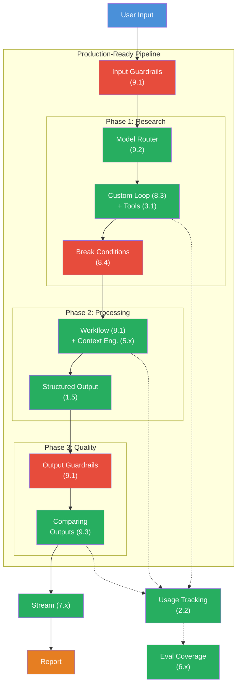

## Das Szenario

Du baust ein **Production-Ready AI-System** — das ultimative Projekt, das alles vereint was Du in 9 Levels gelernt hast. Das System nimmt ein Thema entgegen, recherchiert autonom, waehlt fuer jeden Schritt das optimale Modell, schuetzt sich mit Guardrails, und liefert einen qualitaetsgesicherten Report.

Dein System soll sich so anfuehlen:

```
[Input Guard] "Edge Computing Trends" — Injection Check: OK, PII Check: OK

[Phase 1: Research] Routing: gemini-flash (Research = einfache Suche)
  Iteration 1: search("Edge Computing Vorteile 2026") — 312 Tokens
  Iteration 2: search("Edge Computing vs Cloud Computing") — 287 Tokens
  Iteration 3: Fertig (finishReason: stop)
[Phase 1] 3 Iterationen, 1.041 Tokens, Abbruch: complete

[Phase 2: Summarize] Routing: claude-sonnet (Analyse = komplex)
  5 Kernaussagen generiert — 423 Tokens

[Phase 3: Format] Routing: claude-sonnet (Formatierung = komplex)
  Streaming Report...
  "Edge Computing hat sich als Schluessel-Technologie etabliert..."
[Phase 3] 891 Tokens

[Output Guard] Laenge: OK (2.847 Zeichen), Format: OK

[Quality Compare] Gleichen Prompt an 2 Modelle → Judge Score: 8/10

[Stats] Pipeline: 3.2s, 2.355 Tokens, geschaetzte Kosten: $0.023
```

Dieses Projekt verbindet alle 9 Levels:



## Anforderungen

1. **Input Guardrails** (Challenge 9.1) — Pruefe jeden User-Input auf Prompt Injection und PII bevor die Pipeline startet. Ungueltige Eingaben werden mit einer klaren Fehlermeldung abgelehnt.

2. **Model Router** (Challenge 9.2) — Nutze fuer jede Phase der Pipeline das optimale Modell. Research: guenstiges Flash-Modell. Analyse und Formatierung: starkes Sonnet/Opus-Modell. Klassifikation: kleinstes verfuegbares Modell.

3. **Research Loop** (Level 3 + Level 8) — Ein Custom Agent Loop mit mindestens einem Tool (search). Der Loop hat drei Break Conditions: Max Iterations (5), Timeout (30s), Cost Guard (5.000 Tokens). Der Agent entscheidet selbst, wann genug recherchiert ist.

4. **Workflow** (Level 8.1) — Die Processing-Phase verkettet mindestens 2 sequentielle `generateText`-Calls. Output von Step N wird Input von Step N+1. Jeder Step hat einen eigenen System Prompt mit XML-strukturiertem Context Engineering (Level 5).

5. **Output Guardrails** (Challenge 9.1) — Pruefe den finalen Report auf Laenge, Format und Inhalt. Leere oder zu lange Outputs werden abgefangen.

6. **Comparing Outputs** (Challenge 9.3) — Fuer den finalen Report: Generiere die Zusammenfassung mit 2 verschiedenen Modellen parallel und waehle das bessere Ergebnis (per einfachem Scorer oder LLM-as-a-Judge).

7. **Streaming** (Level 7 + 8.2) — Streame den finalen Report in Echtzeit. Sende Progress Data Parts fuer jede Phase der Pipeline.

8. **Usage Tracking** (Level 2.2) — Tracke den Token-Verbrauch pro Phase und gesamt. Berechne geschaetzte Kosten.

9. **Structured Output** (Level 1.5) — Der Report wird als typisiertes Objekt mit Zod Schema zurueckgegeben (Titel, Zusammenfassung, Kernaussagen, Fazit).

10. **Eval Coverage** (Level 6) — Schreibe mindestens 2 Evalite-Tests: einen der prueft ob der Report die erwarteten Abschnitte hat, und einen der die Laenge der Zusammenfassung bewertet.

## Starter-Code

```typescript
import { createDataStream, generateText, streamText, tool, Output } from 'ai';
import { anthropic } from '@ai-sdk/anthropic';
import { google } from '@ai-sdk/google';
import { z } from 'zod';

// --- Schemas ---
const ReportSchema = z.object({
  title: z.string(),
  summary: z.string(),
  keyFindings: z.array(z.string()).min(3).max(7),
  conclusion: z.string(),
});

// --- Guardrails ---
// TODO: Input-Guardrails (Injection, PII)
// TODO: Output-Guardrails (Laenge, Format)

// --- Model Router ---
// TODO: selectModel(phase: 'research' | 'analysis' | 'format' | 'classify')

// --- Tools ---
// TODO: search-Tool

// --- Pipeline Phases ---
// TODO: researchPhase(topic) — Custom Loop + Tools + Break Conditions
// TODO: processingPhase(research, topic) — Workflow + Context Engineering + Structured Output
// TODO: qualityPhase(report) — Output Guardrails + Comparing Outputs

// --- Main Pipeline ---
// TODO: researchPipeline(topic) — Orchestriert alle Phasen, streamt Fortschritt, trackt Kosten

// --- Evals ---
// TODO: evalite('research-pipeline', { ... })
```

## Bewertungskriterien

Dein Boss Fight ist bestanden, wenn:

- [ ] Input-Guardrails pruefen auf Prompt Injection und PII
- [ ] Model Router waehlt unterschiedliche Modelle fuer Research vs. Analysis
- [ ] Research Loop nutzt einen Custom while-Loop mit mindestens einem Tool
- [ ] Mindestens 2 Break Conditions sind implementiert (Max Iterations + ein weiterer)
- [ ] Workflow verkettet mindestens 2 sequentielle `generateText`-Calls
- [ ] System Prompts nutzen XML-Struktur (Context Engineering)
- [ ] Output-Guardrails pruefen den finalen Report
- [ ] Comparing Outputs generiert mit mindestens 2 Modellen parallel und waehlt das bessere Ergebnis
- [ ] Token-Verbrauch wird pro Phase und gesamt getrackt
- [ ] Mindestens ein Evalite-Test prueft die Pipeline-Qualitaet

## Hinweise

<details>
<summary>Hinweis 1: Pipeline-Struktur</summary>

Baue die Pipeline als eine `async function researchPipeline(topic: string)` die alle drei Phasen nacheinander ausfuehrt. Jede Phase ist eine eigene Funktion die ein Ergebnis-Objekt zurueckgibt. Am Ende: Statistiken sammeln und den Report zurueckgeben.

</details>

<details>
<summary>Hinweis 2: Model Router Integration</summary>

Erstelle eine `selectModel`-Funktion die den Phasen-Namen als Parameter nimmt. Research bekommt ein Flash-Modell, Analysis und Format bekommen Sonnet. Der Router wird in jeder Phase aufgerufen, nicht zentral — so kann jede Phase ihr optimales Modell bekommen.

</details>

<details>
<summary>Hinweis 3: Comparing Outputs einbauen</summary>

Der Vergleich muss nicht die gesamte Pipeline doppelt laufen lassen. Es reicht, in der Processing-Phase die Zusammenfassung mit 2 Modellen parallel zu generieren (`Promise.all`) und dann den laengeren/besseren Output zu waehlen. Der Research-Schritt laeuft nur einmal.

</details>

<details>
<summary>Hinweis 4: Evals separat halten</summary>

Schreibe die Evals in eine separate Datei. Importiere die Pipeline-Funktion und teste sie mit Evalite. Ein Scorer prueft ob `keyFindings.length >= 3`, ein anderer ob `summary.length > 100`. So bleiben Pipeline und Tests sauber getrennt.

</details>

## Quellen

- [Vercel AI SDK: Generating Text](https://ai-sdk.dev/docs/ai-sdk-core/generating-text)
- [Vercel AI SDK: Building Agents](https://ai-sdk.dev/docs/agents/building-agents)
- [Vercel AI SDK: Data Streams](https://ai-sdk.dev/docs/ai-sdk-core/data-streams)
- [Anthropic: Prompt Engineering](https://docs.anthropic.com/en/docs/build-with-claude/prompt-engineering/overview)
- [Evalite Documentation](https://www.evalite.dev/)
- [ai-hero-dev Exercises 09.01-09.04](https://github.com/ai-hero-dev/ai-sdk-v6-crash-course/tree/main/exercises/09-production-patterns)
