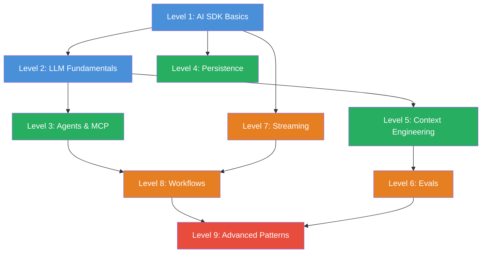

import { CardGrid, LinkCard } from '@astrojs/starlight/components';

# Roadmap

## Der Skill Tree

**Legende:** Blau = Grundlagen | Gruen = Aufbau | Orange = Fortgeschritten | Rot = Experte

## Empfohlene Lernpfade

### Einsteiger (empfohlen)

Level 1 → 2 → 3 → 4 → 5 → 6 → 7 → 8 → 9

Folge den Levels der Reihe nach. Jedes Level baut auf den vorherigen auf.

### Fortgeschrittene (bereits AI SDK Erfahrung)

Level 3 → 5 → 6 → 8 → 9

Ueberspringe die Grundlagen und steige direkt bei Agents oder Context Engineering ein.

### Fokus: Agents & MCP

Level 1 → 3 → 4 → 8 → 9

Direkt zu Agents, Tools und Workflows — die Persistence brauchst Du fuer robuste Agents.

### Fokus: Qualitaet & Production

Level 1 → 5 → 6 → 7 → 9

Context Engineering, Evals und Streaming — alles was Production-Ready AI ausmacht.

## Level-Details

<CardGrid>
  <LinkCard title="Level 1 — AI SDK Basics" description="6 Challenges · Text generieren, streamen, strukturierte Ausgaben und System Prompts" href="/de/level-1-ai-sdk-basics/01-briefing/" />
  <LinkCard title="Level 2 — LLM Fundamentals" description="4 Challenges · Tokens, Context Windows, Usage Tracking und Prompt Caching" href="/de/level-2-llm-fundamentals/01-briefing/" />
  <LinkCard title="Level 3 — Agents & MCP" description="5 Challenges · Tool Calling, MCP via stdio/HTTP, Tool Loop Agent" href="/de/level-3-agents/01-briefing/" />
  <LinkCard title="Level 4 — Persistence" description="4 Challenges · Callbacks, Chat-IDs, Datenbank-Persistenz, Message-Validierung" href="/de/level-4-persistence/01-briefing/" />
  <LinkCard title="Level 5 — Context Engineering" description="5 Challenges · Prompt Templates, Exemplars, RAG, Chain of Thought" href="/de/level-5-context-engineering/01-briefing/" />
  <LinkCard title="Level 6 — Evals" description="5 Challenges · Evalite, deterministische Evals, LLM-as-Judge, Langfuse" href="/de/level-6-evals/01-briefing/" />
  <LinkCard title="Level 7 — Streaming" description="4 Challenges · Custom Data Parts, Message Metadata, Error Handling" href="/de/level-7-streaming/01-briefing/" />
  <LinkCard title="Level 8 — Workflows" description="4 Challenges · Multi-Step Workflows, Custom Loops, Frontend-Streaming" href="/de/level-8-workflows/01-briefing/" />
  <LinkCard title="Level 9 — Advanced Patterns" description="4 Challenges · Guardrails, Model Router, Output-Vergleich, Research Workflow" href="/de/level-9-advanced/01-briefing/" />
</CardGrid>
