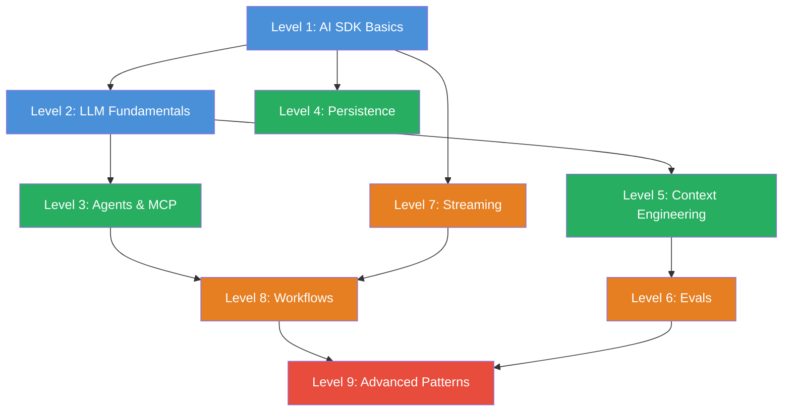

# Roadmap

## Der Skill Tree

**Legende:** Blau = Grundlagen | Gruen = Aufbau | Orange = Fortgeschritten | Rot = Experte

## Empfohlene Lernpfade

### Einsteiger (empfohlen)

Level 1 → 2 → 3 → 4 → 5 → 6 → 7 → 8 → 9

Folge den Levels der Reihe nach. Jedes Level baut auf den vorherigen auf.

### Fortgeschrittene (bereits AI SDK Erfahrung)

Level 3 → 5 → 6 → 8 → 9

Ueberspringe die Grundlagen und steige direkt bei Agents oder Context Engineering ein.

### Fokus: Agents & MCP

Level 1 → 3 → 4 → 8 → 9

Direkt zu Agents, Tools und Workflows — die Persistence brauchst Du fuer robuste Agents.

### Fokus: Qualitaet & Production

Level 1 → 5 → 6 → 7 → 9

Context Engineering, Evals und Streaming — alles was Production-Ready AI ausmacht.

## Level-Details

| Level | Challenges | Kern-Diagramm | Abhaengig von |
|-------|-----------|---------------|---------------|
| 1 — AI SDK Basics | 6 | Flow: User → SDK → Provider → LLM | — |
| 2 — LLM Fundamentals | 4 | Box: Tokens, Context Window, Caching | Level 1 |
| 3 — Agents & MCP | 5 | Sequenz: LLM → Tool → LLM Loop | Level 1, 2 |
| 4 — Persistence | 4 | Flow: Chat → API → DB → Reload | Level 1 |
| 5 — Context Engineering | 5 | Box: Prompt Template Schichten | Level 1, 2 |
| 6 — Evals | 5 | Flow: Task → Scorer → Score → Iterate | Level 1, 5 |
| 7 — Streaming | 4 | Sequenz: Stream Events Timeline | Level 1 |
| 8 — Workflows | 4 | Flow: Multi-Step Agent Pipeline | Level 3, 7 |
| 9 — Advanced Patterns | 4 | Entscheidungsbaum: Model Router | Level 6, 8 |
